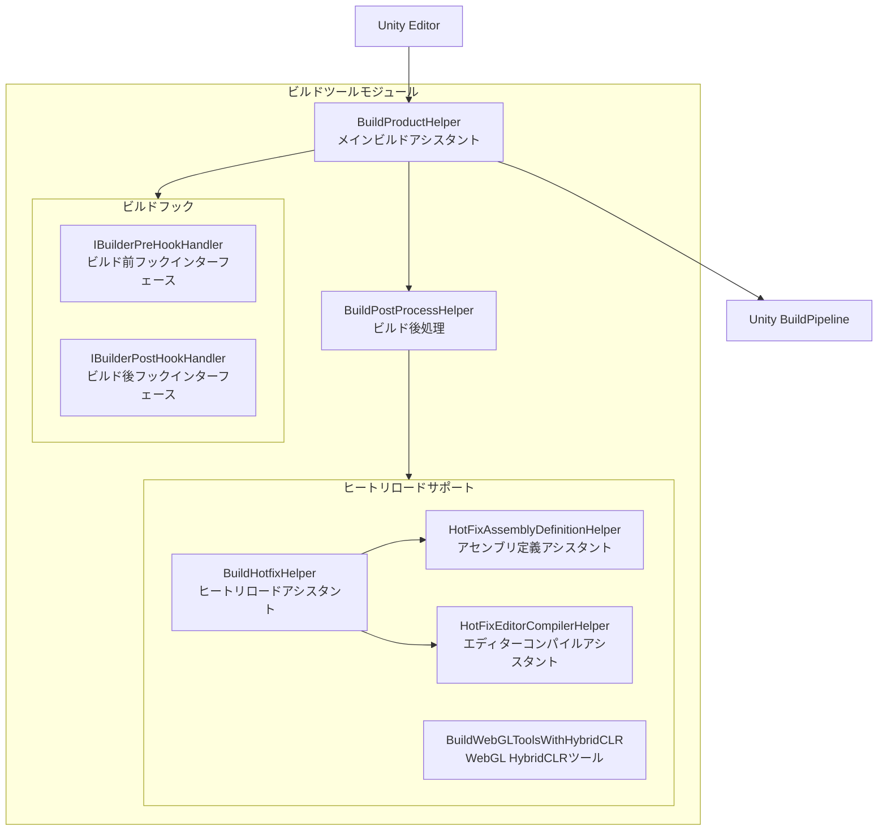
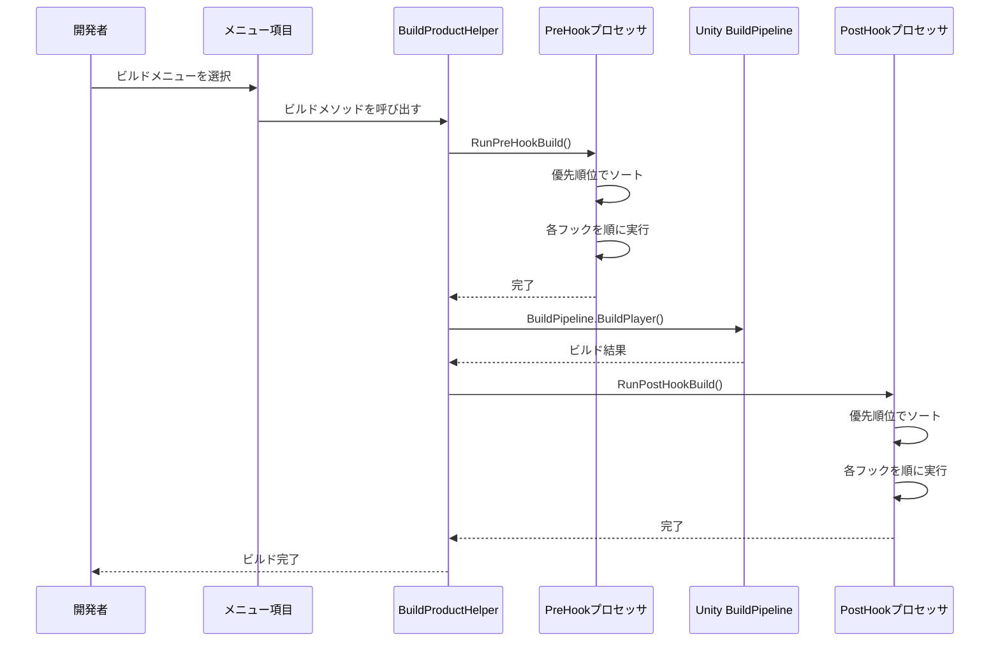

# ビルドツール

GameFrameXは完全なUnityエディターブライズツール一套を提供し、マルチプラットフォームビルド、ヒートリロード（HybridCLR）統合、ビルドフック拡張などの機能をサポートしています。

## 概要

ビルドツールモジュールは`Editor/`ディレクトリにあり、以下のコアコンポーネントを含みます：

- **BuildProductHelper** - メインビルドアシスタント、マルチプラットフォームビルド機能を提供
- **BuildHotfixHelper** - ヒートリロードコード管理アシスタント
- **Hookメカニズム** - ビルド前後の拡張フックインターフェース

これらのツールはUnity Editorメニュー`GameFrameX/Build` 통해統一されたビルドエントリーポイントを提供し、クロスプラットフォームビルド流程を簡素化します。

## アーキテクチャ



### コアコンポーネント説明

| コンポーネント | ファイルパス | 説明 |
|------|----------|------|
| BuildProductHelper | `Editor/BuildProduct/BuildProductHelper.cs` | メインビルドアシスタント、Windows、Mac、Android、iOS、WebGLプラットフォームビルドをサポート |
| BuildPostProcessHelper | `Editor/BuildProduct/BuildPostProcessHelper.cs` | ビルド後に自動バージョン番号を更新 |
| IBuilderPreHookHandler | `Editor/BuildProduct/IBuilderPreHookHandler.cs` | ビルド前フックインターフェース |
| IBuilderPostHookHandler | `Editor/BuildProduct/IBuilderPostHookHandler.cs` | ビルド後フックインターフェース |
| BuildHotfixHelper | `Editor/BuildHotfix/BuildHotfixHelper.cs` | ヒートリロードコードコピー与管理 |
| HotFixEditorCompilerHelper | `Editor/BuildHotfix/HotFixEditorCompilerHelper.cs` | エディターコンパイル制御 |
| HotFixAssemblyDefinitionHelper | `Editor/BuildHotfix/HotFixAssemblyDefinitionHelper.cs` | アセンブリ定義ファイル修正 |
| BuildWebGLToolsWithHybridCLR | `Editor/BuildWebGLTools/BuildWebGLToolsWithHybridCLR.cs` | WebGL HybridCLRサポート |

## メニュース項目

ビルドツールはUnity Editorメニューを通じて統一されたビルドエントリーポイントを提供し、`GameFrameX/Build`メニュー配下にあります：

| メニュー項目 | 機能 |
|--------|------|
| Windows X64 | Windows x64実行ファイルをビルド |
| Windows X32 | Windows x32実行ファイルをビルド |
| Mac Os | macOSアプリケーションをビルド |
| WebGL | WebGLバージョンをビルド |
| Apk | Android APKをビルド |
| AAB | Android AABパッケージをビルド |
| AndroidStudio Project Debug | Android Studio Debugプロジェクトをエクスポート |
| AndroidStudio Project Release | Android Studio Releaseプロジェクトをエクスポート |
| Xcode Project Debug | Xcode Debugプロジェクトをエクスポート |
| Xcode Project Release | Xcode Releaseプロジェクトをエクスポート |
| Copy HotFix Code | ヒートリロードコードをBundles/Codeディレクトリにコピー |
| Copy AOT Code | AOTコードをBundles/AOTCodeディレクトリにコピー |
| HotFix Editor Compiler Add | ヒートリロードアセンブリのエディターコンパイル指令を追加 |
| HotFix Editor Compiler Remove | ヒートリロードアセンブリのエディターコンパイル指令を削除 |

## コア機能

### マルチプラットフォームビルド

BuildProductHelperは以下のプラットフォームのビルドをサポート：

```csharp
// Windows x64 ビルド
[MenuItem("GameFrameX/Build/Windows X64", false, 100)]
public static void BuildPlayerToWindows64BuildTarget()

// Windows x32 ビルド
[MenuItem("GameFrameX/Build/Windows X32", false, 100)]
public static void BuildPlayerToWindows32BuildTarget()

// macOS ビルド
[MenuItem("GameFrameX/Build/Mac Os", false, 200)]
public static void BuildPlayerToMacBuildTarget()

// WebGL ビルド
[MenuItem("GameFrameX/Build/WebGL", false, 300)]
private static void BuildPlayerToWebGL()

// Android APK ビルド
[MenuItem("GameFrameX/Build/Apk", false, 400)]
private static void BuildPlayerToAndroid()

// Android AAB ビルド
[MenuItem("GameFrameX/Build/AAB", false, 400)]
private static void BuildAppBundleForAndroid()

// Android Studioプロジェクトエクスポート（Debug/Release）
[MenuItem("GameFrameX/Build/AndroidStudio Project Debug", false, 500)]
private static void ExportToAndroidStudioToDevelop()

[MenuItem("GameFrameX/Build/AndroidStudio Project Release", false, 500)]
private static void ExportToAndroidStudioToRelease()

// Xcodeプロジェクトエクスポート（Debug/Release）
[MenuItem("GameFrameX/Build/Xcode Project Debug", false, 250)]
private static void ExportToXcodeToDevelop()

[MenuItem("GameFrameX/Build/Xcode Project Release", false, 250)]
private static void ExportToXcodeToRelease()
```
> Source: [BuildProductHelper.cs](https://github.com/GameFrameX/com.gameframex.unity/blob/main/Editor/BuildProduct/BuildProductHelper.cs#L101-L662)

### ビルドフックメカニズム

`IBuilderPreHookHandler`と`IBuilderPostHookHandler`インターフェースを実装することで、ビルド前後でカスタムロジックを実行可能：

```csharp
using UnityEditor;

namespace MyProject.Editor
{
    /// <summary>
    /// ビルド前フック例
    /// </summary>
    public class MyPreBuildHook : IBuilderPreHookHandler
    {
        /// <summary>
        /// 優先順位、値が大きいほど優先順位が低い
        /// </summary>
        public int Priority => 0;

        /// <summary>
        /// ビルド前ロジックを実行
        /// </summary>
        /// <param name="target">ビルドターゲットプラットフォーム</param>
        /// <param name="path">ビルド出力パス</param>
        public void Run(BuildTarget target, string path)
        {
            // ビルド前に実行するカスタムロジック
            UnityEngine.Debug.Log($"{target} を {path} にビルド開始");
        }
    }

    /// <summary>
    /// ビルド後フック例
    /// </summary>
    public class MyPostBuildHook : IBuilderPostHookHandler
    {
        /// <summary>
        /// 優先順位
        /// </summary>
        public int Priority => 0;

        /// <summary>
        /// ビルド後ロジックを実行
        /// </summary>
        /// <param name="target">ビルドターゲットプラットフォーム</param>
        /// <param name="path">ビルド出力パス</param>
        public void Run(BuildTarget target, string path)
        {
            // ビルド後に実行するカスタムロジック
            UnityEngine.Debug.Log($"{target} のビルド完了、出力パス {path}");
        }
    }
}
```
> Sources:
> - [IBuilderPreHookHandler.cs](https://github.com/GameFrameX/com.gameframex.unity/blob/main/Editor/BuildProduct/IBuilderPreHookHandler.cs#L39-L52)
> - [IBuilderPostHookHandler.cs](https://github.com/GameFrameX/com.gameframex.unity/blob/main/Editor/BuildProduct/IBuilderPostHookHandler.cs#L39-L52)

**フック実行フロー：**



### ヒートリロードサポート (HybridCLR)

GameFrameXはHybridCLRヒートリロードソリューションのサポートを内蔵：

#### HybridCLRを有効/無効化

```csharp
// HybridCLRを無効化
[MenuItem("GameFrameX/Scripting Define Symbols/Disable HybridCLR(关闭HybridCLR适配)", false, 5000)]
public static void DisableHybridCLR()
{
    ScriptingDefineSymbols.AddScriptingDefineSymbol(HybridCLRScriptingDefineSymbol);
}

// HybridCLRを有効化
[MenuItem("GameFrameX/Scripting Define Symbols/Enable HybridCLR(开启HybridCLR适配)", false, 5001)]
public static void EnableHybridCLR()
{
    ScriptingDefineSymbols.RemoveScriptingDefineSymbol(HybridCLRScriptingDefineSymbol);
}
```
> Source: [BuildHotfixHelper.cs](https://github.com/GameFrameX/com.gameframex.unity/blob/main/Editor/BuildHotfix/BuildHotfixHelper.cs#L107-L125)

#### ヒートリロードコードをコピー

```csharp
// ヒートリロードDLLをAssets/Bundles/Codeにコピー
[MenuItem("GameFrameX/Build/Copy HotFix Code(复制热更新代码到Assets>Bundles>Code)", false, 10)]
public static void CopyHotfixCode()
{
    // Library/ScriptAssembliesからUnity.HotFix.dllをAssets/Bundles/Codeにコピー
}

// AOTコードをAssets/Bundles/AOTCodeにコピー
[MenuItem("GameFrameX/Build/Copy AOT Code(复制AOT代码到Assets>Bundles>AOTCode)", false, 11)]
public static void CopyAOTCode()
{
    // HybridCLRData/AssembliesPostIl2CppStripからAOT DLLをコピー
}
```
> Source: [BuildHotfixHelper.cs](https://github.com/GameFrameX/com.gameframex.unity/blob/main/Editor/BuildHotfix/BuildHotfixHelper.cs#L43-L104)

### エディターコンパイル制御

ビルドプロセスではヒートリロードアセンブリのコンパイル範囲を一時的に制御する必要があります：

```csharp
// ヒートリロードアセンブリのエディターコンパイル指令を削除
[MenuItem("GameFrameX/Build/HotFix Editor Compiler Remove(移除热更新程序集的编辑器编译指令)", false, 15)]
public static void RemoveEditor()
{
    var path = "Assets/Hotfix/Unity.HotFix.asmdef";
    HotFixAssemblyDefinitionHelper.RemoveEditor(path);
}

// ヒートリロードアセンブリのエディターコンパイル指令を追加
[MenuItem("GameFrameX/Build/HotFix Editor Compiler Add(增加热更新程序集的编辑器编译指令)", false, 16)]
public static void AddEditor()
{
    var path = "Assets/Hotfix/Unity.HotFix.asmdef";
    HotFixAssemblyDefinitionHelper.AddEditor(path);
}
```
> Source: [HotFixEditorCompilerHelper.cs](https://github.com/GameFrameX/com.gameframex.unity/blob/main/Editor/BuildHotfix/HotFixEditorCompilerHelper.cs#L8-L29)

### ビルド後自動処理

BuildPostProcessHelperは毎回のビルド後に自動バージョン番号を更新：

```csharp
[PostProcessBuild(999)]
public static void OnPostProcessBuild(BuildTarget target, string path)
{
    if (target == BuildTarget.Android)
    {
        // Android: bundleVersionCode + 1
        PlayerSettings.Android.bundleVersionCode = Convert.ToInt32(PlayerSettings.Android.bundleVersionCode) + 1;
    }

    if (target == BuildTarget.iOS)
    {
        // iOS: buildNumber + 1
        PlayerSettings.iOS.buildNumber = (Convert.ToInt32(PlayerSettings.iOS.buildNumber) + 1).ToString();
    }
}
```
> Source: [BuildPostProcessHelper.cs](https://github.com/GameFrameX/com.gameframex.unity/blob/main/Editor/BuildProduct/BuildPostProcessHelper.cs#L43-L57)

### ビルド出力パス管理

ビルド出力パスは以下のルールに従って自動生成：

```csharp
// パス形式: Builds/{プラットフォーム}/{パッケージ名}/{バージョン}/{タイムスタンプ}
var pathName = $"{Application.identifier}_{_buildTime}_v_{PlayerSettings.bundleVersion}";

// Android特殊形式
if (EditorUserBuildSettings.activeBuildTarget == BuildTarget.Android)
{
    pathName = $"{_buildTime}_code_{PlayerSettings.Android.bundleVersionCode}";
}

// iOS/macOS特殊形式
else if (EditorUserBuildSettings.activeBuildTarget == BuildTarget.iOS ||
         EditorUserBuildSettings.activeBuildTarget == BuildTarget.StandaloneOSX)
{
    pathName = $"{_buildTime}_code_{PlayerSettings.iOS.buildNumber}";
}
```
> Source: [BuildProductHelper.cs](https://github.com/GameFrameX/com.gameframex.unity/blob/main/Editor/BuildProduct/BuildProductHelper.cs#L703-L746)

## 使用例

### 基礎ビルドフロー

1. **ターゲットプラットフォームを選択**：Unity Editorでシーンを開く
2. **ビルドターゲットを設定**：`File > Build Settings`でターゲットプラットフォームを選択
3. **ビルドを実行**：`GameFrameX/Build`メニューから対応するビルドオプションを選択
4. **出力を確認**：ビルド完了後、`Builds/{プラットフォーム}/`ディレクトリで出力を確認

### ビルドフック拡張を使用

カスタムビルドフックを作成し、ビルド前に古いリソースをクリーンアップ：

```csharp
using UnityEditor;
using GameFrameX.Editor;

public class CustomBuildHook : IBuilderPreHookHandler
{
    public int Priority => 10; // 较低的優先順位

    public void Run(BuildTarget target, string path)
    {
        // 古いビルドキャッシュをクリーンアップ
        string cachePath = $"{path}/Cache";
        if (System.IO.Directory.Exists(cachePath))
        {
            System.IO.Directory.Delete(cachePath, true);
        }

        UnityEngine.Debug.Log($"ビルド前クリーンアップ完了: {target}");
    }
}
```

### APIプログラムビルド

コード呼び出しを通じて自動化ビルドを実現可能：

```csharp
using GameFrameX.Editor;

// Android APKをビルド
string apkPath = BuildProductHelper.BuildPlayerAndroid();

// WebGLをビルド
string webglPath = BuildProductHelper.BuildPlayerWebGL();

// Xcodeプロジェクトをビルド
string xcodePath = BuildProductHelper.BuildPlayerXcode();
```
> Source: [BuildProductHelper.cs](https://github.com/GameFrameX/com.gameframex.unity/blob/main/Editor/BuildProduct/BuildProductHelper.cs#L281-L368)

## 関連リンク

- [ミニゲームプラットフォーム対応](./6-editor-tools.mini-game-platform) - WeChat、バイトダンスなどミニゲームプラットフォームへの対処方法を了解
- [パッケージ管理ツール](./6-editor-tools.package-management) - パッケージ管理機能を了解
- [ランタイムモジュール概要](./5-runtime.base) - ランタイム基本コンポーネントを了解
- [イベントシステム](./5-runtime.event-system) - イベントシステムを了解
- [オブジェクトプールシステム](./5-runtime.object-pool) - オブジェクトプールシステムを了解
