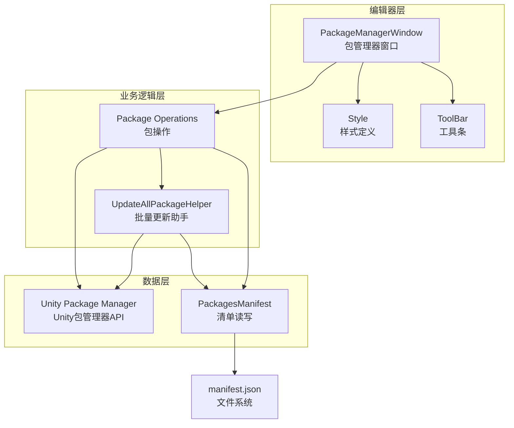
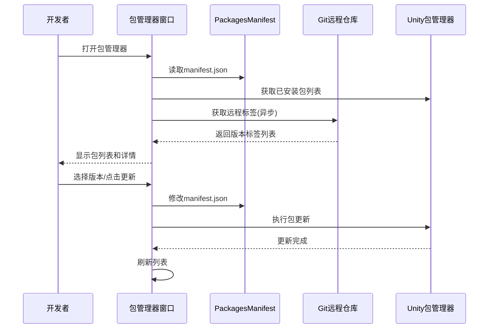

# パッケージ管理工具

GameFrameX パッケージ管理工具是一套完全な的 Unity エディタ拡張，专门用于管理基于 Git 的依赖パッケージ。它提供します可视化的パッケージ管理界面和批量アップデート機能，帮助開発者更効率的地管理プロジェクト依赖。

## 概要

GameFrameX パッケージ管理工具是 Unity エディタ拡張，集成在 `GameFrameX` メニュー下。该工具主な解决以下問題：

1. **可视化パッケージ管理** - 通过图形界面確認所有已インストール的 Git パッケージ及其詳細情報
2. **バージョン切换** - サポート在同一パッケージ的不同バージョン间自由切换（升级/降级）
3. **批量アップデート** - 一键アップデート所有 Git パッケージ到最新バージョン
4. **镜像切换** - サポート在 GitHub 和 Gitee 镜像间快速切换

### コア機能

| 機能 | 説明 |
|------|------|
| パッケージ列表显示 | 显示所有已インストール的 Git パッケージ |
| パッケージ详情確認 | 確認パッケージ的名称、バージョン、作者、説明等情報 |
| バージョン切换 | サポート升级/降级到指定バージョン |
| 批量アップデート | 一键アップデート所有パッケージ到最新バージョン |
| 镜像切换 | サポート GitHub/Gitee 镜像切换 |
| 刷新機能 | 重新ロードパッケージ列表 |

## アーキテクチャ設計



### コンポーネント説明

| コンポーネント | ファイル路径 | 职责 |
|------|----------|------|
| PackageManagerWindow | Editor/PackageManager/PackageManagerWindow.cs | 主ウィンドウ界面，提供パッケージ列表和详情表示 |
| PackageManagerWindow.Package | Editor/PackageManager/PackageManagerWindow.Package.cs | パッケージ操作逻辑，含みますロード、バージョン取得 |
| PackageManagerWindow.ToolBar | Editor/PackageManager/PackageManagerWindow.ToolBar.cs | 工具条 UI，提供刷新、アップデート、镜像切换 |
| PackageManagerWindow.Style | Editor/PackageManager/PackageManagerWindow.Style.cs | 样式定義 |
| PackagesManifest | Editor/PackageManager/PackagesManifest.cs | manifest.json 读写カプセル化 |
| UpdateAllPackageHelper | Editor/UpdatePackages/UpdateAllPackageHelper.cs | 批量アップデート機能 |

## コア機能详解

### 打开パッケージマネージャー

通过メニュー `GameFrameX → Package Manager(GameFrameX的包管理器)` 打开パッケージ管理ウィンドウ。

```csharp
[MenuItem("GameFrameX/Package Manager(GameFrameX的包管理器)", false, 2000)]
public static void ShowWindow()
{
    var window = GetWindow<PackageManagerWindow>("GameFrameX");
    window.minSize = new UnityEngine.Vector2(800, 600);
    window.Show();
}
```
> Source: [PackageManagerWindow.cs](https://github.com/GameFrameX/com.gameframex.unity/blob/main/Editor/PackageManager/PackageManagerWindow.cs#L11-L17)

### パッケージ情報模型

```csharp
public sealed class PackageManagerInfo
{
    /// <summary>
    /// 包名称
    /// </summary>
    public string Name { get; }
    
    /// <summary>
    /// 包 git 地址
    /// </summary>
    public string GitUrl { get; }
    
    /// <summary>
    /// 包信息
    /// </summary>
    public PackageInfo Package { get; }
    
    /// <summary>
    /// 版本列表，Tags
    /// </summary>
    public List<string> Versions { get; }
}
```
> Source: [PackageManagerWindow.Package.cs](https://github.com/GameFrameX/com.gameframex.unity/blob/main/Editor/PackageManager/PackageManagerWindow.Package.cs#L20-L49)

### 取得 Git 标签バージョン

工具通过呼び出し git ls-remote 取得远程リポジトリ的所有标签：

```csharp
private void FetchGitTags(string gitUrl, PackageManagerInfo package)
{
    isLoadingPackageTagList = true;
    Task.Run(() =>
    {
        ProcessStartInfo startInfo = new ProcessStartInfo
        {
            FileName = "git",
            Arguments = $"ls-remote --tags {gitUrl}",
            RedirectStandardOutput = true,
            UseShellExecute = false,
            CreateNoWindow = true
        };
        using (Process process = Process.Start(startInfo))
        {
            using (StreamReader reader = process.StandardOutput)
            {
                string result = reader.ReadToEnd();
                string[] tags = result.Split('\n');
                foreach (var tag in tags)
                {
                    if (!string.IsNullOrEmpty(tag) && !tag.Contains("^{"))
                    {
                        // 提取标签名
                        var tagName = tag.Split('\t')[1].Replace("refs/tags/", "").Trim();
                        package.Versions.Add(tagName);
                    }
                }
                package.Versions.Sort((x, y) => -x.CompareTo(y));
            }
        }
        isLoadingPackageTagList = false;
    });
}
```
> Source: [PackageManagerWindow.Package.cs](https://github.com/GameFrameX/com.gameframex.unity/blob/main/Editor/PackageManager/PackageManagerWindow.Package.cs#L103-L144)

### バージョンアップデート/降级

```csharp
void UpdateToVersion(string packageName, string version)
{
    StartLoadPackages();
    PackagesManifest saveManifest = new PackagesManifest
    {
        Dependencies = new Dictionary<string, string>(PackagesManifest.Dependencies),
    };
    foreach (var dependency in PackagesManifest.Dependencies)
    {
        if (dependency.Key.Equals(packageName, StringComparison.OrdinalIgnoreCase))
        {
            string packageUrl = dependency.Value;
            if (packageUrl.Contains(".git"))
            {
                int indexTag = packageUrl.LastIndexOf("#", StringComparison.InvariantCulture);
                string url;
                if (indexTag >= 0)
                {
                    // 已有版本号
                    url = packageUrl.Substring(0, indexTag);
                    url = $"{url}#{version}";
                }
                else
                {
                    url = packageUrl.Split(new[] { ".git", }, StringSplitOptions.RemoveEmptyEntries)[0];
                    url = $"{url}.git#{version}";
                }
                saveManifest.Dependencies[dependency.Key] = url;
                UpdateAllPackageHelper.UpdatePackages(packageName, url);
                continue;
            }
            saveManifest.Dependencies[dependency.Key] = packageUrl;
        }
    }
    SavePackages(saveManifest);
    UpdateAllPackageHelper.StartUpdate();
    AssetDatabase.Refresh();
}
```
> Source: [PackageManagerWindow.cs](https://github.com/GameFrameX/com.gameframex.unity/blob/main/Editor/PackageManager/PackageManagerWindow.cs#L230-L271)

## 使用フロー



## 批量アップデート機能

### メニュー入口

```csharp
[MenuItem("GameFrameX/Update All Packages(更新所有git包)", false, 2000)]
public static void UpdatePackages()
{
    var result = EditorUtility.DisplayDialog("更新包提示", "是否更新所有包?\n 更新完成之后需要[重启、重启、重启]Unity", "是", "否");
    if (result)
    {
        var manifestPath = Path.Combine(Application.dataPath, "..", "Packages", "manifest.json");
        UpdatePackagesFromManifest(manifestPath);
    }
}
```
> Source: [UpdateAllPackageHelper.cs](https://github.com/GameFrameX/com.gameframex.unity/blob/main/Editor/UpdatePackages/UpdateAllPackageHelper.cs#L24-L33)

### アップデート進捗処理

```csharp
private static void UpdatingProgressHandler()
{
    if (_addRequest.IsCompleted)
    {
        if (_addRequest.Status == StatusCode.Success)
        {
            UnityEngine.Debug.Log($"Updated package: {_addRequest.Result.packageId}");
        }
        else if (_addRequest.Status >= StatusCode.Failure)
        {
            UnityEngine.Debug.LogError($"Failed to update package: {_addRequest.Error.message}");
        }
        EditorApplication.update -= UpdatingProgressHandler;
        UpdateNextPackage();
    }
}
```
> Source: [UpdateAllPackageHelper.cs](https://github.com/GameFrameX/com.gameframex.unity/blob/main/Editor/UpdatePackages/UpdateAllPackageHelper.cs#L110-L126)

## 镜像切换機能

工具サポート在 GitHub 和 Gitee 镜像间切换，适应不同网络環境：

```csharp
private void OnGUIByToolBar()
{
    GUILayout.BeginHorizontal(EditorStyles.toolbar);
    GUILayout.Label("镜像列表:", EditorStyles.label, GUILayout.Width(100));
    int newDropdownIndex = EditorGUILayout.Popup(_selectedDropdownIndex, _dropdownOptions, EditorStyles.toolbarDropDown);
    if (newDropdownIndex != _selectedDropdownIndex)
    {
        var confirmed = EditorUtility.DisplayDialog("切换提示", 
            $"您将要将所有的包的下载地址切换为镜像地址:\n{_dropdownOptions[newDropdownIndex]}\n可能会遇到部分库没有的情况。请提交Issue反馈", "确认", "取消");
        
        if (confirmed)
        {
            _selectedDropdownIndex = newDropdownIndex;
            // 更新所有包的 URL
            foreach (var manifestDependency in PackagesManifest.Dependencies)
            {
                if (manifestDependency.Value.StartsWith("https://"))
                {
                    var path = manifestDependency.Value.Replace("https://", string.Empty).Replace("\\", "/");
                    var index = path.IndexOf("/", System.StringComparison.OrdinalIgnoreCase);
                    if (index >= 0)
                    {
                        path = path.Substring(index);
                    }
                    dependencies[manifestDependency.Key] = $"https://{_dropdownOptions[_selectedDropdownIndex]}{path}";
                }
            }
            PackagesManifest.Dependencies = dependencies;
            SavePackages(PackagesManifest);
        }
    }
    // ... 刷新和更新按钮
}
```
> Source: [PackageManagerWindow.ToolBar.cs](https://github.com/GameFrameX/com.gameframex.unity/blob/main/Editor/PackageManager/PackageManagerWindow.ToolBar.cs#L13-L49)

## よくある問題

### Q: アップデートパッケージ后〜する必要があります重启 Unity 吗？

是的，由于 Unity パッケージマネージャー的限制，アップデートパッケージ后〜する必要があります**重启 Unity エディタ**才能生效。工具会弹出ヒント框提醒您。

### Q: 为什么某些パッケージ没有显示バージョン列表？

这〜の可能性があります是因为：
1. 远程リポジトリ没有作成 Git Tag
2. 网络問題导致无法取得远程标签
3. Git リポジトリ不サポート ls-remote 操作

如遇此問題，〜できます点击"该库缺失Tagまたはバージョン标记? 我要反馈"ボタン提交 Issue。

### Q: 镜像切换后部分パッケージ无法下载怎么办？

由于 Gitee 镜像〜の可能性があります与 GitHub リポジトリ不完全同步，切换后〜の可能性があります出现部分パッケージ无法下载的情况。请提交 Issue 反馈，開発者会尽快処理。

### Q: 如何取消〜中进行的批量アップデート？

在批量アップデート过程中，Progress Bar 右上角有閉じるボタン，点击つまり可取消アップデート。

## 関連リンク

- [ビルド工具](./6-editor-tools.build-tools)
- [ミニゲームプラットフォーム适配](./6-editor-tools.mini-game-platform)
- [检视パネル工具](./6-editor-tools.inspector-tools)
- [图片裁剪工具](./6-editor-tools.cropping-tool)
- [Unity Package Manager ドキュメント](https://docs.unity3d.com/Manual/Packages.html)
