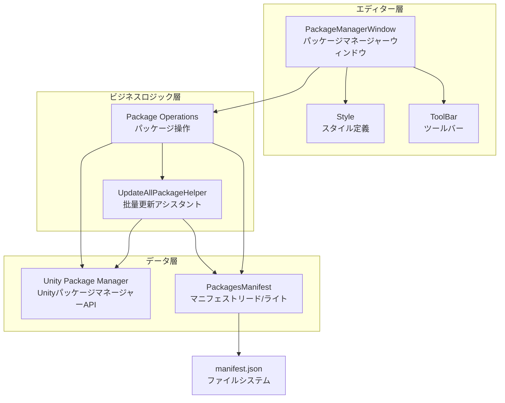
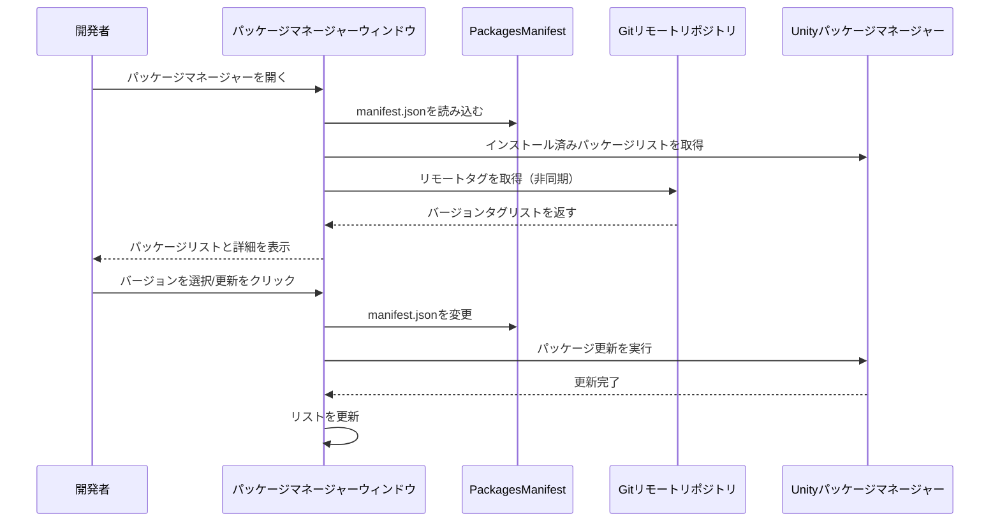

# パッケージ管理ツール

GameFrameXパッケージ管理ツールは完全なUnityエディター拡張であり、Gitベースの依存パッケージを管理するために特化しています。可視化パッケージ管理インターフェースと批量更新機能を提供し、開発者がプロジェクト依存をより効率的に管理できるよう支援します。

## 概要

GameFrameXパッケージ管理ツールはUnityエディター拡張であり、`GameFrameX`メニュー配下に統合されています。このツールは主に以下の問題を解決します：

1. **可視化パッケージ管理** - グラフィカルインターフェースを通じてインストール済みすべてのGitパッケージとその詳細情報を表示
2. **バージョン切り替え** - 同一パッケージ的不同バージョン間で自由に切り替え可能（アップグレード/ダウングレード）
3. **批量更新** - ワンボタンですべてのGitパッケージを最新バージョンに更新
4. **ミラー切り替え** - GitHubとGiteeミラー間を素早く切り替え可能

### コア機能

| 機能 | 説明 |
|------|------|
| パッケージリスト表示 | インストール済みすべてのGitパッケージを表示 |
| パッケージ詳細表示 | パッケージの名前、バージョン、作者、説明などの情報を表示 |
| バージョン切り替え | 指定バージョンへのアップグレード/ダウングレードをサポート |
| 批量更新 | ワンボタンで、すべてのパケットを最新バージョンに更新 |
| ミラー切り替え | GitHub/Giteeミラー切り替えをサポート |
| 更新機能 | パッケージリストを再読み込み |

## アーキテクチャ設計



### コンポーネント説明

| コンポーネント | ファイルパス | 責務 |
|------|----------|------|
| PackageManagerWindow | Editor/PackageManager/PackageManagerWindow.cs | メインウィンドウインターフェース、パッケージリストと詳細表示を提供 |
| PackageManagerWindow.Package | Editor/PackageManager/PackageManagerWindow.Package.cs | パッケージ操作ロジック、ロード、バージョン取得を含む |
| PackageManagerWindow.ToolBar | Editor/PackageManager/PackageManagerWindow.ToolBar.cs | ツールバーUI、更新、ミラー切り替えを提供 |
| PackageManagerWindow.Style | Editor/PackageManager/PackageManagerWindow.Style.cs | スタイル定義 |
| PackagesManifest | Editor/PackageManager/PackagesManifest.cs | manifest.jsonのリード/ライト封装 |
| UpdateAllPackageHelper | Editor/UpdatePackages/UpdateAllPackageHelper.cs | 批量更新機能 |

## コア機能詳細

### パッケージマネージャーを開く

メニュー`GameFrameX → Package Manager(GameFrameXのパッケージマネージャー)`からパッケージ管理ウィンドウを開きます。

```csharp
[MenuItem("GameFrameX/Package Manager(GameFrameXの包管理器)", false, 2000)]
public static void ShowWindow()
{
    var window = GetWindow<PackageManagerWindow>("GameFrameX");
    window.minSize = new UnityEngine.Vector2(800, 600);
    window.Show();
}
```
> Source: [PackageManagerWindow.cs](https://github.com/GameFrameX/com.gameframex.unity/blob/main/Editor/PackageManager/PackageManagerWindow.cs#L11-L17)

### パッケージ情報モデル

```csharp
public sealed class PackageManagerInfo
{
    /// <summary>
    /// パッケージ名
    /// </summary>
    public string Name { get; }

    /// <summary>
    /// パッケージgitアドレス
    /// </summary>
    public string GitUrl { get; }

    /// <summary>
    /// パッケージ情報
    /// </summary>
    public PackageInfo Package { get; }

    /// <summary>
    /// バージョンリスト、Tags
    /// </summary>
    public List<string> Versions { get; }
}
```
> Source: [PackageManagerWindow.Package.cs](https://github.com/GameFrameX/com.gameframex.unity/blob/main/Editor/PackageManager/PackageManagerWindow.Package.cs#L20-L49)

### Gitタグバージョンを取得

ツールはgit ls-remoteを呼び出してリモートリポジトリのすべてのタグを取得：

```csharp
private void FetchGitTags(string gitUrl, PackageManagerInfo package)
{
    isLoadingPackageTagList = true;
    Task.Run(() =>
    {
        ProcessStartInfo startInfo = new ProcessStartInfo
        {
            FileName = "git",
            Arguments = $"ls-remote --tags {gitUrl}",
            RedirectStandardOutput = true,
            UseShellExecute = false,
            CreateNoWindow = true
        };
        using (Process process = Process.Start(startInfo))
        {
            using (StreamReader reader = process.StandardOutput)
            {
                string result = reader.ReadToEnd();
                string[] tags = result.Split('\n');
                foreach (var tag in tags)
                {
                    if (!string.IsNullOrEmpty(tag) && !tag.Contains("^{"))
                    {
                        // タグ名を抽出
                        var tagName = tag.Split('\t')[1].Replace("refs/tags/", "").Trim();
                        package.Versions.Add(tagName);
                    }
                }
                package.Versions.Sort((x, y) => -x.CompareTo(y));
            }
        }
        isLoadingPackageTagList = false;
    });
}
```
> Source: [PackageManagerWindow.Package.cs](https://github.com/GameFrameX/com.gameframex.unity/blob/main/Editor/PackageManager/PackageManagerWindow.Package.cs#L103-L144)

### バージョン更新/ダウングレード

```csharp
void UpdateToVersion(string packageName, string version)
{
    StartLoadPackages();
    PackagesManifest saveManifest = new PackagesManifest
    {
        Dependencies = new Dictionary<string, string>(PackagesManifest.Dependencies),
    };
    foreach (var dependency in PackagesManifest.Dependencies)
    {
        if (dependency.Key.Equals(packageName, StringComparison.OrdinalIgnoreCase))
        {
            string packageUrl = dependency.Value;
            if (packageUrl.Contains(".git"))
            {
                int indexTag = packageUrl.LastIndexOf("#", StringComparison.InvariantCulture);
                string url;
                if (indexTag >= 0)
                {
                    // 既にバージョン番号あり
                    url = packageUrl.Substring(0, indexTag);
                    url = $"{url}#{version}";
                }
                else
                {
                    url = packageUrl.Split(new[] { ".git", }, StringSplitOptions.RemoveEmptyEntries)[0];
                    url = $"{url}.git#{version}";
                }
                saveManifest.Dependencies[dependency.Key] = url;
                UpdateAllPackageHelper.UpdatePackages(packageName, url);
                continue;
            }
            saveManifest.Dependencies[dependency.Key] = packageUrl;
        }
    }
    SavePackages(saveManifest);
    UpdateAllPackageHelper.StartUpdate();
    AssetDatabase.Refresh();
}
```
> Source: [PackageManagerWindow.cs](https://github.com/GameFrameX/com.gameframex.unity/blob/main/Editor/PackageManager/PackageManagerWindow.cs#L230-L271)

## 使用フロー



## 批量更新機能

### メニューエントリーポイント

```csharp
[MenuItem("GameFrameX/Update All Packages(更新所有git包)", false, 2000)]
public static void UpdatePackages()
{
    var result = EditorUtility.DisplayDialog("パッケージ更新提示", "すべてのパケットを更新しますか?\n 更新完了後[再起動、再起動、再起動]Unityが必要です", "はい", "いいえ");
    if (result)
    {
        var manifestPath = Path.Combine(Application.dataPath, "..", "Packages", "manifest.json");
        UpdatePackagesFromManifest(manifestPath);
    }
}
```
> Source: [UpdateAllPackageHelper.cs](https://github.com/GameFrameX/com.gameframex.unity/blob/main/Editor/UpdatePackages/UpdateAllPackageHelper.cs#L24-L33)

### 更新進捗処理

```csharp
private static void UpdatingProgressHandler()
{
    if (_addRequest.IsCompleted)
    {
        if (_addRequest.Status == StatusCode.Success)
        {
            UnityEngine.Debug.Log($"Updated package: {_addRequest.Result.packageId}");
        }
        else if (_addRequest.Status >= StatusCode.Failure)
        {
            UnityEngine.Debug.LogError($"Failed to update package: {_addRequest.Error.message}");
        }
        EditorApplication.update -= UpdatingProgressHandler;
        UpdateNextPackage();
    }
}
```
> Source: [UpdateAllPackageHelper.cs](https://github.com/GameFrameX/com.gameframex.unity/blob/main/Editor/UpdatePackages/UpdateAllPackageHelper.cs#L110-L126)

## ミラー切り替え機能

ツールはGitHubとGiteeミラー間の切り替えをサポートし、異なるネットワーク環境に適応：

```csharp
private void OnGUIByToolBar()
{
    GUILayout.BeginHorizontal(EditorStyles.toolbar);
    GUILayout.Label("ミラー一覧:", EditorStyles.label, GUILayout.Width(100));
    int newDropdownIndex = EditorGUILayout.Popup(_selectedDropdownIndex, _dropdownOptions, EditorStyles.toolbarDropDown);
    if (newDropdownIndex != _selectedDropdownIndex)
    {
        var confirmed = EditorUtility.DisplayDialog("切り替え提示",
            $"すべてのパケットのダウンロードアドレスを以下ミラーに切り替えます:\n{_dropdownOptions[newDropdownIndex]}\n 一部のライブラリがない場合があります。Issueを提出してフィードバックしてください", "確認", "キャンセル");

        if (confirmed)
        {
            _selectedDropdownIndex = newDropdownIndex;
            // すべてのパケットのURLを更新
            foreach (var manifestDependency in PackagesManifest.Dependencies)
            {
                if (manifestDependency.Value.StartsWith("https://"))
                {
                    var path = manifestDependency.Value.Replace("https://", string.Empty).Replace("\\", "/");
                    var index = path.IndexOf("/", System.StringComparison.OrdinalIgnoreCase);
                    if (index >= 0)
                    {
                        path = path.Substring(index);
                    }
                    dependencies[manifestDependency.Key] = $"https://{_dropdownOptions[_selectedDropdownIndex]}{path}";
                }
            }
            PackagesManifest.Dependencies = dependencies;
            SavePackages(PackagesManifest);
        }
    }
    // ... 更新ボタン
}
```
> Source: [PackageManagerWindow.ToolBar.cs](https://github.com/GameFrameX/com.gameframex.unity/blob/main/Editor/PackageManager/PackageManagerWindow.ToolBar.cs#L13-L49)

## よくある質問

### Q: パッケージ更新後にUnityを再起動する必要がありますか？

はい、Unityパッケージマネージャーの制限により、パケット更新後は**Unityエディターを再起動**する必要があります。ツールはプロンプトダイアログを表示して注意します。

### Q: 一部のパッケージにバージョンリストが表示されない理由は？

これは以下の原因が考えられます：
1. リモートリポジトリにGit Tagが作成されていない
2. ネットワーク問題でリモートタグを取得できない
3. Gitリポジトリがls-remote操作をサポートしていない

この問題が発生した場合、「この庫缺失Tag或者版本标记? 我要反馈」ボタンをクリックしてIssueを提出できます。

### Q: ミラー切り替え後に一部のパケットがダウンロードできない場合の対処は？

GiteeミラーはGitHubリポジトリと完全に同期していない可能性があり、切り替え後に一部のパケットがダウンロードできない場合があります。Issueを提出してフィードバックしてください。開発者が適切に対応します。

### Q: 正在进行の批量更新をキャンセルする方法は？

批量更新プロセス中、Progress Barの右上隅に閉じるボタンがあり、クリックすれば更新をキャンセルできます。

## 関連リンク

- [ビルドツール](./6-editor-tools.build-tools)
- [ミニゲームプラットフォーム対応](./6-editor-tools.mini-game-platform)
- [インスペクターパネルツール](./6-editor-tools.inspector-tools)
- [画像切り抜きツール](./6-editor-tools.cropping-tool)
- [Unity Package Manager ドキュメント](https://docs.unity3d.com/Manual/Packages.html)
