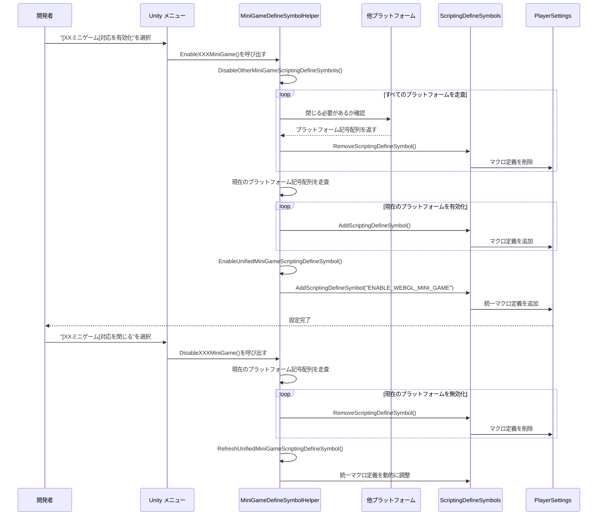

# ミニゲームプラットフォーム対応

ミニゲームプラットフォーム対応モジュールは21の主流ミニゲームプラットフォームへの統一マクロ定義管理ソリューションを提供します。このモジュールを通じて、開発者はワンボタンでターゲットプラットフォームを切り替えでき、システムはプラットフォーム間の相互排他性を自動的に処理し、统一されたWebGLミニゲームマクロ定義を生成します。

## 概要

Unity WebGLミニゲームを開發する際、異なるプラットフォームに対して異なるスクリプトマクロ定義（Scripting Define Symbols）を設定してプラットフォーム固有のコード対応を有効にする必要があります。従来方式是PlayerSettingsで手动で構成する必要があり、面倒でエラーが発生しやすいです。

ミニゲームプラットフォーム対応モジュールは以下の設計でこの問題を解決します：

- **ワンボタン切り替え**：Unityメニューバーを通じてターゲットプラットフォームを быстро有効/無効
- **自動相互排他**：新プラットフォームを有効にすると自動的に他プラットフォームを閉じ、マクロ定義冲突を回避
- **統一識別子**：自動管理`ENABLE_WEBGL_MINI_GAME`統一マクロ、クロスプラットフォーム通用コードを記述可能被ように
- **プラットフォーム分類**：国内ミニゲーム、海外ミニゲーム、デバイスメーカー、ゲームプラットフォームの4種類に分類、管理しやすい

## アーキテクチャ設計

```mermaid
graph TB
    subgraph Core["コア層 - MiniGameDefineSymbolHelper.cs"]
        Main["主クラス定義<br/>MiniGameDefineSymbolHelper"]
        GetAll["全プラットフォーム記号を取得<br/>GetAllMiniGameScriptingDefineSymbols"]
        DisableOthers["他プラットフォームを閉じる<br/>DisableOtherMiniGameScriptingDefineSymbols"]
        EnableUnified["統一記号を有効化<br/>EnableUnifiedMiniGameScriptingDefineSymbol"]
        RefreshUnified["統一記号を更新<br/>RefreshUnifiedMiniGameScriptingDefineSymbol"]
    end

    subgraph Domestic["国内ミニゲーム - DomesticMiniGames"]
        WC["微信 WeChat"]
        DY["抖音 DouYin"]
        KS["快手 KuaiShou"]
        BD["百度 Baidu"]
        AL["支付宝 Alipay"]
        MT["美団 Meituan"]
        BL["Bilibili"]
        JD["京東 JingDong"]
        TB["淘宝 Taobao"]
        TT["TapTap"]
    end

    subgraph International["海外ミニゲーム - InternationalMiniGames"]
        CG["CrazyGames"]
        DC["Discord"]
        FB["Facebook"]
        GP["Google Play"]
        PK["Poki"]
        TTInt["TikTok"]
        YT["YouTube"]
    end

    subgraph Device["デバイスメーカー - DeviceOEMs"]
        HW["Huawei"]
        OP["OPPO"]
        VI["Vivo"]
        XM["Xiaomi"]
    end

    subgraph Utilities["ツール層 - ScriptingDefineSymbols"]
        Util["ScriptingDefineSymbols<br/>ツールクラス"]
    end

    Main --> GetAll
    Main --> DisableOthers
    Main --> EnableUnified
    Main --> RefreshUnified

    GetAll --> WC
    GetAll --> DY
    GetAll --> KS
    GetAll --> BD
    GetAll --> AL
    GetAll --> MT
    GetAll --> BL
    GetAll --> JD
    GetAll --> TB
    GetAll --> TT
    GetAll --> CG
    GetAll --> DC
    GetAll --> FB
    GetAll --> GP
    GetAll --> PK
    GetAll --> TTInt
    GetAll --> YT
    GetAll --> HW
    GetAll --> OP
    GetAll --> VI
    GetAll --> XM

    DisableOthers --> Util
    EnableUnified --> Util
    RefreshUnified --> Util
```



### アーキテクチャ説明

コア層`MiniGameDefineSymbolHelper`はモジュール全体のメインコントローラーであり、以下のコア機能を提供します：

1. **全プラットフォーム記号を取得** (`GetAllMiniGameScriptingDefineSymbols`)：登録済みすべてのミニゲームプラットフォームマクロ定義を収集
2. **他プラットフォームを閉じる** (`DisableOtherMiniGameScriptingDefineSymbols`)：プラットフォーム間の相互排他ロジックを実装
3. **統一記号を有効化** (`EnableUnifiedMiniGameScriptingDefineSymbol`)：`ENABLE_WEBGL_MINI_GAME`統一マクロを管理
4. **統一記号を更新** (`RefreshUnifiedMiniGameScriptingDefineSymbol`)：現在のプラットフォーム状態に応じて統一マクロを動的に調整

プラットフォーム層は機能別に4つのフォルダーに分かれ、各プラットフォームはpartial classの形で主クラスを拡張し、`[MenuItem]`属性を通じてUnityメニューバーに对应する有効/無効オプションを生成します。

## コア機能フロー



### 設計意図

このフロー設計は以下の原則に従います：

1. **相互排他性**：`DisableOtherMiniGameScriptingDefineSymbols`を通じて同時に1つのプラットフォームのみがアクティブであることを确保し、マクロ定義冲突によるコンパイルエラーを防止

2. **統一性**：各プラットフォームを有効にすると自動的に`ENABLE_WEBGL_MINI_GAME`統一マクロが追加され、開発者はこのマクロを使用してプラットフォーム无关のコアロジックを記述可能被

3. **動的更新**：プラットフォームを無効にすると他にアクティブなプラットフォームがあるかどうかを確認し、なければ自動的に統一マクロを閉じ、無効なマクロ定義の存在を回避

## 対応プラットフォーム

### 国内ミニゲーム (Domestic Mini Games)

| プラットフォーム | マクロ定義 | メニューパス |
|------|--------|----------|
| 微信 WeChat | `ENABLE_WECHAT_MINI_GAME`, `WEIXINMINIGAME` | GameFrameX → Scripting Define Symbols → Domestic Mini Games |
| 抖音 DouYin | `ENABLE_DOUYIN_MINI_GAME`, `DOUYINMINIGAME`, `TTSDK_MIX_ENGINE` | GameFrameX → Scripting Define Symbols → Domestic Mini Games |
| 快手 KuaiShou | `ENABLE_KUAISHOU_MINI_GAME`, `KUAISHOUMINIGAME` | GameFrameX → Scripting Define Symbols → Domestic Mini Games |
| 百度 Baidu | `ENABLE_BAIDU_MINI_GAME`, `BAIDUMINIGAME` | GameFrameX → Scripting Define Symbols → Domestic Mini Games |
| 支付宝 Alipay | `ENABLE_ALIPAY_MINI_GAME`, `ALIPAYMINIGAME` | GameFrameX → Scripting Define Symbols → Domestic Mini Games |
| 美団 Meituan | `ENABLE_MEITUAN_MINI_GAME`, `MEITUANMINIGAME` | GameFrameX → Scripting Define Symbols → Domestic Mini Games |
| Bilibili | `ENABLE_BILIBILI_MINI_GAME`, `BILIBILIMINIGAME` | GameFrameX → Scripting Define Symbols → Domestic Mini Games |
| 京東 JingDong | `ENABLE_JINGDONG_MINI_GAME`, `JINGDONGMINIGAME` | GameFrameX → Scripting Define Symbols → Domestic Mini Games |
| 淘宝 Taobao | `ENABLE_TAOBAO_MINI_GAME`, `TAOBAOMINIGAME` | GameFrameX → Scripting Define Symbols → Domestic Mini Games |
| TapTap | `ENABLE_TAPTAP_MINI_GAME`, `TAPTAPMINIGAME` | GameFrameX → Scripting Define Symbols → Game Platforms |

### 海外ミニゲーム (International Mini Games)

| プラットフォーム | マクロ定義 | メニューパス |
|------|--------|----------|
| CrazyGames | `ENABLE_CRAZYGAMES_MINI_GAME`, `CRAZYGAMESMINIGAME` | GameFrameX → Scripting Define Symbols → International Mini Games |
| Discord | `ENABLE_DISCORD_MINI_GAME`, `DISCORDMINIGAME` | GameFrameX → Scripting Define Symbols → International Mini Games |
| Facebook | `ENABLE_FACEBOOK_MINI_GAME`, `FACEBOOKMINIGAME` | GameFrameX → Scripting Define Symbols → International Mini Games |
| Google Play | `ENABLE_GOOGLEPLAY_MINI_GAME`, `GOOGLEPLAYMINIGAME` | GameFrameX → Scripting Define Symbols → International Mini Games |
| Poki | `ENABLE_POKI_MINI_GAME`, `POKIMINIGAME` | GameFrameX → Scripting Define Symbols → International Mini Games |
| TikTok | `ENABLE_TIKTOK_MINI_GAME`, `TIKTOKMINIGAME` | GameFrameX → Scripting Define Symbols → International Mini Games |
| YouTube | `ENABLE_YOUTUBE_MINI_GAME`, `YOUTUBEMINIGAME` | GameFrameX → Scripting Define Symbols → International Mini Games |

### デバイスメーカー (Device OEMs)

| プラットフォーム | マクロ定義 | メニューパス |
|------|--------|----------|
| Huawei | `ENABLE_HUAWEI_MINI_GAME`, `HUAWEIMINIGAME` | GameFrameX → Scripting Define Symbols → Device OEMs |
| OPPO | `ENABLE_OPPO_MINI_GAME`, `OPPOSMINIGAME` | GameFrameX → Scripting Define Symbols → Device OEMs |
| Vivo | `ENABLE_VIVO_MINI_GAME`, `VIVOMINIGAME` | GameFrameX → Scripting Define Symbols → Device OEMs |
| Xiaomi | `ENABLE_XIAOMI_MINI_GAME`, `XIAOMIMINIGAME` | GameFrameX → Scripting Define Symbols → Device OEMs |

## 使用例

### 基本使用：プラットフォームを有効化

Unityエディターで、メニューバーから对应するプラットフォームオプションを選択して対応を有効化：

```
GameFrameX → Scripting Define Symbols → Domestic Mini Games → Enable WeChat Mini Game
```

有効化後、システムは自動的に以下の操作を実行：
1. 他すべてのミニゲームプラットフォームのマクロ定義を閉じる
2. 微信ミニゲームのマクロ定義を有効化 (`ENABLE_WECHAT_MINI_GAME`, `WEIXINMINIGAME`)
3. 統一マクロ定義を有効化 (`ENABLE_WEBGL_MINI_GAME`)

### コードでプラットフォームマクロを使用

```csharp
#if ENABLE_WECHAT_MINI_GAME
using WeChatMiniGame API;
// 微信ミニゲーム特定コード
#elif ENABLE_DOUYIN_MINI_GAME
using DouYinMiniGameAPI;
// 抖音ミニゲーム特定コード
#elif ENABLE_WEBGL_MINI_GAME
// 汎用 WebGL ミニゲームロジック
#endif
```

> Source: [MiniGameDefineSymbolHelper.WeChat.cs](https://github.com/GameFrameX/com.gameframex.unity/blob/main/Editor/MiniGame/DomesticMiniGames/MiniGameDefineSymbolHelper.WeChat.cs#L20-L40)

### プラットフォームを無効化

```
GameFrameX → Scripting Define Symbols → Domestic Mini Games → Disable WeChat Mini Game
```

無効化後、システムは해당 플랫폼のマクロ定義を削除し、統一マクロ定義を調整する必要があるかどうかを確認します。

### プラットフォームマクロ定義例

微信ミニゲームプラットフォームのマクロ定義設定：

```csharp
/// <summary>
/// 微信ミニゲーム対応マクロ定義コレクション。
/// Define symbols for WeChat mini game adaptation.
/// </summary>
public static readonly string[] EnableWeChatMiniGameScriptingDefineSymbol = new[]
{
    "ENABLE_WECHAT_MINI_GAME",
    "WEIXINMINIGAME"
};
```

> Source: [MiniGameDefineSymbolHelper.WeChat.cs](https://github.com/GameFrameX/com.gameframex.unity/blob/main/Editor/MiniGame/DomesticMiniGames/MiniGameDefineSymbolHelper.WeChat.cs#L10-L14)

抖音プラットフォームには追加の巨量エンジン記号が含まれています：

```csharp
/// <summary>
/// 抖音ミニゲーム対応マクロ定義コレクション。
/// Define symbols for DouYin mini game adaptation.
/// </summary>
public static readonly string[] EnableDouYinMiniGameScriptingDefineSymbol = new[]
{
    "ENABLE_DOUYIN_MINI_GAME",
    "DOUYINMINIGAME",
    "TTSDK_MIX_ENGINE"
};
```

> Source: [MiniGameDefineSymbolHelper.DouYin.cs](https://github.com/GameFrameX/com.gameframex.unity/blob/main/Editor/MiniGame/DomesticMiniGames/MiniGameDefineSymbolHelper.DouYin.cs#L10-L14)

### コア実装ロジック

プラットフォーム有効化時のコア相互排他ロジック：

```csharp
/// <summary>
/// 現在のプラットフォーム以外の其它ミニゲームプラットフォームマクロ定義を閉じる。
/// Disables define symbols of other mini game platforms except the current one.
/// </summary>
/// <param name="currentMiniGameScriptingDefineSymbols">現在のプラットフォームマクロ定義コレクション</param>
private static void DisableOtherMiniGameScriptingDefineSymbols(string[] currentMiniGameScriptingDefineSymbols)
{
#if UNITY_WEBGL
    var closedCount = 0;
    foreach (var defineSymbols in GetAllMiniGameScriptingDefineSymbols())
    {
        if (defineSymbols == null || object.ReferenceEquals(defineSymbols, currentMiniGameScriptingDefineSymbols))
        {
            continue;
        }

        foreach (var define in defineSymbols)
        {
            if (!ScriptingDefineSymbols.HasScriptingDefineSymbol(BuildTargetGroup.WebGL, define))
            {
                continue;
            }

            ScriptingDefineSymbols.RemoveScriptingDefineSymbol(define);
            closedCount++;
            UnityEngine.Debug.Log($"ミニゲームマクロ定義 [{define}] が閉じられました");
        }
    }

    UnityEngine.Debug.Log($"ミニゲームマクロ定義相互排他清理完了、合計 {closedCount} 個のマクロ定義を閉じました");
#endif
}
```

> Source: [MiniGameDefineSymbolHelper.cs](https://github.com/GameFrameX/com.gameframex.unity/blob/main/Editor/MiniGame/MiniGameDefineSymbolHelper.cs#L52-L88)

## 設定説明

### 統一マクロ定義

任意のミニゲームプラットフォームを有効化したプロジェクトは自動的に`ENABLE_WEBGL_MINI_GAME`マクロ定義を取得します。このマクロはプラットフォーム无关のコアロジックを記述するために使用されます：

```csharp
#if ENABLE_WEBGL_MINI_GAME
// すべてのミニゲームプラットフォームで共有されるコード
// 例：統一リソースロードインターフェース、共通イベントシステムなど
#endif
```

### メニュー項目優先順位

メニュー項目はプラットフォーム分類に従って構成され、優先順位は以下の通り：

| 分類 | 優先順位範囲 | 説明 |
|------|-----------|------|
| 国内ミニゲーム | 2000-2099 | Domestic Mini Games |
| ゲームプラットフォーム | 2500-2599 | Game Platforms |
| 海外ミニゲーム | 3200-3499 | International Mini Games |
| デバイスメーカー | 3700-3999 | Device OEMs |

### 注意事項

1. **WebGLのみサポート**：すべてのミニゲームプラットフォームマクロ定義はWebGLビルドターゲットでのみ有効、コードには`#if UNITY_WEBGL`保護が追加済み
2. **相互排他設計**：ミニゲームプラットフォームは相互排他的であり、新プラットフォームを有効にすると自動的に旧プラットフォームが閉じる
3. **マクロ定義形式**：プラットフォームマクロ定義は通常以下の2部分を含みます：
   - `ENABLE_XXX_MINI_GAME`：統一形式、認識しやすい
   - `XXXMINIGAME`：プラットフォーム特定形式、各プラットフォームSDKに対応

## 関連リンク

- [ビルドツール](./6-editor-tools.build-tools) - 他のビルド関連機能を了解
- [パッケージ管理ツール](./6-editor-tools.package-management) - プロジェクト依存管理を了解
- [インスペクターパネルツール](./6-editor-tools.inspector-tools) - ランタイム監視ツールを了解
- [APIリファレンス](./8-api-reference) - 完全なAPI定義を表示
