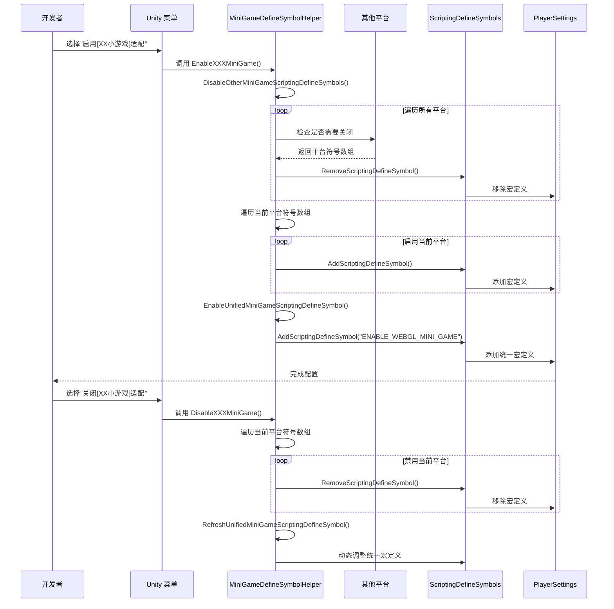

# ミニゲームプラットフォーム适配

ミニゲームプラットフォーム适配モジュール提供します对 21 个主流ミニゲームプラットフォーム的統一された宏定義管理解決策。通过该モジュール，開発者〜できます一键切换目标プラットフォーム，系统会自动処理プラットフォーム之间的互斥关系，并生成統一された的 WebGL ミニゲーム宏定義。

## 概要

在开发 Unity WebGL ミニゲーム时，针对不同プラットフォーム〜する必要があります設定不同的脚本宏定義（Scripting Define Symbols）来启用プラットフォーム特定的コード适配。传统方法〜する必要があります手动在 PlayerSettings 中設定，既繁琐又容易出错。

ミニゲームプラットフォーム适配モジュール通过以下設計解决这些問題：

- **一键切换**：通过 Unity メニュー栏快速启用/禁用目标プラットフォーム
- **自动互斥**：启用新プラットフォーム时自动閉じる其他プラットフォーム，避免宏定義冲突
- **統一された标识**：自动管理 `ENABLE_WEBGL_MINI_GAME` 統一された宏，便于编写跨プラットフォーム汎用コード
- **プラットフォーム分类**：按国内ミニゲーム、海外ミニゲーム、设备厂商、游戏プラットフォーム四类组织，便于管理

## アーキテクチャ設計

```mermaid
graph TB
    subgraph Core["核心层 - MiniGameDefineSymbolHelper.cs"]
        Main["主类定义<br/>MiniGameDefineSymbolHelper"]
        GetAll["获取所有平台符号<br/>GetAllMiniGameScriptingDefineSymbols"]
        DisableOthers["关闭其他平台<br/>DisableOtherMiniGameScriptingDefineSymbols"]
        EnableUnified["启用统一符号<br/>EnableUnifiedMiniGameScriptingDefineSymbol"]
        RefreshUnified["刷新统一符号<br/>RefreshUnifiedMiniGameScriptingDefineSymbol"]
    end
    
    subgraph Domestic["国内小游戏 - DomesticMiniGames"]
        WC["微信 WeChat"]
        DY["抖音 DouYin"]
        KS["快手 KuaiShou"]
        BD["百度 Baidu"]
        AL["支付宝 Alipay"]
        MT["美团 Meituan"]
        BL["哔哩哔哩 Bilibili"]
        JD["京东 JingDong"]
        TB["淘宝 Taobao"]
        TT["TapTap"]
    end
    
    subgraph International["海外小游戏 - InternationalMiniGames"]
        CG["CrazyGames"]
        DC["Discord"]
        FB["Facebook"]
        GP["Google Play"]
        PK["Poki"]
        TTInt["TikTok"]
        YT["YouTube"]
    end
    
    subgraph Device["设备厂商 - DeviceOEMs"]
        HW["华为 Huawei"]
        OP["OPPO"]
        VI["Vivo"]
        XM["小米 Xiaomi"]
    end
    
    subgraph Utilities["工具层 - ScriptingDefineSymbols"]
        Util["ScriptingDefineSymbols<br/>工具类"]
    end
    
    Main --> GetAll
    Main --> DisableOthers
    Main --> EnableUnified
    Main --> RefreshUnified
    
    GetAll --> WC
    GetAll --> DY
    GetAll --> KS
    GetAll --> BD
    GetAll --> AL
    GetAll --> MT
    GetAll --> BL
    GetAll --> JD
    GetAll --> TB
    GetAll --> TT
    GetAll --> CG
    GetAll --> DC
    GetAll --> FB
    GetAll --> GP
    GetAll --> PK
    GetAll --> TTInt
    GetAll --> YT
    GetAll --> HW
    GetAll --> OP
    GetAll --> VI
    GetAll --> XM
    
    DisableOthers --> Util
    EnableUnified --> Util
    RefreshUnified --> Util
```



### アーキテクチャ説明

コア层 `MiniGameDefineSymbolHelper` 是整个モジュール的主控制器，提供以下コア機能：

1. **取得所有プラットフォーム符号** (`GetAllMiniGameScriptingDefineSymbols`)：收集所有已登録的ミニゲームプラットフォーム宏定義
2. **閉じる其他プラットフォーム** (`DisableOtherMiniGameScriptingDefineSymbols`)：実装プラットフォーム间的互斥逻辑
3. **启用統一された符号** (`EnableUnifiedMiniGameScriptingDefineSymbol`)：管理 `ENABLE_WEBGL_MINI_GAME` 統一された宏
4. **刷新統一された符号** (`RefreshUnifiedMiniGameScriptingDefineSymbol`)：根据当前プラットフォームステータス动态调整統一された宏

プラットフォーム层按機能分为四个ファイル夹，每个プラットフォーム以 partial class 的形式拡張主类，通过 `[MenuItem]` プロパティ在 Unity メニュー栏生成对应的启用/禁用オプション。

## コア機能フロー



### 設計意图

このフロー設計遵循以下原则：

1. **互斥性**：通过 `DisableOtherMiniGameScriptingDefineSymbols` 確認してください同時に只有一个プラットフォーム被激活，防止宏定義冲突导致的コンパイルエラー

2. **統一された性**：每个プラットフォーム启用时都会自动追加 `ENABLE_WEBGL_MINI_GAME` 統一された宏，開発者〜できます使用该宏编写プラットフォーム无关的コア逻辑

3. **动态刷新**：禁用プラットフォーム时会確認是否还有其他プラットフォーム处于激活ステータス，もし没有则自动閉じる統一された宏，避免无效宏定義的存在

## サポート的プラットフォーム

### 国内ミニゲーム (Domestic Mini Games)

| プラットフォーム | 宏定義 | メニュー路径 |
|------|--------|----------|
| 微信 WeChat | `ENABLE_WECHAT_MINI_GAME`, `WEIXINMINIGAME` | GameFrameX → Scripting Define Symbols → Domestic Mini Games |
| 抖音 DouYin | `ENABLE_DOUYIN_MINI_GAME`, `DOUYINMINIGAME`, `TTSDK_MIX_ENGINE` | GameFrameX → Scripting Define Symbols → Domestic Mini Games |
| 快手 KuaiShou | `ENABLE_KUAISHOU_MINI_GAME`, `KUAISHOUMINIGAME` | GameFrameX → Scripting Define Symbols → Domestic Mini Games |
| 百度 Baidu | `ENABLE_BAIDU_MINI_GAME`, `BAIDUMINIGAME` | GameFrameX → Scripting Define Symbols → Domestic Mini Games |
| 支付宝 Alipay | `ENABLE_ALIPAY_MINI_GAME`, `ALIPAYMINIGAME` | GameFrameX → Scripting Define Symbols → Domestic Mini Games |
| 美团 Meituan | `ENABLE_MEITUAN_MINI_GAME`, `MEITUANMINIGAME` | GameFrameX → Scripting Define Symbols → Domestic Mini Games |
| 哔哩哔哩 Bilibili | `ENABLE_BILIBILI_MINI_GAME`, `BILIBILIMINIGAME` | GameFrameX → Scripting Define Symbols → Domestic Mini Games |
| 京东 JingDong | `ENABLE_JINGDONG_MINI_GAME`, `JINGDONGMINIGAME` | GameFrameX → Scripting Define Symbols → Domestic Mini Games |
| 淘宝 Taobao | `ENABLE_TAOBAO_MINI_GAME`, `TAOBAOMINIGAME` | GameFrameX → Scripting Define Symbols → Domestic Mini Games |
| TapTap | `ENABLE_TAPTAP_MINI_GAME`, `TAPTAPMINIGAME` | GameFrameX → Scripting Define Symbols → Game Platforms |

### 海外ミニゲーム (International Mini Games)

| プラットフォーム | 宏定義 | メニュー路径 |
|------|--------|----------|
| CrazyGames | `ENABLE_CRAZYGAMES_MINI_GAME`, `CRAZYGAMESMINIGAME` | GameFrameX → Scripting Define Symbols → International Mini Games |
| Discord | `ENABLE_DISCORD_MINI_GAME`, `DISCORDMINIGAME` | GameFrameX → Scripting Define Symbols → International Mini Games |
| Facebook | `ENABLE_FACEBOOK_MINI_GAME`, `FACEBOOKMINIGAME` | GameFrameX → Scripting Define Symbols → International Mini Games |
| Google Play | `ENABLE_GOOGLEPLAY_MINI_GAME`, `GOOGLEPLAYMINIGAME` | GameFrameX → Scripting Define Symbols → International Mini Games |
| Poki | `ENABLE_POKI_MINI_GAME`, `POKIMINIGAME` | GameFrameX → Scripting Define Symbols → International Mini Games |
| TikTok | `ENABLE_TIKTOK_MINI_GAME`, `TIKTOKMINIGAME` | GameFrameX → Scripting Define Symbols → International Mini Games |
| YouTube | `ENABLE_YOUTUBE_MINI_GAME`, `YOUTUBEMINIGAME` | GameFrameX → Scripting Define Symbols → International Mini Games |

### 设备厂商 (Device OEMs)

| プラットフォーム | 宏定義 | メニュー路径 |
|------|--------|----------|
| 华为 Huawei | `ENABLE_HUAWEI_MINI_GAME`, `HUAWEIMINIGAME` | GameFrameX → Scripting Define Symbols → Device OEMs |
| OPPO | `ENABLE_OPPO_MINI_GAME`, `OPPOSMINIGAME` | GameFrameX → Scripting Define Symbols → Device OEMs |
| Vivo | `ENABLE_VIVO_MINI_GAME`, `VIVOMINIGAME` | GameFrameX → Scripting Define Symbols → Device OEMs |
| 小米 Xiaomi | `ENABLE_XIAOMI_MINI_GAME`, `XIAOMIMINIGAME` | GameFrameX → Scripting Define Symbols → Device OEMs |

## 使用例

### 基本使用：启用プラットフォーム

在 Unity エディタ中，通过メニュー栏选择对应的プラットフォームオプションつまり可启用适配：

```
GameFrameX → Scripting Define Symbols → Domestic Mini Games → Enable WeChat Mini Game
```

启用后，系统会自动执行以下操作：
1. 閉じる其他所有ミニゲームプラットフォーム的宏定義
2. 启用WeChatミニゲーム的宏定義 (`ENABLE_WECHAT_MINI_GAME`, `WEIXINMINIGAME`)
3. 启用統一された宏定義 (`ENABLE_WEBGL_MINI_GAME`)

### コード中使用プラットフォーム宏

```csharp
#if ENABLE_WECHAT_MINI_GAME
using WeChatMiniGame API;
// 微信小游戏特定代码
#elif ENABLE_DOUYIN_MINI_GAME
using DouYinMiniGameAPI;
// 抖音小游戏特定代码
#elif ENABLE_WEBGL_MINI_GAME
// 通用的 WebGL 小游戏逻辑
#endif
```

> Source: [MiniGameDefineSymbolHelper.WeChat.cs](https://github.com/GameFrameX/com.gameframex.unity/blob/main/Editor/MiniGame/DomesticMiniGames/MiniGameDefineSymbolHelper.WeChat.cs#L20-L40)

### 禁用プラットフォーム

```
GameFrameX → Scripting Define Symbols → Domestic Mini Games → Disable WeChat Mini Game
```

禁用后，系统会移除该プラットフォーム的宏定義，并確認是否〜する必要があります调整統一された宏定義。

### プラットフォーム宏定義例

WeChatミニゲームプラットフォーム的宏定義設定：

```csharp
/// <summary>
/// 微信小游戏适配宏定义集合。
/// Define symbols for WeChat mini game adaptation.
/// </summary>
public static readonly string[] EnableWeChatMiniGameScriptingDefineSymbol = new[] 
{ 
    "ENABLE_WECHAT_MINI_GAME", 
    "WEIXINMINIGAME" 
};
```

> Source: [MiniGameDefineSymbolHelper.WeChat.cs](https://github.com/GameFrameX/com.gameframex.unity/blob/main/Editor/MiniGame/DomesticMiniGames/MiniGameDefineSymbolHelper.WeChat.cs#L10-L14)

抖音プラットフォームパッケージ含额外的巨量引擎符号：

```csharp
/// <summary>
/// 抖音小游戏适配宏定义集合。
/// Define symbols for DouYin mini game adaptation.
/// </summary>
public static readonly string[] EnableDouYinMiniGameScriptingDefineSymbol = new[] 
{ 
    "ENABLE_DOUYIN_MINI_GAME", 
    "DOUYINMINIGAME", 
    "TTSDK_MIX_ENGINE" 
};
```

> Source: [MiniGameDefineSymbolHelper.DouYin.cs](https://github.com/GameFrameX/com.gameframex.unity/blob/main/Editor/MiniGame/DomesticMiniGames/MiniGameDefineSymbolHelper.DouYin.cs#L10-L14)

### コア実装逻辑

プラットフォーム启用时的コア互斥逻辑：

```csharp
/// <summary>
/// 关闭除当前平台以外的其它小游戏平台宏定义。
/// Disables define symbols of other mini game platforms except the current one.
/// </summary>
/// <param name="currentMiniGameScriptingDefineSymbols">当前平台宏定义集合</param>
private static void DisableOtherMiniGameScriptingDefineSymbols(string[] currentMiniGameScriptingDefineSymbols)
{
#if UNITY_WEBGL
    var closedCount = 0;
    foreach (var defineSymbols in GetAllMiniGameScriptingDefineSymbols())
    {
        if (defineSymbols == null || object.ReferenceEquals(defineSymbols, currentMiniGameScriptingDefineSymbols))
        {
            continue;
        }

        foreach (var define in defineSymbols)
        {
            if (!ScriptingDefineSymbols.HasScriptingDefineSymbol(BuildTargetGroup.WebGL, define))
            {
                continue;
            }

            ScriptingDefineSymbols.RemoveScriptingDefineSymbol(define);
            closedCount++;
            UnityEngine.Debug.Log($"小游戏宏定义 [{define}] 已经关闭");
        }
    }

    UnityEngine.Debug.Log($"小游戏宏定义互斥清理完成，共关闭 {closedCount} 个宏定义");
#endif
}
```

> Source: [MiniGameDefineSymbolHelper.cs](https://github.com/GameFrameX/com.gameframex.unity/blob/main/Editor/MiniGame/MiniGameDefineSymbolHelper.cs#L52-L88)

## 設定説明

### 統一された宏定義

所有启用了任意ミニゲームプラットフォーム的プロジェクト都会自动获得 `ENABLE_WEBGL_MINI_GAME` 宏定義。该宏用于编写プラットフォーム无关的コア逻辑：

```csharp
#if ENABLE_WEBGL_MINI_GAME
// 所有小游戏平台共用的代码
// 例如：统一的资源加载接口、通用的事件系统等
#endif
```

### メニュー项优先级

メニュー项按照プラットフォーム分类进行组织，优先级設定如下：

| 分类 | 优先级范围 | 説明 |
|------|-----------|------|
| 国内ミニゲーム | 2000-2099 | Domestic Mini Games |
| 游戏プラットフォーム | 2500-2599 | Game Platforms |
| 海外ミニゲーム | 3200-3499 | International Mini Games |
| 设备厂商 | 3700-3999 | Device OEMs |

### 注意事项

1. **仅サポート WebGL**：所有ミニゲームプラットフォーム宏定義仅在 WebGL ビルド目标下有效，コード中已追加 `#if UNITY_WEBGL` 保护
2. **互斥設計**：ミニゲームプラットフォーム之间是互斥的，启用新プラットフォーム会自动閉じる旧プラットフォーム
3. **宏定義フォーマット**：プラットフォーム宏定義通常パッケージ含两部分：
   - `ENABLE_XXX_MINI_GAME`：統一されたフォーマット，便于识别
   - `XXXMINIGAME`：プラットフォーム特定フォーマット，与各プラットフォーム SDK 对应

## 関連リンク

- [ビルド工具](./6-editor-tools.build-tools) - 理解する其他ビルド相关機能
- [パッケージ管理工具](./6-editor-tools.package-management) - 理解するプロジェクト依赖管理
- [检视パネル工具](./6-editor-tools.inspector-tools) - 理解するランタイム监控工具
- [API リファレンス](./8-api-reference) - 確認完全な的 API 定義
