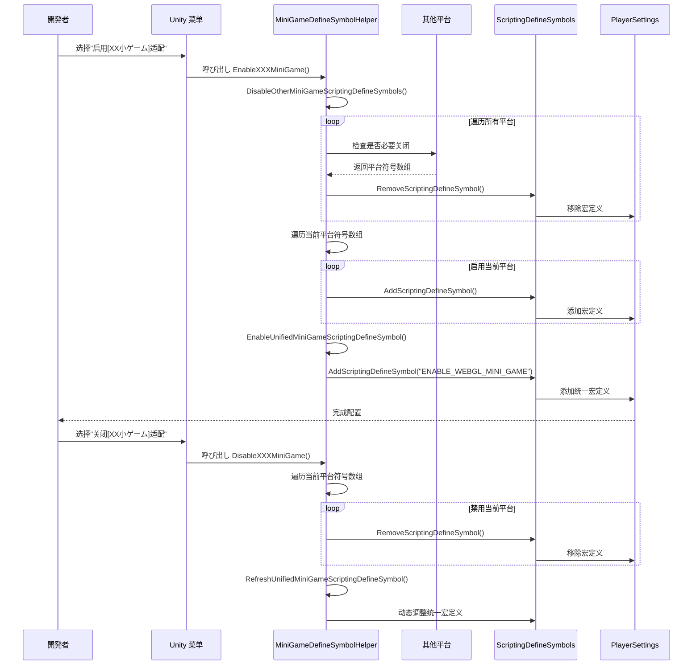

# 小ゲーム平台适配

小ゲーム平台适配模块提供します对 21 个主流小ゲーム平台的统一宏定义管理解決策。を通じて该模块，開発者可能ワンスイッチ切り替え目标平台，系统会自动处理平台之间的互斥关系，并生成统一的 WebGL 小ゲーム宏定义。

## 概要

在开发 Unity WebGL 小ゲーム时，针对不同平台必要設定不同的脚本宏定义（Scripting Define Symbols）来启用平台特定的代码适配。传统方法必要手动在 PlayerSettings 中配置，既繁琐又容易出错。

小ゲーム平台适配模块を通じて以下设计解决这些问题：

- **ワンスイッチ切り替え**：を通じて Unity 菜单栏快速启用/禁用目标平台
- **自动互斥**：启用新平台时自动关闭其他平台，避免宏定义冲突
- **统一标识**：自动管理 `ENABLE_WEBGL_MINI_GAME` 统一宏，便于编写跨平台通用代码
- **平台分クラス**：按国内小ゲーム、海外小ゲーム、设备厂商、ゲーム平台四クラス组织，便于管理

## アーキテクチャ設計


### 架构説明

コア层 `MiniGameDefineSymbolHelper` 是整个模块的主控制器，提供以下コア機能：

1. **取得所有平台符号** (`GetAllMiniGameScriptingDefineSymbols`)：收集所有已注册的小ゲーム平台宏定义
2. **关闭其他平台** (`DisableOtherMiniGameScriptingDefineSymbols`)：実装平台间的互斥逻辑
3. **启用统一符号** (`EnableUnifiedMiniGameScriptingDefineSymbol`)：管理 `ENABLE_WEBGL_MINI_GAME` 统一宏
4. **刷新统一符号** (`RefreshUnifiedMiniGameScriptingDefineSymbol`)：に基づいて当前平台ステータス动态调整统一宏

平台层按機能分为四个ファイル夹，每个平台以 partial class 的形式扩展主クラス，を通じて `[MenuItem]` プロパティ在 Unity 菜单栏生成对应的启用/禁用选项。

## コア機能フロー



### 设计意图

该フロー设计遵循以下原则：

1. **互斥性**：を通じて `DisableOtherMiniGameScriptingDefineSymbols` 确保同时只有一个平台被激活，防止宏定义冲突导致的编译错误

2. **统一性**：每个平台启用时都会自动添加 `ENABLE_WEBGL_MINI_GAME` 统一宏，開発者可能使用该宏编写平台无关的コア逻辑

3. **动态刷新**：禁用平台时会检查是否还有其他平台处于激活ステータス，如果没有则自动关闭统一宏，避免无效宏定义的存在

## サポート的平台

### 国内小ゲーム (Domestic Mini Games)

| 平台 | 宏定义 | 菜单路径 |
|------|--------|----------|
| 微信 WeChat | `ENABLE_WECHAT_MINI_GAME`, `WEIXINMINIGAME` | GameFrameX → Scripting Define Symbols → Domestic Mini Games |
| 抖音 DouYin | `ENABLE_DOUYIN_MINI_GAME`, `DOUYINMINIGAME`, `TTSDK_MIX_ENGINE` | GameFrameX → Scripting Define Symbols → Domestic Mini Games |
| 快手 KuaiShou | `ENABLE_KUAISHOU_MINI_GAME`, `KUAISHOUMINIGAME` | GameFrameX → Scripting Define Symbols → Domestic Mini Games |
| 百度 Baidu | `ENABLE_BAIDU_MINI_GAME`, `BAIDUMINIGAME` | GameFrameX → Scripting Define Symbols → Domestic Mini Games |
| 支付宝 Alipay | `ENABLE_ALIPAY_MINI_GAME`, `ALIPAYMINIGAME` | GameFrameX → Scripting Define Symbols → Domestic Mini Games |
| 美团 Meituan | `ENABLE_MEITUAN_MINI_GAME`, `MEITUANMINIGAME` | GameFrameX → Scripting Define Symbols → Domestic Mini Games |
| 哔哩哔哩 Bilibili | `ENABLE_BILIBILI_MINI_GAME`, `BILIBILIMINIGAME` | GameFrameX → Scripting Define Symbols → Domestic Mini Games |
| 京东 JingDong | `ENABLE_JINGDONG_MINI_GAME`, `JINGDONGMINIGAME` | GameFrameX → Scripting Define Symbols → Domestic Mini Games |
| 淘宝 Taobao | `ENABLE_TAOBAO_MINI_GAME`, `TAOBAOMINIGAME` | GameFrameX → Scripting Define Symbols → Domestic Mini Games |
| TapTap | `ENABLE_TAPTAP_MINI_GAME`, `TAPTAPMINIGAME` | GameFrameX → Scripting Define Symbols → Game Platforms |

### 海外小ゲーム (International Mini Games)

| 平台 | 宏定义 | 菜单路径 |
|------|--------|----------|
| CrazyGames | `ENABLE_CRAZYGAMES_MINI_GAME`, `CRAZYGAMESMINIGAME` | GameFrameX → Scripting Define Symbols → International Mini Games |
| Discord | `ENABLE_DISCORD_MINI_GAME`, `DISCORDMINIGAME` | GameFrameX → Scripting Define Symbols → International Mini Games |
| Facebook | `ENABLE_FACEBOOK_MINI_GAME`, `FACEBOOKMINIGAME` | GameFrameX → Scripting Define Symbols → International Mini Games |
| Google Play | `ENABLE_GOOGLEPLAY_MINI_GAME`, `GOOGLEPLAYMINIGAME` | GameFrameX → Scripting Define Symbols → International Mini Games |
| Poki | `ENABLE_POKI_MINI_GAME`, `POKIMINIGAME` | GameFrameX → Scripting Define Symbols → International Mini Games |
| TikTok | `ENABLE_TIKTOK_MINI_GAME`, `TIKTOKMINIGAME` | GameFrameX → Scripting Define Symbols → International Mini Games |
| YouTube | `ENABLE_YOUTUBE_MINI_GAME`, `YOUTUBEMINIGAME` | GameFrameX → Scripting Define Symbols → International Mini Games |

### 设备厂商 (Device OEMs)

| 平台 | 宏定义 | 菜单路径 |
|------|--------|----------|
| 华为 Huawei | `ENABLE_HUAWEI_MINI_GAME`, `HUAWEIMINIGAME` | GameFrameX → Scripting Define Symbols → Device OEMs |
| OPPO | `ENABLE_OPPO_MINI_GAME`, `OPPOSMINIGAME` | GameFrameX → Scripting Define Symbols → Device OEMs |
| Vivo | `ENABLE_VIVO_MINI_GAME`, `VIVOMINIGAME` | GameFrameX → Scripting Define Symbols → Device OEMs |
| 小米 Xiaomi | `ENABLE_XIAOMI_MINI_GAME`, `XIAOMIMINIGAME` | GameFrameX → Scripting Define Symbols → Device OEMs |

## 使用例

### 基础使用：启用平台

在 Unity 编辑器中，を通じて菜单栏选择对应的平台选项即可启用适配：

```
GameFrameX → Scripting Define Symbols → Domestic Mini Games → Enable WeChat Mini Game
```

启用后，系统会自动以下の操作を実行：
1. 关闭其他所有小ゲーム平台的宏定义
2. 启用微信小ゲーム的宏定义 (`ENABLE_WECHAT_MINI_GAME`, `WEIXINMINIGAME`)
3. 启用统一宏定义 (`ENABLE_WEBGL_MINI_GAME`)

### 代码中使用平台宏

```csharp
#if ENABLE_WECHAT_MINI_GAME
using WeChatMiniGame API;
// 微信小ゲーム特定代码
#elif ENABLE_DOUYIN_MINI_GAME
using DouYinMiniGameAPI;
// 抖音小ゲーム特定代码
#elif ENABLE_WEBGL_MINI_GAME
// 通用的 WebGL 小ゲーム逻辑
#endif
```

> Source: [MiniGameDefineSymbolHelper.WeChat.cs](https://github.com/GameFrameX/com.gameframex.unity/blob/main/Editor/MiniGame/DomesticMiniGames/MiniGameDefineSymbolHelper.WeChat.cs#L20-L40)

### 禁用平台

```
GameFrameX → Scripting Define Symbols → Domestic Mini Games → Disable WeChat Mini Game
```

禁用后，系统会移除该平台的宏定义，并检查是否必要调整统一宏定义。

### 平台宏定义示例

微信小ゲーム平台的宏定义配置：

```csharp
/// <summary>
/// 微信小ゲーム适配宏定义集合。
/// Define symbols for WeChat mini game adaptation.
/// </summary>
public static readonly string[] EnableWeChatMiniGameScriptingDefineSymbol = new[] 
{ 
    "ENABLE_WECHAT_MINI_GAME", 
    "WEIXINMINIGAME" 
};
```

> Source: [MiniGameDefineSymbolHelper.WeChat.cs](https://github.com/GameFrameX/com.gameframex.unity/blob/main/Editor/MiniGame/DomesticMiniGames/MiniGameDefineSymbolHelper.WeChat.cs#L10-L14)

抖音平台包含额外的巨量引擎符号：

```csharp
/// <summary>
/// 抖音小ゲーム适配宏定义集合。
/// Define symbols for DouYin mini game adaptation.
/// </summary>
public static readonly string[] EnableDouYinMiniGameScriptingDefineSymbol = new[] 
{ 
    "ENABLE_DOUYIN_MINI_GAME", 
    "DOUYINMINIGAME", 
    "TTSDK_MIX_ENGINE" 
};
```

> Source: [MiniGameDefineSymbolHelper.DouYin.cs](https://github.com/GameFrameX/com.gameframex.unity/blob/main/Editor/MiniGame/DomesticMiniGames/MiniGameDefineSymbolHelper.DouYin.cs#L10-L14)

### コア実装逻辑

平台启用时的コア互斥逻辑：

```csharp
/// <summary>
/// 关闭除当前平台以外的其它小ゲーム平台宏定义。
/// Disables define symbols of other mini game platforms except the current one.
/// </summary>
/// <param name="currentMiniGameScriptingDefineSymbols">当前平台宏定义集合</param>
private static void DisableOtherMiniGameScriptingDefineSymbols(string[] currentMiniGameScriptingDefineSymbols)
{
#if UNITY_WEBGL
    var closedCount = 0;
    foreach (var defineSymbols in GetAllMiniGameScriptingDefineSymbols())
    {
        if (defineSymbols == null || object.ReferenceEquals(defineSymbols, currentMiniGameScriptingDefineSymbols))
        {
            continue;
        }

        foreach (var define in defineSymbols)
        {
            if (!ScriptingDefineSymbols.HasScriptingDefineSymbol(BuildTargetGroup.WebGL, define))
            {
                continue;
            }

            ScriptingDefineSymbols.RemoveScriptingDefineSymbol(define);
            closedCount++;
            UnityEngine.Debug.Log($"小ゲーム宏定义 [{define}] 已经关闭");
        }
    }

    UnityEngine.Debug.Log($"小ゲーム宏定义互斥清理完成，共关闭 {closedCount} 个宏定义");
#endif
}
```

> Source: [MiniGameDefineSymbolHelper.cs](https://github.com/GameFrameX/com.gameframex.unity/blob/main/Editor/MiniGame/MiniGameDefineSymbolHelper.cs#L52-L88)

## 設定説明

### 统一宏定义

所有启用了任意小ゲーム平台的プロジェクト都会自动获得 `ENABLE_WEBGL_MINI_GAME` 宏定义。该宏に使用编写平台无关的コア逻辑：

```csharp
#if ENABLE_WEBGL_MINI_GAME
// 所有小ゲーム平台共用的代码
// 例如：统一的リソース加载インターフェース、通用的イベント系统等
#endif
```

### 菜单项优先级

菜单项按照平台分クラス进行组织，优先级設定如下：

| 分クラス | 优先级范围 | 説明 |
|------|-----------|------|
| 国内小ゲーム | 2000-2099 | Domestic Mini Games |
| ゲーム平台 | 2500-2599 | Game Platforms |
| 海外小ゲーム | 3200-3499 | International Mini Games |
| 设备厂商 | 3700-3999 | Device OEMs |

### 注意事项

1. **仅サポート WebGL**：所有小ゲーム平台宏定义仅在 WebGL 构建目标下有效，代码中已添加 `#if UNITY_WEBGL` 保护
2. **互斥设计**：小ゲーム平台之间是互斥的，启用新平台会自动关闭旧平台
3. **宏定义格式**：平台宏定义通常包含两部分：
   - `ENABLE_XXX_MINI_GAME`：统一格式，便于识别
   - `XXXMINIGAME`：平台特定格式，与各平台 SDK 对应

## 関連リンク

- [ビルドツール](./6-editor-tools.build-tools) - 了解其他构建関連機能
- [パッケージ管理工具](./6-editor-tools.package-management) - 了解プロジェクト依赖管理
- [インスペクターパネル工具](./6-editor-tools.inspector-tools) - 了解运行时监控工具
- [API 参考](./8-api-reference) - 查看完整的 API 定义
