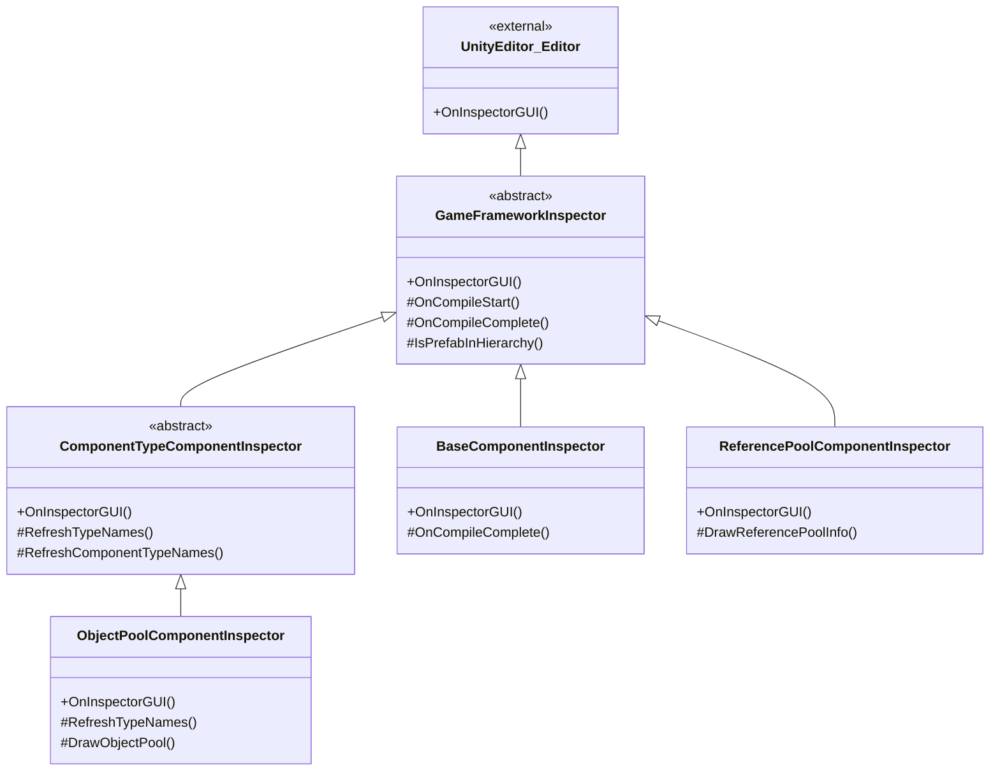

# 检视パネル工具

检视パネル工具是 GameFrameX 为 Unity エディタ提供的一系列自定義检视パネル（Inspector）拡張，用于在エディタ中直观地確認和設定游戏フレームワーク各コンポーネント的运行ステータス和パラメータ。

## 概要

GameFrameX 的检视パネル工具通过拡張 Unity 原生的 Inspector 系统，为フレームワーク的コアコンポーネント提供します更加使いやすい和機能丰富的設定界面。这些自定義检视パネル不仅〜できます在エディタモード下設定コンポーネントプロパティ，还能在ランタイム实时显示对象池、参照池等系统的内部ステータス，帮助開発者更好地デバッグ和最適化游戏性能。

检视パネル工具主なパッケージ含以下機能：
- **基本コンポーネント检视パネル**：設定全局助手タイプ（文本、バージョン、ログ、压缩、JSON）和ランタイムパラメータ（帧率、游戏速度）
- **对象池检视パネル**：ランタイム显示对象池ステータス，サポート手动解放和 CSV 数据导出
- **参照池检视パネル**：按アセンブリ分组显示参照池统计情報，サポート数据导出
- **检视パネル锁定快捷键**：通过メニュー快捷键快速切换 Inspector 锁定ステータス

## アーキテクチャ

检视パネル工具采用面向对象的継承结构，通过抽象基底クラス定義汎用機能，具体的检视パネル実装定制化的界面表示。



### コアコンポーネント説明

| 类名 | 职责 | 継承关系 |
|------|------|----------|
| `GameFrameworkInspector` | 所有检视パネル的抽象基底クラス，提供コンパイルステータス检测和 Prefab 层级判断等汎用機能 | 継承自 `UnityEditor.Editor` |
| `ComponentTypeComponentInspector` | コンポーネントタイプ选择器的抽象基底クラス，用于〜する必要があります动态选择コンポーネントタイプ的シーン | 継承自 `GameFrameworkInspector` |
| `BaseComponentInspector` | `BaseComponent` 的定制检视パネル，設定全局助手タイプ和ランタイムパラメータ | 継承自 `GameFrameworkInspector` |
| `ObjectPoolComponentInspector` | `ObjectPoolComponent` 的定制检视パネル，显示对象池ランタイムステータス | 継承自 `ComponentTypeComponentInspector` |
| `ReferencePoolComponentInspector` | `ReferencePoolComponent` 的定制检视パネル，显示参照池统计情報 | 継承自 `GameFrameworkInspector` |

## 機能详解

### 基本检视パネル基底クラス

`GameFrameworkInspector` 是所有自定義检视パネル的基底クラス，提供しますコンパイルステータス检测和 Prefab 层级判断等汎用機能。

```csharp
public abstract class GameFrameworkInspector : UnityEditor.Editor
{
    protected const string NoneOptionName = "<None>";
    private bool m_IsCompiling = false;

    public override void OnInspectorGUI()
    {
        if (m_IsCompiling && !EditorApplication.isCompiling)
        {
            m_IsCompiling = false;
            OnCompileComplete();
        }
        else if (!m_IsCompiling && EditorApplication.isCompiling)
        {
            m_IsCompiling = true;
            OnCompileStart();
        }
    }

    protected bool IsPrefabInHierarchy(UnityEngine.Object obj)
    {
        // 判断对象是否在 Prefab 层级视图中
    }
}
```
> Source: [GameFrameworkInspector.cs](https://github.com/GameFrameX/com.gameframex.unity/blob/main/Editor/Inspector/GameFrameworkInspector.cs#L1-L57)

**設計意图：**
- 监听 Unity コンパイルステータス变化，在コンパイル完成后自动刷新タイプ列表
- 提供 Prefab 层级判断メソッド，確認してくださいランタイム检视機能仅在シーン中的对象上可用

### BaseComponent 检视パネル

`BaseComponentInspector` 为基本コンポーネント提供します丰富的設定界面，含みます全局助手タイプ的选择和ランタイムパラメータ的控制。

```csharp
[CustomEditor(typeof(BaseComponent))]
internal sealed class BaseComponentInspector : GameFrameworkInspector
{
    private static readonly float[] GameSpeed = new float[] { 0f, 0.01f, 0.1f, 0.25f, 0.5f, 1f, 1.5f, 2f, 4f, 8f };

    public override void OnInspectorGUI()
    {
        base.OnInspectorGUI();
        serializedObject.Update();
        
        // 全局助手类型配置
        EditorGUILayout.BeginVertical("box");
        {
            EditorGUILayout.LabelField("Global Helpers", EditorStyles.boldLabel);
            int textHelperSelectedIndex = EditorGUILayout.Popup("Text Helper", m_TextHelperTypeNameIndex, m_TextHelperTypeNames);
            // ... 其他助手类型配置
        }
        EditorGUILayout.EndVertical();

        // 帧率配置
        int frameRate = EditorGUILayout.IntSlider("Frame Rate", m_FrameRate.intValue, 1, 120);

        // 游戏速度配置
        float gameSpeed = EditorGUILayout.Slider("Game Speed", m_GameSpeed.floatValue, 0f, 8f);

        serializedObject.ApplyModifiedProperties();
    }
}
```
> Source: [BaseComponentInspector.cs](https://github.com/GameFrameX/com.gameframex.unity/blob/main/Editor/Inspector/BaseComponentInspector.cs#L40-L193)

**機能特性：**
- **助手タイプ設定**：通过下拉メニュー动态选择 Text、Version、Log、Compression、JSON 等助手タイプ
- **帧率控制**：滑块控制游戏帧率（1-120）
- **游戏速度**：滑块+プリセットボタン控制时间缩放（0x - 8x）
- **后台运行**：Toggle 控制应用是否在后台运行
- **屏幕常亮**：Toggle 控制是否禁止设备休眠

### 对象池检视パネル

`ObjectPoolComponentInspector` 在ランタイム显示对象池的詳細ステータス情報。

```csharp
[CustomEditor(typeof(ObjectPoolComponent))]
internal sealed class ObjectPoolComponentInspector : ComponentTypeComponentInspector
{
    private readonly HashSet<string> m_OpenedItems = new HashSet<string>();

    public override void OnInspectorGUI()
    {
        base.OnInspectorGUI();

        if (!EditorApplication.isPlaying)
        {
            EditorGUILayout.HelpBox("Available during runtime only.", MessageType.Info);
            return;
        }

        ObjectPoolComponent t = (ObjectPoolComponent)target;
        if (IsPrefabInHierarchy(t.gameObject))
        {
            EditorGUILayout.LabelField("Object Pool Count", t.Count.ToString());
            ObjectPoolBase[] objectPools = t.GetAllObjectPools(true);
            foreach (ObjectPoolBase objectPool in objectPools)
            {
                DrawObjectPool(objectPool);
            }
        }
    }
}
```
> Source: [ObjectPoolComponentInspector.cs](https://github.com/GameFrameX/com.gameframex.unity/blob/main/Editor/Inspector/ObjectPoolComponentInspector.cs#L43-L72)

**機能特性：**
- **ランタイム可用**：仅在游戏ランタイム显示詳細情報
- **可折叠列表**：每个对象池〜できます展开確認详情
- **实时统计**：显示池容量、使用计数、可用解放数量、过期时间等
- **手动解放**：提供 Release 和 Release All Unused ボタン
- **CSV 导出**：サポート将对象池数据导出为 CSV ファイル进行分析

### 参照池检视パネル

`ReferencePoolComponentInspector` 按アセンブリ分组显示参照池的统计情報。

```csharp
[CustomEditor(typeof(ReferencePoolComponent))]
internal sealed class ReferencePoolComponentInspector : GameFrameworkInspector
{
    private readonly Dictionary<string, List<ReferencePoolInfo>> m_ReferencePoolInfos = new Dictionary<string, List<ReferencePoolInfo>>();

    public override void OnInspectorGUI()
    {
        base.OnInspectorGUI();
        serializedObject.Update();

        ReferencePoolComponent t = (ReferencePoolComponent)target;

        if (EditorApplication.isPlaying && IsPrefabInHierarchy(t.gameObject))
        {
            // 显示严格检查开关
            bool enableStrictCheck = EditorGUILayout.Toggle("Enable Strict Check", t.EnableStrictCheck);
            
            // 按程序集分组显示引用池信息
            foreach (KeyValuePair<string, List<ReferencePoolInfo>> assemblyReferencePoolInfo in m_ReferencePoolInfos)
            {
                bool currentState = EditorGUILayout.Foldout(lastState, assemblyReferencePoolInfo.Key);
                // 显示详细统计信息
            }
        }
    }
}
```
> Source: [ReferencePoolComponentInspector.cs](https://github.com/GameFrameX/com.gameframex.unity/blob/main/Editor/Inspector/ReferencePoolComponentInspector.cs#L42-L151)

**機能特性：**
- **アセンブリ分组**：按アセンブリ名称分组显示参照池
- **詳細统计**：显示未使用/使用中/取得/解放/追加/移除的参照计数
- **严格確認开关**：ランタイム控制是否启用严格確認
- **シンプル/完全な类名切换**：可选择显示简短类名或完全な类名
- **CSV 导出**：サポート数据导出機能

### 检视パネル锁定快捷键

`InspectorLockShortcut` 提供します一个エディタウィンドウ，用于快速切换 Inspector 的锁定ステータス。

```csharp
public sealed class InspectorLockShortcut : EditorWindow
{
    [MenuItem("Window/Toggle Inspector Lock %l")]
    private static void ToggleInspectorLock()
    {
        // 获取Inspector窗口
        var inspectorType = typeof(UnityEditor.Editor).Assembly.GetType("UnityEditor.InspectorWindow");
        var inspectorWindow = EditorWindow.GetWindow(inspectorType);
        // 使用反射调用isLocked属性
        var isLockedProperty = inspectorType.GetProperty("isLocked");
        var isLocked = (bool)isLockedProperty.GetValue(inspectorWindow);
        isLockedProperty.SetValue(inspectorWindow, !isLocked);
    }
}
```
> Source: [InspectorLockShortcut.cs](https://github.com/GameFrameX/com.gameframex.unity/blob/main/Editor/InspectorLockShortcut/InspectorLockShortcut.cs#L5-L18)

**機能特性：**
- **快捷键**：使用 `Ctrl+L`（Mac 上为 `Cmd+L`）快速切换
- **メニュー入口**：在 `Window` メニュー下显示 `Toggle Inspector Lock` オプション
- **反射実装**：通过反射呼び出し Unity 内部 API 実装锁定機能

## 使用メソッド

### 確認基本コンポーネント設定

1. 在 Unity シーン中作成一个空物体，追加 `BaseComponent` コンポーネント
2. 选中该物体，在 Inspector パネル中確認自定義检视パネル
3. 通过下拉メニュー选择各类助手タイプ
4. 调整帧率和游戏速度滑块

### 確認ランタイム对象池ステータス

1. 运行游戏シーン
2. 选中パッケージ含 `ObjectPoolComponent` 的游戏对象
3. 展开各个对象池確認詳細情報
4. 可点击 Release ボタン手动解放对象
5. 可点击 Export CSV Data 导出数据分析

### 確認ランタイム参照池ステータス

1. 运行游戏シーン
2. 选中パッケージ含 `ReferencePoolComponent` 的游戏对象
3. 按アセンブリ展开確認各类参照统计
4. 切换 Show Full Class Name 確認完全な类名
5. 导出 CSV 数据进行性能分析

### 锁定检视パネル

1. 按下 `Ctrl+L`（或通过 Window > Toggle Inspector Lock メニュー）
2. Inspector パネル将锁定当前选中的对象
3. 再次按下快捷键可解锁

## 拡張检视パネル

フレームワーク提供します可拡張的基底クラス，開発者〜できます基于此作成自定義检视パネル。

### 継承 GameFrameworkInspector

```csharp
[CustomEditor(typeof(MyComponent))]
public class MyComponentInspector : GameFrameworkInspector
{
    public override void OnInspectorGUI()
    {
        base.OnInspectorGUI();
        serializedObject.Update();
        
        // 自定义检视面板逻辑
        
        serializedObject.ApplyModifiedProperties();
    }

    protected override void OnCompileComplete()
    {
        base.OnCompileComplete();
        // 编译完成后刷新数据
    }
}
```

### 継承 ComponentTypeComponentInspector

```csharp
[CustomEditor(typeof(MyComponentWithType))]
public class MyComponentWithTypeInspector : ComponentTypeComponentInspector
{
    protected override void RefreshTypeNames()
    {
        RefreshComponentTypeNames(typeof(IMyInterface));
    }

    protected override void Enable()
    {
        // 额外的初始化逻辑
    }
}
```

## 関連リンク

- [ランタイムモジュール概要](./5-runtime.base)
- [对象池系统](./5-runtime.object-pool)
- [参照池系统](./5-runtime.reference-pool)
- [ビルド工具](./6-editor-tools.build-tools)
- [パッケージ管理工具](./6-editor-tools.package-management)
