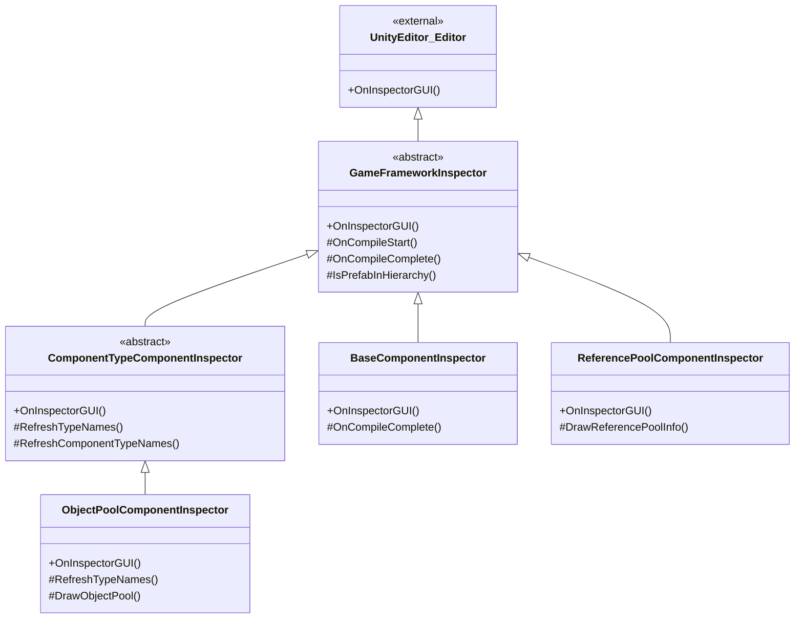

# インスペクターパネルツール

インスペクターパネルツールはGameFrameXがUnityエディターに提供する一連のカスタムインスペクター（Inspector）拡張であり、エディターでゲームフレームワークの各コンポーネントの実行状態とパラメータを直感的に表示および構成できます。

## 概要

GameFrameXのインスペクターパネルツールはUnityネイティブのInspectorシステムを拡張し、フレームワークのコアコンポーネントによりフレンドリーで機能が丰富的な設定インターフェースを提供します。これらのカスタムインスペクターはエディターモードでコンポーネントプロパティを構成できるだけでなく、実行時にオブジェクトプール、参照プールなどのシステムの内部状態をリアルタイムで表示し、開発者がゲームパフォーマンスをよりよくデバッグおよび最適化できるよう支援します。

インスペクターパネルツールには主に以下の機能が含まれます：
- **基本コンポーネントインスペクター**：グローバルアシスタータイプ（テキスト、バージョン、ログ、圧縮、JSON）と実行時パラメータ（フレームレート、ゲーム速度）を構成
- **オブジェクトプールインスペクター**：実行時にオブジェクトプール状態を表示、手動解放とCSVデータエクスポートをサポート
- **参照プールインスペクター**：アセンブリ別にグループ化された参照プール統計情報を表示、データエクスポートをサポート
- **インスペクターパネルロックショートカット**：メニューボタンでInspectorロック状態を быстро切り替え

## アーキテクチャ

インスペクターパネルツールはオブジェクト指向の継承構造を採用し、抽象基本クラスで共通機能を定義し、具体的なインスペクター実装でカスタマイズされたインターフェース表示を提供します。



### コアコンポーネント説明

| クラス名 | 責務 | 継承関係 |
|------|------|----------|
| `GameFrameworkInspector` | すべてのインスペクターの抽象基本クラス、コンパイル状態検出とPrefab階層判断などの共通機能を提供 | `UnityEditor.Editor`を継承 |
| `ComponentTypeComponentInspector` | コンポーネントタイプセレクターの抽象基本クラス、動的にコンポーネントタイプを選択する必要があるシナリオに使用 | `GameFrameworkInspector`を継承 |
| `BaseComponentInspector` | `BaseComponent`のカスタムインスペクター、グローバルアシスタータイプと実行時パラメータを構成 | `GameFrameworkInspector`を継承 |
| `ObjectPoolComponentInspector` | `ObjectPoolComponent`のカスタムインスペクター、オブジェクトプール実行時状態を表示 | `ComponentTypeComponentInspector`を継承 |
| `ReferencePoolComponentInspector` | `ReferencePoolComponent`のカスタムインスペクター、参照プール統計情報を表示 | `GameFrameworkInspector`を継承 |

## 機能詳細

### 基本インスペクター基本クラス

`GameFrameworkInspector`はすべてのカスタムインスペクターの基本クラスであり、コンパイル状態検出とPrefab階層判断などの共通機能を提供します。

```csharp
public abstract class GameFrameworkInspector : UnityEditor.Editor
{
    protected const string NoneOptionName = "<None>";
    private bool m_IsCompiling = false;

    public override void OnInspectorGUI()
    {
        if (m_IsCompiling && !EditorApplication.isCompiling)
        {
            m_IsCompiling = false;
            OnCompileComplete();
        }
        else if (!m_IsCompiling && EditorApplication.isCompiling)
        {
            m_IsCompiling = true;
            OnCompileStart();
        }
    }

    protected bool IsPrefabInHierarchy(UnityEngine.Object obj)
    {
        // オブジェクトがPrefab階層ビューにあるか判断
    }
}
```
> Source: [GameFrameworkInspector.cs](https://github.com/GameFrameX/com.gameframex.unity/blob/main/Editor/Inspector/GameFrameworkInspector.cs#L1-L57)

**設計意図：**
- Unityコンパイル状態の変化を監視し、コンパイル完了後に自動的に型リストを更新
- Prefab階層判断方法を提供し、実行時インスペクター機能がシーン内のオブジェクトでのみ利用可能であることを確保

### BaseComponent インスペクター

`BaseComponentInspector`は基本コンポーネントに丰富的な設定インターフェースを提供し、グローバルアシスタータイプの選択と実行時パラメータの制御を含みます。

```csharp
[CustomEditor(typeof(BaseComponent))]
internal sealed class BaseComponentInspector : GameFrameworkInspector
{
    private static readonly float[] GameSpeed = new float[] { 0f, 0.01f, 0.1f, 0.25f, 0.5f, 1f, 1.5f, 2f, 4f, 8f };

    public override void OnInspectorGUI()
    {
        base.OnInspectorGUI();
        serializedObject.Update();

        // グローバルアシスタータイプ設定
        EditorGUILayout.BeginVertical("box");
        {
            EditorGUILayout.LabelField("Global Helpers", EditorStyles.boldLabel);
            int textHelperSelectedIndex = EditorGUILayout.Popup("Text Helper", m_TextHelperTypeNameIndex, m_TextHelperTypeNames);
            // ... 他のアシスタータイプ設定
        }
        EditorGUILayout.EndVertical();

        // フレームレート設定
        int frameRate = EditorGUILayout.IntSlider("Frame Rate", m_FrameRate.intValue, 1, 120);

        // ゲーム速度設定
        float gameSpeed = EditorGUILayout.Slider("Game Speed", m_GameSpeed.floatValue, 0f, 8f);

        serializedObject.ApplyModifiedProperties();
    }
}
```
> Source: [BaseComponentInspector.cs](https://github.com/GameFrameX/com.gameframex.unity/blob/main/Editor/Inspector/BaseComponentInspector.cs#L40-L193)

**機能特性：**
- **アシスタータイプ設定**：ドロップダウンメニューでText、Version、Log、Compression、JSONなどのアシスタータイプを動的に選択
- **フレームレート制御**：スライダーでゲームフレームレートを制御（1-120）
- **ゲーム速度**：スライダー+プリセットボタン чтобы контролировать времяスケール（0x - 8x）
- **バックグラウンド実行**：Toggle чтобы управлять 应用がバックグラウンドで実行されるかどうか
- **画面常駐**：Toggle чтобы управлять デバイススリープを禁止するかどうか

### オブジェクトプールインスペクター

`ObjectPoolComponentInspector`は実行時にオブジェクトプールの詳細な状態情報を表示します。

```csharp
[CustomEditor(typeof(ObjectPoolComponent))]
internal sealed class ObjectPoolComponentInspector : ComponentTypeComponentInspector
{
    private readonly HashSet<string> m_OpenedItems = new HashSet<string>();

    public override void OnInspectorGUI()
    {
        base.OnInspectorGUI();

        if (!EditorApplication.isPlaying)
        {
            EditorGUILayout.HelpBox("Available during runtime only.", MessageType.Info);
            return;
        }

        ObjectPoolComponent t = (ObjectPoolComponent)target;
        if (IsPrefabInHierarchy(t.gameObject))
        {
            EditorGUILayout.LabelField("Object Pool Count", t.Count.ToString());
            ObjectPoolBase[] objectPools = t.GetAllObjectPools(true);
            foreach (ObjectPoolBase objectPool in objectPools)
            {
                DrawObjectPool(objectPool);
            }
        }
    }
}
```
> Source: [ObjectPoolComponentInspector.cs](https://github.com/GameFrameX/com.gameframex.unity/blob/main/Editor/Inspector/ObjectPoolComponentInspector.cs#L43-L72)

**機能特性：**
- **実行時利用可能**：ゲーム実行時のみ詳細情報を表示
- **折叠可能リスト**：各オブジェクトプールを展開して詳細を表示可能被
- **リアルタイム統計**：プール容量、使用回数、利用可能解放回数、有効期限などを表示
- **手動解放**：ReleaseとRelease All Unusedボタンを提供
- **CSVエクスポート**：オブジェクトプールデータをCSVファイルにエクスポートして分析をサポート

### 参照プールインスペクター

`ReferencePoolComponentInspector`はアセンブリ別にグループ化された参照プールの統計情報を表示します。

```csharp
[CustomEditor(typeof(ReferencePoolComponent))]
internal sealed class ReferencePoolComponentInspector : GameFrameworkInspector
{
    private readonly Dictionary<string, List<ReferencePoolInfo>> m_ReferencePoolInfos = new Dictionary<string, List<ReferencePoolInfo>>();

    public override void OnInspectorGUI()
    {
        base.OnInspectorGUI();
        serializedObject.Update();

        ReferencePoolComponent t = (ReferencePoolComponent)target;

        if (EditorApplication.isPlaying && IsPrefabInHierarchy(t.gameObject))
        {
            // 厳格チェックスイッチを表示
            bool enableStrictCheck = EditorGUILayout.Toggle("Enable Strict Check", t.EnableStrictCheck);

            // アセンブリ別にグループ化して参照プール情報を表示
            foreach (KeyValuePair<string, List<ReferencePoolInfo>> assemblyReferencePoolInfo in m_ReferencePoolInfos)
            {
                bool currentState = EditorGUILayout.Foldout(lastState, assemblyReferencePoolInfo.Key);
                // 詳細な統計情報を表示
            }
        }
    }
}
```
> Source: [ReferencePoolComponentInspector.cs](https://github.com/GameFrameX/com.gameframex.unity/blob/main/Editor/Inspector/ReferencePoolComponentInspector.cs#L42-L151)

**機能特性：**
- **アセンブリグループ化**：アセンブリ名でグループ化して参照プールを表示
- **詳細統計**：未使用/使用中/取得/解放/追加/削除の参照カウントを表示
- **厳格チェックスイッチ**：実行時に厳格チェックを有効にするかどうかを制御
- **簡略/完全クラス名切り替え**：简短なクラス名または完全クラス名を選択して表示可能被
- **CSVエクスポート**：データエクスポート機能をサポート

### インスペクターパネルロックショートカット

`InspectorLockShortcut`はInspectorのロック状態を быстро切り替えためのエディターウィンドウを提供します。

```csharp
public sealed class InspectorLockShortcut : EditorWindow
{
    [MenuItem("Window/Toggle Inspector Lock %l")]
    private static void ToggleInspectorLock()
    {
        // Inspectorウィンドウを取得
        var inspectorType = typeof(UnityEditor.Editor).Assembly.GetType("UnityEditor.InspectorWindow");
        var inspectorWindow = EditorWindow.GetWindow(inspectorType);
        // リフレクションを使用してisLockedプロパティを呼び出す
        var isLockedProperty = inspectorType.GetProperty("isLocked");
        var isLocked = (bool)isLockedProperty.GetValue(inspectorWindow);
        isLockedProperty.SetValue(inspectorWindow, !isLocked);
    }
}
```
> Source: [InspectorLockShortcut.cs](https://github.com/GameFrameX/com.gameframex.unity/blob/main/Editor/InspectorLockShortcut/InspectorLockShortcut.cs#L5-L18)

**機能特性：**
- **ショートカットキー**：`Ctrl+L`（Macでは`Cmd+L`）を使用して быстро切り替え
- **メニューエントリーポイント**：`Window`メニュー下に`Toggle Inspector Lock`オプションを表示
- **リフレクション実装**：Unity内部APIを呼び出してロック機能を実装

## 使用方法

### 基本コンポーネント設定を表示

1. Unityシーンで空のオブジェクトを作成し、`BaseComponent`コンポーネントを追加
2. このオブジェクトを選択、Inspectorパネルでカスタムインスペクターを表示
3. ドロップダウンメニューで各種アシスタータイプを選択
4. フレームレートとゲーム速度スライダーを調整

### 実行時オブジェクトプール状態を表示

1. ゲームシーンを実行
2. `ObjectPoolComponent`を含むゲームオブジェクトを選択
3. 各オブジェクトプールを展開して詳細を表示
4. Releaseボタンをクリックして手動でオブジェクトを解放可能被
5. Export CSV Dataをクリックしてデータをエクスポート

### 実行時参照プール状態を表示

1. ゲームシーンを実行
2. `ReferencePoolComponent`を含むゲームオブジェクトを選択
3. アセンブリ別に展開して各種参照統計を表示
4. Show Full Class Nameを切り替えて完全クラス名を表示
5. CSVデータをエクスポートしてパフォーマンス分析

### インスペクターパネルをロック

1. `Ctrl+L`を押す（またはWindow > Toggle Inspector Lockメニュー経由）
2. Inspectorパネルは現在の選択オブジェクトをロック
3. 再度ショートカットキーを押してロック解除

## インスペクターを拡張

フレームワークは拡張可能な基本クラスを提供し、開発者はこれを基にカスタムインスペクターを作成可能被。

### GameFrameworkInspectorを継承

```csharp
[CustomEditor(typeof(MyComponent))]
public class MyComponentInspector : GameFrameworkInspector
{
    public override void OnInspectorGUI()
    {
        base.OnInspectorGUI();
        serializedObject.Update();

        // カスタムインスペクターロジック

        serializedObject.ApplyModifiedProperties();
    }

    protected override void OnCompileComplete()
    {
        base.OnCompileComplete();
        // コンパイル完了後にデータを更新
    }
}
```

### ComponentTypeComponentInspectorを継承

```csharp
[CustomEditor(typeof(MyComponentWithType))]
public class MyComponentWithTypeInspector : ComponentTypeComponentInspector
{
    protected override void RefreshTypeNames()
    {
        RefreshComponentTypeNames(typeof(IMyInterface));
    }

    protected override void Enable()
    {
        // 追加の初期化ロジック
    }
}
```

## 関連リンク

- [ランタイムモジュール概要](./5-runtime.base)
- [オブジェクトプールシステム](./5-runtime.object-pool)
- [参照プールシステム](./5-runtime.reference-pool)
- [ビルドツール](./6-editor-tools.build-tools)
- [パッケージ管理ツール](./6-editor-tools.package-management)
