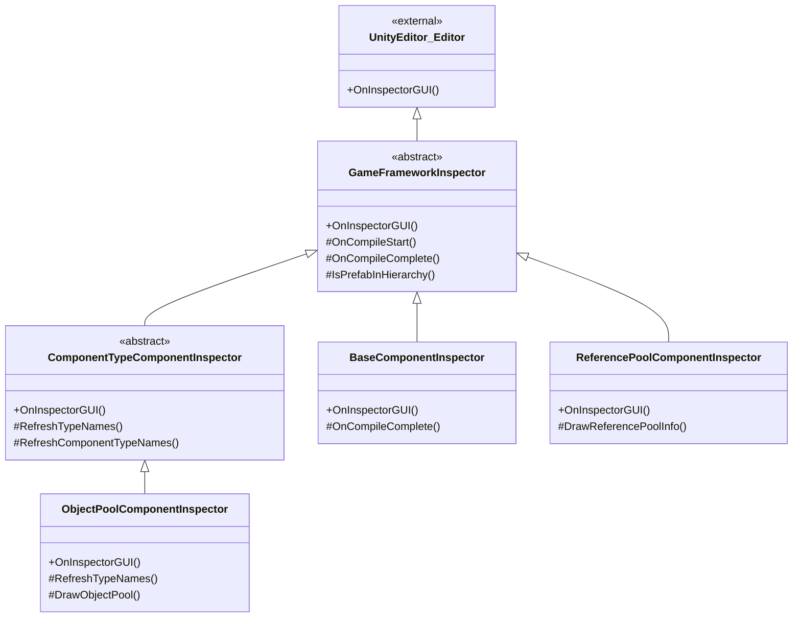

# インスペクターパネル工具

インスペクターパネル工具是 GameFrameX 为 Unity 编辑器提供的一系列自定义インスペクターパネル（Inspector）扩展，に使用在编辑器中直观地查看和配置ゲームフレームワーク各コンポーネント的运行ステータス和参数。

## 概要

GameFrameX 的インスペクターパネル工具を通じて扩展 Unity 原生的 Inspector 系统，为フレームワーク的コアコンポーネント提供します更加友好和機能丰富的配置界面。这些自定义インスペクターパネル不仅可能在编辑器模式下配置コンポーネントプロパティ，还能在运行时实时显示オブジェクトプール、参照プール等系统的内部ステータス，帮助開発者更好地调试和优化ゲーム性能。

インスペクターパネル工具主要包含以下機能：
- **基础コンポーネントインスペクターパネル**：配置全局助手クラス型（文本、版本、日志、压缩、JSON）和运行时参数（帧率、ゲーム速度）
- **オブジェクトプールインスペクターパネル**：运行时显示オブジェクトプールステータス，サポート手动释放和 CSV 数据导出
- **参照プールインスペクターパネル**：按程序集分组显示参照プール统计信息，サポート数据导出
- **インスペクターパネル锁定快捷键**：を通じて菜单快捷键快速切换 Inspector 锁定ステータス

## 架构

インスペクターパネル工具采用面向对象的继承结构，を通じて抽象基底クラス定义通用機能，具体的インスペクターパネル実装定制化的界面展示。



### コアコンポーネント説明

| クラス名 | 职责 | 继承关系 |
|------|------|----------|
| `GameFrameworkInspector` | 所有インスペクターパネル的抽象基底クラス，提供编译ステータス检测和 Prefab 层级判断等通用機能 | を継承 `UnityEditor.Editor` |
| `ComponentTypeComponentInspector` | コンポーネントタイプ选择器的抽象基底クラス，に使用必要动态选择コンポーネントタイプ的シーン | を継承 `GameFrameworkInspector` |
| `BaseComponentInspector` | `BaseComponent` 的定制インスペクターパネル，配置全局助手クラス型和运行时参数 | を継承 `GameFrameworkInspector` |
| `ObjectPoolComponentInspector` | `ObjectPoolComponent` 的定制インスペクターパネル，显示オブジェクトプール运行时ステータス | を継承 `ComponentTypeComponentInspector` |
| `ReferencePoolComponentInspector` | `ReferencePoolComponent` 的定制インスペクターパネル，显示参照プール统计信息 | を継承 `GameFrameworkInspector` |

## 機能详解

### 基础インスペクターパネル基クラス

`GameFrameworkInspector` 是所有自定义インスペクターパネル的基クラス，提供します编译ステータス检测和 Prefab 层级判断等通用機能。

```csharp
public abstract class GameFrameworkInspector : UnityEditor.Editor
{
    protected const string NoneOptionName = "<None>";
    private bool m_IsCompiling = false;

    public override void OnInspectorGUI()
    {
        if (m_IsCompiling && !EditorApplication.isCompiling)
        {
            m_IsCompiling = false;
            OnCompileComplete();
        }
        else if (!m_IsCompiling && EditorApplication.isCompiling)
        {
            m_IsCompiling = true;
            OnCompileStart();
        }
    }

    protected bool IsPrefabInHierarchy(UnityEngine.Object obj)
    {
        // 判断对象是否在 Prefab 层级视图中
    }
}
```
> Source: [GameFrameworkInspector.cs](https://github.com/GameFrameX/com.gameframex.unity/blob/main/Editor/Inspector/GameFrameworkInspector.cs#L1-L57)

**设计意图：**
- 监听 Unity 编译ステータス变化，在编译完成后自动刷新クラス型列表
- 提供 Prefab 层级判断メソッド，确保运行时检视機能仅在シーン中的对象上可用

### BaseComponent インスペクターパネル

`BaseComponentInspector` 为基础コンポーネント提供します丰富的配置界面，包括全局助手クラス型的选择和运行时参数的控制。

```csharp
[CustomEditor(typeof(BaseComponent))]
internal sealed class BaseComponentInspector : GameFrameworkInspector
{
    private static readonly float[] GameSpeed = new float[] { 0f, 0.01f, 0.1f, 0.25f, 0.5f, 1f, 1.5f, 2f, 4f, 8f };

    public override void OnInspectorGUI()
    {
        base.OnInspectorGUI();
        serializedObject.Update();
        
        // 全局助手クラス型配置
        EditorGUILayout.BeginVertical("box");
        {
            EditorGUILayout.LabelField("Global Helpers", EditorStyles.boldLabel);
            int textHelperSelectedIndex = EditorGUILayout.Popup("Text Helper", m_TextHelperTypeNameIndex, m_TextHelperTypeNames);
            // ... 其他助手クラス型配置
        }
        EditorGUILayout.EndVertical();

        // 帧率配置
        int frameRate = EditorGUILayout.IntSlider("Frame Rate", m_FrameRate.intValue, 1, 120);

        // ゲーム速度配置
        float gameSpeed = EditorGUILayout.Slider("Game Speed", m_GameSpeed.floatValue, 0f, 8f);

        serializedObject.ApplyModifiedProperties();
    }
}
```
> Source: [BaseComponentInspector.cs](https://github.com/GameFrameX/com.gameframex.unity/blob/main/Editor/Inspector/BaseComponentInspector.cs#L40-L193)

**機能特性：**
- **助手クラス型配置**：を通じて下拉菜单动态选择 Text、Version、Log、Compression、JSON 等助手クラス型
- **帧率控制**：滑块控制ゲーム帧率（1-120）
- **ゲーム速度**：滑块+预设按钮控制时间缩放（0x - 8x）
- **后台运行**：Toggle 控制应用是否在后台运行
- **屏幕常亮**：Toggle 控制是否禁止设备休眠

### オブジェクトプールインスペクターパネル

`ObjectPoolComponentInspector` 在运行时显示オブジェクトプール的详细ステータス信息。

```csharp
[CustomEditor(typeof(ObjectPoolComponent))]
internal sealed class ObjectPoolComponentInspector : ComponentTypeComponentInspector
{
    private readonly HashSet<string> m_OpenedItems = new HashSet<string>();

    public override void OnInspectorGUI()
    {
        base.OnInspectorGUI();

        if (!EditorApplication.isPlaying)
        {
            EditorGUILayout.HelpBox("Available during runtime only.", MessageType.Info);
            return;
        }

        ObjectPoolComponent t = (ObjectPoolComponent)target;
        if (IsPrefabInHierarchy(t.gameObject))
        {
            EditorGUILayout.LabelField("Object Pool Count", t.Count.ToString());
            ObjectPoolBase[] objectPools = t.GetAllObjectPools(true);
            foreach (ObjectPoolBase objectPool in objectPools)
            {
                DrawObjectPool(objectPool);
            }
        }
    }
}
```
> Source: [ObjectPoolComponentInspector.cs](https://github.com/GameFrameX/com.gameframex.unity/blob/main/Editor/Inspector/ObjectPoolComponentInspector.cs#L43-L72)

**機能特性：**
- **运行时可用**：仅在ゲーム运行时显示详细信息
- **可折叠列表**：每个オブジェクトプール可能展开查看详情
- **实时统计**：显示池容量、使用计数、可用释放数量、过期时间等
- **手动释放**：提供 Release 和 Release All Unused 按钮
- **CSV 导出**：サポート将オブジェクトプール数据导出为 CSV ファイル进行分析

### 参照プールインスペクターパネル

`ReferencePoolComponentInspector` 按程序集分组显示参照プール的统计信息。

```csharp
[CustomEditor(typeof(ReferencePoolComponent))]
internal sealed class ReferencePoolComponentInspector : GameFrameworkInspector
{
    private readonly Dictionary<string, List<ReferencePoolInfo>> m_ReferencePoolInfos = new Dictionary<string, List<ReferencePoolInfo>>();

    public override void OnInspectorGUI()
    {
        base.OnInspectorGUI();
        serializedObject.Update();

        ReferencePoolComponent t = (ReferencePoolComponent)target;

        if (EditorApplication.isPlaying && IsPrefabInHierarchy(t.gameObject))
        {
            // 显示严格检查开关
            bool enableStrictCheck = EditorGUILayout.Toggle("Enable Strict Check", t.EnableStrictCheck);
            
            // 按程序集分组显示参照プール信息
            foreach (KeyValuePair<string, List<ReferencePoolInfo>> assemblyReferencePoolInfo in m_ReferencePoolInfos)
            {
                bool currentState = EditorGUILayout.Foldout(lastState, assemblyReferencePoolInfo.Key);
                // 显示详细统计信息
            }
        }
    }
}
```
> Source: [ReferencePoolComponentInspector.cs](https://github.com/GameFrameX/com.gameframex.unity/blob/main/Editor/Inspector/ReferencePoolComponentInspector.cs#L42-L151)

**機能特性：**
- **程序集分组**：按程序集名称分组显示参照プール
- **详细统计**：显示未使用/使用中/取得/释放/添加/移除的引用计数
- **严格检查开关**：运行时控制是否启用严格检查
- **简洁/完整クラス名切换**：可选择显示简短クラス名或完整クラス名
- **CSV 导出**：サポート数据导出機能

### インスペクターパネル锁定快捷键

`InspectorLockShortcut` 提供します一个编辑器窗口，に使用快速切换 Inspector 的锁定ステータス。

```csharp
public sealed class InspectorLockShortcut : EditorWindow
{
    [MenuItem("Window/Toggle Inspector Lock %l")]
    private static void ToggleInspectorLock()
    {
        // 取得Inspector窗口
        var inspectorType = typeof(UnityEditor.Editor).Assembly.GetType("UnityEditor.InspectorWindow");
        var inspectorWindow = EditorWindow.GetWindow(inspectorType);
        // 使用反射呼び出しisLockedプロパティ
        var isLockedProperty = inspectorType.GetProperty("isLocked");
        var isLocked = (bool)isLockedProperty.GetValue(inspectorWindow);
        isLockedProperty.SetValue(inspectorWindow, !isLocked);
    }
}
```
> Source: [InspectorLockShortcut.cs](https://github.com/GameFrameX/com.gameframex.unity/blob/main/Editor/InspectorLockShortcut/InspectorLockShortcut.cs#L5-L18)

**機能特性：**
- **快捷键**：使用 `Ctrl+L`（Mac 上为 `Cmd+L`）快速切换
- **菜单エントリーポイント**：在 `Window` 菜单下显示 `Toggle Inspector Lock` 选项
- **反射実装**：を通じて反射呼び出し Unity 内部 API 実装锁定機能

## 使用メソッド

### 查看基础コンポーネント配置

1. 在 Unity シーン中作成一个空物体，添加 `BaseComponent` コンポーネント
2. 選択该物体，在 Inspector 面板中查看自定义インスペクターパネル
3. を通じて下拉菜单选择各クラス助手クラス型
4. 调整帧率和ゲーム速度滑块

### 查看运行时オブジェクトプールステータス

1. 运行ゲームシーン
2. 選択包含 `ObjectPoolComponent` 的ゲーム对象
3. 展开各个オブジェクトプール查看详细信息
4. 可点击 Release 按钮手动释放对象
5. 可点击 Export CSV Data 导出数据分析

### 查看运行时参照プールステータス

1. 运行ゲームシーン
2. 選択包含 `ReferencePoolComponent` 的ゲーム对象
3. 按程序集展开查看各クラス引用统计
4. 切换 Show Full Class Name 查看完整クラス名
5. 导出 CSV 数据进行性能分析

### 锁定インスペクターパネル

1. 按下 `Ctrl+L`（或を通じて Window > Toggle Inspector Lock 菜单）
2. Inspector 面板将锁定当前選択的对象
3. 再次按下快捷键可解锁

## 扩展インスペクターパネル

フレームワーク提供します可扩展的基クラス，開発者可能基づく此作成自定义インスペクターパネル。

### 继承 GameFrameworkInspector

```csharp
[CustomEditor(typeof(MyComponent))]
public class MyComponentInspector : GameFrameworkInspector
{
    public override void OnInspectorGUI()
    {
        base.OnInspectorGUI();
        serializedObject.Update();
        
        // 自定义インスペクターパネル逻辑
        
        serializedObject.ApplyModifiedProperties();
    }

    protected override void OnCompileComplete()
    {
        base.OnCompileComplete();
        // 编译完成后刷新数据
    }
}
```

### 继承 ComponentTypeComponentInspector

```csharp
[CustomEditor(typeof(MyComponentWithType))]
public class MyComponentWithTypeInspector : ComponentTypeComponentInspector
{
    protected override void RefreshTypeNames()
    {
        RefreshComponentTypeNames(typeof(IMyInterface));
    }

    protected override void Enable()
    {
        // 额外の初期化論理
    }
}
```

## 関連リンク

- [运行时模块概述](./5-runtime.base)
- [オブジェクトプールシステム](./5-runtime.object-pool)
- [参照プールシステム](./5-runtime.reference-pool)
- [ビルドツール](./6-editor-tools.build-tools)
- [パッケージ管理工具](./6-editor-tools.package-management)
