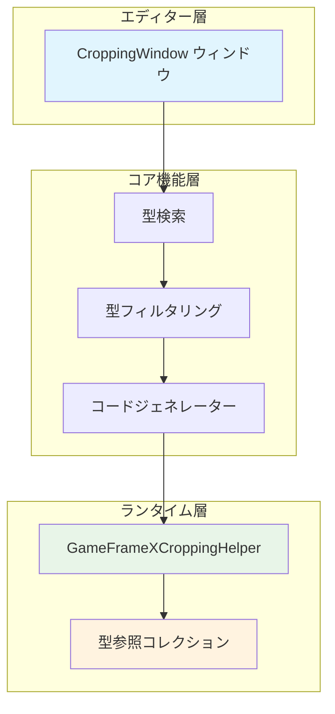
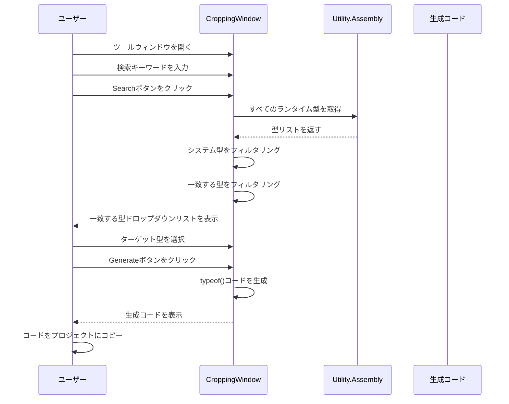

# 画像切り抜きツール

画像切り抜きツール（実際の名前は「防裁剪コード生成工具」）はGameFrameXが提供するUnityエディター拡張であり、IL2CPPビルド時代にコードが误って剥离される問題を解決するために使用されます。

## 概要

UnityプロジェクトでIL2CPPを使用してビルドする際、コンパイラーは直接参照されていないコード（所谓的「コード裁剪」）を自動的に剥离します。しかし、コードが反射或其他動的な方法で使用される場合、これらの型が误って剥离され、実行時に`MissingMethodException`またはタイプ解析失敗の問題が発生する可能性があります。

画像切り抜きツールは以下の方法でこの問題を解決します：
1. 可視化インターフェースを提供してアセンブリ内の型を検索
2. `typeof(TypeName)`コードを生成して型への参照を維持
3. 生成されたコードをプロジェクトに追加し、IL2CPPがこれらの型を剥离することを防止

## アーキテクチャ



### コアコンポーネント

| コンポーネント | ファイルパス | 責務 |
|------|----------|------|
| CroppingWindow | `Editor/Cropping/CroppingWindow.cs` | エディターウィンドウUI、型検索、コード生成 |
| GameFrameXCroppingHelper | `Runtime/GameFrameXCroppingHelper.cs` | ランタイム型参照保持テンプレート |

## ワークフロー



## 使用ガイド

### ツールウィンドウを開く

Unityエディターのメニューバーで`GameFrameX` → `Cropping(防止裁剪代码生成)`をクリックしてツールウィンドウを開きます。

```csharp
// メニュー項目定義
[MenuItem("GameFrameX/Cropping(防止裁剪代码生成)", false, 2001)]
public static void ShowWindow()
{
    var window = GetWindow<CroppingWindow>("Cropping");
    window.minSize = new UnityEngine.Vector2(800, 600);
    window.maxSize = window.minSize;
    window.maximized = false;
    window.Show();
}
```
> Source: [CroppingWindow.cs](https://github.com/GameFrameX/com.gameframex.unity/blob/main/Editor/Cropping/CroppingWindow.cs#L45-L55)

### 型を検索

1. 「クエリ型」テキストフィールドに検索する型名のキーワードを入力
2. `Search(クエリ)`ボタンをクリック
3. ツールはすべてのランタイムアセンブリをスキャン、システム型（UnityEngine、UnityEditor、Systemなど）を除外
4. ドロップダウンリストで処理する型を選択

```csharp
// 型検索ロジック
string searchText = _searchText.ToLower();
var types = Utility.Assembly.GetTypes();
var result = new List<string>();
foreach (var type in types)
{
    var fullName = type.FullName.ToLower();
    var isFind = false;
    foreach (var ignoredType in _ignoredTypes)
    {
        if (fullName.Contains(ignoredType))
        {
            isFind = true;
            break;
        }
    }
    if (isFind) continue;

    if (fullName.Contains(searchText))
    {
        result.Add(type.FullName);
    }
}
```
> Source: [CroppingWindow.cs](https://github.com/GameFrameX/com.gameframex.unity/blob/main/Editor/Cropping/CroppingWindow.cs#L76-L102)

### 防裁剪コードを生成

1. ドロップダウンリストからターゲット型を選択（通常はアセンブリのルート名前空間型を選択）
2. `Generate(生成)`ボタンをクリック
3. ツールはそのアセンブリ内のすべての型の`typeof()`参照コードを生成
4. 生成されたコードをプロジェクトの`CroppingHelper.cs`ファイルにコピー

```csharp
// コード生成ロジック
private void Generate(string targetTypeName)
{
    var targetType = Utility.Assembly.GetType(targetTypeName);
    if (targetType != null)
    {
        var types = targetType.Assembly.GetTypes();
        types = types.OrderBy(m => m.FullName).ToArray();
        StringBuilder stringBuilder = new StringBuilder();
        foreach (var type in types)
        {
            if (type.IsNestedPrivate) continue;
            if (type.FullName.Contains("PrivateImplementationDetails")) continue;

            stringBuilder.AppendLine(" _ = typeof(" + type.FullName.Replace("+", ".").Replace("`1", "<>").Replace("`2", "<,>") + ");");
        }
        _generatedText = stringBuilder.ToString();
    }
}
```
> Source: [CroppingWindow.cs](https://github.com/GameFrameX/com.gameframex.unity/blob/main/Editor/Cropping/CroppingWindow.cs#L136-L163)

### 生成されたコードを使用

生成されたコードをUnityプロジェクトのスクリプトファイルにコピー：

```csharp
using UnityEngine;

namespace GameFrameX.Runtime
{
    public class GameFrameXCroppingHelper : MonoBehaviour
    {
        private void Start()
        {
            // 生成されたコード例
            _ = typeof(GameFrameX.Runtime.SomeClass);
            _ = typeof(GameFrameX.Runtime.AnotherClass);
            // ... 更多型
        }
    }
}
```
> Source: [GameFrameXCroppingHelper.cs](https://github.com/GameFrameX/com.gameframex.unity/blob/main/Runtime/GameFrameXCroppingHelper.cs#L1-L10)

## 除外されるシステム型

ツールはデフォルトで以下のアセンブリの型を除外し、不要なコードを生成することを回避：

| 除外前缀 | 説明 |
|----------|------|
| unityengine | Unityコアエンジンテイプル |
| unityeditor | Unityエディタータイプ |
| mono | Monoランタイムタイプ |
| system | .NET Systemタイプ |
| dnlib | アセンブリ解析ライブラリ |
| unity.hotfix | ヒートリロードタイプ |
| unity.baselib | 基本ライブラリタイプ |
| .editor | エディター関連 |
| jetbrains | JetBrainsツールタイプ |
| nunit | NUnitテストフレームワーク |

```csharp
private readonly string[] _ignoredTypes = new string[] {
    "unityengine".ToLower(),
    "unityeditor".ToLower(),
    "mono".ToLower(),
    "system".ToLower(),
    "dnlib".ToLower(),
    "unity.hotfix".ToLower(),
    "unity.baselib".ToLower(),
    ".editor".ToLower(),
    "jetbrains".ToLower(),
    "nunit".ToLower()
};
```
> Source: [CroppingWindow.cs](https://github.com/GameFrameX/com.gameframex.unity/blob/main/Editor/Cropping/CroppingWindow.cs#L58)

## 一般的な使用シナリオ

### シナリオ1：反射で型を呼び出す

反射を使用して動的にオブジェクトを作成またはメソッドを呼び出す場合：

```csharp
// このコードは型が剥离される可能导致
var type = Type.GetType("GameFrameX.Runtime.DynamicClass");
var instance = Activator.CreateInstance(type);
```

### シナリオ2：JSONシリアライズ

JSONシリアライズライブラリを使用する場合、型情報が失われる可能性がある：

```csharp
// Newtonsoft.Json または他のシリアライズライブラリ
string json = JsonConvert.SerializeObject(someObject);
// デシリアライズ時に型が存在する必要がある
var obj = JsonConvert.DeserializeObject<DynamicType>(json);
```

### シナリオ3：インターフェースと実装の分離

依存性注入またはファクトリパターンを使用する場合：

```csharp
// 設定ファイルまたは反射でアセンブリをロード
var assembly = Assembly.Load("GameFrameX.Plugin");
var type = assembly.GetType("GameFrameX.Plugin.IPlugin");
```

## 生成コードテンプレートを設定

生成されたコードは以下の型の型を除外します：

1. **ネストされたプライベート型** (`IsNestedPrivate`) - 通常は内部実装の詳細
2. **PrivateImplementationDetails** - コンパイラーが生成したヘルパー型

```csharp
foreach (var type in types)
{
    if (type.IsNestedPrivate)
    {
        continue;  // ネストされたプライベート型をスキップ
    }

    if (type.FullName.Contains("PrivateImplementationDetails"))
    {
        continue;  // コンパイラー生成の詳細をスキップ
    }

    // typeof()コードを生成
}
```
> Source: [CroppingWindow.cs](https://github.com/GameFrameX/com.gameframex.unity/blob/main/Editor/Cropping/CroppingWindow.cs#L147-L156)

## 関連リンク

- [ビルドツール](./6-editor-tools.build-tools) - Unityプロジェクトビルド自動化ツール
- [パッケージ管理ツール](./6-editor-tools.package-management) - Unityパッケージ管理ツール
- [インスペクターパネルツール](./6-editor-tools.inspector-tools) - カスタムInspectorパネルツール
- [オブジェクトプールシステム](./5-runtime.object-pool) - オブジェクトプール管理システム
- [参照プールシステム](./5-runtime.reference-pool) - 参照プール管理システム
