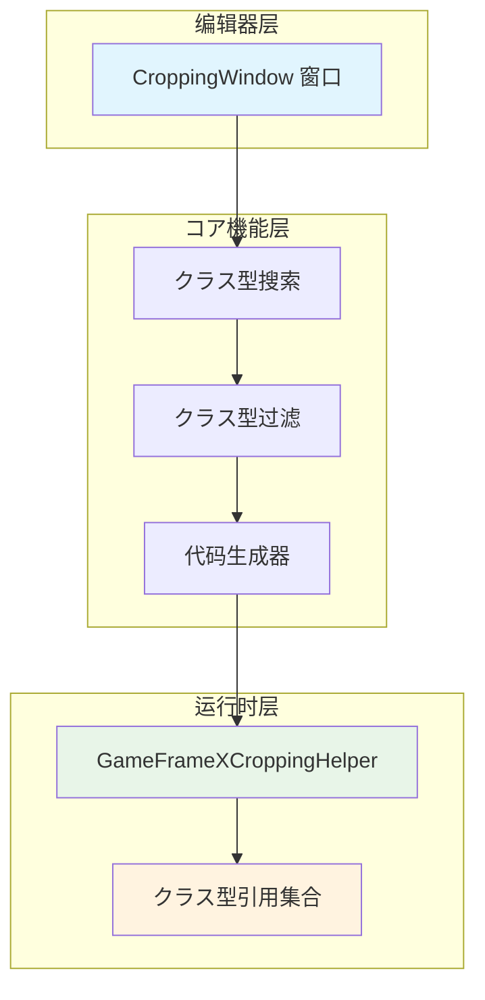
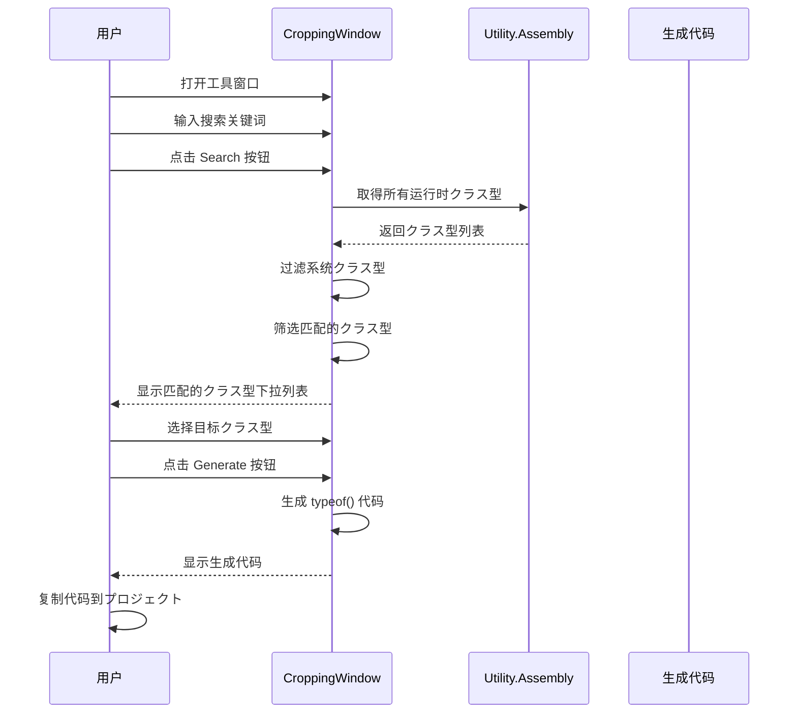

# 画像切り抜き工具

画像切り抜き工具（实际名称为"防裁剪代码生成工具"）是 GameFrameX 提供的 Unity エディター拡張，に使用解决 IL2CPP 构建时代码被错误剥离的问题。

## 概要

在 Unity プロジェクト中使用 IL2CPP 进行构建时，编译器会自动剥离未被直接引用的代码（称为"代码裁剪"）。然而，当代码を通じて反射或其他动态方法使用时，这些クラス型可能被错误地剥离，导致运行时出现 `MissingMethodException` 或クラス型解析失败的问题。

画像切り抜き工具を通じて以下方法解决这一问题：
1. 提供可视化界面搜索程序集中的クラス型
2. 生成 `typeof(TypeName)` 代码来保持对クラス型的引用
3. 将生成的代码添加到プロジェクト中，防止 IL2CPP 剥离这些クラス型

## 架构



### コアコンポーネント

| コンポーネント | ファイル路径 | 职责 |
|------|----------|------|
| CroppingWindow | `Editor/Cropping/CroppingWindow.cs` | 编辑器窗口 UI、クラス型搜索、代码生成 |
| GameFrameXCroppingHelper | `Runtime/GameFrameXCroppingHelper.cs` | 运行时クラス型引用保持模板 |

## 工作フロー



## 使用ガイド

### 打开工具窗口

在 Unity 编辑器菜单栏中点击 `GameFrameX` → `Cropping(防止裁剪代码生成)` 即可打开工具窗口。

```csharp
// 菜单项定义
[MenuItem("GameFrameX/Cropping(防止裁剪代码生成)", false, 2001)]
public static void ShowWindow()
{
    var window = GetWindow<CroppingWindow>("Cropping");
    window.minSize = new UnityEngine.Vector2(800, 600);
    window.maxSize = window.minSize;
    window.maximized = false;
    window.Show();
}
```
> Source: [CroppingWindow.cs](https://github.com/GameFrameX/com.gameframex.unity/blob/main/Editor/Cropping/CroppingWindow.cs#L45-L55)

### 搜索クラス型

1. 在"查询クラス型"文本框中输入要搜索的クラス型名称关键词
2. 点击 `Search(查询)` 按钮
3. 工具将扫描所有运行时程序集，排除系统クラス型（UnityEngine、UnityEditor、System等）
4. 在下拉列表中选择要处理的クラス型

```csharp
// クラス型搜索逻辑
string searchText = _searchText.ToLower();
var types = Utility.Assembly.GetTypes();
var result = new List<string>();
foreach (var type in types)
{
    var fullName = type.FullName.ToLower();
    var isFind = false;
    foreach (var ignoredType in _ignoredTypes)
    {
        if (fullName.Contains(ignoredType))
        {
            isFind = true;
            break;
        }
    }
    if (isFind) continue;
    
    if (fullName.Contains(searchText))
    {
        result.Add(type.FullName);
    }
}
```
> Source: [CroppingWindow.cs](https://github.com/GameFrameX/com.gameframex.unity/blob/main/Editor/Cropping/CroppingWindow.cs#L76-L102)

### 生成防裁剪代码

1. 从下拉列表中选择目标クラス型（通常选择程序集的根名前空間クラス型）
2. 点击 `Generate(生成)` 按钮
3. 工具将生成该程序集中所有クラス型的 `typeof()` 引用代码
4. 将生成的代码复制到プロジェクト的 `CroppingHelper.cs` ファイル中

```csharp
// 代码生成逻辑
private void Generate(string targetTypeName)
{
    var targetType = Utility.Assembly.GetType(targetTypeName);
    if (targetType != null)
    {
        var types = targetType.Assembly.GetTypes();
        types = types.OrderBy(m => m.FullName).ToArray();
        StringBuilder stringBuilder = new StringBuilder();
        foreach (var type in types)
        {
            if (type.IsNestedPrivate) continue;
            if (type.FullName.Contains("PrivateImplementationDetails")) continue;
            
            stringBuilder.AppendLine(" _ = typeof(" + type.FullName.Replace("+", ".").Replace("`1", "<>").Replace("`2", "<,>") + ");");
        }
        _generatedText = stringBuilder.ToString();
    }
}
```
> Source: [CroppingWindow.cs](https://github.com/GameFrameX/com.gameframex.unity/blob/main/Editor/Cropping/CroppingWindow.cs#L136-L163)

### 使用生成的代码

将生成的代码复制到 Unity プロジェクト的脚本ファイル中：

```csharp
using UnityEngine;

namespace GameFrameX.Runtime
{
    public class GameFrameXCroppingHelper : MonoBehaviour
    {
        private void Start()
        {
            // 生成的代码示例
            _ = typeof(GameFrameX.Runtime.SomeClass);
            _ = typeof(GameFrameX.Runtime.AnotherClass);
            // ... 更多クラス型
        }
    }
}
```
> Source: [GameFrameXCroppingHelper.cs](https://github.com/GameFrameX/com.gameframex.unity/blob/main/Runtime/GameFrameXCroppingHelper.cs#L1-L10)

## 排除的系统クラス型

工具默认排除以下程序集中的クラス型，避免生成不必要的代码：

| 排除前缀 | 説明 |
|----------|------|
| unityengine | Unity コア引擎クラス型 |
| unityeditor | Unity 编辑器クラス型 |
| mono | Mono 运行时クラス型 |
| system | .NET System クラス型 |
| dnlib | 程序集解析库 |
| unity.hotfix | ホットアップデートクラス型 |
| unity.baselib | 基础库クラス型 |
| .editor | 编辑器関連 |
| jetbrains | JetBrains 工具クラス型 |
| nunit | NUnit 测试フレームワーク |

```csharp
private readonly string[] _ignoredTypes = new string[] { 
    "unityengine".ToLower(), 
    "unityeditor".ToLower(), 
    "mono".ToLower(), 
    "system".ToLower(), 
    "dnlib".ToLower(), 
    "unity.hotfix".ToLower(), 
    "unity.baselib".ToLower(), 
    ".editor".ToLower(), 
    "jetbrains".ToLower(), 
    "nunit".ToLower() 
};
```
> Source: [CroppingWindow.cs](https://github.com/GameFrameX/com.gameframex.unity/blob/main/Editor/Cropping/CroppingWindow.cs#L58)

## 常见使用シーン

### シーン一：反射呼び出しクラス型

当使用反射动态作成对象或呼び出しメソッド时：

```csharp
// 这种代码可能导致クラス型被剥离
var type = Type.GetType("GameFrameX.Runtime.DynamicClass");
var instance = Activator.CreateInstance(type);
```

### シーン二：JSON 序列化

使用 JSON 序列化库时，クラス型信息可能丢失：

```csharp
// Newtonsoft.Json 或其他序列化库
string json = JsonConvert.SerializeObject(someObject);
// 反序列化时必要クラス型存在
var obj = JsonConvert.DeserializeObject<DynamicType>(json);
```

### シーン三：インターフェース与実装分离

使用依赖注入或工厂模式时：

```csharp
// を通じて配置ファイル或反射加载程序集
var assembly = Assembly.Load("GameFrameX.Plugin");
var type = assembly.GetType("GameFrameX.Plugin.IPlugin");
```

## 設定生成的代码模板

生成的代码会排除以下クラス型的クラス型：

1. **嵌套私有クラス型** (`IsNestedPrivate`) - 通常是内部実装细节
2. **PrivateImplementationDetails** - 编译器生成的辅助クラス型

```csharp
foreach (var type in types)
{
    if (type.IsNestedPrivate)
    {
        continue;  // 跳过嵌套私有クラス型
    }
    
    if (type.FullName.Contains("PrivateImplementationDetails"))
    {
        continue;  // 跳过编译器生成细节
    }
    
    // 生成 typeof() 代码
}
```
> Source: [CroppingWindow.cs](https://github.com/GameFrameX/com.gameframex.unity/blob/main/Editor/Cropping/CroppingWindow.cs#L147-L156)

## 関連リンク

- [ビルドツール](./6-editor-tools.build-tools) - Unity プロジェクト构建自动化工具
- [パッケージ管理工具](./6-editor-tools.package-management) - Unity パッケージ管理工具
- [インスペクターパネル工具](./6-editor-tools.inspector-tools) - 自定义 Inspector 面板工具
- [オブジェクトプールシステム](./5-runtime.object-pool) - オブジェクトプール管理系统
- [参照プールシステム](./5-runtime.reference-pool) - 参照プール管理系统
