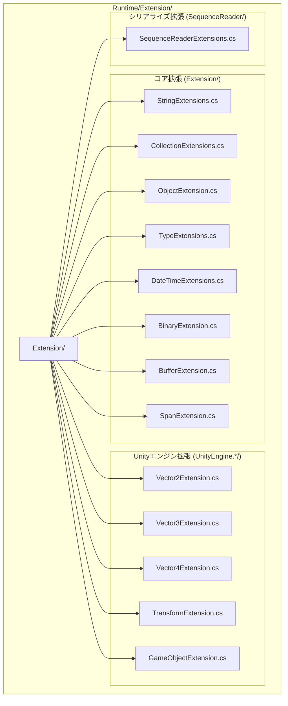

# 拡張メソッドライブラリ

GameFrameX拡張メソッドライブラリは.NET基本型和Unityエンジンテイプルに対して丰富的な拡張メソッド一套を提供し、一般的なプログラミングタスクを簡素化し、开发効率を向上させます。すべての拡張メソッドは`[UnityEngine.Scripting.Preserve]`属性でマークされ、Unity打包時にコード裁剪されないことを確保します。

## 概要

拡張メソッドライブラリはGameFrameXフレームワークのコア基本コンポーネントの1つであり、標準ライブラリ型とUnityエンジンテイプルに対する拡張機能を提供します。これらの拡張メソッドはC#拡張メソッド構文仕様に準拠し、静的クラスの形でサービスを提供し、拡張メソッドをサポートする任意の位置で直接使用できます。

### 設計目標

拡張メソッドライブラリの設計は以下のコア原則に従います：

1. **一般的な操作を簡素化**：複雑な操作を簡潔なAPI呼び出しに封装
2. **パフォーマンス向上**：高频操作に対してパフォーマンス最適化バージョンを提供（文字列高速比較など）
3. **型安全**：ジェネリックと强い型を十分に活用してコンパイル時安全を確保
4. **Unity互換**：すべてのメソッドはUnityプラットフォームの特殊的要件を考慮

### ディレクトリ構造

拡張メソッドライブラリのソースコード組織構造は以下の通り：



## コア機能分類

拡張メソッドライブラリが 제공하는機能は主に以下の主要なカテゴリに分類されます：

### 1. 文字列拡張メソッド

文字列拡張メソッドは文字列の高速比較、フォーマット変換、エンコード変換などの機能を提供します。

**主要機能：**

- 高速文字列比較：`EqualsFast`、`StartsWithFast`、`EndsWithFast` - 文字列末尾から逐文字比較、パフォーマンスは標準メソッドより優秀
- 文字列エンコード変換：`ToBytes`、`ToByteArray`、`ToUtf8` - デフォルトエンコードとUTF-8エンコードをサポート
- 十六進変換：`HexToBytes` - 十六進文字列をバイト配列に変換
- null値確認：`IsNullOrEmpty`、`IsNullOrWhiteSpace`、`IsNotNullOrEmpty`、`IsNotNullOrWhiteSpace`
- フォーマットと清理：`Format`、`TrimEmpty`、`TrimZhCn` - 空白または中国語の文字を削除
- 命名変換：`ConvertToSnakeCase` - キャメルケースをスネークケースに変換
- 文字列分割：`SplitToIntArray`、`SplitTo2IntArray` - 文字列を整数配列に分割

```csharp
// 高速文字列比較例
string str = "Hello World";
bool isMatch = str.EqualsFast("hello world"); // falseを返す（大文字小文字を区別）
bool startsWithHello = str.StartsWithFast("Hello"); // trueを返す
bool endsWithWorld = str.EndsWithFast("World"); // trueを返す

// 文字列をバイト配列に変換
byte[] bytes = str.ToUtf8(); // UTF-8エンコード
byte[] defaultBytes = str.ToByteArray(); // デフォルトエンコード

// 十六進文字列をバイト配列に変換
string hex = "48656C6C6F";
byte[] hexBytes = hex.HexToBytes(); // [72, 101, 108, 108, 111]

// null値確認
string nullStr = null;
bool emptyCheck = nullStr.IsNullOrEmpty(); // true
bool whitespaceCheck = "   ".IsNullOrWhiteSpace(); // true
```
> Source: [StringExtensions.cs](https://github.com/GameFrameX/com.gameframex.unity/blob/main/Runtime/Extension/Extension/StringExtensions.cs#L31-L58)

### 2. コレクション拡張メソッド

コレクション拡張メソッドはDictionary、List、HashSetなどのコレクション型に対して便利な操作方法を提供します。

**主要機能：**

- Dictionary拡張：
  - `Merge` - キー値マージ、カスタムマージ関数をサポート
  - `GetOrAdd` - 取得または追加、默认值とファクトリメソッドをサポート
  - `RemoveIf` - 条件別に要素を削除
- List拡張：
  - `Shuffle` - Fisher-Yatesシャッフルアルゴリズムでリスト順序をシャッフル
  - `RemoveIf` - 条件別に要素を削除
  - `ListToString` - リストを区切り文字で連結された文字列に変換
- HashSet拡張：
  - `AddRange` - バッチで要素を追加
- ICollection拡張：
  - `IsNullOrEmpty` - コレクションが空かどうかを確認

```csharp
// Dictionary使用例
var dict = new Dictionary<string, int>();
dict.Merge("score", 100, (old, newVal) => old + newVal); // 値をマージ
int value = dict.GetOrAdd("newKey", k => 100); // 取得または作成

// List使用例
var list = new List<int> { 1, 2, 3, 4, 5 };
list.Shuffle(); // ランダムにシャッフル
list.RemoveIf(x => x > 3); // 3より大きい要素を削除
string result = list.ListToString(","); // "1,2,3,"
```
> Source: [CollectionExtensions.cs](https://github.com/GameFrameX/com.gameframex.unity/blob/main/Runtime/Extension/Extension/CollectionExtensions.cs#L33-L77)

### 3. オブジェクト拡張メソッド

オブジェクト拡張メソッドはオブジェクトのnull値確認と検証機能を提供します。

**主要機能：**

- `IsNull` - オブジェクトがnullかどうかを確認
- `IsNotNull` - オブジェクトがnullでないかどうかを確認
- `CheckNull` - オブジェクトがnullかどうかを確認、nullの場合ArgumentNullExceptionを抛出

```csharp
object obj = null;
bool isNull = obj.IsNull(); // true
bool isNotNull = obj.IsNotNull(); // false

object validObj = new object();
validObj.CheckNull("validObj"); // 例外を抛出しない
```
> Source: [ObjectExtension.cs](https://github.com/GameFrameX/com.gameframex.unity/blob/main/Runtime/Extension/Extension/ObjectExtension.cs#L18-L47)

### 4. 型拡張メソッド

型拡張メソッドは型が特定のインターフェースを実装したかどうかを確認するために使用されます。

**主要機能：**

- `IsImplWithInterface` - 型が指定したインターフェースを実装したかどうかを確認、直接実装のみを確認するか、継承チェーンを含むかを選択可能被

```csharp
// 型がインターフェースを実装したかどうかを確認
Type type = typeof(List<string>);
bool implements = type.IsImplWithInterface(typeof(IEnumerable<object>), false); // true
bool directOnly = type.IsImplWithInterface(typeof(IList<string>), true); // true
```
> Source: [TypeExtensions.cs](https://github.com/GameFrameX/com.gameframex.unity/blob/main/Runtime/Extension/Extension/TypeExtensions.cs#L30-L58)

### 5. DateTime拡張メソッド

DateTime拡張メソッドは日時関連の計算機能を提供します。

**主要機能：**

- `GetDaysFrom` - 指定日から現在までの日数を計算
- `GetDaysFromDefault` - 1970年1月1日から現在までの日数を計算

```csharp
DateTime now = DateTime.Now;
int days = now.GetDaysFrom(new DateTime(2020, 1, 1)); // 2020年1月1日からの日数
int unixDays = now.GetDaysFromDefault(); // Unixタイムスタンプに対応する日数
```
> Source: [DateTimeExtensions.cs](https://github.com/GameFrameX/com.gameframex.unity/blob/main/Runtime/Extension/Extension/DateTimeExtensions.cs#L23-L40)

### 6. バイナリ拡張メソッド

バイナリ拡張メソッドはBinaryReaderとBinaryWriterに対して7ビットエンコード整数と暗号化文字列の読み書き機能を提供します。

**主要機能：**

- 7ビットエンコード整数読み書き：
  - `Read7BitEncodedInt32` / `Write7BitEncodedInt32`
  - `Read7BitEncodedUInt32` / `Write7BitEncodedUInt32`
  - `Read7BitEncodedInt64` / `Write7BitEncodedInt64`
  - `Read7BitEncodedUInt64` / `Write7BitEncodedUInt64`
- 暗号化文字列読み書き：
  - `ReadEncryptedString` - 暗号化文字列を読み取る
  - `WriteEncryptedString` - 暗号化文字列をを書き込む

7ビットエンコードは可变长エンコード方式であり、シリアライズ時にスペースを節約するために使用され、小さな整数はより少ないバイト数を占有します。

### 7. バッファ拡張メソッド

バッファ拡張メソッドはバイト配列に対して型付けされた読み書き操作を提供し、エンディアン（ネットワークバイト順）をサポートします。

**書き込みメソッド：**

- `WriteInt`、`WriteUInt`、`WriteShort`、`WriteUShort`
- `WriteLong`、`WriteFloat`、`WriteDouble`
- `WriteByte`、`WriteSByte`、`WriteBool`
- `WriteBytes`、`WriteBytesWithoutLength`、`WriteString`

**読み取りメソッド：**

- `ReadInt`、`ReadUInt`、`ReadShort`、`ReadUShort`
- `ReadLong`、`ReadFloat`、`ReadDouble`
- `ReadByte`、`ReadSByte`、`ReadBool`
- `ReadBytes`、`ReadString`

**変換メソッド：**

- `ToHex`、`ToHex(format)`、`ToHex(offset, count)` - バイト配列を十六進文字列に変換
- `ToDefaultString`、`ToUtf8String` - バイト配列を文字列に変換

```csharp
byte[] buffer = new byte[1024];
int offset = 0;

// 各种类型を書き込む
buffer.WriteInt(12345, ref offset);
buffer.WriteFloat(3.14f, ref offset);
buffer.WriteString("Hello", ref offset);

// 各种类型を読み取る
offset = 0;
int intVal = buffer.ReadInt(ref offset);
float floatVal = buffer.ReadFloat(ref offset);
string strVal = buffer.ReadString(ref offset);

// 字节数组を十六進字符串に変換
byte[] data = new byte[] { 0x48, 0x65, 0x6C, 0x6C, 0x6F };
string hex = data.ToHex(); // "48656C6C6F"
```
> Source: [BufferExtension.cs](https://github.com/GameFrameX/com.gameframex.unity/blob/main/Runtime/Extension/Extension/BufferExtension.cs#L90-L103)

### 8. Span拡張メソッド

Span拡張メソッドは`Span<byte>`に対してBufferExtensionと同様の読み書き操作を提供し、高パフォーマンスシナリオに使用されます。

## Unity エンジン拡張

### 1. Vector拡張メソッド

Vector拡張メソッドは異なる次元のベクトル間の変換機能を提供します。

**Vector2拡張：**

- `ToVector3` - Vector3に変換（yコンポーネントを0または指定値に設定）
- `ToVector4` - Vector4に変換（z、wコンポーネントを0に設定）
- `AsVector3` - Vector3に変換（zコンポーネントを0に設定）

**Vector3拡張：**

- `ToVector2` - Vector2に変換（x、zコンポーネントを取得）
- `ToVector3(Vector3Int)` - Vector3Intから変換
- `ToVector4` - Vector4に変換（wコンポーネントを0に設定）

**Vector4拡張：**

- `ToVector2` - Vector2に変換（x、yコンポーネントを取得）
- `ToVector3` - Vector3に変換（x、y、zコンポーネントを取得）

```csharp
Vector2 v2 = new Vector2(1, 2);
Vector3 v3 = v2.ToVector3(); // (1, 0, 2)
Vector3 v3WithY = v2.ToVector3(5); // (1, 5, 2)
Vector4 v4 = v2.ToVector4(); // (1, 2, 0, 0)

Vector3 v3 = new Vector3(1, 2, 3);
Vector2 v2FromV3 = v3.ToVector2(); // (1, 3)
```
> Source: [UnityEngine.Vector2Extension.cs](https://github.com/GameFrameX/com.gameframex.unity/blob/main/Runtime/Extension/UnityEngine.Vector2/UnityEngine.Vector2Extension.cs#L17-L35)

### 2. Transform拡張メソッド

Transform拡張メソッドは便利なTransformコンポーネント操作機能を提供します。

**位置操作：**

- 世界座標設定：`SetPositionX`、`SetPositionY`、`SetPositionZ`
- 世界座標増分：`AddPositionX`、`AddPositionY`、`AddPositionZ`
- ローカル座標設定：`SetLocalPositionX`、`SetLocalPositionY`、`SetLocalPositionZ`
- ローカル座標増分：`AddLocalPositionX`、`AddLocalPositionY`、`AddLocalPositionZ`

**缩放操作：**

- 缩放設定：`SetLocalScaleX`、`SetLocalScaleY`、`SetLocalScaleZ`
- 缩放増分：`AddLocalScaleX`、`AddLocalScaleY`、`AddLocalScaleZ`

**他の操作：**

- `FindChildName` - 再帰的に子ノードを検索
- `LookAt2D` - 二次元空間でターゲットに向かう
- `Reset` - Transformをリセット（位置、回転、缩放）
- `SetParentAndReset` - 親を設定してリセット

```csharp
Transform transform = someObject.transform;

// 单个座標成分を設定
transform.SetPositionX(5f);
transform.AddPositionY(2f);

// ローカル座標を設定
transform.SetLocalPositionZ(0f);

// 缩放を設定
transform.SetLocalScaleX(2f);

// 子ノードを検索
Transform child = transform.FindChildName("ChildName");

// 二次元に向かう
transform.LookAt2D(new Vector2(10, 5));

// リセット
transform.Reset();
```
> Source: [UnityEngine.TransformExtension.cs](https://github.com/GameFrameX/com.gameframex.unity/blob/main/Runtime/Extension/UnityEngine.Transform/UnityEngine.TransformExtension.cs#L55-L92)

### 3. GameObjectとComponent拡張メソッド

GameObjectとComponent拡張メソッドはゲームオブジェクトとコンポーネントの便利な操作を提供します。

**コンポーネント操作：**

- `GetOrAddComponent<T>` - コンポーネントを取得または追加
- `GetOrAddComponent(Type)` - 指定タイプのコンポーネントを取得または追加
- `DestroyComponent<T>` - 指定タイプのコンポーネントを破棄
- `DestroyComponent` - 自身のコンポーネントを破棄

**ゲームオブジェクト操作：**

- `InScene` - GameObjectがシーンにあるかどうかを確認
- `SetLayerRecursively` - ゲームオブジェクトとその子オブジェクトのレイヤーを再帰的に設定

```csharp
GameObject go = someGameObject;

// コンポーネントを取得または追加
Rigidbody rb = go.GetOrAddComponent<Rigidbody>();
AudioSource audio = go.GetOrAddComponent<AudioSource>();

// コンポーネントを破棄
go.DestroyComponent<Rigidbody>();

// シーンにあるか確認
bool inScene = go.InScene(); // trueはシーンにある、falseはプレハブ

// 再帰的にレイヤーを設定
go.SetLayerRecursively(LayerMask.NameToLayer("UI"));
```
> Source: [UnityEngage.GameObjectExtension.cs](https://github.com/GameFrameX/com.gameframex.unity/blob/main/Runtime/Extension/UnityEngage.GameObject/UnityEngage.GameObjectExtension.cs#L60-L90)

## 使用例

### 包括的な例

以下の例は実際のプロジェクトで拡張メソッドライブラリを使用する方法を展示します：

```csharp
using GameFrameX.Runtime;
using UnityEngine;
using System.Collections.Generic;

public class ExtensionMethodDemo : MonoBehaviour
{
    void Start()
    {
        // 文字列操作
        string json = "{\"name\":\"Player\",\"score\":100}";
        if (json.IsNotNullOrWhiteSpace())
        {
            Debug.Log($"JSON有効、長さ: {json.ToUtf8().Length}");
        }

        // コレクション操作
        var scores = new Dictionary<string, int>
        {
            { "Player1", 100 },
            { "Player2", 200 }
        };

        // スコアをマージ
        scores.Merge("Player1", 50, (old, newVal) => old + newVal);

        // 新規プレイヤーを取得または追加
        int player3Score = scores.GetOrAdd("Player3", k => 0);

        // Unityオブジェクト操作
        var child = transform.FindChildName("HealthBar");
        child?.SetPositionX(0);

        // コンポーネントを取得または追加
        var animator = gameObject.GetOrAddComponent<Animator>();

        // リスト操作
        var items = new List<string> { "Sword", "Shield", "Potion" };
        items.Shuffle(); // ランダムにソート
        Debug.Log(items.ListToString(", "));
    }
}
```

## パフォーマンス最適化説明

拡張メソッドライブラリには多个のパフォーマンス最適化バージョンのメソッドが含まれています：

1. **文字列高速比較**：`EqualsFast`、`StartsWithFast`、`EndsWithFast`メソッドは文字列末尾から比較し、同じ接尾辞/接頭辞を持つ文字列を比較する際に優れたパフォーマンスを提供可能被。

2. **バッファ直接操作**：`Span<T>`と不安全ポインター操作を使用して境界確認を回避し、ネイティブに近いパフォーマンスを提供。

3. **7ビットエンコード整数**：可变长エンコードを使用して整数を表現し、小さな整数はより少ないバイト数を占有し、大量整数シリアライズシナリオに適しています。

## 関連リンク

- [基本コンポーネント](./5-runtime.base) - GameFrameX基本コンポーネントシステム
- [ヘルパークラス](./5-runtime.helper-classes) - ヘルパートールクラス
- [ユーティリティクラス](./5-runtime.utility-classes) - 实用ツールセット
- [GitHubリポジトリ](https://github.com/GameFrameX/com.gameframex.unity)
