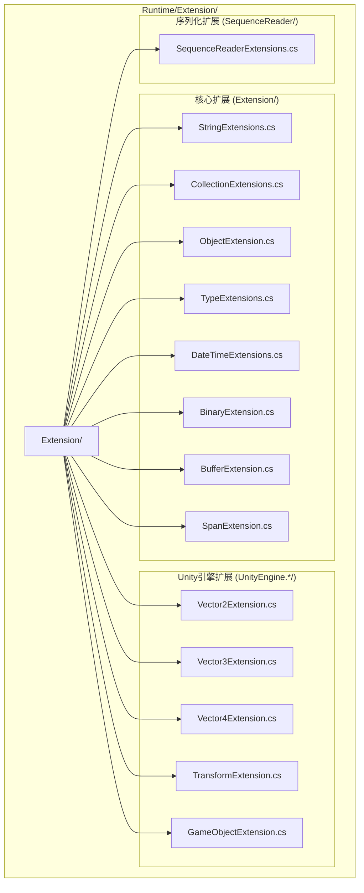

# 拡張メソッド库

GameFrameX 拡張メソッド库为 .NET 基本タイプ和 Unity 引擎タイプ提供します一套丰富的拡張メソッド，旨在簡素化常见编程任务，提升开发效率。所有拡張メソッド均使用 `[UnityEngine.Scripting.Preserve]` 特性标记，以確認してください在 Unity 打パッケージ时不会被コード裁剪。

## 概要

拡張メソッド库是 GameFrameX フレームワーク的コア基本コンポーネント之一，提供します对標準库タイプ和 Unity 引擎タイプ的增强機能。这些拡張メソッド遵循 C# 拡張メソッド语法规范，以静态类的形式提供服务，〜できます直接在任何サポート拡張メソッド的位置使用。

### 設計目标

拡張メソッド库的設計遵循以下コア原则：

1. **簡素化常见操作**：将複雑的操作カプセル化为シンプル的 API 呼び出し
2. **提升性能**：针对高频操作提供性能最適化バージョン（如字符串快速比较）
3. **タイプ安全**：充分利用ジェネリック和强タイプ確認してくださいコンパイル时安全
4. **Unity 兼容**：所有メソッド均考虑 Unity プラットフォーム的特殊要求

### 目次结构

拡張メソッド库的ソースコード组织结构如下：



## コア機能分类

拡張メソッド库提供的機能〜できます分为以下几个主な类别：

### 1. 字符串拡張メソッド

字符串拡張メソッド提供します字符串的快速比较、フォーマット转换、编码转换等機能。

**主な機能：**

- 快速字符串比较：`EqualsFast`、`StartsWithFast`、`EndsWithFast` - 从字符串末尾开始逐字符比较，性能优于標準メソッド
- 字符串编码转换：`ToBytes`、`ToByteArray`、`ToUtf8` - サポートデフォルト编码和 UTF-8 编码
- 十六进制转换：`HexToBytes` - 将十六进制字符串转换为字节数组
- 空值確認：`IsNullOrEmpty`、`IsNullOrWhiteSpace`、`IsNotNullOrEmpty`、`IsNotNullOrWhiteSpace`
- フォーマット化和清理：`Format`、`TrimEmpty`、`TrimZhCn` - 移除空白字符或中文字符
- 命名转换：`ConvertToSnakeCase` - 将驼峰命名转换为蛇形命名
- 字符串分割：`SplitToIntArray`、`SplitTo2IntArray` - 将字符串分割为整数数组

```csharp
// 快速字符串比较示例
string str = "Hello World";
bool isMatch = str.EqualsFast("hello world"); // 返回 false（区分大小写）
bool startsWithHello = str.StartsWithFast("Hello"); // 返回 true
bool endsWithWorld = str.EndsWithFast("World"); // 返回 true

// 字符串转字节数组
byte[] bytes = str.ToUtf8(); // UTF-8 编码
byte[] defaultBytes = str.ToByteArray(); // 默认编码

// 十六进制字符串转字节数组
string hex = "48656C6C6F";
byte[] hexBytes = hex.HexToBytes(); // [72, 101, 108, 108, 111]

// 空值检查
string nullStr = null;
bool emptyCheck = nullStr.IsNullOrEmpty(); // true
bool whitespaceCheck = "   ".IsNullOrWhiteSpace(); // true
```
> Source: [StringExtensions.cs](https://github.com/GameFrameX/com.gameframex.unity/blob/main/Runtime/Extension/Extension/StringExtensions.cs#L31-L58)

### 2. 集合拡張メソッド

集合拡張メソッド为 Dictionary、List、HashSet 等集合タイプ提供します便捷的操作メソッド。

**主な機能：**

- Dictionary 拡張：
  - `Merge` - 合并键值对，サポート自定義合并函数
  - `GetOrAdd` - 取得或追加元素，サポートデフォルト值和工厂メソッド
  - `RemoveIf` - 按条件移除元素
- List 拡張：
  - `Shuffle` - Fisher-Yates 洗牌算法打乱列表顺序
  - `RemoveIf` - 按条件移除元素
  - `ListToString` - 将列表转换为分隔符连接的字符串
- HashSet 拡張：
  - `AddRange` - 批量追加元素
- ICollection 拡張：
  - `IsNullOrEmpty` - 確認集合是否为空

```csharp
// Dictionary 使用示例
var dict = new Dictionary<string, int>();
dict.Merge("score", 100, (old, newVal) => old + newVal); // 合并值
int value = dict.GetOrAdd("newKey", k => 100); // 获取或创建

// List 使用示例
var list = new List<int> { 1, 2, 3, 4, 5 };
list.Shuffle(); // 随机打乱
list.RemoveIf(x => x > 3); // 移除大于3的元素
string result = list.ListToString(","); // "1,2,3,"
```
> Source: [CollectionExtensions.cs](https://github.com/GameFrameX/com.gameframex.unity/blob/main/Runtime/Extension/Extension/CollectionExtensions.cs#L33-L77)

### 3. 对象拡張メソッド

对象拡張メソッド提供します对象空值確認和検証機能。

**主な機能：**

- `IsNull` - 確認对象是否为 null
- `IsNotNull` - 確認对象是否不为 null
- `CheckNull` - 確認对象是否为 null，为 null 时抛出 ArgumentNullException

```csharp
object obj = null;
bool isNull = obj.IsNull(); // true
bool isNotNull = obj.IsNotNull(); // false

object validObj = new object();
validObj.CheckNull("validObj"); // 不抛出异常
```
> Source: [ObjectExtension.cs](https://github.com/GameFrameX/com.gameframex.unity/blob/main/Runtime/Extension/Extension/ObjectExtension.cs#L18-L47)

### 4. タイプ拡張メソッド

タイプ拡張メソッド用于確認タイプ是否実装了特定的インターフェース。

**主な機能：**

- `IsImplWithInterface` - 確認タイプ是否実装了指定的インターフェース，サポート仅確認直接実装或パッケージ含継承链

```csharp
// 检查类型是否实现接口
Type type = typeof(List<string>);
bool implements = type.IsImplWithInterface(typeof(IEnumerable<object>), false); // true
bool directOnly = type.IsImplWithInterface(typeof(IList<string>), true); // true
```
> Source: [TypeExtensions.cs](https://github.com/GameFrameX/com.gameframex.unity/blob/main/Runtime/Extension/Extension/TypeExtensions.cs#L30-L58)

### 5. DateTime 拡張メソッド

DateTime 拡張メソッド提供します日期时间相关的计算機能。

**主な機能：**

- `GetDaysFrom` - 计算从指定日期到当前日期的天数差
- `GetDaysFromDefault` - 计算从 1970年1月1日 到当前日期的天数差

```csharp
DateTime now = DateTime.Now;
int days = now.GetDaysFrom(new DateTime(2020, 1, 1)); // 距离2020年1月1日的天数
int unixDays = now.GetDaysFromDefault(); // Unix时间戳对应的天数
```
> Source: [DateTimeExtensions.cs](https://github.com/GameFrameX/com.gameframex.unity/blob/main/Runtime/Extension/Extension/DateTimeExtensions.cs#L23-L40)

### 6. 二进制拡張メソッド

二进制拡張メソッド为 BinaryReader 和 BinaryWriter 提供します 7 位编码整数和加密字符串的读写機能。

**主な機能：**

- 7位编码整数读写：
  - `Read7BitEncodedInt32` / `Write7BitEncodedInt32`
  - `Read7BitEncodedUInt32` / `Write7BitEncodedUInt32`
  - `Read7BitEncodedInt64` / `Write7BitEncodedInt64`
  - `Read7BitEncodedUInt64` / `Write7BitEncodedUInt64`
- 加密字符串读写：
  - `ReadEncryptedString` - 读取加密字符串
  - `WriteEncryptedString` - 写入加密字符串

7位编码は一種の变长编码方法，用于在シリアライズ时节省空间，小整数占用较少的字节数。

### 7. 缓冲区拡張メソッド

缓冲区拡張メソッド为字节数组提供しますタイプ化的读写操作，サポート大端字节序（网络字节序）。

**写入メソッド：**

- `WriteInt`、`WriteUInt`、`WriteShort`、`WriteUShort`
- `WriteLong`、`WriteFloat`、`WriteDouble`
- `WriteByte`、`WriteSByte`、`WriteBool`
- `WriteBytes`、`WriteBytesWithoutLength`、`WriteString`

**读取メソッド：**

- `ReadInt`、`ReadUInt`、`ReadShort`、`ReadUShort`
- `ReadLong`、`ReadFloat`、`ReadDouble`
- `ReadByte`、`ReadSByte`、`ReadBool`
- `ReadBytes`、`ReadString`

**转换メソッド：**

- `ToHex`、`ToHex(format)`、`ToHex(offset, count)` - 字节数组转十六进制字符串
- `ToDefaultString`、`ToUtf8String` - 字节数组转字符串

```csharp
byte[] buffer = new byte[1024];
int offset = 0;

// 写入各种类型
buffer.WriteInt(12345, ref offset);
buffer.WriteFloat(3.14f, ref offset);
buffer.WriteString("Hello", ref offset);

// 读取各种类型
offset = 0;
int intVal = buffer.ReadInt(ref offset);
float floatVal = buffer.ReadFloat(ref offset);
string strVal = buffer.ReadString(ref offset);

// 字节数组转十六进制字符串
byte[] data = new byte[] { 0x48, 0x65, 0x6C, 0x6C, 0x6F };
string hex = data.ToHex(); // "48656C6C6F"
```
> Source: [BufferExtension.cs](https://github.com/GameFrameX/com.gameframex.unity/blob/main/Runtime/Extension/Extension/BufferExtension.cs#L90-L103)

### 8. Span 拡張メソッド

Span 拡張メソッド为 `Span<byte>` 提供します与 BufferExtension 类似的读写操作，用于高性能シーン。

## Unity 引擎拡張

### 1. Vector 拡張メソッド

Vector 拡張メソッド提供します不同维度向量之间的转换機能。

**Vector2 拡張：**

- `ToVector3` - 转换为 Vector3（y 分量设为 0 或指定值）
- `ToVector4` - 转换为 Vector4（z、w 分量设为 0）
- `AsVector3` - 转换为 Vector3（z 分量设为 0）

**Vector3 拡張：**

- `ToVector2` - 转换为 Vector2（取 x、z 分量）
- `ToVector3(Vector3Int)` - 从 Vector3Int 转换
- `ToVector4` - 转换为 Vector4（w 分量设为 0）

**Vector4 拡張：**

- `ToVector2` - 转换为 Vector2（取 x、y 分量）
- `ToVector3` - 转换为 Vector3（取 x、y、z 分量）

```csharp
Vector2 v2 = new Vector2(1, 2);
Vector3 v3 = v2.ToVector3(); // (1, 0, 2)
Vector3 v3WithY = v2.ToVector3(5); // (1, 5, 2)
Vector4 v4 = v2.ToVector4(); // (1, 2, 0, 0)

Vector3 v3 = new Vector3(1, 2, 3);
Vector2 v2FromV3 = v3.ToVector2(); // (1, 3)
```
> Source: [UnityEngine.Vector2Extension.cs](https://github.com/GameFrameX/com.gameframex.unity/blob/main/Runtime/Extension/UnityEngine.Vector2/UnityEngine.Vector2Extension.cs#L17-L35)

### 2. Transform 拡張メソッド

Transform 拡張メソッド提供します便捷的 Transform コンポーネント操作機能。

**位置操作：**

- 世界坐标設定：`SetPositionX`、`SetPositionY`、`SetPositionZ`
- 世界坐标增量：`AddPositionX`、`AddPositionY`、`AddPositionZ`
- 本地坐标設定：`SetLocalPositionX`、`SetLocalPositionY`、`SetLocalPositionZ`
- 本地坐标增量：`AddLocalPositionX`、`AddLocalPositionY`、`AddLocalPositionZ`

**缩放操作：**

- 缩放設定：`SetLocalScaleX`、`SetLocalScaleY`、`SetLocalScaleZ`
- 缩放增量：`AddLocalScaleX`、`AddLocalScaleY`、`AddLocalScaleZ`

**其他操作：**

- `FindChildName` - 递归查找子节点
- `LookAt2D` - 二维空间朝向目标
- `Reset` - 重置 Transform（位置、旋转、缩放）
- `SetParentAndReset` - 設定父级并重置

```csharp
Transform transform = someObject.transform;

// 设置单个坐标分量
transform.SetPositionX(5f);
transform.AddPositionY(2f);

// 设置局部坐标
transform.SetLocalPositionZ(0f);

// 设置缩放
transform.SetLocalScaleX(2f);

// 查找子节点
Transform child = transform.FindChildName("ChildName");

// 二维朝向
transform.LookAt2D(new Vector2(10, 5));

// 重置
transform.Reset();
```
> Source: [UnityEngine.TransformExtension.cs](https://github.com/GameFrameX/com.gameframex.unity/blob/main/Runtime/Extension/UnityEngine.Transform/UnityEngine.TransformExtension.cs#L55-L92)

### 3. GameObject 和 Component 拡張メソッド

GameObject 和 Component 拡張メソッド提供します游戏对象和コンポーネント的便捷操作。

**コンポーネント操作：**

- `GetOrAddComponent<T>` - 取得或追加コンポーネント
- `GetOrAddComponent(Type)` - 取得或追加指定タイプコンポーネント
- `DestroyComponent<T>` - 破棄指定タイプコンポーネント
- `DestroyComponent` - 破棄自身コンポーネント

**游戏对象操作：**

- `InScene` - 確認 GameObject 是否在シーン中
- `SetLayerRecursively` - 递归設定游戏对象及其子对象的层级

```csharp
GameObject go = someGameObject;

// 获取或添加组件
Rigidbody rb = go.GetOrAddComponent<Rigidbody>();
AudioSource audio = go.GetOrAddComponent<AudioSource>();

// 销毁组件
go.DestroyComponent<Rigidbody>();

// 检查是否在场景中
bool inScene = go.InScene(); // true 表示在场景中，false 表示是预制体

// 递归设置层级
go.SetLayerRecursively(LayerMask.NameToLayer("UI"));
```
> Source: [UnityEngage.GameObjectExtension.cs](https://github.com/GameFrameX/com.gameframex.unity/blob/main/Runtime/Extension/UnityEngage.GameObject/UnityEngage.GameObjectExtension.cs#L60-L90)

## 使用例

### 综合例

以下例表示了如何在实际プロジェクト中使用拡張メソッド库：

```csharp
using GameFrameX.Runtime;
using UnityEngine;
using System.Collections.Generic;

public class ExtensionMethodDemo : MonoBehaviour
{
    void Start()
    {
        // 字符串操作
        string json = "{\"name\":\"Player\",\"score\":100}";
        if (json.IsNotNullOrWhiteSpace())
        {
            Debug.Log($"JSON有效，长度: {json.ToUtf8().Length}");
        }

        // 集合操作
        var scores = new Dictionary<string, int>
        {
            { "Player1", 100 },
            { "Player2", 200 }
        };
        
        // 合并分数
        scores.Merge("Player1", 50, (old, newVal) => old + newVal);
        
        // 获取或添加新玩家
        int player3Score = scores.GetOrAdd("Player3", k => 0);

        // Unity 对象操作
        var child = transform.FindChildName("HealthBar");
        child?.SetPositionX(0);
        
        // 获取或添加组件
        var animator = gameObject.GetOrAddComponent<Animator>();
        
        // 列表操作
        var items = new List<string> { "Sword", "Shield", "Potion" };
        items.Shuffle(); // 随机排序
        Debug.Log(items.ListToString(", "));
    }
}
```

## 性能最適化説明

拡張メソッド库中パッケージ含多个性能最適化バージョン的メソッド：

1. **字符串快速比较**：`EqualsFast`、`StartsWithFast`、`EndsWithFast` メソッド从字符串末尾开始比较，在比较具有共同后缀/前缀的字符串时〜の可能性があります提供更好的性能。

2. **缓冲区直接操作**：使用 `Span<T>` 和不安全的指针操作避免边界確認，提供接近原生的性能。

3. **7位编码整数**：使用变长编码表示整数，小整数占用更少的字节，适合大量整数シリアライズ的シーン。

## 関連リンク

- [基本コンポーネント](./5-runtime.base) - GameFrameX 基本コンポーネント系统
- [辅助类](./5-runtime.helper-classes) - 辅助工具类
- [工具类](./5-runtime.utility-classes) - 实用工具集
- [GitHub リポジトリ](https://github.com/GameFrameX/com.gameframex.unity)
