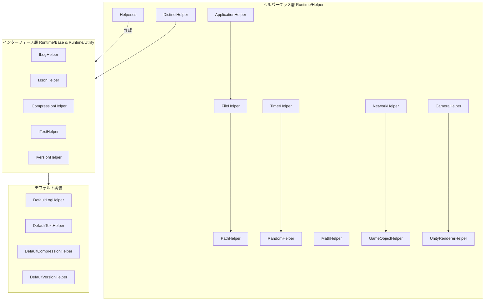

# ヘルパークラス

GameFrameXフレームワークが提供するヘルパークラスモジュールは、アプリケーション、ファイル、パス、数学、ランダム数、時間、ネットワーク、ゲームオブジェクト、カメラ、レンダリングなど多个分野の实用ツールメソッドをカバーします。

## 概要

ヘルパークラス（Helper Classes）はGameFrameXフレームワークの基本ツール層であり、開発者の日常開発における常用的静的ツールメソッドを提供します。これらのヘルパークラスは丁寧に設計されており、Unity開発と汎用プログラミングにおける一般的な操作を統一적이고便捷な方法で封装し、開発者がよりビジネスロジックの実装に集中できるようにします。

### 設計目標

GameFrameXヘルパークラスシステムの設計は以下の原則に従います：

1. **統一エントリーポイント**：`Helper`工厂クラスを通じて統一されたヘルパー作成メカニズムを提供
2. **プラットフォーム适配**：異なるUnityプラットフォーム（Editor、Windows、Mac、Android、iOS、WebGLなど）の차를 자동으로 처리
3. **パフォーマンス最適化**：`ThreadLocalRandom`などのメカニズムを使用してマルチスレッド安全を確保
4. **拡張性**：インターフェース（`ILogHelper`、`IJsonHelper`など）を通じてカスタム実装をサポート

### ヘルパークラス分類

GameFrameXのヘルパークラスは以下のカテゴリに分類できます：

| カテゴリ | ヘルパー | 機能説明 |
|------|--------|----------|
| アプリケーション層 | `ApplicationHelper` | プラットフォーム検出、アプリケーション制御、URLを開く |
| ファイル/パス | `FileHelper`、`PathHelper` | ファイル読み書き、ディレクトリ操作、パス拼接 |
| 数学計算 | `MathHelper`、`PositionHelper` | 矩形相交検出、位置計算 |
| ランダム数 | `RandomHelper` | 多种ランダム数生成方法 |
| 時間 | `TimerHelper` | Unixタイムスタンプ、ローカル時間、サーバー時間同期 |
| ネットワーク | `NetworkHelper` | ネットワーク可達性検出、WiFi/モバイルネットワーク判断 |
| ゲームオブジェクト | `GameObjectHelper` | GameObject作成、破棄、検索 |
| レンダリング | `CameraHelper`、`UnityRendererHelper` | スクリーンキャプチャ、レンダラー可視性検出 |
| データ処理 | `DistinctHelper`、`NewtonsoftJsonHelper`、`ZipHelper` | 重複去除、JSONシリアライズ、圧縮 |

## アーキテクチャ

GameFrameXヘルパークラスは分层アーキテクチャ設計を採用し、コアコンポーネントは静的ツールクラスと交换可能なインターフェース実装を含みます。



### コアコンポーネント説明

#### Helper.cs - ヘルパーファクトリー

`Helper.cs`は整个ヘルパークラスシステムの核心工厂クラスであり、`MonoBehaviour`ベースのヘルパー作成メカニズムを提供します。

> Source: [Helper.cs](https://github.com/GameFrameX/com.gameframex.unity/blob/main/Runtime/Helper/Helper.cs#L44-L155)

```csharp
public static T CreateHelper<T>(string helperTypeName, T customHelper) where T : MonoBehaviour
{
    return CreateHelper(helperTypeName, customHelper, 0);
}

public static T CreateHelper<T>(string helperTypeName, T customHelper, int index) where T : MonoBehaviour
{
    // タイプ名またはカスタムヘルパーに従ってインスタンスを作成
}
```

**設計意図**：ファクトリパターンを通じて開発者が実行時にデフォルト実装を動的に置き換えることを 허용し、フレームワークの拡張性を向上させます。

#### 静的ツールクラス

すべての静的ヘルパークラスは`[UnityEngine.Scripting.Preserve]`属性でマークされ、コード裁剪（IL2CPP）時に削除されないことを確保します。

## コア機能詳細

### アプリケーション層ヘルパー

`ApplicationHelper`はプラットフォーム検出とアプリケーション制御機能を提供し、クロスプラットフォームゲーム開発において重要なツールです。

> Source: [ApplicationHelper.cs](https://github.com/GameFrameX/com.gameframex.unity/blob/main/Runtime/Helper/ApplicationHelper.cs#L1-L305)

```csharp
// プラットフォーム検出
public static bool IsEditor => ...;
public static bool IsAndroid => ...;
public static bool IsIOS => ...;
public static bool IsWebGL => ...;
public static bool IsWindows => ...;
public static bool IsMacOsx => ...;
public static bool IsLinux => ...;

// ミニゲームプラットフォーム検出
public static bool IsWebGLWeChatMiniGame => ...;
public static bool IsWebGLDouYinMiniGame => ...;

// アプリケーション制御
public static void Quit() => ...;
public static void OpenURL(string url) => ...;
public static void OpenSetting() => ...;
```

### ファイル操作ヘルパー

`FileHelper`はクロスプラットフォームファイル読み書き操作を提供し、Android APK内リソースの読み取り問題を自動的に処理します。

> Source: [FileHelper.cs](https://github.com/GameFrameX/com.gameframex.unity/blob/main/Runtime/Helper/FileHelper.cs#L16-L357)

```csharp
// ファイル読み取り
public static byte[] ReadAllBytes(string path) => ...;
public static string ReadAllText(string path) => ...;
public static string[] ReadAllLines(string path) => ...;

// ファイル書き込み
public static void WriteAllBytes(string path, byte[] buffer) => ...;
public static void WriteAllText(string path, string content) => ...;
public static void WriteAllLines(string path, string[] lines) => ...;

// ファイル操作
public static void Copy(string sourceFileName, string destFileName, bool overwrite = false) => ...;
public static void Delete(string path) => ...;
public static void Move(string sourceFileName, string destFileName) => ...;
public static bool IsExists(string path) => ...;

// ディレクトリ操作
public static void GetAllFiles(List<string> files, string dir) => ...;
public static void CleanDirectory(string dir) => ...;
public static void CopyDirectory(string srcDir, string targetDir) => ...;
```

**設計意図**：クロスプラットフォームファイル操作インターフェースを統一し、Android StreamingAssets読み取り专用路径の特殊的 상황을 자동으로 처리합니다。

### パスヘルパー

`PathHelper`はパス正規化と拼接機能を提供します。

> Source: [PathHelper.cs](https://github.com/GameFrameX/com.gameframex.unity/blob/main/Runtime/Helper/PathHelper.cs#L14-L130)

```csharp
// 常用パス
public static string AppHotfixResPath => ...;  // ヒートリロードリソースパス
public static string AppResPath => ...;        // StreamingAssetsパス
public static string AppResPath4Web => ...;   // Webリクエスト専用パス

// パス操作
public static string NormalizePath(string path) => ...;
public static string Combine(params string[] paths) => ...;
```

### 時間ヘルパー

`TimerHelper`は完全な時間処理機能を提供し、Unixタイムスタンプ変換、サーバー時間同期などを含みます。

> Source: [TimerHelper.cs](https://github.com/GameFrameX/com.gameframex.unity/blob/main/Runtime/Helper/TimerHelper.cs#L36-L525)

```csharp
// タイムスタンプ取得
public static long UnixTimeSeconds() => ...;
public static long UnixTimeMilliseconds() => ...;
public static long NowTimeSeconds() => ...;
public static long NowTimeMilliseconds() => ...;

// クライアント/サーバー時間
public static long ClientNow() => ...;
public static long ClientNowSeconds() => ...;
public static long ServerNow() => ...;

// 時間変換
public static long LocalTimeToUnixTimeSeconds(DateTime time) => ...;
public static long LocalTimeToUnixTimeMilliseconds(DateTime time) => ...;
public static DateTime UtcToLocalDateTime(long utcTimestamp) => ...;
public static DateTime UtcToUtcDateTime(long utcTimestamp) => ...;

// サーバー時間同期
public static void SetDifferenceTime(long timeSpan) => ...;
public static void SetDifferenceTime(DateTime serverTime, bool isUtc = false) => ...;
```

### ランダム数ヘルパー

`RandomHelper`はスレッドセーフなランダム数生成を提供します。

> Source: [RandomHelper.cs](https://github.com/GameFrameX/com.gameframex.unity/blob/main/Runtime/Helper/RandomHelper.cs#L12-L80)

```csharp
// ランダム数生成
public static void SetSeed(int seed) => ...;
public static int Next(int lower, int upper) => ...;
public static float Next() => ...;
public static long NextInt64() => ...;
public static ulong NextUInt64() => ...;
```

### 数学ヘルパー

`MathHelper`は矩形相交検出などの機能を提供します。

> Source: [MathHelper.cs](https://github.com/GameFrameX/com.gameframex.unity/blob/main/Runtime/Helper/MathHelper.cs#L13-L148)

```csharp
// 矩形相交検出
public static bool CheckIntersect(RectInt src, RectInt target) => ...;
public static bool CheckIntersect(int x1, int y1, int w1, int h1, int x2, int y2, int w2, int h2) => ...;
public static bool CheckIntersectPoints(int x1, int y1, int w1, int h1, int x2, int y2, int w2, int h2, int[] intersectPoints) => ...;
```

### ネットワークヘルパー

`NetworkHelper`はネットワーク状態検出を提供します。

> Source: [NetworkHelper.cs](https://github.com/GameFrameX/com.gameframex.unity/blob/main/Runtime/Helper/NetworkHelper.cs#L14-L77)

```csharp
// ネットワーク状態検出
public static string[] GetAddressIPs() => ...;
public static bool IsReachable() => ...;
public static bool IsWifi() => ...;
public static bool IsViaCarrierData() => ...;
```

### ゲームオブジェクトヘルパー

`GameObjectHelper`はGameObjectの作成、破棄、検索などの操作を提供します。

> Source: [GameObjectHelper.cs](https://github.com/GameFrameX/com.gameframex.unity/blob/main/Runtime/Helper/GameObjectHelper.cs#L14-L213)

```csharp
// 作成
public static GameObject Create(Transform parent, string name) => ...;
public static GameObject Create(GameObject parent, string name) => ...;

// 破棄
public static void Destroy(GameObject gameObject) => ...;
public static void DestroyObject(this GameObject gameObject) => ...;
public static void DestroyComponent(Component component) => ...;

// 検索
public static GameObject FindChildGamObjectByName(string nodeName, string sceneName = null) => ...;
public static GameObject FindChildGamObjectByName(GameObject gameObject, string name) => ...;

// 変換操作
public static void RemoveChildren(GameObject go) => ...;
public static void ResetTransform(GameObject gameObject) => ...;

// レイヤー設定
public static void SetLayer(GameObject gameObject, int layer, bool children = true) => ...;
public static void SetSortingGroupLayer(GameObject gameObject, string sortingLayer) => ...;
```

### レンダリングヘルパー

`CameraHelper`と`UnityRendererHelper`はスクリーンキャプチャとレンダラー可視性検出を提供します。

> Source: [CameraHelper.cs](https://github.com/GameFrameX/com.gameframex.unity/blob/main/Runtime/Helper/CameraHelper.cs#L14-L47)

```csharp
// スクリーンキャプチャ
public static Texture2D GetCaptureScreenshot(Camera main, float scale = 0.5f) => ...;
```

> Source: [UnityRendererHelper.cs](https://github.com/GameFrameX/com.gameframex.unity/blob/main/Runtime/Helper/UnityRendererHelper.cs#L12-L42)

```csharp
// 可視性検出
public static bool IsVisibleFrom(Renderer renderer, Camera camera) => ...;
public static bool IsVisibleFrom(MeshRenderer renderer, Camera camera) => ...;
```

### データ処理ヘルパー

`DistinctHelper`はキーに基づくコレクション重複去除機能を提供します。

> Source: [DistinctHelper.cs](https://github.com/GameFrameX/com.gameframex.unity/blob/main/Runtime/Helper/DistinctHelper.cs#L13-L39)

```csharp
// 重複去除
public static IEnumerable<TSource> DistinctBy<TSource, TKey>(
    this IEnumerable<TSource> source,
    Func<TSource, TKey> keySelector) => ...;
```

## 使用例

### プラットフォーム検出と适配

```csharp
using GameFrameX.Runtime;

// 現在のプラットフォームを検出
if (ApplicationHelper.IsAndroid)
{
    Debug.Log("Androidプラットフォームで実行中");
}
else if (ApplicationHelper.IsIOS)
{
    Debug.Log("iOSプラットフォームで実行中");
}
else if (ApplicationHelper.IsWebGL)
{
    Debug.Log("WebGLプラットフォームで実行中");
}

// ミニゲームプラットフォームを検出
if (ApplicationHelper.IsWebGLWeChatMiniGame)
{
    Debug.Log("微信ミニゲームプラットフォームで実行中");
}

// プラットフォーム名を取得
string platform = ApplicationHelper.PlatformName;
```

### ファイル読み書き操作

```csharp
using GameFrameX.Runtime;

// ファイルを読み取る
string content = FileHelper.ReadAllText("path/to/file.txt");
byte[] data = FileHelper.ReadAllBytes("path/to/file.bin");
string[] lines = FileHelper.ReadAllLines("path/to/file.txt");

// ファイルを書き込む
FileHelper.WriteAllText("path/to/output.txt", "Hello World");
FileHelper.WriteAllBytes("path/to/output.bin", data);

// ファイルが存在するか確認
if (FileHelper.IsExists("path/to/file.txt"))
{
    Debug.Log("ファイルが存在します");
}
```

### タイムスタンプ処理

```csharp
using GameFrameX.Runtime;

// 現在のタイムスタンプを取得
long unixSeconds = TimerHelper.UnixTimeSeconds();
long unixMillis = TimerHelper.UnixTimeMilliseconds();

// タイムスタンプ変換
DateTime dateTime = TimerHelper.UtcToLocalDateTime(1699999999);
long timestamp = TimerHelper.LocalTimeToUnixTimeSeconds(DateTime.Now);

// サーバー時間同期（サーバーから時間を取得した後に呼び出し）
TimerHelper.SetDifferenceTime(serverTimestamp);

// サーバー時間を取得
long serverTime = TimerHelper.ServerNow();
DateTime serverDateTime = TimerHelper.ServerToday();
```

### ゲームオブジェクト操作

```csharp
using GameFrameX.Runtime;

// GameObjectを作成
GameObject parent = someParent;
GameObject newObj = GameObjectHelper.Create(parent, "NewObject");

// 変換をリセット
GameObjectHelper.ResetTransform(newObj);

// レイヤーを設定
GameObjectHelper.SetLayer(newObj, LayerMask.NameToLayer("UI"), true);

// 子オブジェクトを検索
GameObject child = GameObjectHelper.FindChildGamObjectByName(parent, "ChildName");

// 子オブジェクトを破棄
GameObjectHelper.RemoveChildren(parent);
```

### レンダラー可視性検出

```csharp
using GameFrameX.Runtime;

// 物体がカメラ視野内にあるか確認
Camera mainCamera = Camera.main;
Renderer[] renderers = FindObjectsOfType<Renderer>();

foreach (var renderer in renderers)
{
    if (UnityRendererHelper.IsVisibleFrom(renderer, mainCamera))
    {
        Debug.Log("物体がカメラ視野内");
    }
}
```

### スクリーンキャプチャ

```csharp
using GameFrameX.Runtime;

// スクリーンキャプチャをキャプチャ
Texture2D screenshot = CameraHelper.GetCaptureScreenshot(Camera.main, 0.5f);

// キャプチャを保存
byte[] pngData = screenshot.EncodeToPNG();
FileHelper.WriteAllBytes(Application.persistentDataPath + "/screenshot.png", pngData);
```

### コレクション重複去除

```csharp
using GameFrameX.Runtime;

// 特定のキーに基づいて重複去除
var list = new List<Player>();
list.Add(new Player { Id = 1, Name = "Alice" });
list.Add(new Player { Id = 1, Name = "Alice" });
list.Add(new Player { Id = 2, Name = "Bob" });

// Idで重複去除
var distinctList = list.DistinctBy(p => p.Id).ToList();
```

## APIリファレンス

### Helper

#### `CreateHelper<T>(string helperTypeName, T customHelper): T`

ヘルパーインスタンスを作成。

**パラメータ：**
- `helperTypeName` (string): ヘルパーのタイプ名
- `customHelper` (T): カスタムヘルパーインスタンス

**戻り値：** 作成したヘルパーインスタンス

### ApplicationHelper

| メソッド/プロパティ | 戻り値型 | 説明 |
|----------|---------|------|
| `IsEditor` | `bool` | Unityエディターで実行しているか |
| `IsAndroid` | `bool` | Androidプラットフォームで実行しているか |
| `IsIOS` | `bool` | iOSプラットフォームで実行しているか |
| `IsWebGL` | `bool` | WebGLプラットフォームで実行しているか |
| `IsWindows` | `bool` | Windowsプラットフォームで実行しているか |
| `PlatformName` | `string` | 現在のプラットフォーム名を取得 |
| `Quit()` | `void` | アプリケーションを終了 |
| `OpenURL(string url)` | `void` | 指定URLを開く |

### FileHelper

| メソッド | 説明 |
|------|------|
| `ReadAllBytes(string path)` | ファイルバイト配列を読み取る |
| `ReadAllText(string path)` | ファイルテキスト内容を読み取る |
| `WriteAllBytes(string path, byte[] buffer)` | バイト配列を書き込む |
| `WriteAllText(string path, string content)` | テキスト内容を書き込む |
| `Copy(string source, string dest, bool overwrite)` | ファイルをコピー |
| `Delete(string path)` | ファイルを削除 |
| `IsExists(string path)` | ファイルが存在するか確認 |
| `GetAllFiles(List<string> files, string dir)` | ディレクトリ内のすべてのファイルを取得 |
| `CleanDirectory(string dir)` | ディレクトリをクリーンアップ |

### TimerHelper

| メソッド | 説明 |
|------|------|
| `UnixTimeSeconds()` | 現在のUTC Unixタイムスタンプ（秒）を取得 |
| `UnixTimeMilliseconds()` | 現在のUTC Unixタイムスタンプ（ミリ秒）を取得 |
| `ServerNow()` | サーバー現在時間を取得 |
| `ClientNow()` | クライアント現在時間を取得（ミリ秒） |
| `UtcToLocalDateTime(long timestamp)` | UTCタイムスタンプをローカル時間に変換 |
| `SetDifferenceTime(long timeSpan)` | サーバー時間差を設定 |

### RandomHelper

| メソッド | 説明 |
|------|------|
| `SetSeed(int seed)` | ランダム数シードを設定 |
| `Next(int lower, int upper)` | 指定範囲のランダム整数を取得 |
| `Next()` | 0-1の間のランダム浮動小数点を取得 |
| `NextInt64()` | Int64範囲のランダム数を取得 |

### GameObjectHelper

| メソッド | 説明 |
|------|------|
| `Create(Transform parent, string name)` | GameObjectを作成 |
| `Destroy(GameObject gameObject)` | GameObjectを破棄 |
| `FindChildGamObjectByName(string name)` | 名前で子オブジェクトを検索 |
| `RemoveChildren(GameObject go)` | すべての子オブジェクトを破棄 |
| `ResetTransform(GameObject gameObject)` | 変換コンポーネントをリセット |
| `SetLayer(GameObject gameObject, int layer, bool children)` | レイヤーを設定 |

### MathHelper

| メソッド | 説明 |
|------|------|
| `CheckIntersect(RectInt src, RectInt target)` | 矩形相交を検出 |
| `CheckIntersect(int x1, int y1, int w1, int h1, int x2, int y2, int w2, int h2)` | 矩形相交を検出（パラメータ形式） |

### NetworkHelper

| メソッド | 説明 |
|------|------|
| `IsReachable()` | ネットワーク接続があるか検出 |
| `IsWifi()` | WiFiで接続しているか |
| `IsViaCarrierData()` | モバイルデータで接続しているか |
| `GetAddressIPs()` | ローカルIPアドレスリストを取得 |

### CameraHelper

| メソッド | 説明 |
|------|------|
| `GetCaptureScreenshot(Camera main, float scale)` | カメラスクリーンキャプチャをキャプチャ |

### UnityRendererHelper

| メソッド | 説明 |
|------|------|
| `IsVisibleFrom(Renderer renderer, Camera camera)` | レンダラーがカメラ視野内か検出 |

### DistinctHelper

| メソッド | 説明 |
|------|------|
| `DistinctBy<TSource, TKey>(IEnumerable, Func)` | キーセレクターに基づいて重複去除 |

## 関連リンク

- [拡張メソッドライブラリ](./5-runtime.extension-methods) - より多くの拡張メソッドを了解
- [ツールクラス](./5-runtime.utility-classes) - フレームワークコラー工具クラス
- [基本コンポーネント](./5-runtime.base) - フレームワークコラーコンポーネント
- [イベントシステム](./5-runtime.event-system) - フレームワークイベントメカニズム
