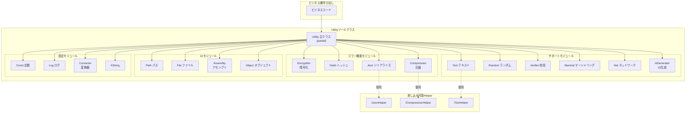

# ツールクラス

GameFrameXフレームワークが提供するコラー静的ツール関数ライブラリは、暗号化復号化、ハッシュ計算、JSONシリアライズ、圧縮解凍、文字列処理、ランダム数生成、データ校验、ネットワーク操作、ID生成などの常用機能をカバーします。

## 概要

UtilityツールクラスはGameFrameXフレームワークのインフラストラクチャ層であり、上層ビジネスロジックに低層技術サポートを提供します。これらのツールクラスは**静的クラス設計**を採用しており、インスタンス化せずに直接呼び出すことができ、日常開発作業を大幅に簡素化します。

### 設計理念

1. **無状態ツールメソッド**：すべてのメソッドは無副作用の静的メソッドであり、安全に並行呼び出し可能
2. **拡張可能アーキテクチャ**：主要機能はHelper差し込みメカニズムを採用し、ユーザーのカスタム実装をサポート
3. **Partial Class組織**：C# partial class機能を使用し、機能モジュール別にコードを複数のファイルに分散させ、可視性と保守性を向上

### モジュールの分類

Utilityツールクラスは以下の機能領域をカバーします：

| 分類 | 機能説明 |
|------|----------|
| 暗号化モジュール | XOR異或暗号化 |
| ハッシュモジュール | MD5、SHA1、SHA256、HMAC-SHA256、MurmurHash3、XxHash |
| データフォーマット | JSONシリアライズ/デシリアライズ、圧縮/解凍 |
| テキスト処理 | 文字列フォーマット、型変換、拡張文字列 |
| 校验モジュール | CRC32、CRC64チェックサム計算 |
| ランダム数 | ランダム整数、浮動小数点、バイト配列生成 |
| システム操作 | 構造体マーシャリング、ネットワークポート/IP操作、一意ID生成 |
| 入出力 | パス処理、ファイル操作 |
| 反射操作 | アセンブリロード、オブジェクト操作 |

## アーキテクチャ



## コラー機能詳解

### 暗号化モジュール (Encryption)

軽量级データ混淆シナリオに適したXOR異或暗号化機能を提供します。

```csharp
// XOR暗号化例
byte[] originalData = new byte[] { 0x01, 0x02, 0x03, 0x04 };
byte[] key = new byte[] { 0xAA, 0xBB, 0xCC, 0xDD };

// 暗号化
byte[] encrypted = Utility.Encryption.GetXorBytes(originalData, key);

// 復号化（異或暗号化は対称的）
byte[] decrypted = Utility.Encryption.GetXorBytes(encrypted, key);
```
> Source: [Utility.Encryption.cs](https://github.com/GameFrameX/com.gameframex.unity/blob/main/Runtime/Utility/Utility.Encryption.cs#L82-L90)

### ハッシュモジュール (Hash)

データ整合性校验とパスワード存储に使用される多种ハッシュアルゴリズムをサポート：

- **MD5**：128ビットハッシュ値、ファイル整合性校验に適合
- **SHA1**：160ビットハッシュ値
- **SHA256**：256ビットハッシュ値、より高い安全係数
- **HMAC-SHA256**：鍵付きハッシュ、メッセージ認証に使用
- **MurmurHash3**：高性能非暗号化ハッシュ
- **XxHash**：极高性能の非暗号化ハッシュ

```csharp
// 文字列のMD5ハッシュを計算
string input = "Hello GameFrameX";
string md5Hash = Utility.Hash.MD5.Hash(input);

// ハッシュ値を検証
bool isValid = Utility.Hash.MD5.IsVerify(input, md5Hash);

// ファイルのMD5を計算
string fileHash = Utility.Hash.MD5.FileHash("path/to/file");
```
> Source: [Utility.Hash.Md5.cs](https://github.com/GameFrameX/com.gameframex.unity/blob/main/Runtime/Utility/Utility.Hash.Md5.cs#L38-L42)

### JSONモジュール (Json)

JSONシリアライズとデシリアライズ機能を提供し、差し込み可能なHelper実装をサポート：

```csharp
// カスタムJSON Helperを設定
Utility.Json.SetJsonHelper(new NewtonsoftJsonHelper());

// オブジェクトをJSONにシリアライズ
var user = new User { Name = "张三", Age = 25 };
string json = Utility.Json.ToJson(user);

// JSONをオブジェクトにデシリアライズ
var user2 = Utility.Json.ToObject<User>(json);

// 指定タイプにデシリアライズ
object obj = Utility.Json.ToObject(typeof(User), json);
```
> Source: [Utility.Json.cs](https://github.com/GameFrameX/com.gameframex.unity/blob/main/Runtime/Utility/Utility.Json.cs#L68-L88)

### 圧縮モジュール (Compression)

データ圧縮と解凍機能を提供：

```csharp
// 圧縮Helperを設定
Utility.Compression.SetCompressionHelper(new DefaultCompressionHelper());

// バイト配列を圧縮
byte[] originalData = File.ReadAllBytes("data.bin");
byte[] compressed = Utility.Compression.Compress(originalData);

// 解凍
byte[] decompressed = Utility.Compression.Decompress(compressed);

// ストリームを圧縮
using (var inputStream = File.OpenRead("data.bin"))
using (var outputStream = new MemoryStream())
{
    Utility.Compression.Compress(inputStream, outputStream);
}
```
> Source: [Utility.Compression.cs](https://github.com/GameFrameX/com.gameframex.unity/blob/main/Runtime/Utility/Utility.Compression.cs#L67-L75)

### テキストモジュール (Text)

安全な文字列フォーマット機能を提供、最大16パラメータのフォーマットをサポート：

```csharp
// 基本フォーマット
string result = Utility.Text.Format("Hello {0}, you have {1} messages", "张三", 5);

// 複数パラメータフォーマット
string result2 = Utility.Text.Format(
    "Name: {0}, Age: {1}, Score: {2}, Rank: {3}",
    "李四", 25, 98.5, "A"
);

// カスタムText Helperを設定
Utility.Text.SetTextHelper(new DefaultTextHelper());
```
> Source: [Utility.Text.cs](https://github.com/GameFrameX/com.gameframex.unity/blob/main/Runtime/Utility/Utility.Text.cs#L68-L81)

### ランダム数モジュール (Random)

高品質なランダム数生成を提供：

```csharp
// ランダム数シードを設定
Utility.Random.SetSeed(12345);

// 0からInt32.MaxValueの間のランダム数を生成
int rand1 = Utility.Random.GetRandom();

// 0から100の間のランダム数を生成（100を含まない）
int rand2 = Utility.Random.GetRandom(100);

// 50から100の間のランダム数を生成
int rand3 = Utility.Random.GetRandom(50, 100);

// 0.0から1.0の間のランダム浮動小数点を生成
double randFloat = Utility.Random.GetRandomDouble();

// ランダムバイト配列を生成
byte[] buffer = new byte[16];
Utility.Random.GetRandomBytes(buffer);
```
> Source: [Utility.Random.cs](https://github.com/GameFrameX/com.gameframex.unity/blob/main/Runtime/Utility/Utility.Random.cs#L71-L103)

### 校验モジュール (Verifier)

CRC32/CRC64チェックサム計算を提供し、データ整合性検証に使用：

```csharp
// バイト配列のCRC32を計算
byte[] data = new byte[] { 0x01, 0x02, 0x03, 0x04 };
int crc32 = Utility.Verifier.GetCrc32(data);

// ストリームのCRC32を計算
using (var stream = File.OpenRead("data.bin"))
{
    int crc = Utility.Verifier.GetCrc32(stream);
}

// CRC64を計算
ulong crc64 = Utility.Verifier.GetCrc64(data);

// CRC32バイト配列変換
byte[] crcBytes = Utility.Verifier.GetCrc32Bytes(crc32);
```
> Source: [Utility.Verifier.cs](https://github.com/GameFrameX/com.gameframex.unity/blob/main/Runtime/Utility/Utility.Verifier.cs#L95-L103)

### ネットワークモジュール (Net)

ネットワーク操作補助機能を提供：

```csharp
// 最初の利用可能ポートを取得
int availablePort = Utility.Net.GetFirstAvailablePort(8000, 9000);

// ポートが利用可能か確認
bool isAvailable = Utility.Net.PortIsAvailable(8080);

// 使用中ポートリストを取得
List<int> usedPorts = Utility.Net.PortIsUsed();

// ローカルIPアドレスを取得
string localIP = Utility.Net.GetIP();

// ドメインのIPv4アドレスを取得
string ipv4 = Utility.Net.GetHostIPv4("example.com");

// ドメインのIPv6アドレスを取得
string ipv6 = Utility.Net.GetHostIPv6("example.com");
```
> Source: [Utility.Net.cs](https://github.com/GameFrameX/com.gameframex.unity/blob/main/Runtime/Utility/Utility.Net.cs#L145-L158)

### ID生成モジュール (IdGenerator)

分散型一意ID生成機能を提供_timestamp + counter戦略を使用：

```csharp
// 一意のlongタイプIDを生成
long uniqueId = Utility.IdGenerator.GetNextUniqueId();

// 一意のintタイプIDを生成
int uniqueIntId = Utility.IdGenerator.GetNextUniqueIntId();

// 時間基準：2020年1月1日 UTC
DateTime startTime = Utility.IdGenerator.UtcTimeStart;
```
> Source: [Utility.IdGenerator.cs](https://github.com/GameFrameX/com.gameframex.unity/blob/main/Runtime/Utility/Utility.IdGenerator.cs#L45-L49)

### Marshalモジュール

構造体とバイト配列間の相互変換を提供、低レベルデータ処理に使用：

```csharp
// 構造体を定義
[StructLayout(LayoutKind.Sequential)]
public struct PlayerData
{
    public int Id;
    public int Level;
    public long Experience;
}

// 構造体をバイト配列に変換
PlayerData player = new PlayerData { Id = 1, Level = 10, Experience = 5000 };
byte[] bytes = Utility.Marshal.StructureToBytes(player);

// バイト配列を構造体に変換
PlayerData player2 = Utility.Marshal.BytesToStructure<PlayerData>(bytes);

// キャッシュ管理
Utility.Marshal.EnsureCachedHGlobalSize(4096);
Utility.Marshal.FreeCachedHGlobal();
```
> Source: [Utility.Marshal.cs](https://github.com/GameFrameX/com.gameframex.unity/blob/main/Runtime/Utility/Utility.Marshal.cs#L102-L105)

## 使用例

### 包括的使用例

以下の例は実際のプロジェクトでUtilityツールクラスを使用する方法を展示します：

```csharp
using GameFrameX.Runtime;

// 1. Helperを初期化（オプション、カスタム実装が必要な場合）
Utility.Json.SetJsonHelper(new NewtonsoftJsonHelper());
Utility.Compression.SetCompressionHelper(new DefaultCompressionHelper());
Utility.Text.SetTextHelper(new DefaultTextHelper());

// 2. データ処理フロー
public class DataProcessor
{
    public void ProcessData(byte[] rawData)
    {
        // CRC32チェックサムを計算
        int crc = Utility.Verifier.GetCrc32(rawData);
        Console.WriteLine($"CRC32: {crc}");

        // MD5ハッシュを計算
        string md5 = Utility.Hash.MD5.Hash(rawData.ToString());

        // データを圧縮
        byte[] compressed = Utility.Compression.Compress(rawData);

        // 一意IDを生成
        long dataId = Utility.IdGenerator.GetNextUniqueId();

        // JSONにシリアライズ
        var dataInfo = new
        {
            Id = dataId,
            Crc = crc,
            Md5 = md5,
            Size = compressed.Length
        };
        string json = Utility.Json.ToJson(dataInfo);

        // フォーマット出力を生成
        string message = Utility.Text.Format(
            "データ処理完了 - ID: {0}, CRC: {1}, 圧縮後サイズ: {2} bytes",
            dataId, crc, compressed.Length
        );
    }
}
```

### ゲーム開発における一般的なシナリオ

```csharp
// シナリオ1：リソースバージョン校验
public bool VerifyResource(string filePath, string expectedHash)
{
    string actualHash = Utility.Hash.MD5.FileHash(filePath);
    return Utility.Hash.MD5.IsVerify(expectedHash, actualHash);
}

// シナリオ2：設定データを暗号化して保存
public void SaveEncryptedConfig(byte[] configData, byte[] key)
{
    byte[] encrypted = Utility.Encryption.GetXorBytes(configData, key);
    byte[] compressed = Utility.Compression.Compress(encrypted);
    File.WriteAllBytes("config.dat", compressed);
}

// シナリオ3：ランダムにゲームアイテムを生成
public Item GenerateRandomItem()
{
    int itemType = Utility.Random.GetRandom(1, 100);
    int itemLevel = Utility.Random.GetRandom(1, 10);
    long itemId = Utility.IdGenerator.GetNextUniqueId();

    return new Item
    {
        Id = itemId,
        Type = itemType,
        Level = itemLevel
    };
}
```

## 関連リンク

- [ヘルパークラス](./5-runtime.helper-classes) - Unity特定的シナリオのヘルパーコンポーネント
- [拡張メソッドライブラリ](./5-runtime.extension-methods) - チェーン呼び出し拡張メソッド
- [イベントシステム](./5-runtime.event-system) - イベント驱动アーキテクチャ
- [オブジェクトプールシステム](./5-runtime.object-pool) - オブジェクト再利用管理
