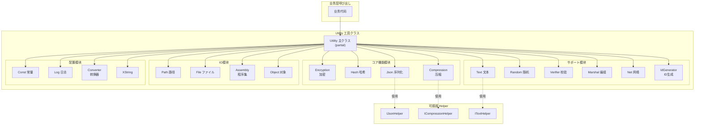

# 工具クラス

GameFrameX フレームワーク提供的コア静态工具函数库，涵盖加密解密、哈希计算、JSON序列化、压缩解压、字符串处理、随机数生成、数据校验、网络操作、ID生成等常用機能。

## 概要

Utility 工具クラス是 GameFrameX フレームワーク的基础设施层，为上层业务逻辑提供底层技术支撑。这些工具クラス采用**静态クラス设计**，无需インスタンス化即可直接呼び出し，极大地简化了日常开发工作。

### 设计理念

1. **无ステータス工具メソッド**：所有メソッド都是无副作用的静态メソッド，可安全并行呼び出し
2. **可扩展架构**：关键機能采用 Helper 插拔机制，サポート用户自定义実装
3. **Partial Class 组织**：使用 C# partial class 特性，按機能模块分散代码到多个ファイル，提高可维护性

### 模块分クラス

Utility 工具クラス涵盖以下機能领域：

| 分クラス | 機能説明 |
|------|----------|
| 加密模块 | XOR 异或加密 |
| 哈希模块 | MD5、SHA1、SHA256、HMAC-SHA256、MurmurHash3、XxHash |
| 数据格式 | JSON 序列化/反序列化、压缩/解压缩 |
| 文本处理 | 字符串格式化、クラス型转换、扩展字符串 |
| 校验模块 | CRC32、CRC64 校验和计算 |
| 随机数 | 随机整数、浮点数、字节数组生成 |
| 系统操作 | 结构体编组、网络端口/IP操作、唯一ID生成 |
| 输入输出 | 路径处理、ファイル操作 |
| 反射操作 | 程序集加载、对象操作 |

## 架构



## コア機能详解

### 加密模块 (Encryption)

提供 XOR 异或加密機能，适に使用轻量级数据混淆シーン。

```csharp
// XOR 加密示例
byte[] originalData = new byte[] { 0x01, 0x02, 0x03, 0x04 };
byte[] key = new byte[] { 0xAA, 0xBB, 0xCC, 0xDD };

// 加密
byte[] encrypted = Utility.Encryption.GetXorBytes(originalData, key);

// 解密（异或加密是对称的）
byte[] decrypted = Utility.Encryption.GetXorBytes(encrypted, key);
```
> Source: [Utility.Encryption.cs](https://github.com/GameFrameX/com.gameframex.unity/blob/main/Runtime/Utility/Utility.Encryption.cs#L82-L90)

### 哈希模块 (Hash)

サポート多种哈希算法，に使用数据完整性校验和密码存储：

- **MD5**：128位哈希值，适に使用ファイル完整性校验
- **SHA1**：160位哈希值
- **SHA256**：256位哈希值，安全系数更高
- **HMAC-SHA256**：带密钥的哈希，に使用消息认证
- **MurmurHash3**：高性能非加密哈希
- **XxHash**：极高性能的非加密哈希

```csharp
// 计算字符串的 MD5 哈希
string input = "Hello GameFrameX";
string md5Hash = Utility.Hash.MD5.Hash(input);

// 验证哈希值
bool isValid = Utility.Hash.MD5.IsVerify(input, md5Hash);

// 计算ファイル MD5
string fileHash = Utility.Hash.MD5.FileHash("path/to/file");
```
> Source: [Utility.Hash.Md5.cs](https://github.com/GameFrameX/com.gameframex.unity/blob/main/Runtime/Utility/Utility.Hash.Md5.cs#L38-L42)

### JSON 模块 (Json)

提供 JSON 序列化和反序列化機能，サポート可插拔的 Helper 実装：

```csharp
// 設定自定义 JSON Helper
Utility.Json.SetJsonHelper(new NewtonsoftJsonHelper());

// 序列化对象为 JSON
var user = new User { Name = "张三", Age = 25 };
string json = Utility.Json.ToJson(user);

// 反序列化 JSON 为对象
var user2 = Utility.Json.ToObject<User>(json);

// 反序列化为指定クラス型
object obj = Utility.Json.ToObject(typeof(User), json);
```
> Source: [Utility.Json.cs](https://github.com/GameFrameX/com.gameframex.unity/blob/main/Runtime/Utility/Utility.Json.cs#L68-L88)

### 压缩模块 (Compression)

提供数据压缩和解压缩機能：

```csharp
// 設定压缩 Helper
Utility.Compression.SetCompressionHelper(new DefaultCompressionHelper());

// 压缩字节数组
byte[] originalData = File.ReadAllBytes("data.bin");
byte[] compressed = Utility.Compression.Compress(originalData);

// 解压缩
byte[] decompressed = Utility.Compression.Decompress(compressed);

// 压缩流
using (var inputStream = File.OpenRead("data.bin"))
using (var outputStream = new MemoryStream())
{
    Utility.Compression.Compress(inputStream, outputStream);
}
```
> Source: [Utility.Compression.cs](https://github.com/GameFrameX/com.gameframex.unity/blob/main/Runtime/Utility/Utility.Compression.cs#L67-L75)

### 文本模块 (Text)

提供安全的字符串格式化機能，サポート最多16个参数的格式化：

```csharp
// 基本格式化
string result = Utility.Text.Format("Hello {0}, you have {1} messages", "张三", 5);

// 多参数格式化
string result2 = Utility.Text.Format(
    "Name: {0}, Age: {1}, Score: {2}, Rank: {3}",
    "李四", 25, 98.5, "A"
);

// 設定自定义 Text Helper
Utility.Text.SetTextHelper(new DefaultTextHelper());
```
> Source: [Utility.Text.cs](https://github.com/GameFrameX/com.gameframex.unity/blob/main/Runtime/Utility/Utility.Text.cs#L68-L81)

### 随机数模块 (Random)

提供高质量的随机数生成：

```csharp
// 設定随机数种子
Utility.Random.SetSeed(12345);

// 生成 0 到 Int32.MaxValue 之间的随机数
int rand1 = Utility.Random.GetRandom();

// 生成 0 到 100 之间的随机数（不含100）
int rand2 = Utility.Random.GetRandom(100);

// 生成 50 到 100 之间的随机数
int rand3 = Utility.Random.GetRandom(50, 100);

// 生成 0.0 到 1.0 之间的随机浮点数
double randFloat = Utility.Random.GetRandomDouble();

// 生成随机字节数组
byte[] buffer = new byte[16];
Utility.Random.GetRandomBytes(buffer);
```
> Source: [Utility.Random.cs](https://github.com/GameFrameX/com.gameframex.unity/blob/main/Runtime/Utility/Utility.Random.cs#L71-L103)

### 校验模块 (Verifier)

提供 CRC32/CRC64 校验和计算，に使用数据完整性验证：

```csharp
// 计算字节数组的 CRC32
byte[] data = new byte[] { 0x01, 0x02, 0x03, 0x04 };
int crc32 = Utility.Verifier.GetCrc32(data);

// 计算流的 CRC32
using (var stream = File.OpenRead("data.bin"))
{
    int crc = Utility.Verifier.GetCrc32(stream);
}

// 计算 CRC64
ulong crc64 = Utility.Verifier.GetCrc64(data);

// CRC32 字节数组转换
byte[] crcBytes = Utility.Verifier.GetCrc32Bytes(crc32);
```
> Source: [Utility.Verifier.cs](https://github.com/GameFrameX/com.gameframex.unity/blob/main/Runtime/Utility/Utility.Verifier.cs#L95-L103)

### 网络模块 (Net)

提供网络操作辅助機能：

```csharp
// 取得第一个可用端口
int availablePort = Utility.Net.GetFirstAvailablePort(8000, 9000);

// 检查端口是否可用
bool isAvailable = Utility.Net.PortIsAvailable(8080);

// 取得已用端口列表
List<int> usedPorts = Utility.Net.PortIsUsed();

// 取得本机IP地址
string localIP = Utility.Net.GetIP();

// 取得域名的IPv4地址
string ipv4 = Utility.Net.GetHostIPv4("example.com");

// 取得域名的IPv6地址
string ipv6 = Utility.Net.GetHostIPv6("example.com");
```
> Source: [Utility.Net.cs](https://github.com/GameFrameX/com.gameframex.unity/blob/main/Runtime/Utility/Utility.Net.cs#L145-L158)

### ID生成模块 (IdGenerator)

提供分布式唯一ID生成機能，使用时间戳+计数器策略：

```csharp
// 生成唯一的 long クラス型 ID
long uniqueId = Utility.IdGenerator.GetNextUniqueId();

// 生成唯一的 int クラス型 ID
int uniqueIntId = Utility.IdGenerator.GetNextUniqueIntId();

// 时间基准：2020年1月1日 UTC
DateTime startTime = Utility.IdGenerator.UtcTimeStart;
```
> Source: [Utility.IdGenerator.cs](https://github.com/GameFrameX/com.gameframex.unity/blob/main/Runtime/Utility/Utility.IdGenerator.cs#L45-L49)

### Marshal 模块

提供结构体与字节数组之间的相互转换，に使用低层次数据处理：

```csharp
// 定义结构体
[StructLayout(LayoutKind.Sequential)]
public struct PlayerData
{
    public int Id;
    public int Level;
    public long Experience;
}

// 结构体转字节数组
PlayerData player = new PlayerData { Id = 1, Level = 10, Experience = 5000 };
byte[] bytes = Utility.Marshal.StructureToBytes(player);

// 字节数组转结构体
PlayerData player2 = Utility.Marshal.BytesToStructure<PlayerData>(bytes);

// 缓存管理
Utility.Marshal.EnsureCachedHGlobalSize(4096);
Utility.Marshal.FreeCachedHGlobal();
```
> Source: [Utility.Marshal.cs](https://github.com/GameFrameX/com.gameframex.unity/blob/main/Runtime/Utility/Utility.Marshal.cs#L102-L105)

## 使用例

### 综合使用示例

以下示例展示如何在实际プロジェクト中使用 Utility 工具クラス：

```csharp
using GameFrameX.Runtime;

// 1. 初期化 Helper（可选，如需自定义実装）
Utility.Json.SetJsonHelper(new NewtonsoftJsonHelper());
Utility.Compression.SetCompressionHelper(new DefaultCompressionHelper());
Utility.Text.SetTextHelper(new DefaultTextHelper());

// 2. 数据处理フロー
public class DataProcessor
{
    public void ProcessData(byte[] rawData)
    {
        // 计算 CRC32 校验
        int crc = Utility.Verifier.GetCrc32(rawData);
        Console.WriteLine($"CRC32: {crc}");
        
        // 计算 MD5 哈希
        string md5 = Utility.Hash.MD5.Hash(rawData.ToString());
        
        // 压缩数据
        byte[] compressed = Utility.Compression.Compress(rawData);
        
        // 生成唯一ID
        long dataId = Utility.IdGenerator.GetNextUniqueId();
        
        // 序列化为 JSON
        var dataInfo = new 
        {
            Id = dataId,
            Crc = crc,
            Md5 = md5,
            Size = compressed.Length
        };
        string json = Utility.Json.ToJson(dataInfo);
        
        // 格式化输出
        string message = Utility.Text.Format(
            "数据处理完成 - ID: {0}, CRC: {1}, 压缩后大小: {2} bytes",
            dataId, crc, compressed.Length
        );
    }
}
```

### ゲーム开发常见シーン

```csharp
// シーン1：リソース版本校验
public bool VerifyResource(string filePath, string expectedHash)
{
    string actualHash = Utility.Hash.MD5.FileHash(filePath);
    return Utility.Hash.MD5.IsVerify(expectedHash, actualHash);
}

// シーン2：配置数据加密存储
public void SaveEncryptedConfig(byte[] configData, byte[] key)
{
    byte[] encrypted = Utility.Encryption.GetXorBytes(configData, key);
    byte[] compressed = Utility.Compression.Compress(encrypted);
    File.WriteAllBytes("config.dat", compressed);
}

// シーン3：随机生成ゲーム道具
public Item GenerateRandomItem()
{
    int itemType = Utility.Random.GetRandom(1, 100);
    int itemLevel = Utility.Random.GetRandom(1, 10);
    long itemId = Utility.IdGenerator.GetNextUniqueId();
    
    return new Item 
    { 
        Id = itemId, 
        Type = itemType, 
        Level = itemLevel 
    };
}
```

## 関連リンク

- [辅助クラス](./5-runtime.helper-classes) - Unity 特定シーン的辅助コンポーネント
- [扩展メソッド库](./5-runtime.extension-methods) - 链式呼び出し扩展メソッド
- [イベント系统](./5-runtime.event-system) - イベント驱动架构
- [オブジェクトプールシステム](./5-runtime.object-pool) - 对象复用管理
