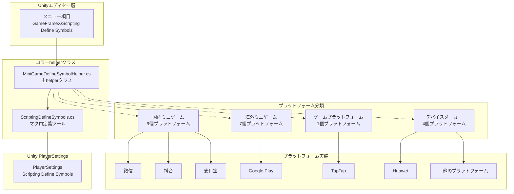
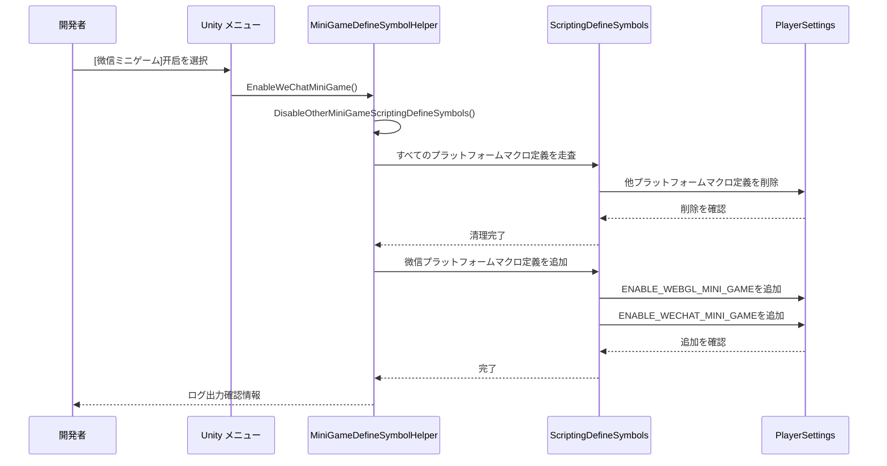

# プラットフォームサポート

GameFrameXはオペレーティングシステムプラットフォームとミニゲームプラットフォームの2大カテゴリ涵盖する包括的なマルチプラットフォームサポートを提供します。条件コンパイルメカニズムと統一マクロ定義管理を通じて、開発者は異なるプラットフォーム間でプロジェクトのシームレスな切り替えを容易 实现できます。

## 概要

GameFrameXのプラットフォームサポートシステムはUnityのScripting Define Symbols（スクリプトマクロ定義）技術を採用しており、21の主流ミニゲームプラットフォームへのワンボタン切り替えサポートを実現します。このシステムは以下のコア原則に従って設計されています：

- **相互排他メカニズム**：各ミニゲームプラットフォームは相互排他であり、一度に1つのプラットフォームのみアクティブ可能
- **統一識別子**：すべてのミニゲームプラットフォームは統一マクロ定義`ENABLE_WEBGL_MINI_GAME`を共有
- **メニュー統合**：Unityメニューを通じて可视化的プラットフォーム切り替え操作を提供
- **条件コンパイル**：`#if`プリプロセッサ命令を使用してプラットフォーム特定のコードを実装

## アーキテクチャ

プラットフォームサポートシステムの 아키텍처は`MiniGameDefineSymbolHelper`を中心に展開し、部分的クラス（partial class）パターンを使用してモジュラー拡張を實現します。



**アーキテクチャ説明：**

1. **エディター層**：Unityメニューを通じてプラットフォーム切り替え操作をトリガー
2. **コラーhelperクラス**：
   - `MiniGameDefineSymbolHelper`：主helperクラス、すべてのプラットフォームマクロ定義を管理
   - `ScriptingDefineSymbols`：低層ツールクラス、PlayerSettings APIを封装
3. **プラットフォーム分類**：地区とタイプ別に21のプラットフォームを4つのグループに分類
4. **Unity PlayerSettings**：最終的なマクロ定義ストレージ場所

## コラーメカニзм

### マクロ定義システム

GameFrameXは双層マクロ定義システムを使用してプラットフォーム切り替えを管理します：

```mermaid
flowchart LR
    subgraph DefineLayers["マクロ定義层级"]
        Unified["統一マクロ定義<br/>ENABLE_WEBGL_MINI_GAME"]
        Platform["プラットフォームマクロ定義<br/>ENABLE_XXX_MINI_GAME<br/>XXXMINIGAME"]
    end

    Unified -->|活性タイミング| Auto[任意プラットフォーム开启时<br/>自動活性]
    Platform -->|条件コンパイル|#if UNITY_WEBGL<br/>& ENABLE_XXX_MINI_GAME

    style Unified fill:#e1f5fe
    style Platform fill:#fff3e0
```

**マクロ定義説明：**

| マクロ定義タイプ | 名称 | 用途 |
|-----------|------|------|
| 統一マクロ定義 | `ENABLE_WEBGL_MINI_GAME` | 現在のビルドがWebGLミニゲーム임을識別 |
| プラットフォームマクロ定義 | `ENABLE_XXX_MINI_GAME` | 特定のミニゲームプラットフォーム임을識別 |
| プラットフォームマクロ定義 | `XXXMINIGAME` | プラットフォーム省略識別子（サードパーティーSDK适配用） |

### プラットフォーム相互排他メカニズム



## 対応プラットフォーム

### オペレーティングシステムプラットフォーム

GameFrameXは以下のオペレーティングシステムプラットフォームのビルドをサポート：

| プラットフォーム | ステータス | 対応バージョン | ビルドターゲットグループ |
|------|------|----------|-----------|
| Windows | ✅ 対応済み | Unity 2019.4+ | Standalone |
| macOS | ✅ 対応済み | Unity 2019.4+ | Standalone |
| Linux | ✅ 対応済み | Unity 2019.4+ | Standalone |
| iOS | ✅ 対応済み | Unity 2019.4+ | iOS |
| Android | ✅ 対応済み | Unity 2019.4+ | Android |
| WebGL | ✅ 対応済み | Unity 2019.4+ | WebGL |

### ミニゲームプラットフォーム

GameFrameXはワンボタン切り替えの21のミニゲームプラットフォーム适配を提供し、国内、国際、デバイスメーカー、ゲームプラットフォームの4大カテゴリを涵盖します。

#### 国内ミニゲーム（9個）

| プラットフォーム | マクロ定義 | 地区 | メニューパス |
|------|--------|------|----------|
| 微信小程序 | `ENABLE_WECHAT_MINI_GAME` / `WEIXINMINIGAME` | 中国 | Domestic Mini Games |
| 支付宝小程序 | `ENABLE_ALIPAY_MINI_GAME` / `ALIPAYMINIGAME` | 中国 | Domestic Mini Games |
| 抖音小程序 | `ENABLE_DOUYIN_MINI_GAME` / `DOUYINMINIGAME` | 中国 | Domestic Mini Games |
| 快手小程序 | `ENABLE_KUAISHOU_MINI_GAME` / `KUAISHOUMINIGAME` | 中国 | Domestic Mini Games |
| 百度小程序 | `ENABLE_BAIDU_MINI_GAME` / `BAIDUMINIGAME` | 中国 | Domestic Mini Games |
| 京東小程序 | `ENABLE_JINGDONG_MINI_GAME` / `JINGDONGMINIGAME` | 中国 | Domestic Mini Games |
| 淘宝小程序 | `ENABLE_TAOBAO_MINI_GAME` / `TAOBAOMINIGAME` | 中国 | Domestic Mini Games |
| 美団小程序 | `ENABLE_MEITUAN_MINI_GAME` / `MEITUANMINIGAME` | 中国 | Domestic Mini Games |
| Bilibili小程序 | `ENABLE_BILIBILI_MINI_GAME` / `BILIBILIMINIGAME` | 中国 | Domestic Mini Games |

#### 海外ミニゲーム（7個）

| プラットフォーム | マクロ定義 | 地区 | メニューパス |
|------|--------|------|----------|
| Discord | `ENABLE_DISCORD_MINI_GAME` / `DISCORDMINIGAME` | 全球 | International Mini Games |
| YouTube | `ENABLE_YOUTUBE_MINI_GAME` / `YOUTUBEMINIGAME` | 全球 | International Mini Games |
| Facebook | `ENABLE_FACEBOOK_MINI_GAME` / `FACEBOOKMINIGAME` | 全球 | International Mini Games |
| Google Play | `ENABLE_GOOGLEPLAY_MINI_GAME` / `GOOGLEPLAYMINIGAME` | 全球 | International Mini Games |
| TikTok | `ENABLE_TIKTOK_MINI_GAME` / `TIKTOKMINIGAME` | 全球 | International Mini Games |
| CrazyGames | `ENABLE_CRAZYGAMES_MINI_GAME` / `CRAZYGAMESMINIGAME` | 全球 | International Mini Games |
| Poki | `ENABLE_POKI_MINI_GAME` / `POKIMINIGAME` | 全球 | International Mini Games |

#### デバイスメーカー（4個）

| プラットフォーム | マクロ定義 | 地区 | メニューパス |
|------|--------|------|----------|
| Huaweiミニゲーム | `ENABLE_HUAWEI_MINI_GAME` / `HUAWEIMINIGAME` | 中国 | Device OEMs |
| OPPOミニゲーム | `ENABLE_OPPO_MINI_GAME` / `OPPOSMINIGAME` | 中国 | Device OEMs |
| vivoミニゲーム | `ENABLE_VIVO_MINI_GAME` / `VIVOMINIGAME` | 中国 | Device OEMs |
| Xiaomiミニゲーム | `ENABLE_XIAOMI_MINI_GAME` / `XIAOMIMINIGAME` | 中国 | Device OEMs |

#### ゲームプラットフォーム（1個）

| プラットフォーム | マクロ定義 | 地区 | メニューパス |
|------|--------|------|----------|
| TapTapミニゲーム | `ENABLE_TAPTAP_MINI_GAME` / `TAPTAPMINIGAME` | 中国 | Game Platforms |

## 使用ガイド

### ミニゲームプラットフォームを有効化

Unityエディターで、メニュー操作を通じてミニゲームプラットフォームを быстро切り替えできます：

```
GameFrameX/
└── Scripting Define Symbols/
    ├── Domestic Mini Games(国内ミニゲーム)/
    │   ├── Enable WeChat Mini Game ([微信ミニゲーム]适配を開始)
    │   ├── Enable Alipay Mini Game ([支付宝ミニゲーム]适配を開始)
    │   ├── Enable DouYin Mini Game ([抖音ミニゲーム]适配を開始)
    │   ├── Enable KuaiShou Mini Game ([快手ミニゲーム]适配を開始)
    │   ├── Enable Baidu Mini Game ([百度ミニゲーム]适配を開始)
    │   ├── Enable JingDong Mini Game ([京東ミニゲーム]适配を開始)
    │   ├── Enable Meituan Mini Game ([美団ミニゲーム]适配を開始)
    │   ├── Enable Taobao Mini Game ([淘宝ミニゲーム]适配を開始)
    │   └── Enable Bilibili Mini Game ([Bilibiliミニゲーム]适配を開始)
    ├── International Mini Games(海外ミニゲーム)/
    │   ├── Enable Discord Mini Game
    │   ├── Enable YouTube Mini Game
    │   ├── Enable Facebook Mini Game
    │   ├── Enable Google Play Mini Game
    │   ├── Enable TikTok Mini Game
    │   ├── Enable CrazyGames Mini Game
    │   └── Enable Poki Mini Game
    ├── Device OEMs(デバイスメーカー)/
    │   ├── Enable Huawei Mini Game ([Huaweiミニゲーム]适配を開始)
    │   ├── Enable OPPO Mini Game ([OPPOミニゲーム]适配を開始)
    │   ├── Enable Vivo Mini Game ([vivoミニゲーム]适配を開始)
    │   └── Enable Xiaomi Mini Game ([Xiaomiミニゲーム]适配を開始)
    └── Game Platforms(ゲームプラットフォーム)/
        └── Enable TapTap Mini Game ([TapTapミニゲーム]适配を開始)
```

### 条件コンパイルを使用

コードで条件コンパイル命令を使用してプラットフォーム特定のロジックを実装：

```csharp
#if ENABLE_WEBGL_MINI_GAME
    // すべてのミニゲームプラットフォームで共有されるコード
#endif

#if ENABLE_WECHAT_MINI_GAME
    // 微信ミニゲーム特定のコード
    // 微信ミニゲーム専用APIを使用可能
#endif

#if ENABLE_TAPTAP_MINI_GAME
    // TapTapミニゲーム特定のコード
    // TapTapプラットフォームSDKを使用可能
#endif

#if ENABLE_GOOGLEPLAY_MINI_GAME
    // Google Playミニゲーム特定のコード
    // Google Playゲームサービスを使用可能
#endif
```

> Source: [MiniGameDefineSymbolHelper.WeChat.cs](https://github.com/GameFrameX/com.gameframex.unity/blob/main/Editor/MiniGame/DomesticMiniGames/MiniGameDefineSymbolHelper.WeChat.cs#L14-L39)
> Source: [MiniGameDefineSymbolHelper.TapTap.cs](https://github.com/GameFrameX/com.gameframex.unity/blob/main/Editor/MiniGame/GamePlatforms/MiniGameDefineSymbolHelper.TapTap.cs#L14-L39)

### ミニゲームプラットフォームを閉じる

同理としてメニューを通じて有効なミニゲームプラットフォームを閉じることも可能：

```
GameFrameX/
└── Scripting Define Symbols/
    ├── Domestic Mini Games(国内ミニゲーム)/
    │   └── Disable WeChat Mini Game ([微信ミニゲーム]适配を閉じる)
    ├── International Mini Games(海外ミニゲーム)/
    │   └── Disable Google Play Mini Game ([Google Play]适配を閉じる)
    ├── Device OEMs(デバイスメーカー)/
    │   └── Disable Huawei Mini Game ([Huaweiミニゲーム]适配を閉じる)
    └── Game Platforms(ゲームプラットフォーム)/
        └── Disable TapTap Mini Game ([TapTapミニゲーム]适配を閉じる)
```

## コラーAPIリファレンス

### `MiniGameDefineSymbolHelper`

ミニゲームプラットフォームマクロ定義管理主クラス。

#### `EnableWeChatMiniGame()`

```csharp
#if UNITY_WEBGL
[MenuItem("GameFrameX/Scripting Define Symbols/Domestic Mini Games(国内ミニゲーム)/Enable WeChat Mini Game([微信ミニゲーム]适配を開始)", false, 2000)]
#endif
public static void EnableWeChatMiniGame()
```

微信ミニゲーム适配を開始。有効化時に自動的に：
1. 他すべてのミニゲームプラットフォームのマクロ定義を閉じる
2. 微信ミニゲーム専用のマクロ定義を有効化
3. 統一されたWebGLミニゲームマクロ定義を有効化

> Source: [MiniGameDefineSymbolHelper.WeChat.cs](https://github.com/GameFrameX/com.gameframex.unity/blob/main/Editor/MiniGame/DomesticMiniGames/MiniGameDefineSymbolHelper.WeChat.cs#L20-L40)

#### `DisableWeChatMiniGame()`

```csharp
#if UNITY_WEBGL
[MenuItem("GameFrameX/Scripting Define Symbols/Domestic Mini Games(国内ミニゲーム)/Disable WeChat Mini Game([微信ミニゲーム]适配を閉じる)", false, 2001)]
#endif
public static void DisableWeChatMiniGame()
```

微信ミニゲーム适配を閉じる。

> Source: [MiniGameDefineSymbolHelper.WeChat.cs](https://github.com/GameFrameX/com.gameframex.unity/blob/main/Editor/MiniGame/DomesticMiniGames/MiniGameDefineSymbolHelper.WeChat.cs#L46-L64)

### `ScriptingDefineSymbols`

スクリプトマクロ定義低層操作ツールクラス。

#### `HasScriptingDefineSymbol(buildTargetGroup, scriptingDefineSymbol): bool`

```csharp
public static bool HasScriptingDefineSymbol(BuildTargetGroup buildTargetGroup, string scriptingDefineSymbol)
```

指定プラットフォームに特定のスクリプトマクロ定義が存在するか確認。

**パラメータ：**
- `buildTargetGroup` (BuildTargetGroup)：ターゲットプラットフォームグループ
- `scriptingDefineSymbol` (string)：確認するマクロ定義

**戻り値：** 特定マクロ定義が存在するか

> Source: [ScriptingDefineSymbols.cs](https://github.com/GameFrameX/com.gameframex.unity/blob/main/Editor/Misc/ScriptingDefineSymbols.cs#L57-L74)

#### `AddScriptingDefineSymbol(buildTargetGroup, scriptingDefineSymbol): void`

```csharp
public static void AddScriptingDefineSymbol(BuildTargetGroup buildTargetGroup, string scriptingDefineSymbol)
```

指定プラットフォームにスクリプトマクロ定義を追加。

**パラメータ：**
- `buildTargetGroup` (BuildTargetGroup)：ターゲットプラットフォームグループ
- `scriptingDefineSymbol` (string)：追加するマクロ定義

> Source: [ScriptingDefineSymbols.cs](https://github.com/GameFrameX/com.gameframex.unity/blob/main/Editor/Misc/ScriptingDefineSymbols.cs#L81-L99)

#### `RemoveScriptingDefineSymbol(buildTargetGroup, scriptingDefineSymbol): void`

```csharp
public static void RemoveScriptingDefineSymbol(BuildTargetGroup buildTargetGroup, string scriptingDefineSymbol)
```

指定プラットフォームからスクリプトマクロ定義を削除。

**パラメータ：**
- `buildTargetGroup` (BuildTargetGroup)：ターゲットプラットフォームグループ
- `scriptingDefineSymbol` (string)：削除するマクロ定義

> Source: [ScriptingDefineSymbols.cs](https://github.com/GameFrameX/com.gameframex.unity/blob/main/Editor/Misc/ScriptingDefineSymbols.cs#L106-L125)

#### `GetScriptingDefineSymbols(buildTargetGroup): string[]`

```csharp
public static string[] GetScriptingDefineSymbols(BuildTargetGroup buildTargetGroup)
```

指定プラットフォームのスクリプトマクロ定義配列を取得。

**パラメータ：**
- `buildTargetGroup` (BuildTargetGroup)：ターゲットプラットフォームグループ

**戻り値：** マクロ定義配列

> Source: [ScriptingDefineSymbols.cs](https://github.com/GameFrameX/com.gameframex.unity/blob/main/Editor/Misc/ScriptingDefineSymbols.cs#L166-L169)

## ベストプラクティス

### プラットフォーム适配提案

1. **統一WebGLマクロ定義を使用**：すべてのミニゲームプラットフォームで通用するコードには`ENABLE_WEBGL_MINI_GAME`で条件コンパイル

2. **プラットフォーム特定のコードを分離**：異なるプラットフォームのコードを别々のディレクトリまたはファイルに配置し、保守を容易にする

3. **インターフェース抽象**：プラットフォーム特定のAPIを呼び出す必要があるシナリオでは、インターフェース抽象または依存性注入パターンを使用することを推奨

4. **テスト覆盖**：各ターゲットプラットフォームは十分なテストを行い、条件コンパイルコードが正しく実行されることを確保

### よくある質問

**Q: 新規プラットフォーム开启后之前的平台宏定义是否会自动关闭？**

はい、システムは相互排他メカニズムを採用しており、任意ミニゲームプラットフォーム开启ると他のすべてのミニゲームプラットフォームのマクロ定義が自動的に閉じます。

**Q: 可以同时开启多个小游戏平台吗？**

不可以。ミニゲームプラットフォーム間のAPIとSDKには冲突があるため、システムは相互排他モードで設計されており、一度に1つのプラットフォームのみアクティブ可能です。

**Q: 如何查看当前已开启的平台？**

Unityメニュー`Edit > Project Settings > Player > Other Settings > Scripting Define Symbols` 통해 WebGLプラットフォーム下のマクロ定義リストを表示できます。

## 関連リンク

- [エディターツール](./6-editor-tools.mini-game-platform) - ミニゲームプラットフォーム适配詳細ドキュメント
- [ビルドツール](./6-editor-tools.build-tools) - ビルド製品関連ツール
- [APIリファレンス](./8-api-reference) - 完全なAPIドキュメント
- [プロジェクト主页](https://github.com/GameFrameX/com.gameframex.unity)
- [公式ドキュメント](https://gameframex.doc.alianblank.com)
