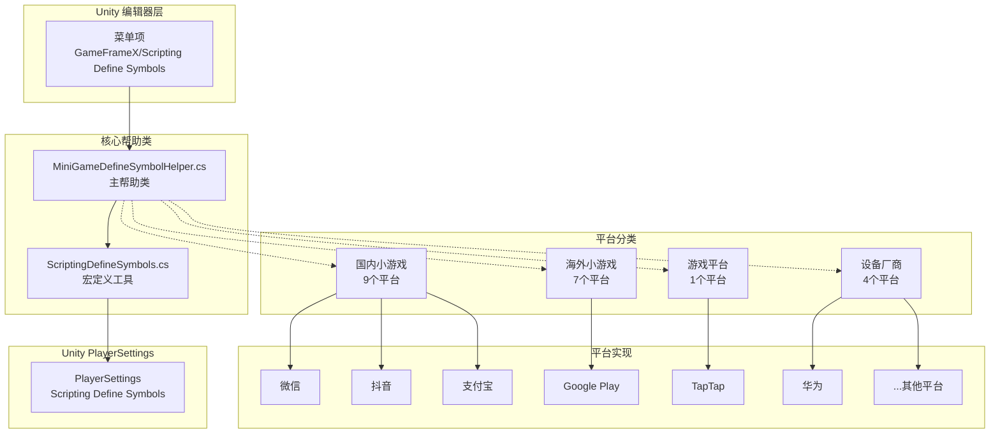
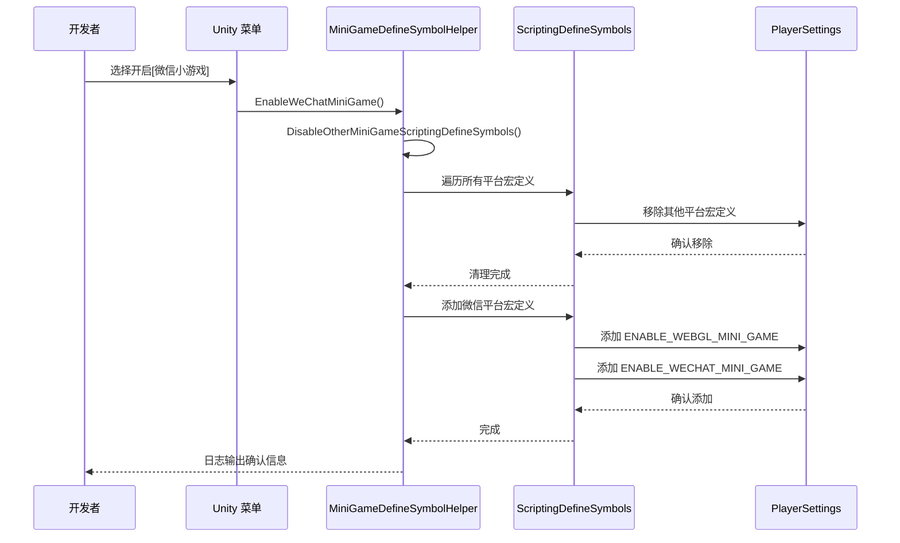

# プラットフォームサポート

GameFrameX 提供全面的多プラットフォームサポート，涵盖操作系统プラットフォーム和ミニゲームプラットフォーム两大类别。通过条件コンパイル机制和統一された的宏定義管理，開発者〜できます轻松実装プロジェクト在不同プラットフォーム之间的无缝切换。

## 概要

GameFrameX 的プラットフォームサポート系统采用 Unity 的 Scripting Define Symbols（脚本宏定義）技术，実装了对 21 个主流ミニゲームプラットフォーム的一键切换サポート。该系统設計遵循以下コア原则：

- **互斥机制**：各ミニゲームプラットフォーム之间互斥，一次只能激活一个プラットフォーム
- **統一された标识**：所有ミニゲームプラットフォーム共享統一された宏定義 `ENABLE_WEBGL_MINI_GAME`
- **メニュー集成**：通过 Unity メニュー提供可视化的プラットフォーム切换操作
- **条件コンパイル**：使用 `#if` 预処理指令実装プラットフォーム特定コード

## アーキテクチャ

プラットフォームサポート系统的アーキテクチャ設計围绕 `MiniGameDefineSymbolHelper` 展开，采用部分类（partial class）モード実装モジュール化拡張。



**アーキテクチャ説明：**

1. **エディタ层**：通过 Unity メニュートリガープラットフォーム切换操作
2. **コア帮助类**：
   - `MiniGameDefineSymbolHelper`：主帮助类，管理所有プラットフォーム宏定義
   - `ScriptingDefineSymbols`：底层工具类，カプセル化 PlayerSettings API
3. **プラットフォーム分类**：按地区和タイプ将 21 个プラットフォーム分为 4 个组
4. **Unity PlayerSettings**：最终的宏定義存储位置

## コア机制

### 宏定義体系

GameFrameX 使用双层宏定義体系来管理プラットフォーム切换：

```mermaid
flowchart LR
    subgraph DefineLayers["宏定义层级"]
        Unified["统一宏定义<br/>ENABLE_WEBGL_MINI_GAME"]
        Platform["平台宏定义<br/>ENABLE_XXX_MINI_GAME<br/>XXXMINIGAME"]
    end
    
    Unified -->|激活时机| Auto[当任意平台开启时<br/>自动激活]
    Platform -->|条件编译|#if UNITY_WEBGL<br/>& ENABLE_XXX_MINI_GAME
    
    style Unified fill:#e1f5fe
    style Platform fill:#fff3e0
```

**宏定義説明：**

| 宏定義タイプ | 名称 | 用途 |
|-----------|------|------|
| 統一された宏定義 | `ENABLE_WEBGL_MINI_GAME` | 标识当前ビルド为 WebGL ミニゲーム |
| プラットフォーム宏定義 | `ENABLE_XXX_MINI_GAME` | 标识具体的ミニゲームプラットフォーム |
| プラットフォーム宏定義 | `XXXMINIGAME` | プラットフォーム简写标识（用于第3方 SDK 适配） |

### プラットフォーム互斥机制



## サポート的プラットフォーム

### 操作系统プラットフォーム

GameFrameX サポート以下操作系统プラットフォーム的ビルド：

| プラットフォーム | ステータス | サポートバージョン | ビルド目标组 |
|------|------|----------|-----------|
| Windows | ✅ 已サポート | Unity 2019.4+ | Standalone |
| macOS | ✅ 已サポート | Unity 2019.4+ | Standalone |
| Linux | ✅ 已サポート | Unity 2019.4+ | Standalone |
| iOS | ✅ 已サポート | Unity 2019.4+ | iOS |
| Android | ✅ 已サポート | Unity 2019.4+ | Android |
| WebGL | ✅ 已サポート | Unity 2019.4+ | WebGL |

### ミニゲームプラットフォーム

GameFrameX 提供一键切换的 21 个ミニゲームプラットフォーム适配，涵盖国内、国际、设备厂商和游戏プラットフォーム四大类别。

#### 国内ミニゲーム（9个）

| プラットフォーム | 宏定義 | 地区 | メニュー路径 |
|------|--------|------|----------|
| WeChatミニゲーム | `ENABLE_WECHAT_MINI_GAME` / `WEIXINMINIGAME` | 🇨🇳 中国 | Domestic Mini Games |
| 支付宝小程序 | `ENABLE_ALIPAY_MINI_GAME` / `ALIPAYMINIGAME` | 🇨🇳 中国 | Domestic Mini Games |
| DouYinミニゲーム | `ENABLE_DOUYIN_MINI_GAME` / `DOUYINMINIGAME` | 🇨🇳 中国 | Domestic Mini Games |
| KuaiShouミニゲーム | `ENABLE_KUAISHOU_MINI_GAME` / `KUAISHOUMINIGAME` | 🇨🇳 中国 | Domestic Mini Games |
| 百度小程序 | `ENABLE_BAIDU_MINI_GAME` / `BAIDUMINIGAME` | 🇨🇳 中国 | Domestic Mini Games |
| 京东小程序 | `ENABLE_JINGDONG_MINI_GAME` / `JINGDONGMINIGAME` | 🇨🇳 中国 | Domestic Mini Games |
| 淘宝小程序 | `ENABLE_TAOBAO_MINI_GAME` / `TAOBAOMINIGAME` | 🇨🇳 中国 | Domestic Mini Games |
| 美团小程序 | `ENABLE_MEITUAN_MINI_GAME` / `MEITUANMINIGAME` | 🇨🇳 中国 | Domestic Mini Games |
| Bilibili 小程序 | `ENABLE_BILIBILI_MINI_GAME` / `BILIBILIMINIGAME` | 🇨🇳 中国 | Domestic Mini Games |

#### 海外ミニゲーム（7个）

| プラットフォーム | 宏定義 | 地区 | メニュー路径 |
|------|--------|------|----------|
| Discord | `ENABLE_DISCORD_MINI_GAME` / `DISCORDMINIGAME` | 🌍 全球 | International Mini Games |
| YouTube | `ENABLE_YOUTUBE_MINI_GAME` / `YOUTUBEMINIGAME` | 🌍 全球 | International Mini Games |
| Facebook | `ENABLE_FACEBOOK_MINI_GAME` / `FACEBOOKMINIGAME` | 🌍 全球 | International Mini Games |
| Google Play | `ENABLE_GOOGLEPLAY_MINI_GAME` / `GOOGLEPLAYMINIGAME` | 🌍 全球 | International Mini Games |
| TikTok | `ENABLE_TIKTOK_MINI_GAME` / `TIKTOKMINIGAME` | 🌍 全球 | International Mini Games |
| CrazyGames | `ENABLE_CRAZYGAMES_MINI_GAME` / `CRAZYGAMESMINIGAME` | 🌍 全球 | International Mini Games |
| Poki | `ENABLE_POKI_MINI_GAME` / `POKIMINIGAME` | 🌍 全球 | International Mini Games |

#### 设备厂商（4个）

| プラットフォーム | 宏定義 | 地区 | メニュー路径 |
|------|--------|------|----------|
| 华为ミニゲーム | `ENABLE_HUAWEI_MINI_GAME` / `HUAWEIMINIGAME` | 🇨🇳 中国 | Device OEMs |
| OPPO ミニゲーム | `ENABLE_OPPO_MINI_GAME` / `OPPOSMINIGAME` | 🇨🇳 中国 | Device OEMs |
| vivo ミニゲーム | `ENABLE_VIVO_MINI_GAME` / `VIVOMINIGAME` | 🇨🇳 中国 | Device OEMs |
| 小米ミニゲーム | `ENABLE_XIAOMI_MINI_GAME` / `XIAOMIMINIGAME` | 🇨🇳 中国 | Device OEMs |

#### 游戏プラットフォーム（1个）

| プラットフォーム | 宏定義 | 地区 | メニュー路径 |
|------|--------|------|----------|
| TapTap ミニゲーム | `ENABLE_TAPTAP_MINI_GAME` / `TAPTAPMINIGAME` | 🇨🇳 中国 | Game Platforms |

## 使用ガイド

### 启用ミニゲームプラットフォーム

在 Unity エディタ中，通过メニュー操作〜できます快速切换ミニゲームプラットフォーム：

```
GameFrameX/
└── Scripting Define Symbols/
    ├── Domestic Mini Games(国内小游戏)/
    │   ├── Enable WeChat Mini Game (开启[微信小游戏]适配)
    │   ├── Enable Alipay Mini Game (开启[支付宝小游戏]适配)
    │   ├── Enable DouYin Mini Game (开启[抖音小游戏]适配)
    │   ├── Enable KuaiShou Mini Game (开启[快手小游戏]适配)
    │   ├── Enable Baidu Mini Game (开启[百度小游戏]适配)
    │   ├── Enable JingDong Mini Game (开启[京东小游戏]适配)
    │   ├── Enable Meituan Mini Game (开启[美团小游戏]适配)
    │   ├── Enable Taobao Mini Game (开启[淘宝小游戏]适配)
    │   └── Enable Bilibili Mini Game (开启[Bilibili小游戏]适配)
    ├── International Mini Games(海外小游戏)/
    │   ├── Enable Discord Mini Game
    │   ├── Enable YouTube Mini Game
    │   ├── Enable Facebook Mini Game
    │   ├── Enable Google Play Mini Game
    │   ├── Enable TikTok Mini Game
    │   ├── Enable CrazyGames Mini Game
    │   └── Enable Poki Mini Game
    ├── Device OEMs(设备厂商)/
    │   ├── Enable Huawei Mini Game (开启[华为小游戏]适配)
    │   ├── Enable OPPO Mini Game (开启[OPPO小游戏]适配)
    │   ├── Enable Vivo Mini Game (开启[vivo小游戏]适配)
    │   └── Enable Xiaomi Mini Game (开启[小米小游戏]适配)
    └── Game Platforms(游戏平台)/
        └── Enable TapTap Mini Game (开启[TapTap小游戏]适配)
```

### 使用条件コンパイル

在コード中〜できます使用条件コンパイル指令来実装プラットフォーム特定的逻辑：

```csharp
#if ENABLE_WEBGL_MINI_GAME
    // 所有小游戏平台共用的代码
#endif

#if ENABLE_WECHAT_MINI_GAME
    // 微信小游戏特定代码
    // 可使用微信小游戏专属 API
#endif

#if ENABLE_TAPTAP_MINI_GAME
    // TapTap 小游戏特定代码
    // 可使用 TapTap 平台 SDK
#endif

#if ENABLE_GOOGLEPLAY_MINI_GAME
    // Google Play 小游戏特定代码
    // 可使用 Google Play 游戏服务
#endif
```

> Source: [MiniGameDefineSymbolHelper.WeChat.cs](https://github.com/GameFrameX/com.gameframex.unity/blob/main/Editor/MiniGame/DomesticMiniGames/MiniGameDefineSymbolHelper.WeChat.cs#L14-L39)
> Source: [MiniGameDefineSymbolHelper.TapTap.cs](https://github.com/GameFrameX/com.gameframex.unity/blob/main/Editor/MiniGame/GamePlatforms/MiniGameDefineSymbolHelper.TapTap.cs#L14-L39)

### 閉じるミニゲームプラットフォーム

同样〜できます通过メニュー閉じる已启用的ミニゲームプラットフォーム：

```
GameFrameX/
└── Scripting Define Symbols/
    ├── Domestic Mini Games(国内小游戏)/
    │   └── Disable WeChat Mini Game (关闭[微信小游戏]适配)
    ├── International Mini Games(海外小游戏)/
    │   └── Disable Google Play Mini Game (关闭[Google Play]适配)
    ├── Device OEMs(设备厂商)/
    │   └── Disable Huawei Mini Game (关闭[华为小游戏]适配)
    └── Game Platforms(游戏平台)/
        └── Disable TapTap Mini Game (关闭[TapTap小游戏]适配)
```

## コア API リファレンス

### `MiniGameDefineSymbolHelper`

ミニゲームプラットフォーム宏定義管理主类。

#### `EnableWeChatMiniGame()`

```csharp
#if UNITY_WEBGL
[MenuItem("GameFrameX/Scripting Define Symbols/Domestic Mini Games(国内小游戏)/Enable WeChat Mini Game(开启[微信小游戏]适配)", false, 2000)]
#endif
public static void EnableWeChatMiniGame()
```

开启WeChatミニゲーム适配。启用时会自动：
1. 閉じる其他所有ミニゲームプラットフォーム的宏定義
2. 启用WeChatミニゲーム专用的宏定義
3. 启用統一された的 WebGL ミニゲーム宏定義

> Source: [MiniGameDefineSymbolHelper.WeChat.cs](https://github.com/GameFrameX/com.gameframex.unity/blob/main/Editor/MiniGame/DomesticMiniGames/MiniGameDefineSymbolHelper.WeChat.cs#L20-L40)

#### `DisableWeChatMiniGame()`

```csharp
#if UNITY_WEBGL
[MenuItem("GameFrameX/Scripting Define Symbols/Domestic Mini Games(国内小游戏)/Disable WeChat Mini Game(关闭[微信小游戏]适配)", false, 2001)]
#endif
public static void DisableWeChatMiniGame()
```

閉じるWeChatミニゲーム适配。

> Source: [MiniGameDefineSymbolHelper.WeChat.cs](https://github.com/GameFrameX/com.gameframex.unity/blob/main/Editor/MiniGame/DomesticMiniGames/MiniGameDefineSymbolHelper.WeChat.cs#L46-L64)

### `ScriptingDefineSymbols`

脚本宏定義底层操作工具类。

#### `HasScriptingDefineSymbol(buildTargetGroup, scriptingDefineSymbol): bool`

```csharp
public static bool HasScriptingDefineSymbol(BuildTargetGroup buildTargetGroup, string scriptingDefineSymbol)
```

確認指定プラットフォーム是否存在指定的脚本宏定義。

**パラメータ：**
- `buildTargetGroup` (BuildTargetGroup)：目标プラットフォーム组
- `scriptingDefineSymbol` (string)：要確認的宏定義

**返す：** 是否存在指定宏定義

> Source: [ScriptingDefineSymbols.cs](https://github.com/GameFrameX/com.gameframex.unity/blob/main/Editor/Misc/ScriptingDefineSymbols.cs#L57-L74)

#### `AddScriptingDefineSymbol(buildTargetGroup, scriptingDefineSymbol): void`

```csharp
public static void AddScriptingDefineSymbol(BuildTargetGroup buildTargetGroup, string scriptingDefineSymbol)
```

为指定プラットフォーム追加脚本宏定義。

**パラメータ：**
- `buildTargetGroup` (BuildTargetGroup)：目标プラットフォーム组
- `scriptingDefineSymbol` (string)：要追加的宏定義

> Source: [ScriptingDefineSymbols.cs](https://github.com/GameFrameX/com.gameframex.unity/blob/main/Editor/Misc/ScriptingDefineSymbols.cs#L81-L99)

#### `RemoveScriptingDefineSymbol(buildTargetGroup, scriptingDefineSymbol): void`

```csharp
public static void RemoveScriptingDefineSymbol(BuildTargetGroup buildTargetGroup, string scriptingDefineSymbol)
```

从指定プラットフォーム移除脚本宏定義。

**パラメータ：**
- `buildTargetGroup` (BuildTargetGroup)：目标プラットフォーム组
- `scriptingDefineSymbol` (string)：要移除的宏定義

> Source: [ScriptingDefineSymbols.cs](https://github.com/GameFrameX/com.gameframex.unity/blob/main/Editor/Misc/ScriptingDefineSymbols.cs#L106-L125)

#### `GetScriptingDefineSymbols(buildTargetGroup): string[]`

```csharp
public static string[] GetScriptingDefineSymbols(BuildTargetGroup buildTargetGroup)
```

取得指定プラットフォーム的脚本宏定義数组。

**パラメータ：**
- `buildTargetGroup` (BuildTargetGroup)：目标プラットフォーム组

**返す：** 宏定義数组

> Source: [ScriptingDefineSymbols.cs](https://github.com/GameFrameX/com.gameframex.unity/blob/main/Editor/Misc/ScriptingDefineSymbols.cs#L166-L169)

## ベストプラクティス

### プラットフォーム适配お勧め

1. **使用統一された的 WebGL 宏定義**：对于所有ミニゲームプラットフォーム汎用的コード，使用 `ENABLE_WEBGL_MINI_GAME` 进行条件コンパイル

2. **分离プラットフォーム特定コード**：将不同プラットフォーム的コード分别放置在独立的ディレクトリ或ファイル中，便于维护

3. **インターフェース抽象**：对于〜する必要があります呼び出しプラットフォーム特定 API 的シーン，お勧め使用インターフェース抽象或依存性注入モード

4. **テスト覆盖**：每个目标プラットフォーム都〜すべき进行充分的テスト，確認してください条件コンパイルコード正确执行

### よくある問題

**Q: 开启新プラットフォーム后之前的プラットフォーム宏定義是否会自动閉じる？**

是的，系统采用互斥机制，开启任一ミニゲームプラットフォーム会自动閉じる其他所有ミニゲームプラットフォーム的宏定義。

**Q: 〜できます同時に开启多个ミニゲームプラットフォーム吗？**

不〜できます。由于ミニゲームプラットフォーム之间的 API 和 SDK 存在冲突，系统設計为互斥モード，一次只能激活一个プラットフォーム。

**Q: 如何確認当前已开启的プラットフォーム？**

〜できます通过 Unity メニュー `Edit > Project Settings > Player > Other Settings > Scripting Define Symbols` 確認 WebGL プラットフォーム下的宏定義列表。

## 関連リンク

- [エディタ工具](./6-editor-tools.mini-game-platform) - ミニゲームプラットフォーム适配詳細ドキュメント
- [ビルド工具](./6-editor-tools.build-tools) - ビルド产品相关工具
- [API リファレンス](./8-api-reference) - 完全な API ドキュメント
- [プロジェクト主页](https://github.com/GameFrameX/com.gameframex.unity)
- [官方ドキュメント](https://gameframex.doc.alianblank.com)
