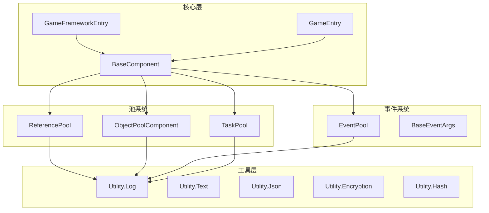

# API リファレンス

このドキュメント提供 GameFrameX フレームワーク所有公共 API 的完全なリファレンス，含みますコア类、インターフェース、メソッド签名和使用説明。

## 概要

GameFrameX フレームワーク采用モジュール化アーキテクチャ設計，コア API 主な分为以下几个部分：

- **フレームワークエントリ**：`GameFrameworkEntry` 和 `GameEntry` 提供フレームワーク初期化和コンポーネント管理
- **基本コンポーネント**：`BaseComponent` 提供游戏ランタイム基本設定
- **参照池**：`ReferencePool` 提供高性能内存管理
- **イベント系统**：`EventPool<T>` 提供タイプ安全的イベント机制
- **任务池**：`TaskPool<T>` 提供异步任务管理
- **对象池**：`ObjectPoolComponent` 提供游戏对象复用
- **工具类**：`Utility` 名前空間提供各类辅助機能

## アーキテクチャ图



---

## フレームワークエントリ

### GameFrameworkEntry

フレームワークモジュールマネージャー，负责フレームワーク级モジュール的登録、取得和アップデート。

> Source: [Runtime/Base/GameFrameworkEntry.cs](https://github.com/GameFrameX/com.gameframex.unity/blob/main/Runtime/Base/GameFrameworkEntry.cs#L44-L209)

#### コアメソッド

##### `Update(elapseSeconds: float, realElapseSeconds: float): void`

轮询所有已登録的フレームワークモジュール。

```csharp
GameFrameworkEntry.Update(deltaTime, unscaledDeltaTime);
```
> Source: [GameFrameworkEntry.cs#L58-L64](https://github.com/GameFrameX/com.gameframex.unity/blob/main/Runtime/Base/GameFrameworkEntry.cs#L58-L64)

##### `Shutdown(): void`

閉じる并清理所有游戏フレームワークモジュール，解放参照池和缓存。

```csharp
GameFrameworkEntry.Shutdown();
```
> Source: [GameFrameworkEntry.cs#L73-L84](https://github.com/GameFrameX/com.gameframex.unity/blob/main/Runtime/Base/GameFrameworkEntry.cs#L73-L84)

##### `GetModule<T>(): T`

取得指定インターフェースタイプ的フレームワークモジュール。もしモジュール不存在，将自动作成。

```csharp
var objectPoolMgr = GameFrameworkEntry.GetModule<IObjectPoolManager>();
```
> Source: [GameFrameworkEntry.cs#L95-L120](https://github.com/GameFrameX/com.gameframex.unity/blob/main/Runtime/Base/GameFrameworkEntry.cs#L95-L120)

##### `RegisterModule(interfaceType: Type, implType: Type): void`

登録フレームワークモジュール的インターフェース与実装タイプ映射。

```csharp
GameFrameworkEntry.RegisterModule(typeof(IObjectPoolManager), typeof(ObjectPoolManager));
```
> Source: [GameFrameworkEntry.cs#L153-L169](https://github.com/GameFrameX/com.gameframex.unity/blob/main/Runtime/Base/GameFrameworkEntry.cs#L153-L169)

---

### GameEntry

Unity コンポーネントマネージャー，提供游戏フレームワークコンポーネント的登録和取得。

> Source: [Runtime/Base/GameEntry.cs](https://github.com/GameFrameX/com.gameframex.unity/blob/main/Runtime/Base/GameEntry.cs#L46-L196)

#### コアメソッド

##### `GetComponent<T>(): T`

取得指定タイプ的游戏フレームワークコンポーネント。

```csharp
var objectPoolComp = GameEntry.GetComponent<ObjectPoolComponent>();
```
> Source: [GameEntry.cs#L67-L70](https://github.com/GameFrameX/com.gameframex.unity/blob/main/Runtime/Base/GameEntry.cs#L67-L70)

##### `Shutdown(shutdownType: ShutdownType): void`

閉じる游戏フレームワーク。

```csharp
GameEntry.Shutdown(ShutdownType.Quit);
```
> Source: [GameEntry.cs#L131-L162](https://github.com/GameFrameX/com.gameframex.unity/blob/main/Runtime/Base/GameEntry.cs#L131-L162)

---

## 基本コンポーネント

### BaseComponent

游戏基本コンポーネント，提供帧率控制、游戏速度管理、后台运行設定等コア機能。

> Source: [Runtime/Base/BaseComponent.cs](https://github.com/GameFrameX/com.gameframex.unity/blob/main/Runtime/Base/BaseComponent.cs#L48-L403)

#### プロパティ

| プロパティ | タイプ | 説明 |
|------|------|------|
| `FrameRate` | `int` | 取得或設定游戏帧率 |
| `GameSpeed` | `float` | 取得或設定游戏速度（0 表示暂停） |
| `IsGamePaused` | `bool` | 取得游戏是否暂停 |
| `IsNormalGameSpeed` | `bool` | 取得游戏是否以正常速度运行 |
| `RunInBackground` | `bool` | 取得或設定是否允许后台运行 |
| `NeverSleep` | `bool` | 取得或設定是否禁止休眠 |

#### メソッド

##### `PauseGame(): void`

暂停游戏。

```csharp
var baseComp = GameEntry.GetComponent<BaseComponent>();
baseComp.PauseGame();
```
> Source: [BaseComponent.cs#L220-L229](https://github.com/GameFrameX/com.gameframex.unity/blob/main/Runtime/Base/BaseComponent.cs#L220-L229)

##### `ResumeGame(): void`

恢复游戏。

```csharp
baseComp.ResumeGame();
```
> Source: [BaseComponent.cs#L235-L243](https://github.com/GameFrameX/com.gameframex.unity/blob/main/Runtime/Base/BaseComponent.cs#L235-L243)

##### `ResetNormalGameSpeed(): void`

重置为正常游戏速度。

```csharp
baseComp.ResetNormalGameSpeed();
```
> Source: [BaseComponent.cs#L249-L257](https://github.com/GameFrameX/com.gameframex.unity/blob/main/Runtime/Base/BaseComponent.cs#L249-L257)

---

## 参照池

### ReferencePool

参照池マネージャー，用于对象的复用，减少 GC 开销。

> Source: [Runtime/Base/ReferencePool/ReferencePool.cs](https://github.com/GameFrameX/com.gameframex.unity/blob/main/Runtime/Base/ReferencePool/ReferencePool.cs#L44-L296)

#### プロパティ

| プロパティ | タイプ | 説明 |
|------|------|------|
| `EnableStrictCheck` | `bool` | 取得或設定是否开启强制タイプ確認 |
| `Count` | `int` | 取得参照池的数量 |

#### コアメソッド

##### `Acquire<T>(): T`

从参照池取得指定タイプ的参照。

```csharp
var myRef = ReferencePool.Acquire<MyReferenceClass>();
```
> Source: [ReferencePool.cs#L129-L132](https://github.com/GameFrameX/com.gameframex.unity/blob/main/Runtime/Base/ReferencePool/ReferencePool.cs#L129-L132)

##### `Release(reference: IReference): void`

将参照归还参照池。

```csharp
ReferencePool.Release(myRef);
```
> Source: [ReferencePool.cs#L157-L167](https://github.com/GameFrameX/com.gameframex.unity/blob/main/Runtime/Base/ReferencePool/ReferencePool.cs#L157-L167)

##### `Add<T>(count: int): void`

向参照池中追加指定数量的参照。

```csharp
ReferencePool.Add<MyReferenceClass>(10);
```
> Source: [ReferencePool.cs#L178-L181](https://github.com/GameFrameX/com.gameframex.unity/blob/main/Runtime/Base/ReferencePool/ReferencePool.cs#L178-L181)

##### `Remove<T>(count: int): void`

从参照池中移除指定数量的参照。

```csharp
ReferencePool.Remove<MyReferenceClass>(5);
```
> Source: [ReferencePool.cs#L207-L210](https://github.com/GameFrameX/com.gameframex.unity/blob/main/Runtime/Base/ReferencePool/ReferencePool.cs#L207-L210)

##### `ClearAll(): void`

清除所有参照池。

```csharp
ReferencePool.ClearAll();
```
> Source: [ReferencePool.cs#L107-L118](https://github.com/GameFrameX/com.gameframex.unity/blob/main/Runtime/Base/ReferencePool/ReferencePool.cs#L107-L118)

##### `GetAllReferencePoolInfos(): ReferencePoolInfo[]`

取得所有参照池的情報。

```csharp
var infos = ReferencePool.GetAllReferencePoolInfos();
```
> Source: [ReferencePool.cs#L82-L98](https://github.com/GameFrameX/com.gameframex.unity/blob/main/Runtime/Base/ReferencePool/ReferencePool.cs#L82-L98)

---

### IReference

参照インターフェース，所有可放入参照池的对象〜しなければなりません実装此インターフェース。

> Source: [Runtime/Base/ReferencePool/IReference.cs](https://github.com/GameFrameX/com.gameframex.unity/blob/main/Runtime/Base/ReferencePool/IReference.cs#L40-L52)

```csharp
public class MyReferenceClass : IReference
{
    public void Clear() { /* 重置状态 */ }
}
```
> Source: [IReference.cs#L40-L52](https://github.com/GameFrameX/com.gameframex.unity/blob/main/Runtime/Base/ReferencePool/IReference.cs#L40-L52)

---

## イベント系统

### EventPool<T>

タイプ安全的イベント池，サポート线程安全的イベント分发。

> Source: [Runtime/Base/EventPool/EventPool.cs](https://github.com/GameFrameX/com.gameframex.unity/blob/main/Runtime/Base/EventPool/EventPool.cs#L47-L395)

#### 构造メソッド

##### `EventPool(mode: EventPoolMode)`

作成イベント池インスタンス。

```csharp
var eventPool = new EventPool<T>(EventPoolMode.AllowMultiHandler | EventPoolMode.AllowDuplicateHandler);
```
> Source: [EventPool.cs#L65-L73](https://github.com/GameFrameX/com.gameframex.unity/blob/main/Runtime/Base/EventPool/EventPool.cs#L65-L73)

#### プロパティ

| プロパティ | タイプ | 説明 |
|------|------|------|
| `EventHandlerCount` | `int` | 取得イベント処理函数的数量 |
| `EventCount` | `int` | 取得队列中待処理イベント的数量 |

#### コアメソッド

##### `Subscribe(id: string, handler: EventHandler<T>): void`

購読イベント。

```csharp
eventPool.Subscribe("PlayerDead", OnPlayerDead);
```
> Source: [EventPool.cs#L208-L234](https://github.com/GameFrameX/com.gameframex.unity/blob/main/Runtime/Base/EventPool/EventPool.cs#L208-L234)

##### `Unsubscribe(id: string, handler: EventHandler<T>): void`

取消購読イベント。

```csharp
eventPool.Unsubscribe("PlayerDead", OnPlayerDead);
```
> Source: [EventPool.cs#L245-L280](https://github.com/GameFrameX/com.gameframex.unity/blob/main/Runtime/Base/EventPool/EventPool.cs#L245-L280)

##### `Fire(sender: object, e: T): void`

抛出イベント（线程安全，异步分发）。

```csharp
var eventArgs = ReferencePool.Acquire<PlayerDeadEventArgs>();
eventArgs.PlayerId = 123;
eventPool.Fire(this, eventArgs);
```
> Source: [EventPool.cs#L304-L313](https://github.com/GameFrameX/com.gameframex.unity/blob/main/Runtime/Base/EventPool/EventPool.cs#L304-L313)

##### `FireNow(sender: object, e: T): void`

立つまり抛出イベント（同步分发）。

```csharp
eventPool.FireNow(this, eventArgs);
```
> Source: [EventPool.cs#L324-L335](https://github.com/GameFrameX/com.gameframex.unity/blob/main/Runtime/Base/EventPool/EventPool.cs#L324-L335)

##### `Check(id: string, handler: EventHandler<T>): bool`

確認是否存在指定的イベント処理函数。

```csharp
bool exists = eventPool.Check("PlayerDead", OnPlayerDead);
```
> Source: [EventPool.cs#L186-L197](https://github.com/GameFrameX/com.gameframex.unity/blob/main/Runtime/Base/EventPool/EventPool.cs#L186-L197)

##### `Update(elapseSeconds: float, realElapseSeconds: float): void`

轮询イベント池，処理队列中的イベント。

```csharp
eventPool.Update(deltaTime, unscaledDeltaTime);
```
> Source: [EventPool.cs#L114-L121](https://github.com/GameFrameX/com.gameframex.unity/blob/main/Runtime/Base/EventPool/EventPool.cs#L114-L121)

##### `Shutdown(): void`

閉じる并清理イベント池。

```csharp
eventPool.Shutdown();
```
> Source: [EventPool.cs#L129-L140](https://github.com/GameFrameX/com.gameframex.unity/blob/main/Runtime/Base/EventPool/EventPool.cs#L129-L140)

---

### BaseEventArgs

イベントパラメータ基底クラス，所有自定義イベントパラメータ都应継承此类。

> Source: [Runtime/Base/EventPool/BaseEventArgs.cs](https://github.com/GameFrameX/com.gameframex.unity/blob/main/Runtime/Base/EventPool/BaseEventArgs.cs)

```csharp
public sealed class PlayerDeadEventArgs : BaseEventArgs
{
    public int PlayerId { get; set; }
    public string PlayerName { get; set; }
    
    public override void Clear()
    {
        PlayerId = 0;
        PlayerName = null;
    }
}
```

---

### EventPoolMode

イベント池モード列挙型。

> Source: [Runtime/Base/EventPool/EventPoolMode.cs](https://github.com/GameFrameX/com.gameframex.unity/blob/main/Runtime/Base/EventPool/EventPoolMode.cs#L44-L56)

```csharp
[Flags]
public enum EventPoolMode : byte
{
    /// 不允许存在空处理函数
    AllowNoHandler = 1,
    /// 允许存在多个处理函数
    AllowMultiHandler = 2,
    /// 允许存在重复的处理函数
    AllowDuplicateHandler = 4,
}
```

---

## 任务池

### TaskPool<T>

任务池マネージャー，用于管理异步任务的执行。

> Source: [Runtime/Base/TaskPool/TaskPool.cs](https://github.com/GameFrameX/com.gameframex.unity/blob/main/Runtime/Base/TaskPool/TaskPool.cs#L44-L525)

#### 构造メソッド

##### `TaskPool()`

作成任务池インスタンス。

```csharp
var taskPool = new TaskPool<DownloadTask>();
```
> Source: [TaskPool.cs#L58-L64](https://github.com/GameFrameX/com.gameframex.unity/blob/main/Runtime/Base/TaskPool/TaskPool.cs#L58-L64)

#### プロパティ

| プロパティ | タイプ | 説明 |
|------|------|------|
| `Paused` | `bool` | 取得或設定任务池是否被暂停 |
| `TotalAgentCount` | `int` | 取得任务代理总数量 |
| `FreeAgentCount` | `int` | 取得可用任务代理数量 |
| `WorkingAgentCount` | `int` | 取得工作中任务代理数量 |
| `WaitingTaskCount` | `int` | 取得等待任务数量 |

#### コアメソッド

##### `AddAgent(agent: ITaskAgent<T>): void`

增加任务代理。

```csharp
taskPool.AddAgent(new DownloadTaskAgent());
```
> Source: [TaskPool.cs#L172-L181](https://github.com/GameFrameX/com.gameframex.unity/blob/main/Runtime/Base/TaskPool/TaskPool.cs#L172-L181)

##### `AddTask(task: T): void`

增加任务。

```csharp
var task = ReferencePool.Acquire<DownloadTask>();
task.Url = "http://example.com/file.png";
task.Priority = 100;
taskPool.AddTask(task);
```
> Source: [TaskPool.cs#L327-L348](https://github.com/GameFrameX/com.gameframex.unity/blob/main/Runtime/Base/TaskPool/TaskPool.cs#L327-L348)

##### `RemoveTask(serialId: int): bool`

根据序列编号移除任务。

```csharp
bool removed = taskPool.RemoveTask(taskSerialId);
```
> Source: [TaskPool.cs#L359-L390](https://github.com/GameFrameX/com.gameframex.unity/blob/main/Runtime/Base/TaskPool/TaskPool.cs#L359-L390)

##### `RemoveTasks(tag: string): int`

根据标签移除任务。

```csharp
int count = taskPool.RemoveTasks("download");
```
> Source: [TaskPool.cs#L401-L439](https://github.com/GameFrameX/com.gameframex.unity/blob/main/Runtime/Base/TaskPool/TaskPool.cs#L401-L439)

##### `RemoveAllTasks(): int`

移除所有任务。

```csharp
int count = taskPool.RemoveAllTasks();
```
> Source: [TaskPool.cs#L449-L471](https://github.com/GameFrameX/com.gameframex.unity/blob/main/Runtime/Base/TaskPool/TaskPool.cs#L449-L471)

##### `GetTaskInfo(serialId: int): TaskInfo`

取得指定序列编号的任务情報。

```csharp
var info = taskPool.GetTaskInfo(serialId);
```
> Source: [TaskPool.cs#L192-L212](https://github.com/GameFrameX/com.gameframex.unity/blob/main/Runtime/Base/TaskPool/TaskPool.cs#L192-L212)

##### `GetAllTaskInfos(): TaskInfo[]`

取得所有任务情報。

```csharp
var infos = taskPool.GetAllTaskInfos();
```
> Source: [TaskPool.cs#L273-L289](https://github.com/GameFrameX/com.gameframex.unity/blob/main/Runtime/Base/TaskPool/TaskPool.cs#L273-L289)

##### `Update(elapseSeconds: float, realElapseSeconds: float): void`

轮询任务池，処理任务。

```csharp
taskPool.Update(deltaTime, unscaledDeltaTime);
```
> Source: [TaskPool.cs#L136-L145](https://github.com/GameFrameX/com.gameframex.unity/blob/main/Runtime/Base/TaskPool/TaskPool.cs#L136-L145)

##### `Shutdown(): void`

閉じる并清理任务池。

```csharp
taskPool.Shutdown();
```
> Source: [TaskPool.cs#L154-L162](https://github.com/GameFrameX/com.gameframex.unity/blob/main/Runtime/Base/TaskPool/TaskPool.cs#L154-L162)

---

### TaskBase

任务基底クラス，所有自定義任务都应継承此类。

> Source: [Runtime/Base/TaskPool/TaskBase.cs](https://github.com/GameFrameX/com.gameframex.unity/blob/main/Runtime/Base/TaskPool/TaskBase.cs)

```csharp
public class DownloadTask : TaskBase
{
    public string Url { get; set; }
    public byte[] Result { get; set; }
    
    public override void Clear()
    {
        Url = null;
        Result = null;
        base.Clear();
    }
}
```

---

### ITaskAgent<T>

任务代理インターフェース。

> Source: [Runtime/Base/TaskPool/ITaskAgent.cs](https://github.com/GameFrameX/com.gameframex.unity/blob/main/Runtime/Base/TaskPool/ITaskAgent.cs#L41-L56)

```csharp
public interface ITaskAgent<T> where T : TaskBase
{
    TaskBase Task { get; }
    void Initialize();
    void Update(float elapseSeconds, float realElapseSeconds);
    void Shutdown();
    void Reset();
    StartTaskStatus Start(T task);
}
```

---

## 对象池

### ObjectPoolComponent

Unity 对象池コンポーネント，提供游戏对象的复用管理。

> Source: [Runtime/ObjectPool/ObjectPoolComponent.cs](https://github.com/GameFrameX/com.gameframex.unity/blob/main/Runtime/ObjectPool/ObjectPoolComponent.cs#L45-L1135)

#### プロパティ

| プロパティ | タイプ | 説明 |
|------|------|------|
| `Count` | `int` | 取得对象池数量 |

#### コアメソッド

##### `HasObjectPool<T>(): bool`

確認是否存在指定タイプ的对象池。

```csharp
bool exists = objectPoolComp.HasObjectPool<MyObject>();
```
> Source: [ObjectPoolComponent.cs#L80-L83](https://github.com/GameFrameX/com.gameframex.unity/blob/main/Runtime/ObjectPool/ObjectPoolComponent.cs#L80-L83)

##### `GetObjectPool<T>(): IObjectPool<T>`

取得指定タイプ的对象池。

```csharp
var pool = objectPoolComp.GetObjectPool<MyObject>();
```
> Source: [ObjectPoolComponent.cs#L137-L140](https://github.com/GameFrameX/com.gameframex.unity/blob/main/Runtime/ObjectPool/ObjectPoolComponent.cs#L137-L140)

##### `CreateSingleSpawnObjectPool<T>(): IObjectPool<T>`

作成单次取得对象池。

```csharp
var pool = objectPoolComp.CreateSingleSpawnObjectPool<MyObject>("MyObjectPool");
```
> Source: [ObjectPoolComponent.cs#L257-L260](https://github.com/GameFrameX/com.gameframex.unity/blob/main/Runtime/ObjectPool/ObjectPoolComponent.cs#L257-L260)

##### `CreateMultiSpawnObjectPool<T>(): IObjectPool<T>`

作成多次取得对象池。

```csharp
var pool = objectPoolComp.CreateMultiSpawnObjectPool<MyObject>("MyObjectPool", 10, 300f);
```
> Source: [ObjectPoolComponent.cs#L655-L658](https://github.com/GameFrameX/com.gameframex.unity/blob/main/Runtime/ObjectPool/ObjectPoolComponent.cs#L655-L658)

##### `DestroyObjectPool<T>(): bool`

破棄对象池。

```csharp
bool destroyed = objectPoolComp.DestroyObjectPool<MyObject>();
```
> Source: [ObjectPoolComponent.cs#L1053-L1056](https://github.com/GameFrameX/com.gameframex.unity/blob/main/Runtime/ObjectPool/ObjectPoolComponent.cs#L1053-L1056)

##### `Release(): void`

解放对象池中的可解放对象。

```csharp
objectPoolComp.Release();
```
> Source: [ObjectPoolComponent.cs#L1120-L1124](https://github.com/GameFrameX/com.gameframex.unity/blob/main/Runtime/ObjectPool/ObjectPoolComponent.cs#L1120-L1124)

##### `ReleaseAllUnused(): void`

解放对象池中的所有未使用对象。

```csharp
objectPoolComp.ReleaseAllUnused();
```
> Source: [ObjectPoolComponent.cs#L1130-L1134](https://github.com/GameFrameX/com.gameframex.unity/blob/main/Runtime/ObjectPool/ObjectPoolComponent.cs#L1130-L1134)

---

### IObjectPool<T>

对象池インターフェース。

> Source: [Runtime/ObjectPool/IObjectPool.cs](https://github.com/GameFrameX/com.gameframex.unity/blob/main/Runtime/ObjectPool/IObjectPool.cs#L40-L58)

```csharp
public interface IObjectPool<T> where T : ObjectBase
{
    string Name { get; }
    int Count { get; }
    int CanReleaseCount { get; }
    T Spawn();
    void Release(T obj);
    void ReleaseAllUnused();
}
```

---

### ObjectBase

对象池对象基底クラス。

> Source: [Runtime/ObjectPool/ObjectBase.cs](https://github.com/GameFrameX/com.gameframex.unity/blob/main/Runtime/ObjectPool/ObjectBase.cs)

```csharp
public class MyObject : ObjectBase
{
    public string Data { get; set; }
    
    public override void Clear() 
    {
        Data = null;
    }
    
    public override void OnSpawn() { }
    public override void OnRelease() { }
}
```

---

## 工具类

### Utility.Log

ログ工具类，提供分级ログ输出。

> Source: [Runtime/Utility/Log.cs](https://github.com/GameFrameX/com.gameframex.unity/blob/main/Runtime/Utility/Log.cs#L40-L2000+)

#### ログ级别

| メソッド | 説明 |
|------|------|
| `Debug(message)` | デバッグ级别ログ |
| `Info(message)` | 情報级别ログ |
| `Warning(message)` | 警告级别ログ |
| `Error(message)` | エラー级别ログ |
| `Fatal(message)` | 致命エラーログ |

```csharp
Log.Info("玩家 {0} 进入了游戏", playerName);
Log.Warning("资源加载失败: {0}", url);
Log.Error("网络请求超时");
```
> Source: [Log.cs#L557-L560](https://github.com/GameFrameX/com.gameframex.unity/blob/main/Runtime/Utility/Log.cs#L557-L560)

---

### Utility.Text

文本フォーマット化工具。

> Source: [Runtime/Utility/Utility.Text.cs](https://github.com/GameFrameX/com.gameframex.unity/blob/main/Runtime/Utility/Utility.Text.cs)

```csharp
string formatted = Utility.Text.Format("{0} + {1} = {2}", 1, 2, 3);
```

---

### Utility.Json

JSON シリアライズ工具。

> Source: [Runtime/Utility/Utility.Json.cs](https://github.com/GameFrameX/com.gameframex.unity/blob/main/Runtime/Utility/Utility.Json.cs)

```csharp
string json = Utility.Json.ToJson(myObject);
var obj = Utility.Json.FromJson<MyClass>(json);
```

---

### Utility.Encryption

加解密工具。

> Source: [Runtime/Utility/Utility.Encryption.cs](https://github.com/GameFrameX/com.gameframex.unity/blob/main/Runtime/Utility/Utility.Encryption.cs)

```csharp
// AES 加密
byte[] encrypted = Utility.Encryption.Aes.Encrypt(data, key, iv);

// AES 解密
byte[] decrypted = Utility.Encryption.Aes.Decrypt(encrypted, key, iv);
```

---

### Utility.Hash

哈希工具。

> Source: [Runtime/Utility/Utility.Hash.Md5.cs](https://github.com/GameFrameX/com.gameframex.unity/blob/main/Runtime/Utility/Utility.Hash.Md5.cs#L25-L50)

```csharp
string md5 = Utility.Hash.MD5.Hash(data);
string sha1 = Utility.Hash.Sha1.Hash(data);
ulong xxhash = Utility.Hash.XXHash.Hash64(data, seed);
```

---

### Utility.Marshal

内存操作工具。

> Source: [Runtime/Utility/Utility.Marshal.cs](https://github.com/GameFrameX/com.gameframex.unity/blob/main/Runtime/Utility/Utility.Marshal.cs#L45-L100)

```csharp
IntPtr ptr = Utility.Marshal.Alloc(size);
Utility.Marshal.Copy(data, 0, ptr, data.Length);
Utility.Marshal.FreeCachedHGlobal();
```

---

### Utility.File

ファイル操作工具。

> Source: [Runtime/Utility/Utility.File.cs](https://github.com/GameFrameX/com.gameframex.unity/blob/main/Runtime/Utility/Utility.File.cs#L12-L100)

```csharp
string[] lines = Utility.File.ReadAllLines(path);
byte[] data = Utility.File.ReadAllBytes(path);
Utility.File.WriteAllBytes(path, data);
```

---

### Utility.Path

路径操作工具。

> Source: [Runtime/Utility/Utility.Path.cs](https://github.com/GameFrameX/com.gameframex.unity/blob/main/Runtime/Utility/Utility.Path.cs#L45-L100)

```csharp
string normalizePath = Utility.Path.GetRegularPath(path);
string combinePath = Utility.Path.Combine(dir, file);
```

---

### Utility.Random

随机数工具。

> Source: [Runtime/Utility/Utility.Random.cs](https://github.com/GameFrameX/com.gameframex.unity/blob/main/Runtime/Utility/Utility.Random.cs#L46-L100)

```csharp
int randomInt = Utility.Random.GetRandom(0, 100);
float randomFloat = Utility.Random.GetRandomFloat(0f, 1f);
```

---

## 列挙型タイプ

### ShutdownType

閉じるタイプ。

> Source: [Runtime/Base/ShutdownType.cs](https://github.com/GameFrameX/com.gameframex.unity/blob/main/Runtime/Base/ShutdownType.cs#L41-L54)

```csharp
public enum ShutdownType : byte
{
    /// 不做任何事
    None = 0,
    /// 关闭后重启游戏
    Restart = 1,
    /// 关闭后退出游戏
    Quit = 2,
}
```

---

### GameFrameworkLogLevel

ログ级别。

> Source: [Runtime/Base/Log/GameFrameworkLogLevel.cs](https://github.com/GameFrameX/com.gameframex.unity/blob/main/Runtime/Base/Log/GameFrameworkLogLevel.cs#L42-L56)

```csharp
public enum GameFrameworkLogLevel : byte
{
    Debug = 0,
    Info = 1,
    Warning = 2,
    Error = 3,
    Fatal = 4,
}
```

---

### TaskStatus

任务ステータス。

> Source: [Runtime/Base/TaskPool/TaskStatus.cs](https://github.com/GameFrameX/com.gameframex.unity/blob/main/Runtime/Base/TaskPool/TaskStatus.cs#L41-L51)

```csharp
public enum TaskStatus : byte
{
    /// 未开始
    Todo = 0,
    /// 进行中
    Doing = 1,
    /// 已完成
    Done = 2,
}
```

---

### StartTaskStatus

任务启动ステータス。

> Source: [Runtime/Base/TaskPool/StartTaskStatus.cs](https://github.com/GameFrameX/com.gameframex.unity/blob/main/Runtime/Base/TaskPool/StartTaskStatus.cs#L41-L54)

```csharp
public enum StartTaskStatus : byte
{
    /// 可以进行
    CanStart = 0,
    /// 需要等待
    HasToWait = 1,
    /// 立即完成
    Done = 2,
    /// 可以恢复
    CanResume = 3,
    /// 未知错误
    UnknownError = 4,
}
```

---

## 関連リンク

- [概要](./1-overview)
- [コアコンセプト](./4-core-concepts)
- [ランタイムモジュール - イベント系统](./5-runtime.event-system)
- [ランタイムモジュール - 对象池系统](./5-runtime.object-pool)
- [ランタイムモジュール - 参照池系统](./5-runtime.reference-pool)
- [ランタイムモジュール - 任务池系统](./5-runtime.task-pool)
- [ランタイムモジュール - 工具类](./5-runtime.utility-classes)
- [常见問題](./9-troubleshooting)
