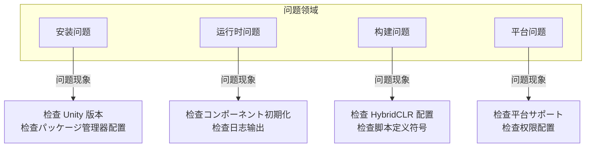

# 常见问题

本文档收集了 GameFrameX Unity フレームワーク在使用过程中可能遇到的常见问题及其解決策。

## 概要

GameFrameX は機能丰富的 Unity ゲームフレームワーク，在使用过程中可能会遇到各种技术问题。本文档旨在帮助開発者快速定位和解决常见问题，提高开发效率。

## 架构



## 安装问题

### Unity 版本不兼容

**问题説明**: 导入フレームワーク后出现编译错误或機能異常。

**原因分析**:
- Unity 版本低于フレームワーク要求的最小バージョン (2019.4+)
- .NET API 兼容级别設定不正确

**解決策**:

1. 检查 Unity 版本：
   - 确保使用 Unity 2019.4 或更高版本
   - 推荐使用 LTS 版本以获得最佳稳定性

2. 設定 API 兼容级别：
   - 打开 `Edit` → `Project Settings` → `Player`
   - 在 `Other Settings` 中将 `Api Compatibility Level` 設定为 `.NET Standard 2.0` 或更高

> Source: [README.zh-CN.md](https://github.com/GameFrameX/com.gameframex.unity/blob/main/README.zh-CN.md#L57-L61)

### Package Manager インストール失敗

**问题説明**: を通じて UPM 添加包时出现网络错误或インストール失敗。

**解決策**:

1. 使用推荐的安装方法：
   - 打开 Unity 编辑器
   - 选择 `Window` → `Package Manager`
   - 点击左上角 `+` 按钮
   - 选择 `Add package from git URL`
   - 输入: `https://github.com/GameFrameX/com.gameframex.unity.git`

2. 备选方案 - 手动安装：
   - 从 GitHub Releases ダウンロード最新版本
   - 解压到プロジェクト的 `Packages` ディレクトリ下

> Source: [README.zh-CN.md](https://github.com/GameFrameX/com.gameframex.unity/blob/main/README.zh-CN.md#L349-L364)

## 运行时问题

### コンポーネント取得返回空 (Null)

**问题説明**: `GameEntry.GetComponent<T>()` 返回 null。

**原因分析**:
- 对应的コンポーネント未添加到シーン中
- コンポーネント未正确初期化
- コンポーネント添加顺序不正确

**解決策**:

1. 确保コンポーネント已添加到シーン：
   - 在シーン中作成空物体，添加必要的コンポーネント
   - 检查コンポーネント是否を継承 `GameFrameworkComponent`

2. 检查コンポーネント初期化代码：
   > Source: [Runtime/Base/ObjectPoolComponent.cs](https://github.com/GameFrameX/com.gameframex.unity/blob/main/Runtime/ObjectPool/ObjectPoolComponent.cs#L61-L72)

```csharp
protected override void Awake()
{
    ImplementationComponentType = Type.GetType(componentType);
    InterfaceComponentType = typeof(IObjectPoolManager);
    base.Awake();
    m_ObjectPoolManager = GameFrameworkEntry.GetModule<IObjectPoolManager>();
    if (m_ObjectPoolManager == null)
    {
        Log.Fatal("Object pool manager is invalid.");
        return;
    }
}
```

3. 确保 GameEntry 已正确初期化

### オブジェクトプール使用问题

**问题説明**: オブジェクトプール无法正常取得或释放对象。

**原因分析**:
- 对象クラス型未を継承 `ObjectBase`
- オブジェクトプール未正确作成
- 池容量設定不合理

**解決策**:

1. 确保对象クラス型正确继承：
   > Source: [Runtime/ObjectPool/ObjectBase.cs](https://github.com/GameFrameX/com.gameframex.unity/blob/main/Runtime/ObjectPool/ObjectBase.cs)

2. 正确作成和使用オブジェクトプール：
```csharp
// 取得オブジェクトプールコンポーネント
var objectPool = GameEntry.GetComponent<ObjectPoolComponent>();

// 作成オブジェクトプール
objectPool.CreatePool<MyObject>("MyObjectPool", 10, 100);

// 从池中取得对象
var obj = objectPool.Spawn<MyObject>("MyObjectPool");

// 归还对象到池中
objectPool.Unspawn(obj);
```

> Source: [README.zh-CN.md](https://github.com/GameFrameX/com.gameframex.unity/blob/main/README.zh-CN.md#L394-L411)

### イベント系统无响应

**问题説明**: 订阅的イベント无法触发。

**原因分析**:
- イベント ID 不匹配
- 未正确订阅/取消订阅
- イベント已过期被清理

**解決策**:

1. 确保イベント ID 定义正确：
```csharp
// 定义イベント参数
public class PlayerDeadEventArgs : BaseEventArgs
{
    public int PlayerId { get; set; }
    public float Damage { get; set; }
}

// 订阅イベント
GameEntry.Event.Subscribe(PlayerDeadEventArgs.EventId, OnPlayerDead);

// 发送イベント
GameEntry.Event.Fire(this, PlayerDeadEventArgs.Create(playerId, damage));

// 取消订阅
GameEntry.Event.Unsubscribe(PlayerDeadEventArgs.EventId, OnPlayerDead);
```

> Source: [README.zh-CN.md](https://github.com/GameFrameX/com.gameframex.unity/blob/main/README.zh-CN.md#L450-L468)

2. 在适当的时候取消订阅，避免内存泄漏

## 构建问题

### HybridCLR ホットアップデート构建失败

**问题説明**: ホットアップデート构建时出现编译错误或ファイル未找到。

**原因分析**:
- HybridCLR 未正确安装
- AOT 代码未正确生成
- 热更 DLL 路径配置错误

**解決策**:

1. 确认 HybridCLR 已正确安装：
   - 检查 `Project Settings` → `HybridCLR` 是否存在
   - 确保已安装 HybridCLR 插件

2. 使用フレームワーク提供的ビルドツール：
   ```
   GameFrameX/
   └── Build/
       ├── Build Hotfix (构建ホットアップデート)
       ├── Build Product (构建产品)
       └── Build WebGL With HybridCLR (WebGLホットアップデート构建)
   ```

3. 复制ホットアップデート代码：
   - 使用菜单 `GameFrameX/Build/Copy HotFix Code` 复制热更 DLL
   - 使用菜单 `GameFrameX/Build/Copy AOT Code` 复制 AOT 代码

> Source: [Editor/BuildHotfix/BuildHotfixHelper.cs](https://github.com/GameFrameX/com.gameframex.unity/blob/main/Editor/BuildHotfix/BuildHotfixHelper.cs#L43-L65)

### AOT 代码ディレクトリ未找到

**问题説明**: 复制 AOT 代码时ヒント "未找到 HybridCLR 数据ディレクトリ"。

**原因分析**:
- プロジェクト未进行 IL2CPP 构建
- HybridCLR 未正确生成 AOT 数据
- 构建目标平台不正确

**解決策**:

1. 确保プロジェクト已配置 IL2CPP：
   - 打开 `Project Settings` → `Player` → `Other Settings`
   - 确认 `Scripting Backend` 設定为 `IL2CPP`

2. 先生成 AOT 元数据：
   - 在 HybridCLR 菜单中执行 `Generate AOT Hocking`

3. 检查构建目标平台：
   > Source: [Editor/BuildHotfix/BuildHotfixHelper.cs](https://github.com/GameFrameX/com.gameframex.unity/blob/main/Editor/BuildHotfix/BuildHotfixHelper.cs#L73-L91)

```csharp
DirectoryInfo directoryInfo = new DirectoryInfo(Application.dataPath);
string path = Path.Combine(directoryInfo.Parent.FullName, "HybridCLRData", "AssembliesPostIl2CppStrip", EditorUserBuildSettings.activeBuildTarget.ToString());

DirectoryInfo aotCodeDir = new DirectoryInfo(path);
if (!aotCodeDir.Exists)
{
    Debug.LogError($"未找到HybridCLR数据ディレクトリ:{path}");
    return;
}
```

### WebGL 构建関連问题

**问题説明**: WebGL 平台构建失败或运行異常。

**解決策**:

1. 使用专门的 WebGL ビルドツール：
   - `GameFrameX/Build WebGL With HybridCLR` - 带ホットアップデート的 WebGL 构建

2. 检查 WebGL 模块是否安装：
   - 打开 Unity Hub → 安装 → 添加模块 → WebGL Build Support

### 脚本定义符号冲突

**问题説明**: 多个平台宏定义同时生效导致编译错误。

**原因分析**:
- 小ゲーム平台宏定义互斥机制未生效
- 手动添加的宏定义与フレームワーク冲突

**解決策**:

1. 使用フレームワーク的菜单切换平台：
   ```
   GameFrameX/
   └── Scripting Define Symbols/
       ├── Domestic Mini Games (国内小ゲーム)
       ├── International Mini Games (国际小ゲーム)
       ├── Device OEMs (设备厂商)
       └── Game Platforms (ゲーム平台)
   ```

2. フレームワーク自动处理互斥逻辑：
   > Source: [Editor/MiniGame/MiniGameDefineSymbolHelper.cs](https://github.com/GameFrameX/com.gameframex.unity/blob/main/Editor/MiniGame/MiniGameDefineSymbolHelper.cs#L52-L88)

```csharp
/// <summary>
/// 关闭除当前平台以外的其它小ゲーム平台宏定义。
/// </summary>
private static void DisableOtherMiniGameScriptingDefineSymbols(string[] currentMiniGameScriptingDefineSymbols)
{
#if UNITY_WEBGL
    var closedCount = 0;
    foreach (var defineSymbols in GetAllMiniGameScriptingDefineSymbols())
    {
        if (defineSymbols == null || object.ReferenceEquals(defineSymbols, currentMiniGameScriptingDefineSymbols))
        {
            continue;
        }

        foreach (var define in defineSymbols)
        {
            if (!ScriptingDefineSymbols.HasScriptingDefineSymbol(BuildTargetGroup.WebGL, define))
            {
                continue;
            }

            ScriptingDefineSymbols.RemoveScriptingDefineSymbol(define);
            closedCount++;
        }
    }
    Debug.Log($"小ゲーム宏定义互斥清理完成，共关闭 {closedCount} 个宏定义");
#endif
}
```

## 平台问题

### iOS 平台编译错误

**问题説明**: iOS 平台构建时出现编译错误或原生插件问题。

**解決策**:

1. 检查 iOS 原生插件：
   - 确保 `Plugins/iOS/GameFrameX/GameFrameX.mm` 存在
   - 检查插件导入設定

2. 設定正确的权限：
   - 在 Xcode 中配置必要的权限説明
   - 检查 Info.plist 配置

### Android 平台运行崩溃

**问题説明**: Android 平台应用启动后崩溃。

**解決策**:

1. 检查 IL2CPP 配置：
   - 确保使用了正确的 ABI 設定
   - 检查 armeabi-v7a 和 arm64-v8a サポート

2. 检查权限配置：
   - 确保必要的 Android 权限已声明

### 小ゲーム平台适配问题

**问题説明**: 切换小ゲーム平台后機能異常。

**原因分析**:
- 未正确启用目标平台的宏定义
- 平台特定的 API 未正确呼び出し
- リソース路径配置问题

**解決策**:

1. 确认平台宏定义已启用：
   - を通じて菜单 `GameFrameX/Scripting Define Symbols/` 选择目标平台
   - 查看 Console 确认宏定义启用日志

2. 使用条件编译处理平台差异：
```csharp
#if ENABLE_WECHAT_MINI_GAME
    // 微信小ゲーム特定代码
#elif ENABLE_ALIPAY_MINI_GAME
    // 支付宝小ゲーム特定代码
#endif
```

3. 检查统一宏定义：
   - 所有小ゲーム平台共享 `ENABLE_WEBGL_MINI_GAME` 宏定义

> Source: [README.zh-CN.md](https://github.com/GameFrameX/com.gameframex.unity/blob/main/README.zh-CN.md#L583-L588)

## 日志与调试

### 启用详细日志

**问题説明**: 必要查看更详细的运行信息进行调试。

**解決策**:

1. 使用フレームワーク日志系统：
   > Source: [Runtime/Base/Log/GameFrameworkLog.cs](https://github.com/GameFrameX/com.gameframex.unity/blob/main/Runtime/Base/Log/GameFrameworkLog.cs)

2. 配置日志级别：
```csharp
// 在ゲーム初期化时設定
Log.SetLogLevel(LogLevel.Debug);
```

3. 查看フレームワーク内置日志：
   - フレームワーク使用 `GameFrameworkLog` 进行日志输出
   - 可を通じて自定义 `ILogHelper` 改变日志行为

### 異常捕获与处理

**问题説明**: 必要捕获并处理フレームワーク異常。

**解決策**:

1. 使用フレームワーク定义的異常クラス型：
   > Source: [Runtime/Base/GameFrameworkException.cs](https://github.com/GameFrameX/com.gameframex.unity/blob/main/Runtime/Base/GameFrameworkException.cs)

```csharp
try
{
    // フレームワーク関連操作
}
catch (GameFrameworkException ex)
{
    Log.Error($"フレームワーク異常: {ex.Message}");
}
catch (Exception ex)
{
    Log.Error($"系统異常: {ex.Message}");
}
```

2. 使用参数验证：
   > Source: [Runtime/Base/GameFrameworkGuard.cs](https://github.com/GameFrameX/com.gameframex.unity/blob/main/Runtime/Base/GameFrameworkGuard.cs)

```csharp
// 参数非空检查
GameFrameworkGuard.NotNull(value, nameof(value));
GameFrameworkGuard.NotNullOrEmpty(text, nameof(text));
// 范围检查
GameFrameworkGuard.NotRange(value, 0, 100, nameof(value));
```

## 性能问题

### 内存泄漏

**问题説明**: 长时间运行后内存持续增长。

**可能原因**:
- イベント未取消订阅
- オブジェクトプール对象未归还
- 参照プール对象未释放

**解決策**:

1. 正确管理イベント订阅：
```csharp
void OnDestroy()
{
    // 取消所有订阅
    GameEntry.Event.Unsubscribe<PlayerDeadEventArgs>(OnPlayerDead);
}
```

2. 正确使用オブジェクトプール：
```csharp
// 使用完成后归还
objectPool.Unspawn(obj);

// 或者使用 using 语句（如果サポート）
```

3. 使用 Inspector 监控：
   - フレームワーク提供しますオブジェクトプール和参照プール的可视化インスペクターパネル
   - を通じて `Window` → `GameFrameX` → `Inspector` 查看

### 性能优化建议

1. 使用オブジェクトプール复用频繁作成销毁的对象
2. 使用参照プール减少 GC 压力
3. 使用扩展メソッド优化 Unity 对象操作
4. 合理使用任务池处理异步操作

## 常见错误信息对照表

| 错误信息 | 可能原因 | 解決策 |
|----------|----------|----------|
| `Object pool manager is invalid` | コンポーネント未正确初期化 | 检查 ObjectPoolComponent 是否添加到シーン |
| `未找到 HybridCLR 数据ディレクトリ` | 未执行 IL2CPP 构建 | 执行完整构建フロー |
| `can not be null` | 参数为空 | 使用 GameFrameworkGuard 进行检查 |
| `コンポーネント取得返回 null` | コンポーネント未添加到シーン | 确认コンポーネント已正确添加到シーン |
| `小ゲーム宏定义冲突` | 多个平台同时启用 | 使用フレームワーク菜单切换平台 |

## 取得更多帮助

- **官方文档**: [https://gameframex.doc.alianblank.com](https://gameframex.doc.alianblank.com)
- **GitHub Issues**: [https://github.com/GameFrameX/com.gameframex.unity/issues](https://github.com/GameFrameX/com.gameframex.unity/issues)
- **QQ 讨论群**: 467608841
- **機能建议**: [GitHub Discussions](https://github.com/GameFrameX/com.gameframex.unity/discussions)

## 関連リンク

- [安装指南](./2-installation)
- [快速入门](./3-quick-start)
- [コア概念](./4-core-concepts)
- [运行时模块](./5-runtime.base)
- [编辑器工具](./6-editor-tools.build-tools)
- [平台サポート](./7-platforms)
- [API 参考](./8-api-reference)
