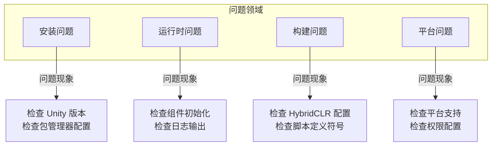

# よくある問題

このドキュメント收集了 GameFrameX Unity フレームワーク在使用过程中〜の可能性があります遇到的常见問題及其解決策。

## 概要

GameFrameX は機能丰富的 Unity 游戏フレームワーク，在使用过程中〜の可能性があります会遇到各种技术問題。このドキュメント旨在帮助開発者快速定位和解决常见問題，提高开发效率。

## アーキテクチャ



## インストール問題

### Unity バージョン不兼容

**問題説明**: 导入フレームワーク后出现コンパイルエラー或機能例外。

**原因分析**:
- Unity バージョン低于フレームワーク要求的最低バージョン (2019.4+)
- .NET API 兼容级别設定不正确

**解決策**:

1. 確認 Unity バージョン：
   - 確認してください使用 Unity 2019.4 或更高バージョン
   - 推奨使用 LTS バージョン以获得最佳稳定性

2. 設定 API 兼容级别：
   - 打开 `Edit` → `Project Settings` → `Player`
   - 在 `Other Settings` 中将 `Api Compatibility Level` 設定为 `.NET Standard 2.0` 或更高

> Source: [README.zh-CN.md](https://github.com/GameFrameX/com.gameframex.unity/blob/main/README.zh-CN.md#L57-L61)

### Package Manager インストール失敗

**問題説明**: 通过 UPM 追加パッケージ时出现网络エラー或インストール失敗。

**解決策**:

1. 使用推奨的インストール方法：
   - 打开 Unity エディタ
   - 选择 `Window` → `Package Manager`
   - 点击左上角 `+` ボタン
   - 选择 `Add package from git URL`
   - 输入: `https://github.com/GameFrameX/com.gameframex.unity.git`

2. 备选方案 - 手动インストール：
   - 从 GitHub Releases 下载最新バージョン
   - 解压到プロジェクト的 `Packages` ディレクトリ下

> Source: [README.zh-CN.md](https://github.com/GameFrameX/com.gameframex.unity/blob/main/README.zh-CN.md#L349-L364)

## ランタイム問題

### コンポーネント取得返す空 (Null)

**問題説明**: `GameEntry.GetComponent<T>()` 返す null。

**原因分析**:
- 对应的コンポーネント未追加到シーン中
- コンポーネント未正确初期化
- コンポーネント追加顺序不正确

**解決策**:

1. 確認してくださいコンポーネント已追加到シーン：
   - 在シーン中作成空物体，追加必要的コンポーネント
   - 確認コンポーネント是否継承自 `GameFrameworkComponent`

2. 確認コンポーネント初期化コード：
   > Source: [Runtime/Base/ObjectPoolComponent.cs](https://github.com/GameFrameX/com.gameframex.unity/blob/main/Runtime/ObjectPool/ObjectPoolComponent.cs#L61-L72)

```csharp
protected override void Awake()
{
    ImplementationComponentType = Type.GetType(componentType);
    InterfaceComponentType = typeof(IObjectPoolManager);
    base.Awake();
    m_ObjectPoolManager = GameFrameworkEntry.GetModule<IObjectPoolManager>();
    if (m_ObjectPoolManager == null)
    {
        Log.Fatal("Object pool manager is invalid.");
        return;
    }
}
```

3. 確認してください GameEntry 已正确初期化

### 对象池使用問題

**問題説明**: 对象池无法正常取得或解放对象。

**原因分析**:
- 对象タイプ未継承自 `ObjectBase`
- 对象池未正确作成
- 池容量設定不合理

**解決策**:

1. 確認してください对象タイプ正确継承：
   > Source: [Runtime/ObjectPool/ObjectBase.cs](https://github.com/GameFrameX/com.gameframex.unity/blob/main/Runtime/ObjectPool/ObjectBase.cs)

2. 正确作成和使用对象池：
```csharp
// 获取对象池组件
var objectPool = GameEntry.GetComponent<ObjectPoolComponent>();

// 创建对象池
objectPool.CreatePool<MyObject>("MyObjectPool", 10, 100);

// 从池中获取对象
var obj = objectPool.Spawn<MyObject>("MyObjectPool");

// 归还对象到池中
objectPool.Unspawn(obj);
```

> Source: [README.zh-CN.md](https://github.com/GameFrameX/com.gameframex.unity/blob/main/README.zh-CN.md#L394-L411)

### イベント系统无响应

**問題説明**: 購読的イベント无法トリガー。

**原因分析**:
- イベント ID 不匹配
- 未正确購読/取消購読
- イベント已过期被清理

**解決策**:

1. 確認してくださいイベント ID 定義正确：
```csharp
// 定义事件参数
public class PlayerDeadEventArgs : BaseEventArgs
{
    public int PlayerId { get; set; }
    public float Damage { get; set; }
}

// 订阅事件
GameEntry.Event.Subscribe(PlayerDeadEventArgs.EventId, OnPlayerDead);

// 发送事件
GameEntry.Event.Fire(this, PlayerDeadEventArgs.Create(playerId, damage));

// 取消订阅
GameEntry.Event.Unsubscribe(PlayerDeadEventArgs.EventId, OnPlayerDead);
```

> Source: [README.zh-CN.md](https://github.com/GameFrameX/com.gameframex.unity/blob/main/README.zh-CN.md#L450-L468)

2. 在适当的时候取消購読，避免内存泄漏

## ビルド問題

### HybridCLR ホットアップデートビルド失敗

**問題説明**: ホットアップデートビルド时出现コンパイルエラー或ファイル未找到。

**原因分析**:
- HybridCLR 未正确インストール
- AOT コード未正确生成
- 热更 DLL 路径設定エラー

**解決策**:

1. 確認 HybridCLR 已正确インストール：
   - 確認 `Project Settings` → `HybridCLR` 是否存在
   - 確認してください已インストール HybridCLR プラグイン

2. 使用フレームワーク提供的ビルド工具：
   ```
   GameFrameX/
   └── Build/
       ├── Build Hotfix (构建热更新)
       ├── Build Product (构建产品)
       └── Build WebGL With HybridCLR (WebGL热更新构建)
   ```

3. 复制ホットアップデートコード：
   - 使用メニュー `GameFrameX/Build/Copy HotFix Code` 复制热更 DLL
   - 使用メニュー `GameFrameX/Build/Copy AOT Code` 复制 AOT コード

> Source: [Editor/BuildHotfix/BuildHotfixHelper.cs](https://github.com/GameFrameX/com.gameframex.unity/blob/main/Editor/BuildHotfix/BuildHotfixHelper.cs#L43-L65)

### AOT コードディレクトリ未找到

**問題説明**: 复制 AOT コード时ヒント "未找到 HybridCLR 数据ディレクトリ"。

**原因分析**:
- プロジェクト未进行 IL2CPP ビルド
- HybridCLR 未正确生成 AOT 数据
- ビルド目标プラットフォーム不正确

**解決策**:

1. 確認してくださいプロジェクト已設定 IL2CPP：
   - 打开 `Project Settings` → `Player` → `Other Settings`
   - 確認 `Scripting Backend` 設定为 `IL2CPP`

2. 先生成 AOT 元数据：
   - 在 HybridCLR メニュー中执行 `Generate AOT Hocking`

3. 確認ビルド目标プラットフォーム：
   > Source: [Editor/BuildHotfix/BuildHotfixHelper.cs](https://github.com/GameFrameX/com.gameframex.unity/blob/main/Editor/BuildHotfix/BuildHotfixHelper.cs#L73-L91)

```csharp
DirectoryInfo directoryInfo = new DirectoryInfo(Application.dataPath);
string path = Path.Combine(directoryInfo.Parent.FullName, "HybridCLRData", "AssembliesPostIl2CppStrip", EditorUserBuildSettings.activeBuildTarget.ToString());

DirectoryInfo aotCodeDir = new DirectoryInfo(path);
if (!aotCodeDir.Exists)
{
    Debug.LogError($"未找到HybridCLR数据目录:{path}");
    return;
}
```

### WebGL ビルド相关問題

**問題説明**: WebGL プラットフォームビルド失敗或运行例外。

**解決策**:

1. 使用专门的 WebGL ビルド工具：
   - `GameFrameX/Build WebGL With HybridCLR` - 带ホットアップデート的 WebGL ビルド

2. 確認 WebGL モジュール是否インストール：
   - 打开 Unity Hub → インストール → 追加モジュール → WebGL Build Support

### 脚本定義符号冲突

**問題説明**: 多个プラットフォーム宏定義同時に生效导致コンパイルエラー。

**原因分析**:
- ミニゲームプラットフォーム宏定義互斥机制未生效
- 手动追加的宏定義与フレームワーク冲突

**解決策**:

1. 使用フレームワーク的メニュー切换プラットフォーム：
   ```
   GameFrameX/
   └── Scripting Define Symbols/
       ├── Domestic Mini Games (国内小游戏)
       ├── International Mini Games (国际小游戏)
       ├── Device OEMs (设备厂商)
       └── Game Platforms (游戏平台)
   ```

2. フレームワーク自动処理互斥逻辑：
   > Source: [Editor/MiniGame/MiniGameDefineSymbolHelper.cs](https://github.com/GameFrameX/com.gameframex.unity/blob/main/Editor/MiniGame/MiniGameDefineSymbolHelper.cs#L52-L88)

```csharp
/// <summary>
/// 关闭除当前平台以外的其它小游戏平台宏定义。
/// </summary>
private static void DisableOtherMiniGameScriptingDefineSymbols(string[] currentMiniGameScriptingDefineSymbols)
{
#if UNITY_WEBGL
    var closedCount = 0;
    foreach (var defineSymbols in GetAllMiniGameScriptingDefineSymbols())
    {
        if (defineSymbols == null || object.ReferenceEquals(defineSymbols, currentMiniGameScriptingDefineSymbols))
        {
            continue;
        }

        foreach (var define in defineSymbols)
        {
            if (!ScriptingDefineSymbols.HasScriptingDefineSymbol(BuildTargetGroup.WebGL, define))
            {
                continue;
            }

            ScriptingDefineSymbols.RemoveScriptingDefineSymbol(define);
            closedCount++;
        }
    }
    Debug.Log($"小游戏宏定义互斥清理完成，共关闭 {closedCount} 个宏定义");
#endif
}
```

## プラットフォーム問題

### iOS プラットフォームコンパイルエラー

**問題説明**: iOS プラットフォームビルド时出现コンパイルエラー或原生プラグイン問題。

**解決策**:

1. 確認 iOS 原生プラグイン：
   - 確認してください `Plugins/iOS/GameFrameX/GameFrameX.mm` 存在
   - 確認プラグイン导入設定

2. 設定正确的权限：
   - 在 Xcode 中設定必要的权限説明
   - 確認 Info.plist 設定

### Android プラットフォーム运行崩溃

**問題説明**: Android プラットフォーム应用启动后崩溃。

**解決策**:

1. 確認 IL2CPP 設定：
   - 確認してください使用了正确的 ABI 設定
   - 確認 armeabi-v7a 和 arm64-v8a サポート

2. 確認权限設定：
   - 確認してください必要的 Android 权限已声明

### ミニゲームプラットフォーム适配問題

**問題説明**: 切换ミニゲームプラットフォーム后機能例外。

**原因分析**:
- 未正确启用目标プラットフォーム的宏定義
- プラットフォーム特定的 API 未正确呼び出し
- リソースパス設定問題

**解決策**:

1. 確認プラットフォーム宏定義已启用：
   - 通过メニュー `GameFrameX/Scripting Define Symbols/` 选择目标プラットフォーム
   - 確認 Console 確認宏定義启用ログ

2. 使用条件コンパイル処理プラットフォーム差异：
```csharp
#if ENABLE_WECHAT_MINI_GAME
    // 微信小游戏特定代码
#elif ENABLE_ALIPAY_MINI_GAME
    // 支付宝小游戏特定代码
#endif
```

3. 確認統一された宏定義：
   - 所有ミニゲームプラットフォーム共享 `ENABLE_WEBGL_MINI_GAME` 宏定義

> Source: [README.zh-CN.md](https://github.com/GameFrameX/com.gameframex.unity/blob/main/README.zh-CN.md#L583-L588)

## ログ与デバッグ

### 启用詳細ログ

**問題説明**: 〜する必要があります確認更詳細的运行情報进行デバッグ。

**解決策**:

1. 使用フレームワークログ系统：
   > Source: [Runtime/Base/Log/GameFrameworkLog.cs](https://github.com/GameFrameX/com.gameframex.unity/blob/main/Runtime/Base/Log/GameFrameworkLog.cs)

2. 設定ログ级别：
```csharp
// 在游戏初始化时设置
Log.SetLogLevel(LogLevel.Debug);
```

3. 確認フレームワーク内置ログ：
   - フレームワーク使用 `GameFrameworkLog` 进行ログ输出
   - 可通过自定義 `ILogHelper` 改变ログ行为

### 例外捕获与処理

**問題説明**: 〜する必要があります捕获并処理フレームワーク例外。

**解決策**:

1. 使用フレームワーク定義的例外タイプ：
   > Source: [Runtime/Base/GameFrameworkException.cs](https://github.com/GameFrameX/com.gameframex.unity/blob/main/Runtime/Base/GameFrameworkException.cs)

```csharp
try
{
    // 框架相关操作
}
catch (GameFrameworkException ex)
{
    Log.Error($"框架异常: {ex.Message}");
}
catch (Exception ex)
{
    Log.Error($"系统异常: {ex.Message}");
}
```

2. 使用パラメータ検証：
   > Source: [Runtime/Base/GameFrameworkGuard.cs](https://github.com/GameFrameX/com.gameframex.unity/blob/main/Runtime/Base/GameFrameworkGuard.cs)

```csharp
// 参数非空检查
GameFrameworkGuard.NotNull(value, nameof(value));
GameFrameworkGuard.NotNullOrEmpty(text, nameof(text));
// 范围检查
GameFrameworkGuard.NotRange(value, 0, 100, nameof(value));
```

## 性能問題

### 内存泄漏

**問題説明**: 长时间运行后内存持续增长。

**考えられる原因**:
- イベント未取消購読
- 对象池对象未归还
- 参照池对象未解放

**解決策**:

1. 正确管理イベント購読：
```csharp
void OnDestroy()
{
    // 取消所有订阅
    GameEntry.Event.Unsubscribe<PlayerDeadEventArgs>(OnPlayerDead);
}
```

2. 正确使用对象池：
```csharp
// 使用完成后归还
objectPool.Unspawn(obj);

// 或者使用 using 语句（如果支持）
```

3. 使用 Inspector 监控：
   - フレームワーク提供します对象池和参照池的可视化检视パネル
   - 通过 `Window` → `GameFrameX` → `Inspector` 確認

### 性能最適化お勧め

1. 使用对象池复用频繁作成破棄的对象
2. 使用参照池减少 GC 压力
3. 使用拡張メソッド最適化 Unity 对象操作
4. 合理使用任务池処理异步操作

## 常见エラー情報对照表

| エラー情報 | 〜の可能性があります原因 | 解決策 |
|----------|----------|----------|
| `Object pool manager is invalid` | コンポーネント未正确初期化 | 確認 ObjectPoolComponent 是否追加到シーン |
| `未找到 HybridCLR 数据目录` | 未执行 IL2CPP ビルド | 执行完全なビルドフロー |
| `can not be null` | パラメータ为空 | 使用 GameFrameworkGuard 进行確認 |
| `组件获取返回 null` | コンポーネント未追加到シーン | 確認コンポーネント已正确追加到シーン |
| `小游戏宏定义冲突` | 多个プラットフォーム同時に启用 | 使用フレームワークメニュー切换プラットフォーム |

## 取得更多帮助

- **官方ドキュメント**: [https://gameframex.doc.alianblank.com](https://gameframex.doc.alianblank.com)
- **GitHub Issues**: [https://github.com/GameFrameX/com.gameframex.unity/issues](https://github.com/GameFrameX/com.gameframex.unity/issues)
- **QQ 讨论群**: 467608841
- **機能お勧め**: [GitHub Discussions](https://github.com/GameFrameX/com.gameframex.unity/discussions)

## 関連リンク

- [インストールガイド](./2-installation)
- [快速入门](./3-quick-start)
- [コアコンセプト](./4-core-concepts)
- [ランタイムモジュール](./5-runtime.base)
- [エディタ工具](./6-editor-tools.build-tools)
- [プラットフォームサポート](./7-platforms)
- [API リファレンス](./8-api-reference)
