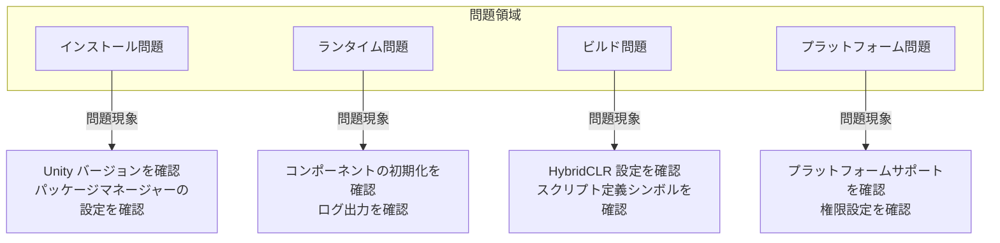

# トラブルシューティング

本文書では、GameFrameX Unity フレームワークの使用中に 발생할可能性のある一般的な問題とその解決策をまとめました。

## 概要

GameFrameX は機能が豊富な Unity ゲームフレームワークであり、使用中にさまざまな技術的な問題が発生する可能性があります。本文書は、開発者が一般的な問題を迅速に特定して解決し、開発効率を向上させるのに役立ちます。

## アーキテクチャ



## インストール問題

### Unity バージョンの互換性がない

**問題の説明**: フレームワークをインポート後にコンパイルエラーまたは機能の異常が発生します。

**原因の分析**:
- Unity バージョンがフレームワークの最小バージョン要件（2019.4+）より低い
- .NET API 互換性レベルが正しく設定されていない

**解決策**:

1. Unity バージョンを確認：
   - Unity 2019.4 以降を使用していることを確認
   - 最高の安定性を得るために LTS バージョンの使用を推奨

2. API 互換性レベルを設定：
   - `Edit` → `Project Settings` → `Player` を開く
   - `Other Settings` で `Api Compatibility Level` を `.NET Standard 2.0` 以上に設定

> Source: [README.zh-CN.md](https://github.com/GameFrameX/com.gameframex.unity/blob/main/README.zh-CN.md#L57-L61)

### Package Manager のインストール失敗

**問題の説明**: UPM を通じてパッケージを追加する際に、ネットワークエラーまたはインストール失敗が発生します。

**解決策**:

1. 推奨されるインストール方法を使用：
   - Unity エディタを開く
   - `Window` → `Package Manager` を選択
   - 左上の `+` ボタンをクリック
   - `Add package from git URL` を選択
   - 次のように入力: `https://github.com/GameFrameX/com.gameframex.unity.git`

2. 代替手段 - 手動インストール：
   - GitHub Releases から最新バージョンをダウンロード
   - プロジェクトの `Packages` ディレクトリに解凍

> Source: [README.zh-CN.md](https://github.com/GameFrameX/com.gameframex.unity/blob/main/README.zh-CN.md#L349-L364)

## ランタイム問題

### コンポーネント取得が null を返す

**問題の説明**: `GameEntry.GetComponent<T>()` が null を返します。

**原因の分析**:
- 対応するコンポーネントがシーンに追加されていない
- コンポーネントが正しく初期化されていない
- コンポーネントの追加順序が正しくない

**解決策**:

1. コンポーネントがシーンに追加されていることを確認：
   - シーン内に空のゲームオブジェクトを作成し、必要なコンポーネントを追加
   - コンポーネントが `GameFrameworkComponent` を継承していることを確認

2. コンポーネント初期化コードを確認：
   > Source: [Runtime/Base/ObjectPoolComponent.cs](https://github.com/GameFrameX/com.gameframex.unity/blob/main/Runtime/ObjectPool/ObjectPoolComponent.cs#L61-L72)

```csharp
protected override void Awake()
{
    ImplementationComponentType = Type.GetType(componentType);
    InterfaceComponentType = typeof(IObjectPoolManager);
    base.Awake();
    m_ObjectPoolManager = GameFrameworkEntry.GetModule<IObjectPoolManager>();
    if (m_ObjectPoolManager == null)
    {
        Log.Fatal("Object pool manager is invalid.");
        return;
    }
}
```

3. GameEntry が正しく初期化されていることを確認

### オブジェクトプールの使用問題

**問題の説明**: オブジェクトプールが正常にオブジェクトを取得または解放できません。

**原因の分析**:
- オブジェクトタイプが `ObjectBase` を継承していない
- オブジェクトプールが正しく作成されていない
- プール容量の設定が不合理

**解決策**:

1. オブジェクトタイプが正しく継承されていることを確認：
   > Source: [Runtime/ObjectPool/ObjectBase.cs](https://github.com/GameFrameX/com.gameframex.unity/blob/main/Runtime/ObjectPool/ObjectBase.cs)

2. オブジェクトプールを正しく作成して使用：
```csharp
// オブジェクトプールコンポーネントを取得
var objectPool = GameEntry.GetComponent<ObjectPoolComponent>();

// オブジェクトプールを作成
objectPool.CreatePool<MyObject>("MyObjectPool", 10, 100);

// プールからオブジェクトを取得
var obj = objectPool.Spawn<MyObject>("MyObjectPool");

// オブジェクトをプールに戻す
objectPool.Unspawn(obj);
```

> Source: [README.zh-CN.md](https://github.com/GameFrameX/com.gameframex.unity/blob/main/README.zh-CN.md#L394-L411)

### イベントシステムが応答しない

**問題の説明**: 購読したイベントがトリガーされません。

**原因の分析**:
- イベント ID が一致しない
- 正しく購読/購読解除されていない
- イベントが期限切れでクリーンアップされた

**解決策**:

1. イベント ID 定義が正しいことを確認：
```csharp
// イベント引数を定義
public class PlayerDeadEventArgs : BaseEventArgs
{
    public int PlayerId { get; set; }
    public float Damage { get; set; }
}

// イベントを購読
GameEntry.Event.Subscribe(PlayerDeadEventArgs.EventId, OnPlayerDead);

// イベントを送信
GameEntry.Event.Fire(this, PlayerDeadEventArgs.Create(playerId, damage));

// 購読を解除
GameEntry.Event.Unsubscribe(PlayerDeadEventArgs.EventId, OnPlayerDead);
```

> Source: [README.zh-CN.md](https://github.com/GameFrameX/com.gameframex.unity/blob/main/README.zh-CN.md#L450-L468)

2. 適切なタイミングで購読を解除し、メモリリークを回避

## ビルド問題

### HybridCLR ホットアップデートビルド失敗

**問題の説明**: ホットアップデートビルド時にコンパイルエラーまたはファイルが見つからないエラーが発生します。

**原因の分析**:
- HybridCLR が正しくインストールされていない
- AOT コードが正しく生成されていない
- ホット更新 DLL パス設定が間違っている

**解決策**:

1. HybridCLR が正しくインストールされていることを確認：
   - `Project Settings` → `HybridCLR` が存在するかをチェック
   - HybridCLR プラグインがインストールされていることを確認

2. フレームワーク提供的ビルドツールを使用：
   ```
   GameFrameX/
   └── Build/
       ├── Build Hotfix (ホットアップデートビルド)
       ├── Build Product (製品ビルド)
       └── Build WebGL With HybridCLR (WebGL ホット更新ビルド)
   ```

3. ホット更新コードをコピー：
   - メニュー `GameFrameX/Build/Copy HotFix Code` を使用してホット更新 DLL をコピー
   - メニュー `GameFrameX/Build/Copy AOT Code` を使用して AOT コードをコピー

> Source: [Editor/BuildHotfix/BuildHotfixHelper.cs](https://github.com/GameFrameX/com.gameframex.unity/blob/main/Editor/BuildHotfix/BuildHotfixHelper.cs#L43-L65)

### AOT コードディレクトリが見つからない

**問題の説明**: AOT コードをコピーする際に「HybridCLR データディレクトリが見つかりません」というプロンプトが表示されます。

**原因の分析**:
- プロジェクトが IL2CPP ビルドを実行していない
- HybridCLR が AOT データを正しく生成していない
- ビルドターゲットプラットフォームが正しくない

**解決策**:

1. プロジェクトが IL2CPP 用に設定されていることを確認：
   - `Project Settings` → `Player` → `Other Settings` を開く
   - `Scripting Backend` が `IL2CPP` に設定されていることを確認

2. 最初に AOT メタデータを生成：
   - HybridCLR メニューで `Generate AOT Hocking` を実行

3. ビルドターゲットプラットフォームを確認：
   > Source: [Editor/BuildHotfix/BuildHotfixHelper.cs](https://github.com/GameFrameX/com.gameframex.unity/blob/main/Editor/BuildHotfix/BuildHotfixHelper.cs#L73-L91)

```csharp
DirectoryInfo directoryInfo = new DirectoryInfo(Application.dataPath);
string path = Path.Combine(directoryInfo.Parent.FullName, "HybridCLRData", "AssembliesPostIl2CppStrip", EditorUserBuildSettings.activeBuildTarget.ToString());

DirectoryInfo aotCodeDir = new DirectoryInfo(path);
if (!aotCodeDir.Exists)
{
    Debug.LogError($"HybridCLRデータディレクトリが見つかりません:{path}");
    return;
}
```

### WebGL ビルド関連の問題

**問題の説明**: WebGL プラットフォームでのビルド失敗または異常な動作。

**解決策**:

1. 専用の WebGL ビルドツールを使用：
   - `GameFrameX/Build WebGL With HybridCLR` - ホット更新付きの WebGL ビルド

2. WebGL モジュールがインストールされているか確認：
   - Unity Hub → インストール → モジュールの追加 → WebGL Build Support を開く

### スクリプト定義シンボルの競合

**問題の説明**: 複数のプラットフォームマクロ定義が同時に有効になり、コンパイルエラーが発生します。

**原因の分析**:
- ミニゲームプラットフォームマクロ定義の相互排他メカニズムが機能していない
- 手動で追加したマクロ定義がフレームワークと競合している

**解決策**:

1. フレームワークのメニューを使用してプラットフォームを切り替え：
   ```
   GameFrameX/
   └── Scripting Define Symbols/
       ├── Domestic Mini Games (国内ミニゲーム)
       ├── International Mini Games (海外ミニゲーム)
       ├── Device OEMs (デバイス OEM)
       └── Game Platforms (ゲームプラットフォーム)
   ```

2. フレームワークが相互排他ロジックを自動処理：
   > Source: [Editor/MiniGame/MiniGameDefineSymbolHelper.cs](https://github.com/GameFrameX/com.gameframex.unity/blob/main/Editor/MiniGame/MiniGameDefineSymbolHelper.cs#L52-L88)

```csharp
/// <summary>
/// 現在のプラットフォーム以外のミニゲームプラットフォームマクロ定義を無効化します。
/// </summary>
private static void DisableOtherMiniGameScriptingDefineSymbols(string[] currentMiniGameScriptingDefineSymbols)
{
#if UNITY_WEBGL
    var closedCount = 0;
    foreach (var defineSymbols in GetAllMiniGameScriptingDefineSymbols())
    {
        if (defineSymbols == null || object.ReferenceEquals(defineSymbols, currentMiniGameScriptingDefineSymbols))
        {
            continue;
        }

        foreach (var define in defineSymbols)
        {
            if (!ScriptingDefineSymbols.HasScriptingDefineSymbol(BuildTargetGroup.WebGL, define))
            {
                continue;
            }

            ScriptingDefineSymbols.RemoveScriptingDefineSymbol(define);
            closedCount++;
        }
    }
    Debug.Log($"ミニゲームマクロ定義の相互排他クリーンアップ完了、合計 {closedCount} 個のマクロ定義を無効化");
#endif
}
```

## プラットフォーム問題

### iOS プラットフォームのコンパイルエラー

**問題の説明**: iOS プラットフォームでビルド時にコンパイルエラーまたはネイティブプラグインの問題が発生します。

**解決策**:

1. iOS ネイティブプラグインを確認：
   - `Plugins/iOS/GameFrameX/GameFrameX.mm` が存在することを確認
   - プラグインのインポート設定を確認

2. 正しい権限を設定：
   - Xcode で必要な権限の説明を構成
   - Info.plist 設定を確認

### Android プラットフォームのクラッシュ

**問題の説明**: Android プラットフォームでアプリケーションが起動後にクラッシュします。

**解決策**:

1. IL2CPP 設定を確認：
   - 正しい ABI 設定を使用していることを確認
   - armeabi-v7a と arm64-v8a のサポートを確認

2. 権限設定を確認：
   - 必要な Android 権限が宣言されていることを確認

### ミニゲームプラットフォームの適応問題

**問題の説明**: ミニゲームプラットフォームを切り替えた後に機能が異常になります。

**原因の分析**:
- ターゲットプラットフォームのマクロ定義が正しく有効になっていない
- プラットフォーム固有の API が正しく呼び出されていない
- リソースパスの設定問題

**解決策**:

1. プラットフォームマクロ定義が有効になっていることを確認：
   - メニュー `GameFrameX/Scripting Define Symbols/` を使用してターゲットプラットフォームを選択
   - Console でマクロ定義の有効化ログを確認

2. 条件付きコンパイルを使用してプラットフォーム差異を処理：
```csharp
#if ENABLE_WECHAT_MINI_GAME
    // WeChat ミニゲーム固有のコード
#elif ENABLE_ALIPAY_MINI_GAME
    // Alipay ミニゲーム固有のコード
#endif
```

3. 統合マクロ定義を確認：
   - すべてのミニゲームプラットフォームは `ENABLE_WEBGL_MINI_GAME` マクロ定義を共有

> Source: [README.zh-CN.md](https://github.com/GameFrameX/com.gameframex.unity/blob/main/README.zh-CN.md#L583-L588)

## ログとデバッグ

### 詳細ログを有効化

**問題の説明**: デバッグにより詳細な実行情報を確認する必要があります。

**解決策**:

1. フレームワークログシステムを使用：
   > Source: [Runtime/Base/Log/GameFrameworkLog.cs](https://github.com/GameFrameX/com.gameframex.unity/blob/main/Runtime/Base/Log/GameFrameworkLog.cs)

2. ログレベルを設定：
```csharp
// ゲームの初期化時に設定
Log.SetLogLevel(LogLevel.Debug);
```

3. フレームワーク組み込みログを表示：
   - フレームワークは `GameFrameworkLog` を使用してログ出力を実行
   - カスタム `ILogHelper` を通じてログ動作を変更可能

### 例外のキャッチと処理

**問題の説明**: フレームワークの例外をキャッチして処理する必要があります。

**解決策**:

1. フレームワーク定義の例外タイプを使用：
   > Source: [Runtime/Base/GameFrameworkException.cs](https://github.com/GameFrameX/com.gameframex.unity/blob/main/Runtime/Base/GameFrameworkException.cs)

```csharp
try
{
    // フレームワーク関連の操作
}
catch (GameFrameworkException ex)
{
    Log.Error($"フレームワーク例外: {ex.Message}");
}
catch (Exception ex)
{
    Log.Error($"システム例外: {ex.Message}");
}
```

2. パラメータの検証を使用：
   > Source: [Runtime/Base/GameFrameworkGuard.cs](https://github.com/GameFrameX/com.gameframex.unity/blob/main/Runtime/Base/GameFrameworkGuard.cs)

```csharp
// パラメータの null チェック
GameFrameworkGuard.NotNull(value, nameof(value));
GameFrameworkGuard.NotNullOrEmpty(text, nameof(text));
// 範囲チェック
GameFrameworkGuard.NotRange(value, 0, 100, nameof(value));
```

## パフォーマンス問題

### メモリリーク

**問題の説明**: 長時間実行後にメモリが持続的に増加します。

**考えられる原因**:
- イベントの購読が解除されていない
- オブジェクトプールオブジェクトが戻されていない
- 参照プールオブジェクトが解放されていない

**解決策**:

1. イベントの購読を正しく管理：
```csharp
void OnDestroy()
{
    // すべての購読を解除
    GameEntry.Event.Unsubscribe<PlayerDeadEventArgs>(OnPlayerDead);
}
```

2. オブジェクトプールを正しく使用：
```csharp
// 使用後に戻す
objectPool.Unspawn(obj);

// または using ステートメントを使用（サポートされている場合）
```

3. Inspector を使用して監視：
   - フレームワークはオブジェクトプールと参照プールのビジュアル Inspector を提供
   - `Window` → `GameFrameX` → `Inspector` を開いて表示

### パフォーマンス最適化の提案

1. オブジェクトプールを使用して頻繁に着脱されるオブジェクトを再利用
2. 参照プールを使用して GC 圧力を軽減
3. 拡張メソッドを使用して Unity オブジェクト操作を最適化
4. 非同期操作を処理するためにタスクプールを適切に使用

## 一般的なエラーメッセージ対応表

| エラーメッセージ | 考えられる原因 | 解決策 |
|----------|----------|------|
| `Object pool manager is invalid` | コンポーネントが正しく初期化されていない | ObjectPoolComponent がシーンに追加されているか確認 |
| `HybridCLR データディレクトリが見つかりません` | IL2CPP ビルドが実行されていない | 完全なビルドフローを実行 |
| `can not be null` | パラメータが null | GameFrameworkGuard を使用してチェック |
| `コンポーネント取得が null を返す` | コンポーネントがシーンに追加されていない | コンポーネントが正しくシーンに追加されているか確認 |
| `ミニゲームマクロ定義の競合` | 複数のプラットフォームが同時に有効 | フレームワークメニューを使用してプラットフォームを切り替え |

## その他のヘルプを取得

- **公式ドキュメント**: [https://gameframex.doc.alianblank.com](https://gameframex.doc.alianblank.com)
- **GitHub Issues**: [https://github.com/GameFrameX/com.gameframex.unity/issues](https://github.com/GameFrameX/com.gameframex.unity/issues)
- **QQ ディカッショングループ**: 467608841
- **機能リクエスト**: [GitHub Discussions](https://github.com/GameFrameX/com.gameframex.unity/discussions)

## 関連リンク

- [インストールガイド](./2.installation)
- [クイックスタート](./3.getting-started)
- [コアコンセプト](./4.features)
- [ランタイムモジュール](./5.base)
- [エディタツール](./11.build-tools)
- [プラットフォームサポート](./19.platforms)
- [API リファレンス](./20.api-reference)
