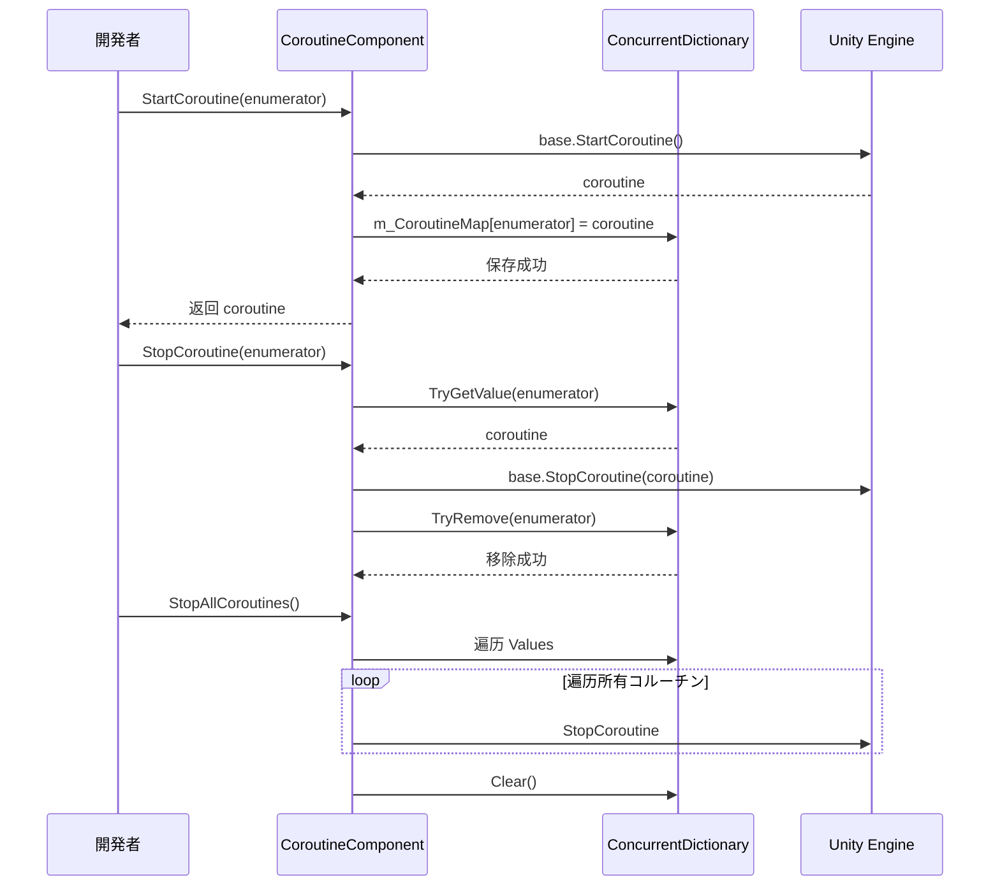

# 插件介绍

GameFrameX Coroutine コルーチンコンポーネントは Unity 扩展コンポーネント，提供增强的コルーチン管理機能。を通じて使用并发字典来跟踪执行的コルーチン，它为コルーチン的启动、停止和清理提供します更好的控制和访问。

## 概要

**CoroutineComponent** 是 GameFrameX ゲーム开发フレームワーク的コアコンポーネント之一，专门に使用管理和执行 Unity コルーチン。该コンポーネントを拡張 Unity 的内建コルーチン管理機能，解决了原生コルーチン管理中的一些痛点问题。

### 解决的问题

在 Unity 开发中，原生コルーチン管理存在以下问题：

1. **追踪困难**: 难以取得已启动コルーチン的ステータス
2. **停止复杂**: 使用 `IEnumerator` 停止コルーチン不够直观
3. **内存泄漏风险**: コルーチン未正确停止可能导致内存泄漏
4. **无法批量管理**: 无法方便地停止所有コルーチン

### コア機能

| 特性 | 説明 |
|------|------|
| コルーチン追踪 | 使用 `ConcurrentDictionary` 记录所有启动的コルーチン |
| 安全停止 | サポートを通じて迭代器和コルーチン对象两种方法停止コルーチン |
| 批量管理 | 提供停止所有コルーチン的機能 |
| 帧结束回调 | 提供在当前帧渲染结束后执行回调的便捷メソッド |
| 单例限制 | 使用 `[DisallowMultipleComponent]` 防止重复添加 |

## 架构


### コンポーネント结构説明

**CoroutineComponent** を継承 `GameFrameworkComponent`，集成了 GameFrameX フレームワーク的コア機能。コンポーネント内部维护一个 `ConcurrentDictionary`，に使用将用户传入的 `IEnumerator` 与 Unity 内部的 `Coroutine` 对象进行映射，从而実装更便捷的コルーチン管理。

### コアファイル

| ファイル | 路径 | 説明 |
|------|------|------|
| CoroutineComponent.cs | Runtime/Coroutine/ | 主コンポーネント実装 |
| CoroutineComponentInspector.cs | Editor/Inspector/ | Unity 编辑器检查器 |
| GameFrameXCoroutineCroppingHelper.cs | Runtime/ | IL2CPP 代码保留辅助クラス |

## コア機能

### 1. コルーチン启动

`StartCoroutine` メソッド重写了 Unity MonoBehaviour 的同名メソッド，在启动コルーチン的同时将其记录到内部字典中：

```csharp
public new UnityEngine.Coroutine StartCoroutine(IEnumerator enumerator)
{
    var ret = base.StartCoroutine(enumerator);
    m_CoroutineMap[enumerator] = ret;
    return ret;
}
```

> Source: [CoroutineComponent.cs](https://github.com/GameFrameX/com.gameframex.unity.coroutine/blob/main/Runtime/Coroutine/CoroutineComponent.cs#L25-L30)

**设计意图**: を通じて在启动时保存映射关系，后续可能を通じて `IEnumerator` 精确地停止特定的コルーチン，解决了原生 Unity コルーチン API 无法を通じて IEnumerator 停止的问题。

### 2. コルーチン停止

コンポーネント提供します两种停止コルーチン的メソッド：

**を通じて IEnumerator 停止**:
```csharp
public new void StopCoroutine(IEnumerator enumerator)
{
    if (m_CoroutineMap.TryGetValue(enumerator, out var coroutine))
    {
        base.StopCoroutine(coroutine);
        m_CoroutineMap.TryRemove(enumerator, out _);
    }
    base.StopCoroutine(enumerator);
}
```

> Source: [CoroutineComponent.cs](https://github.com/GameFrameX/com.gameframex.unity.coroutine/blob/main/Runtime/Coroutine/CoroutineComponent.cs#L36-L45)

**を通じて UnityEngine.Coroutine 停止**:
```csharp
public new void StopCoroutine(UnityEngine.Coroutine coroutine)
{
    base.StopCoroutine(coroutine);
    foreach (var item in m_CoroutineMap)
    {
        if (item.Value == coroutine)
        {
            m_CoroutineMap.TryRemove(item.Key, out _);
            break;
        }
    }
}
```

> Source: [CoroutineComponent.cs](https://github.com/GameFrameX/com.gameframex.unity.coroutine/blob/main/Runtime/Coroutine/CoroutineComponent.cs#L51-L62)

**设计意图**: 提供灵活的停止方法，開発者可能に基づいて手中持有的引用クラス型（IEnumerator 或 Coroutine）选择合适的停止メソッド。

### 3. 停止所有コルーチン

```csharp
public new void StopAllCoroutines()
{
    foreach (var coroutine in m_CoroutineMap.Values)
    {
        base.StopCoroutine(coroutine);
    }
    m_CoroutineMap.Clear();
    base.StopAllCoroutines();
}
```

> Source: [CoroutineComponent.cs](https://github.com/GameFrameX/com.gameframex.unity.coroutine/blob/main/Runtime/Coroutine/CoroutineComponent.cs#L67-L76)

**设计意图**: 在シーン切换或对象销毁时，确保所有コルーチン被干净地停止，防止内存泄漏和野指针问题。

### 4. 帧结束回调

```csharp
public void WaitForEndOfFrameFinish(System.Action callback)
{
    StartCoroutine(_WaitForEndOfFrameFinish(callback));
}
```

> Source: [CoroutineComponent.cs](https://github.com/GameFrameX/com.gameframex.unity.coroutine/blob/main/Runtime/Coroutine/CoroutineComponent.cs#L94-L97)

**设计意图**: 提供一种便捷的方法，在当前帧的渲染完成后执行回调。这对于必要等待 UI 更新完成后再进行计算的シーン特别有用。

## コルーチン管理フロー



## 使用例

### 基本使用

```csharp
IEnumerator YourCoroutine()
{
    // コルーチン执行的内容
    yield return null;
}

// 添加コンポーネント到ゲーム对象
CoroutineComponent coroutineComponent = gameObject.AddComponent<CoroutineComponent>();

// 启动コルーチン
coroutineComponent.StartCoroutine(YourCoroutine());

// 停止コルーチン
coroutineComponent.StopCoroutine(YourCoroutine());
```

> Source: [README.md](https://github.com/GameFrameX/com.gameframex.unity.coroutine/blob/main/README.md#L29-L42)

### 帧结束回调

```csharp
void YourCallback()
{
    // 回调执行的内容
}

coroutineComponent.WaitForEndOfFrameFinish(YourCallback);
```

> Source: [README.md](https://github.com/GameFrameX/com.gameframex.unity.coroutine/blob/main/README.md#L59-L70)

## 注意事项

1. **单例限制**: コンポーネント使用 `[DisallowMultipleComponent]` プロパティ，确保每个 GameObject 只能添加一个 CoroutineComponent インスタンス。

2. **自动注册**: 在 `Awake` メソッド中設定 `IsAutoRegister = false`，表示该コンポーネント不会自动注册到フレームワーク的コア系统。

3. **代码保留**: `GameFrameXCoroutineCroppingHelper` クラスに使用确保在使用 IL2CPP 构建时，CoroutineComponent 不会被代码裁剪掉。

## 関連リンク

- [安装方法](../2-installation.index)
- [使用指南](../3-getting-started.index)
- [API 参考](./4-api-reference.coroutine-component)
- [FAQ](../5-troubleshooting.index)
- [GitHub 仓库](https://github.com/GameFrameX/com.gameframex.unity.coroutine.git)
- [GameFrameX 官网](https://gameframex.doc.alianblank.com)
