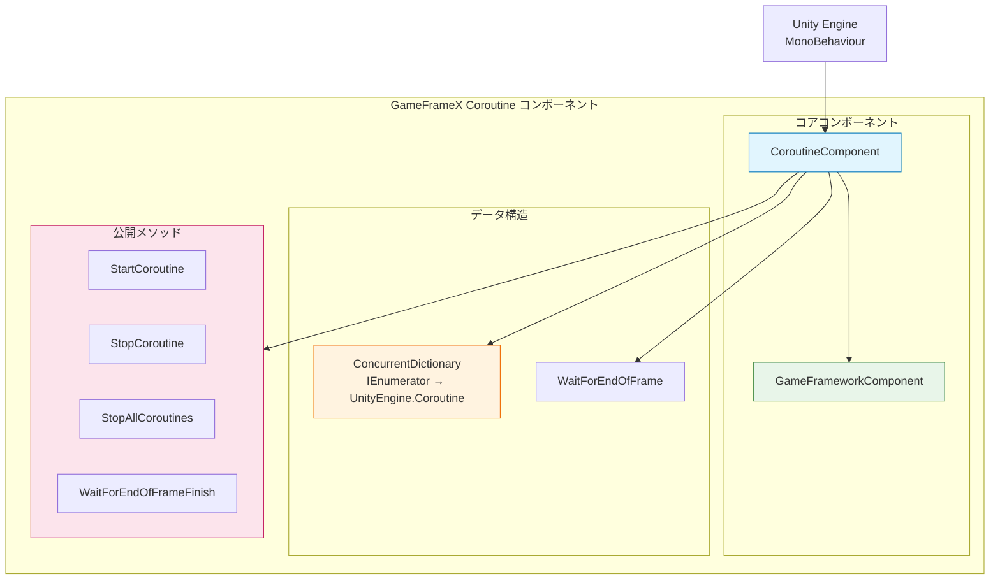
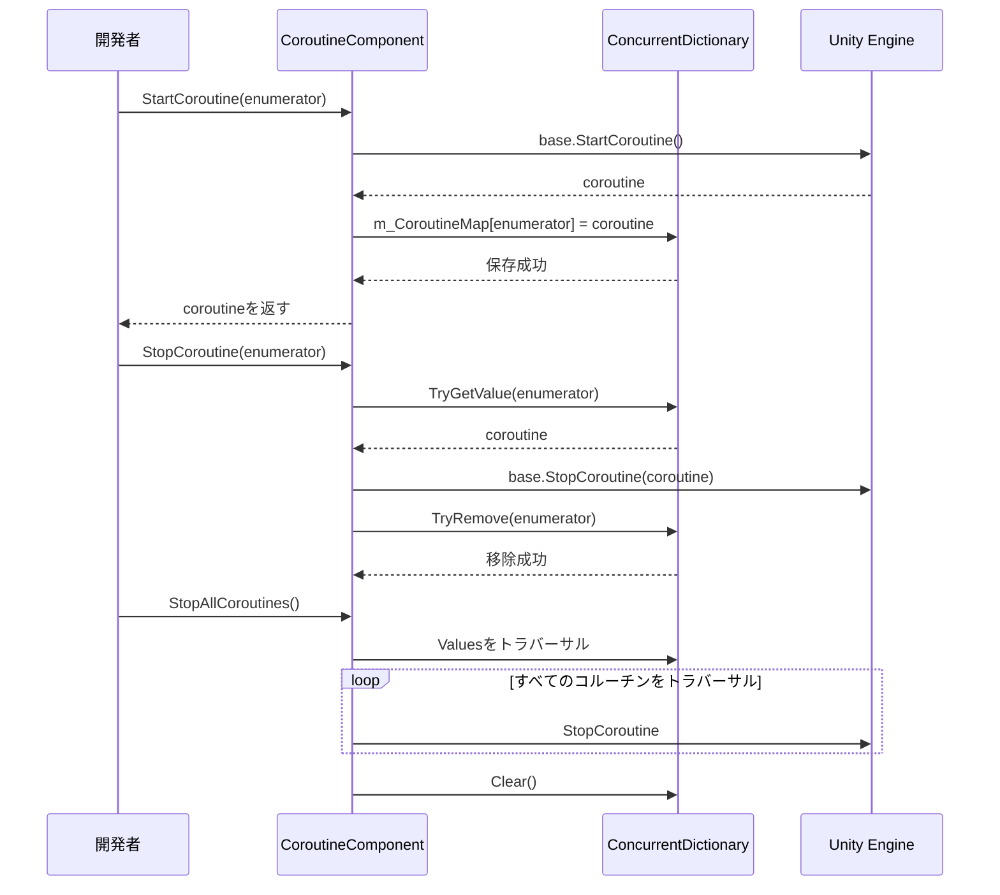

# プラグイン紹介

GameFrameX Coroutine コルは、Unity 拡張コンポーネントであり、强化されたコルーチン管理機能を提供します。ConcurrentDictionaryを使用して実行中のコルを追跡することで、コルの起動、停止、清理により良い制御とアクセスを提供します。

## 概要

**CoroutineComponent** は、GameFrameX ゲーム開発フレームワークのコアコンポーネントの1つであり、Unity コルーチンの管理与実行专门とします。このコンポーネントはUnityの内蔵コルーチン管理機能を拡張しネイティブコルーチン管理の中の一部の 问题を解決します。

### 解决的问题

Unity 開発において、ネイティブコルーチン管理には以下の問題があります：

1. **追跡困難**: 启动済みコルーチンの状態を取得するのが難しい
2. **停止が複雑**: `IEnumerator` を使用してコルーチンを停止するのは直感的でない
3. **メモリリークリスク**: コルーチンが正しく停止されない場合、メモリリークが発生する可能性がある
4. **一括管理不可**: すべてのコルーチンを便利に停止することができない

### コア機能

| 機能 | 説明 |
|------|------|
| コルーチン追跡 | `ConcurrentDictionary` を使用してすべての启动済みコルーチンを記録 |
| 安全停止 | イテレータとコルーチンオブジェクトの2つの方法で停止をサポート |
| 一括管理 | すべてのコルーチンを停止する機能を提供 |
| フレーム終了コールバック | 現在のフレームレンダリング完了後にコールバックを実行する便捷な方法を提供 |
| シングルトン制限 | `[DisallowMultipleComponent]` を使用して重複追加を防止 |

## アーキテクチャ



### コンポーネント構造説明

**CoroutineComponent** は `GameFrameworkComponent` を継承し、GameFrameX フレームワークのコア機能を統合しています。コンポーネント内部では `ConcurrentDictionary` を维持し、ユーザーが渡した `IEnumerator` と Unity 内部の `Coroutine` オブジェクトをマッピングすることで、より便捷なコルーチン管理を実現します。

### コアファイル

| ファイル | パス | 説明 |
|------|------|------|
| CoroutineComponent.cs | Runtime/Coroutine/ | メインコンポーネント実装 |
| CoroutineComponentInspector.cs | Editor/Inspector/ | Unity エディターインスペクター |
| GameFrameXCoroutineCroppingHelper.cs | Runtime/ | IL2CPP コード保持ヘルパー类 |

## コア機能

### 1. コルーチンの起動

`StartCoroutine` メソッドは Unity MonoBehaviour の同名メソッドをオーバーライドし、コルーチンを起動すると同時に内部辞書に記録します：

```csharp
public new UnityEngine.Coroutine StartCoroutine(IEnumerator enumerator)
{
    var ret = base.StartCoroutine(enumerator);
    m_CoroutineMap[enumerator] = ret;
    return ret;
}
```

> Source: [CoroutineComponent.cs](https://github.com/GameFrameX/com.gameframex.unity.coroutine/blob/main/Runtime/Coroutine/CoroutineComponent.cs#L25-L30)

**設計意図**: 起動時にマッピング関係を保存することで、後で `IEnumerator` を通じて特定のコルーチンを正確に停止でき、ネイティブ Unity Coroutine API では IEnumerator を通じて停止できない問題を解決しました。

### 2. コルーチンの停止

コンポーネントは2つの方法でコルーチンを停止する方法を提供します：

**IEnumerator を通じて停止**:
```csharp
public new void StopCoroutine(IEnumerator enumerator)
{
    if (m_CoroutineMap.TryGetValue(enumerator, out var coroutine))
    {
        base.StopCoroutine(coroutine);
        m_CoroutineMap.TryRemove(enumerator, out _);
    }
    base.StopCoroutine(enumerator);
}
```

> Source: [CoroutineComponent.cs](https://github.com/GameFrameX/com.gameframex.unity.coroutine/blob/main/Runtime/Coroutine/CoroutineComponent.cs#L36-L45)

**UnityEngine.Coroutine を通じて停止**:
```csharp
public new void StopCoroutine(UnityEngine.Coroutine coroutine)
{
    base.StopCoroutine(coroutine);
    foreach (var item in m_CoroutineMap)
    {
        if (item.Value == coroutine)
        {
            m_CoroutineMap.TryRemove(item.Key, out _);
            break;
        }
    }
}
```

> Source: [CoroutineComponent.cs](https://github.com/GameFrameX/com.gameframex.unity.coroutine/blob/main/Runtime/Coroutine/CoroutineComponent.cs#L51-L62)

**設計意図**: 柔軟な停止方法を提供し、開発者は持っている参照タイプ（IEnumerator または Coroutine）に基づいて適切な停止方法を選択できます。

### 3. すべてのコルーチンの停止

```csharp
public new void StopAllCoroutines()
{
    foreach (var coroutine in m_CoroutineMap.Values)
    {
        base.StopCoroutine(coroutine);
    }
    m_CoroutineMap.Clear();
    base.StopAllCoroutines();
}
```

> Source: [CoroutineComponent.cs](https://github.com/GameFrameX/com.gameframex.unity.coroutine/blob/main/Runtime/Coroutine/CoroutineComponent.cs#L67-L76)

**設計意図**: シーン切り替えまたはオブジェクト破棄時に、すべてのコルーチンがクリーンに停止されることを確保し、メモリリークとダングリングポインタの問題を防ぎます。

### 4. フレーム終了コールバック

```csharp
public void WaitForEndOfFrameFinish(System.Action callback)
{
    StartCoroutine(_WaitForEndOfFrameFinish(callback));
}
```

> Source: [CoroutineComponent.cs](https://github.com/GameFrameX/com.gameframex.unity.coroutine/blob/main/Runtime/Coroutine/CoroutineComponent.cs#L94-L97)

**設計意図**: 現在のフレームのレンダリング完了後にコールバックを実行する便捷な方法を提供します。これは、UI 更新完了後に计算を実行する必要があるシナリオに特に便利です。

## コルーチン管理フロー



## 使用例

### 基本使用

```csharp
IEnumerator YourCoroutine()
{
    // コルーチン実行の内容
    yield return null;
}

// コンポーネントをゲームオブジェクトに追加
CoroutineComponent coroutineComponent = gameObject.AddComponent<CoroutineComponent>();

// コルーチンを起動
coroutineComponent.StartCoroutine(YourCoroutine());

// コルーチンを停止
coroutineComponent.StopCoroutine(YourCoroutine());
```

> Source: [README.md](https://github.com/GameFrameX/com.gameframex.unity.coroutine/blob/main/README.md#L29-L42)

### フレーム終了コールバック

```csharp
void YourCallback()
{
    // コールバック実行の内容
}

coroutineComponent.WaitForEndOfFrameFinish(YourCallback);
```

> Source: [README.md](https://github.com/GameFrameX/com.gameframex.unity.coroutine/blob/main/README.md#L59-L70)

## 注意事項

1. **シングルトン制限**: コンポーネントは `[DisallowMultipleComponent]` 属性を使用しており、各 GameObject には1つの CoroutineComponent インスタンスのみを追加できます。

2. **自動登録**: `Awake` メソッドで `IsAutoRegister = false` を設定し、このコンポーネントがフレームワークのコアシステムに自動登録されないことを示します。

3. **コード保持**: `GameFrameXCoroutineCroppingHelper` クラスは、IL2CPP ビルド時に CoroutineComponent がコードクロッピングで削除されないことを確保するために使用されます。

## 関連リンク

- [インストール](../2-installation.index)
- [使用ガイド](../3-getting-started.index)
- [API リファレンス](./4-api-reference.coroutine-component)
- [FAQ](../5-troubleshooting.index)
- [GitHub リポジトリ](https://github.com/GameFrameX/com.gameframex.unity.coroutine.git)
- [GameFrameX 公式サイト](https://gameframex.doc.alianblank.com)
