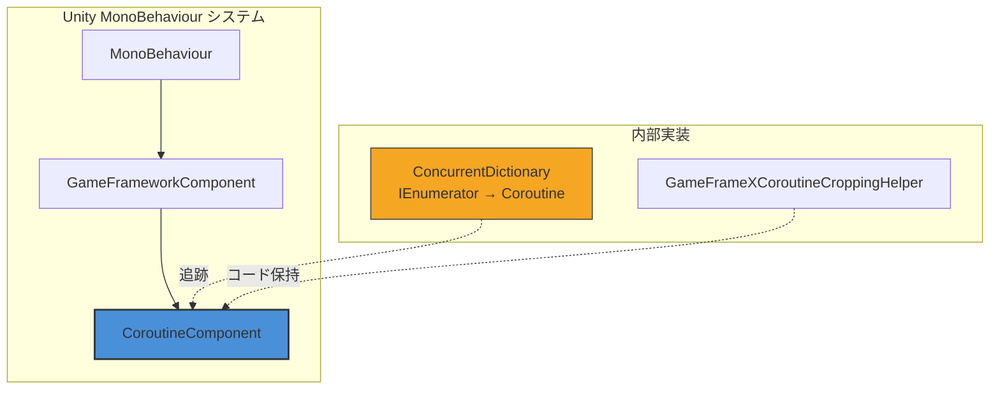

# CoroutineComponent

コルーチンコンポーネント（CoroutineComponent）は GameFrameX フレームワークのコアコンポーネントの1つであり、Unity 内蔵コルーチン管理機能を拡張した接口を提供します。ConcurrentDictionary を使用して実行中のコルーチンを追跡することで、コルーチンの停止と清理により良い制御を提供します。

## 概要

`CoroutineComponent` は Unity `MonoBehaviour` コンポーネントであり、`GameFrameworkComponent` を継承しています。Unity ネイティブコルーチン機能を封装し、コルーチンの追跡与管理能力を добавляет，帮助开发者更方便地控制コルーチンのライフサイクル，防止因未正确停止コルーチン导致的内存泄漏问题。

### コア機能

- **コルーチン追跡**：スレッドセーフにすべての启动済みコルーチンを追跡するために `ConcurrentDictionary` を使用
- **柔軟な停止**：イテレータまたはコルーチンオブジェクトを通じて单个コルーチンを停止することをサポート
- **一括管理**：すべてのコルーチンをワンクリックで停止する機能を提供
- **フレーム終了コールバック**：現在のフレームレンダリング完了後にコールバックを実行する便捷な方法を提供

## アーキテクチャ



### コンポーネントレイヤー

- **MonoBehaviour**：Unity コンポーネントベースクラス
- **GameFrameworkComponent**：GameFrameX フレームワークコンポーネントベースクラス
- **CoroutineComponent**：コルーチン管理コンポーネント（現在のドキュメントテーマ）

### コアデータ構造

`CoroutineComponent` は `ConcurrentDictionary<IEnumerator, UnityEngine.Coroutine>` を使用してコルーチンマッピングテーブルを維持します：

```csharp
private readonly ConcurrentDictionary<IEnumerator, UnityEngine.Coroutine> m_CoroutineMap = new ConcurrentDictionary<IEnumerator, UnityEngine.Coroutine>();
```

> Source: [CoroutineComponent.cs](https://github.com/GameFrameX/com.gameframex.unity.coroutine/blob/main/Runtime/Coroutine/CoroutineComponent.cs#L18)

## コア機能

### コルーチンの起動

`StartCoroutine` メソッドは Unity ベースクラス実装をオーバーライドし、コルーチンを起動するだけでなく、内部追跡辞書に追加します：

```csharp
public new UnityEngine.Coroutine StartCoroutine(IEnumerator enumerator)
{
    var ret = base.StartCoroutine(enumerator);
    m_CoroutineMap[enumerator] = ret;
    return ret;
}
```

> Source: [CoroutineComponent.cs](https://github.com/GameFrameX/com.gameframex.unity.coroutine/blob/main/Runtime/Coroutine/CoroutineComponent.cs#L25-L30)

**設計意図**：各イテレータ与其対応コルーチンのマッピング関係を追跡することで、正確なコルーチン停止制御を実現します。

### コルーチンの停止

コンポーネントは2つの方法でコルーチンを停止する方法を提供します：

**方法1：イテレータを通じて停止**

```csharp
public new void StopCoroutine(IEnumerator enumerator)
{
    if (m_CoroutineMap.TryGetValue(enumerator, out var coroutine))
    {
        base.StopCoroutine(coroutine);
        m_CoroutineMap.TryRemove(enumerator, out _);
    }
    base.StopCoroutine(enumerator);
}
```

> Source: [CoroutineComponent.cs](https://github.com/GameFrameX/com.gameframex.unity.coroutine/blob/main/Runtime/Coroutine/CoroutineComponent.cs#L36-L45)

**方法2：コルーチンオブジェクトを通じて停止**

```csharp
public new void StopCoroutine(UnityEngine.Coroutine coroutine)
{
    base.StopCoroutine(coroutine);
    foreach (var item in m_CoroutineMap)
    {
        if (item.Value == coroutine)
        {
            m_CoroutineMap.TryRemove(item.Key, out _);
            break;
        }
    }
}
```

> Source: [CoroutineComponent.cs](https://github.com/GameFrameX/com.gameframex.unity.coroutine/blob/main/Runtime/Coroutine/CoroutineComponent.cs#L51-L62)

### すべてのコルーチンの停止

```csharp
public new void StopAllCoroutines()
{
    foreach (var coroutine in m_CoroutineMap.Values)
    {
        base.StopCoroutine(coroutine);
    }
    m_CoroutineMap.Clear();
    base.StopAllCoroutines();
}
```

> Source: [CoroutineComponent.cs](https://github.com/GameFrameX/com.gameframex.unity.coroutine/blob/main/Runtime/Coroutine/CoroutineComponent.cs#L67-L76)

**設計意図**：すべてのコルーチンが正しく停止され、内部追跡データが清理されることを確保し、メモリリークを防ぎます。

### フレーム終了コールバック

`WaitForEndOfFrameFinish` メソッドは、現在のフレームレンダリング完了後にコールバックを実行することを許可します：

```csharp
private readonly WaitForEndOfFrame _waitForEndOfFrame = new WaitForEndOfFrame();

public void WaitForEndOfFrameFinish(System.Action callback)
{
    StartCoroutine(_WaitForEndOfFrameFinish(callback));
}
```

> Source: [CoroutineComponent.cs](https://github.com/GameFrameX/com.gameframex.unity.coroutine/blob/main/Runtime/Coroutine/CoroutineComponent.cs#L78-L97)

**設計意図**：フレーム終了コールバック機能を便捷に提供し、フレームレンダリングフロー全体が完了 후에実行する必要がある操作に经常使用されます，例如は UI 更新後のデータ同期。

## 使用例

### 基本使用

```csharp
using GameFrameX.Coroutine.Runtime;
using UnityEngine;
using System.Collections;

public class CoroutineExample : MonoBehaviour
{
    private CoroutineComponent _coroutineComponent;

    private void Start()
    {
        // CoroutineComponent を取得または追加
        _coroutineComponent = gameObject.GetComponent<CoroutineComponent>();
        if (_coroutineComponent == null)
        {
            _coroutineComponent = gameObject.AddComponent<CoroutineComponent>();
        }

        // コルーチンを起動
        IEnumerator myCoroutine = MyCoroutine();
        _coroutineComponent.StartCoroutine(myCoroutine);
    }

    private IEnumerator MyCoroutine()
    {
        Debug.Log("コルーチン開始");
        yield return new WaitForSeconds(1f);
        Debug.Log("1秒後继续実行");
        yield return null;
        Debug.Log("次のフレーム继续実行");
    }
}
```

### コルーチン停止例

```csharp
using GameFrameX.Coroutine.Runtime;
using UnityEngine;
using System.Collections;

public class StopCoroutineExample : MonoBehaviour
{
    private CoroutineComponent _coroutineComponent;
    private IEnumerator _runningCoroutine;

    private void Start()
    {
        _coroutineComponent = gameObject.AddComponent<CoroutineComponent>();
        
        // コルーチンを起動して参照を保存
        _runningCoroutine = LongRunningCoroutine();
        _coroutineComponent.StartCoroutine(_runningCoroutine);
        
        // 5秒後に自動停止
        Invoke("StopMyCoroutine", 5f);
    }

    private IEnumerator LongRunningCoroutine()
    {
        int count = 0;
        while (true)
        {
            Debug.Log($"実行中: {count++}");
            yield return new WaitForSeconds(1f);
        }
    }

    private void StopMyCoroutine()
    {
        // イテレータを通じてコルーチンを停止
        if (_runningCoroutine != null)
        {
            _coroutineComponent.StopCoroutine(_runningCoroutine);
        }
    }
}
```

### フレーム終了コールバック例

```csharp
using GameFrameX.Coroutine.Runtime;
using UnityEngine;
using UnityEngine.UI;

public class FrameEndCallbackExample : MonoBehaviour
{
    public Text statusText;
    private CoroutineComponent _coroutineComponent;

    private void Start()
    {
        _coroutineComponent = gameObject.AddComponent<CoroutineComponent>();
        
        // フレーム終了後 UI を更新
        _coroutineComponent.WaitForEndOfFrameFinish(() =>
        {
            statusText.text = "UI 更新済み";
        });
    }
}
```

## API リファレンス

### プロパティ

| プロパティ | タイプ | 説明 |
|------|------|------|
| m_CoroutineMap | `ConcurrentDictionary<IEnumerator, UnityEngine.Coroutine>` | すべてのアクティブコルーチンを存储するマッピングテーブル |

### メソッド

### `StartCoroutine(IEnumerator enumerator): UnityEngine.Coroutine`

コルーチンを起動して追跡テーブルに追加します。

**パラメータ：**
- `enumerator` (IEnumerator): コルーチンイテレータ

**返り値：** UnityEngine.Coroutine - 起動されたコルーチンオブジェクト

**例：**
```csharp
IEnumerator coroutine = MyRoutine();
UnityEngine.Coroutine running = coroutineComponent.StartCoroutine(coroutine);
```

---

### `StopCoroutine(IEnumerator enumerator): void`

イテレータ参照を通じてコルーチンを停止します。

**パラメータ：**
- `enumerator` (IEnumerator): 停止するコルーチンイテレータ

**説明：** このメソッドは追跡テーブルからコルーチン参照も同時に移除し、完全な清理を確保します。

**例：**
```csharp
IEnumerator myCoroutine = MyRoutine();
coroutineComponent.StartCoroutine(myCoroutine);
// ... しばらく後
coroutineComponent.StopCoroutine(myCoroutine);
```

---

### `StopCoroutine(UnityEngine.Coroutine coroutine): void`

コルーチンオブジェクトを通じてコルーチンを停止します。

**パラメータ：**
- `coroutine` (UnityEngine.Coroutine): 停止するコルーチンオブジェクト

**説明：** コルーチンが追跡テーブルに存在する場合、マッピング関係も同期して清理されます。

**例：**
```csharp
var running = coroutineComponent.StartCoroutine(MyRoutine());
coroutineComponent.StopCoroutine(running);
```

---

### `StopAllCoroutines(): void`

このコンポーネントが起動したすべてのコルーチンを停止します。

**説明：** このメソッドは追跡中のすべてのコルーチンをトラバーサルして停止し、同時に内部追跡テーブルをクリアします。

**例：**
```csharp
// シーン切り替え時にすべてのコルーチンを清理
coroutineComponent.StopAllCoroutines();
```

---

### `WaitForEndOfFrameFinish(System.Action callback): void`

現在のフレームレンダリング完了後にコールバックを実行します。

**パラメータ：**
- `callback` (System.Action): 実行するコールバックメソッド

**説明：** 内部で `WaitForEndOfFrame` を使用して実装され、整个レンダリングフロー完了後に実行する必要がある操作に经常使用されます。

**例：**
```csharp
coroutineComponent.WaitForEndOfFrameFinish(() =>
{
    Debug.Log("現在のフレームのレンダリング完了");
});
```

---

## コンポーネント設定

### Unity エディター設定

`CoroutineComponent` は Unity エディターで以下の特性があります：

| 特性 | 値 | 説明 |
|------|------|------|
| メニューパス | Game Framework/Coroutine | コンポーネント追加時のメニュース位置 |
| 重複許可 | いいえ | `[DisallowMultipleComponent]` で制限 |
| 自動登録 | いいえ | `IsAutoRegister = false`、手動追加が必要 |

### コード保持（IL2CPP）

IL2CPP コードクロッピングによってコンポーネントが削除されるのを防ぐため、フレームワークは `GameFrameXCoroutineCroppingHelper` ヘルパークラスを提供します：

```csharp
[Preserve]
public class GameFrameXCoroutineCroppingHelper : MonoBehaviour
{
    [Preserve]
    private void Start()
    {
        _ = typeof(CoroutineComponent);
    }
}
```

> Source: [GameFrameXCoroutineCroppingHelper.cs](https://github.com/GameFrameX/com.gameframex.unity.coroutine/blob/main/Runtime/GameFrameXCoroutineCroppingHelper.cs#L7-L14)

**設計意図**： `CoroutineComponent` 型を参照することで、IL2CPP ビルド時にこの型がコードクロッピングで削除されないことを確保します。

## 関連リンク

- [プラグイン紹介](../1-overview.index)
- [インストール](../2-installation.index)
- [使用ガイド](../3-getting-started.index)
- [トラブルシューティング](../5-troubleshooting.index)
- [GitHub リポジトリ](https://github.com/GameFrameX/com.gameframex.unity.coroutine.git)
