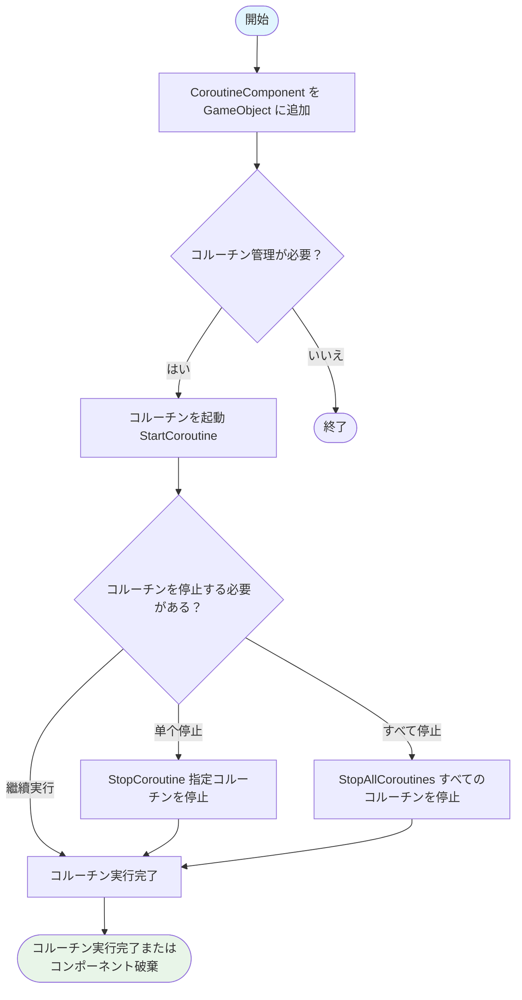
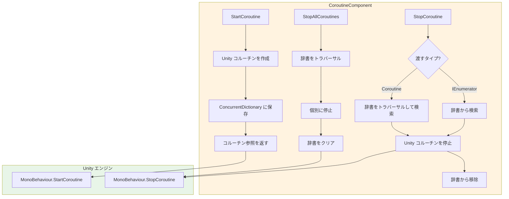

# 使用ガイド

本ガイドでは、CoroutineComponent コルーチンコンポーネントを快速に使い始める方法を説明します。Unity プロジェクト内でコルーチンを管理与制御するコアメソッド掌握を目指します。

## 概要

CoroutineComponent は GameFrameX フレームワーク提供するコルーチン管理コンポーネントであり、Unity 内蔵コルーチン機能を拡張しています。このコンポーネントは ConcurrentDictionary を通じてすべての启动済みコルーチンを追跡し、より精细なライフサイクル制御能力を提供し、開発者がコルーチンリークと管理混乱の問題を避けるのを助けます。

**なぜ CoroutineComponent を使用するのですか？**

大規模な Unity プロジェクトでは、コルーチン管理はメンテナンスの难点 часто 成为します。シーン切り替えまたはオブジェクト破棄時に、正しく停止されていないコルーチンはメモリリーク、ロジックエラー、甚至はクラッシュを引き起こす可能性があります。CoroutineComponent は统一されたコルーチン管理接口を提供し、コルーチンの起動、停止、追跡を简单かつ制御可能にします。

## コア機能概要

| 機能 | 説明 |
|------|------|
| コルーチン起動 | イテレータを使用してコルーチンを起動し、自动追跡 |
| 单个コルーチン停止 | イテレータ参照またはコルーチンオブジェクトを通じて停止 |
| すべてのコルーチン停止 | ワンクリックで実行中のすべてのコルーチンを清理 |
| フレーム終了コールバック | 現在のフレームレンダリング完了後にコールバックを実行 |

## ワークフロー

以下のフロー図は CoroutineComponent の典型的な使用フローを示しています：



## 基本使用

### 手順1：コンポーネントをシーンに追加

Unity エディターでは、以下の方法で CoroutineComponent を追加できます：

1. Hierarchy パネルでゲームオブジェクトを右クリック
2. **Game Framework → Coroutine** メニュー項目を選択
3. コンポーネントが選択したゲームオブジェクトに追加されます

> **注意**：`[DisallowMultipleComponent]` 属性を使用しているため、各ゲームオブジェクトには1つの CoroutineComponent のみを追加できます。

### 手順2：コードで使用

スクリプトでコンポーネントインスタンスを取得してコルーチン機能を使用します：

```csharp
using System.Collections;
using GameFrameX.Coroutine.Runtime;
using UnityEngine;

public class Example : MonoBehaviour
{
    private CoroutineComponent _coroutineComponent;

    private void Start()
    {
        // CoroutineComponent を取得または追加
        _coroutineComponent = gameObject.GetComponent<CoroutineComponent>();
        if (_coroutineComponent == null)
        {
            _coroutineComponent = gameObject.AddComponent<CoroutineComponent>();
        }
    }
}
```
> Source: [CoroutineComponent.cs](https://github.com/GameFrameX/com.gameframex.unity.coroutine/blob/main/Runtime/Coroutine/CoroutineComponent.cs#L25-L30)

## 使用例

### 例1：コルーチンの起動と停止

以下の例は、コルーチンを起動し、特定の条件下で停止する方法を示しています：

```csharp
using System.Collections;
using GameFrameX.Coroutine.Runtime;
using UnityEngine;

public class CoroutineExample : MonoBehaviour
{
    private CoroutineComponent _coroutineComponent;
    private IEnumerator _runningCoroutine;

    private void Start()
    {
        _coroutineComponent = gameObject.AddComponent<CoroutineComponent>();
        
        // コルーチンを起動して参照を保存
        _runningCoroutine = MyProcessCoroutine();
        _coroutineComponent.StartCoroutine(_runningCoroutine);
    }

    private IEnumerator MyProcessCoroutine()
    {
        while (true)
        {
            Debug.Log("コルーチン実行中...");
            yield return null;
        }
    }

    private void OnDestroy()
    {
        // オブジェクト破棄時にコルーチンを停止することを確保
        if (_runningCoroutine != null)
        {
            _coroutineComponent.StopCoroutine(_runningCoroutine);
        }
    }
}
```
> Sources:
> - [CoroutineComponent.cs](https://github.com/GameFrameX/com.gameframex.unity.coroutine/blob/main/Runtime/Coroutine/CoroutineComponent.cs#L25-L30)
> - [CoroutineComponent.cs](https://github.com/GameFrameX/com.gameframex.unity.coroutine/blob/main/Runtime/Coroutine/CoroutineComponent.cs#L36-L45)

### 例2：すべてのコルーチンを停止

すべての実行中のコルーチンを清理する必要がある場合（例：シーン切り替え時）：

```csharp
using System.Collections;
using GameFrameX.Coroutine.Runtime;
using UnityEngine;

public class CleanupExample : MonoBehaviour
{
    private CoroutineComponent _coroutineComponent;

    private void Start()
    {
        _coroutineComponent = gameObject.AddComponent<CoroutineComponent>();
        
        // 複数のコルーチンを起動
        _coroutineComponent.StartCoroutine(TaskA());
        _coroutineComponent.StartCoroutine(TaskB());
        _coroutineComponent.StartCoroutine(TaskC());
    }

    private IEnumerator TaskA()
    {
        for (int i = 0; i < 10; i++)
        {
            Debug.Log("Task A: " + i);
            yield return null;
        }
    }

    private IEnumerator TaskB()
    {
        for (int i = 0; i < 10; i++)
        {
            Debug.Log("Task B: " + i);
            yield return null;
        }
    }

    private IEnumerator TaskC()
    {
        for (int i = 0; i < 10; i++)
        {
            Debug.Log("Task C: " + i);
            yield return null;
        }
    }

    public void OnSceneChange()
    {
        // すべてのコルーチンを停止
        _coroutineComponent.StopAllCoroutines();
        Debug.Log("すべてのコルーチンを停止しました");
    }
}
```
> Source: [CoroutineComponent.cs](https://github.com/GameFrameX/com.gameframex.unity.coroutine/blob/main/Runtime/Coroutine/CoroutineComponent.cs#L67-L76)

### 例3：フレーム終了コールバック

`WaitForEndOfFrameFinish` を使用してフレームレンダリング完了後に操作を実行します。スクリーンショット取得や UI 更新などのシナリオに適しています：

```csharp
using GameFrameX.Coroutine.Runtime;
using UnityEngine;

public class EndOfFrameExample : MonoBehaviour
{
    private CoroutineComponent _coroutineComponent;

    private void Start()
    {
        _coroutineComponent = gameObject.AddComponent<CoroutineComponent>();
    }

    private void OnGUI()
    {
        if (GUI.Button(new Rect(10, 10, 200, 50), "スクリーンショットを撮る"))
        {
            CaptureScreenshot();
        }
    }

    private void CaptureScreenshot()
    {
        // フレーム終了後スクリーンショットを実行
        _coroutineComponent.WaitForEndOfFrameFinish(() =>
        {
            ScreenCapture.CaptureScreenshot("screenshot.png");
            Debug.Log("スクリーンショット保存済み");
        });
    }
}
```
> Source: [CoroutineComponent.cs](https://github.com/GameFrameX/com.gameframex.unity.coroutine/blob/main/Runtime/Coroutine/CoroutineComponent.cs#L94-L97)

### 例4：コルーチンオブジェクトを通じて停止

Unity の Coroutine オブジェクト参照だけを保持している場合も、直接停止できます：

```csharp
using System.Collections;
using GameFrameX.Coroutine.Runtime;
using UnityEngine;

public class StopByCoroutineExample : MonoBehaviour
{
    private CoroutineComponent _coroutineComponent;
    private UnityEngine.Coroutine _unityCoroutine;

    private void Start()
    {
        _coroutineComponent = gameObject.AddComponent<CoroutineComponent>();
        
        // コルーチンを起動
        _unityCoroutine = _coroutineComponent.StartCoroutine(LongRunningTask());
    }

    private IEnumerator LongRunningTask()
    {
        Debug.Log("タスク開始");
        yield return new WaitForSeconds(5f);
        Debug.Log("タスク完了");
    }

    private void Update()
    {
        // スペースキーを押してコルーチンを停止
        if (Input.GetKeyDown(KeyCode.Space))
        {
            if (_unityCoroutine != null)
            {
                _coroutineComponent.StopCoroutine(_unityCoroutine);
                Debug.Log("コルーチン停止済み");
            }
        }
    }
}
```
> Source: [CoroutineComponent.cs](https://github.com/GameFrameX/com.gameframex.unity.coroutine/blob/main/Runtime/Coroutine/CoroutineComponent.cs#L51-L62)

## 内部実装メカニズム

コンポーネントの内部実装を理解することは、それをよりよく使用するのに役立ちます：



コンポーネントは `ConcurrentDictionary<IEnumerator, UnityEngine.Coroutine>` を使用してコルーチンマッピングテーブルを維持します。この設計は以下を確保します：
- **スレッドセーフ**：マルチスレッド環境での 안전한 アクセス
- **双向追跡**：イテレータまたはコルーチンオブジェクトを通じて停止可能
- **自動清理**：コルーチン停止時に辞書から自動的に移除

## ベストプラクティス

### 1. OnDestroy でコルーチンを清理

MonoBehaviour の `OnDestroy` ライフサイクルメソッドで 항상 コ战中停止し、メモリリークを防ぎます：

```csharp
private void OnDestroy()
{
    // 方法1：すべてのコルーチンを停止
    _coroutineComponent.StopAllCoroutines();
    
    // 方法2：特定のコルーチンを停止
    // _coroutineComponent.StopCoroutine(_myCoroutine);
}
```

### 2. コルーチンの重複起動を避ける

コルーチンを起動する前に、既に実行中でかどうかを確認します：

```csharp
private bool _isCoroutineRunning = false;

private void TryStartCoroutine()
{
    if (!_isCoroutineRunning)
    {
        _isCoroutineRunning = true;
        _coroutineComponent.StartCoroutine(MyCoroutine());
    }
}

private IEnumerator MyCoroutine()
{
    try
    {
        yield return null;
    }
    finally
    {
        _isCoroutineRunning = false;
    }
}
```

### 3. シーン切り替え時の清理

シーン切り替え前にすべてのコルーチンを停止し、清潔な过渡を確保します：

```csharp
// シーンマネージャーの切り替えロジックで呼び出す
public void ChangeScene(string sceneName)
{
    // すべてのコルーチンを停止
    _coroutineComponent.StopAllCoroutines();
    
    // 新しいシーンを読み込み
    SceneManager.LoadScene(sceneName);
}
```

## 関連リンク

- [プラグイン紹介](../1-overview.index) - CoroutineComponent の完全な機能と設計理念を理解する
- [インストール](../2-installation.index) - 詳細なインストール手順と依存関係設定
- [API リファレンス](../4-api-reference.coroutine-component) - 完全な API メソッドシグネチャとパラメータ説明
- [トラブルシューティング](../5-troubleshooting.index) - よくある質問と解決策

## コード例参考

本ガイドのコード例は次のソースファイルに基づいています：

- [CoroutineComponent.cs](https://github.com/GameFrameX/com.gameframex.unity.coroutine/blob/main/Runtime/Coroutine/CoroutineComponent.cs) - コアコルーチンコンポーネント実装
- [CoroutineComponentInspector.cs](https://github.com/GameFrameX/com.gameframex.unity.coroutine/blob/main/Editor/Inspector/CoroutineComponentInspector.cs) - Unity エディターインスペクターウィンドウ
