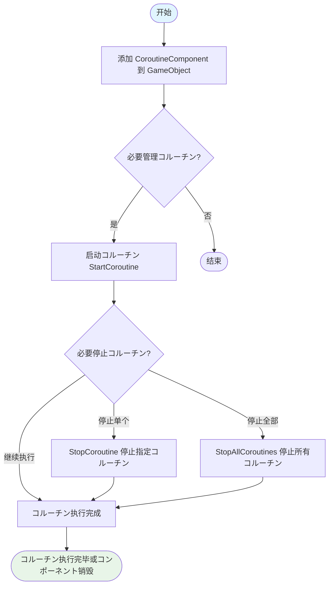
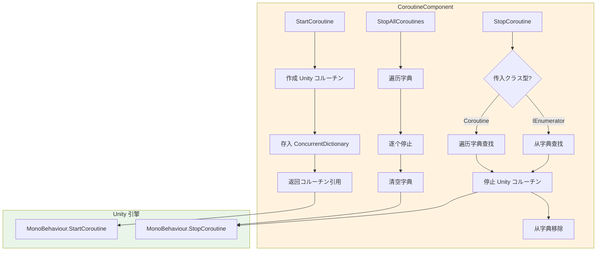

# 使用ガイド

本指南将帮助您快速上手使用 CoroutineComponent コルーチンコンポーネント，掌握在 Unity プロジェクト中管理和控制コルーチン的コアメソッド。

## 概要

CoroutineComponent 是 GameFrameX フレームワーク提供的コルーチン管理コンポーネント，を拡張 Unity 内建的コルーチン機能。该コンポーネントを通じて并发字典（ConcurrentDictionary）追踪所有已启动的コルーチン，提供します更精细的生命周期控制能力，帮助開発者避免コルーチン泄漏和管理混乱的问题。

**为什么使用 CoroutineComponent？**

在大型 Unity プロジェクト中，コルーチン管理往往成为维护难点。当シーン切换或对象销毁时，未正确停止的コルーチン会导致内存泄漏、逻辑错误甚至崩溃。CoroutineComponent 提供します统一的コルーチン管理インターフェース，使得启动、停止、追踪コルーチン变得简单可控。

## コア機能概要

| 機能 | 説明 |
|------|------|
| 启动コルーチン | 使用迭代器启动コルーチン并自动追踪 |
| 停止单个コルーチン | を通じて迭代器引用或コルーチン对象停止 |
| 停止所有コルーチン | 一键清理所有正在运行的コルーチン |
| 帧结束回调 | 在当前帧渲染完成后执行回调 |

## 工作フロー

以下フロー图展示了 CoroutineComponent 的典型使用フロー：



## 基础使用

### 第一步：添加コンポーネント到シーン

在 Unity 编辑器中，您可能を通じて以下方法添加 CoroutineComponent：

1. 在 Hierarchy 面板中右键点击ゲーム对象
2. 选择 **Game Framework → Coroutine** 菜单项
3. コンポーネント将添加到選択的ゲーム对象上

> **注意**：由于使用了 `[DisallowMultipleComponent]` プロパティ，每个ゲーム对象只能添加一个 CoroutineComponent。

### 第二步：在代码中使用

在脚本中取得コンポーネントインスタンス并使用コルーチン機能：

```csharp
using System.Collections;
using GameFrameX.Coroutine.Runtime;
using UnityEngine;

public class Example : MonoBehaviour
{
    private CoroutineComponent _coroutineComponent;

    private void Start()
    {
        // 取得或添加 CoroutineComponent
        _coroutineComponent = gameObject.GetComponent<CoroutineComponent>();
        if (_coroutineComponent == null)
        {
            _coroutineComponent = gameObject.AddComponent<CoroutineComponent>();
        }
    }
}
```
> Source: [CoroutineComponent.cs](https://github.com/GameFrameX/com.gameframex.unity.coroutine/blob/main/Runtime/Coroutine/CoroutineComponent.cs#L25-L30)

## 使用例

### 例一：启动和停止コルーチン

以下示例展示了如何启动一个コルーチン，并在一定条件下停止它：

```csharp
using System.Collections;
using GameFrameX.Coroutine.Runtime;
using UnityEngine;

public class CoroutineExample : MonoBehaviour
{
    private CoroutineComponent _coroutineComponent;
    private IEnumerator _runningCoroutine;

    private void Start()
    {
        _coroutineComponent = gameObject.AddComponent<CoroutineComponent>();
        
        // 启动コルーチン并保存引用
        _runningCoroutine = MyProcessCoroutine();
        _coroutineComponent.StartCoroutine(_runningCoroutine);
    }

    private IEnumerator MyProcessCoroutine()
    {
        while (true)
        {
            Debug.Log("コルーチン正在执行...");
            yield return null;
        }
    }

    private void OnDestroy()
    {
        // 确保在对象销毁时停止コルーチン
        if (_runningCoroutine != null)
        {
            _coroutineComponent.StopCoroutine(_runningCoroutine);
        }
    }
}
```
> Sources:
> - [CoroutineComponent.cs](https://github.com/GameFrameX/com.gameframex.unity.coroutine/blob/main/Runtime/Coroutine/CoroutineComponent.cs#L25-L30)
> - [CoroutineComponent.cs](https://github.com/GameFrameX/com.gameframex.unity.coroutine/blob/main/Runtime/Coroutine/CoroutineComponent.cs#L36-L45)

### 例二：停止所有コルーチン

当必要清理所有正在运行的コルーチン时（例如シーン切换时）：

```csharp
using System.Collections;
using GameFrameX.Coroutine.Runtime;
using UnityEngine;

public class CleanupExample : MonoBehaviour
{
    private CoroutineComponent _coroutineComponent;

    private void Start()
    {
        _coroutineComponent = gameObject.AddComponent<CoroutineComponent>();
        
        // 启动多个コルーチン
        _coroutineComponent.StartCoroutine(TaskA());
        _coroutineComponent.StartCoroutine(TaskB());
        _coroutineComponent.StartCoroutine(TaskC());
    }

    private IEnumerator TaskA()
    {
        for (int i = 0; i < 10; i++)
        {
            Debug.Log("Task A: " + i);
            yield return null;
        }
    }

    private IEnumerator TaskB()
    {
        for (int i = 0; i < 10; i++)
        {
            Debug.Log("Task B: " + i);
            yield return null;
        }
    }

    private IEnumerator TaskC()
    {
        for (int i = 0; i < 10; i++)
        {
            Debug.Log("Task C: " + i);
            yield return null;
        }
    }

    public void OnSceneChange()
    {
        // 停止所有コルーチン
        _coroutineComponent.StopAllCoroutines();
        Debug.Log("已停止所有コルーチン");
    }
}
```
> Source: [CoroutineComponent.cs](https://github.com/GameFrameX/com.gameframex.unity.coroutine/blob/main/Runtime/Coroutine/CoroutineComponent.cs#L67-L76)

### 例三：帧结束回调

使用 `WaitForEndOfFrameFinish` 在帧渲染完成后执行操作，常に使用截图、UI 更新等シーン：

```csharp
using GameFrameX.Coroutine.Runtime;
using UnityEngine;

public class EndOfFrameExample : MonoBehaviour
{
    private CoroutineComponent _coroutineComponent;

    private void Start()
    {
        _coroutineComponent = gameObject.AddComponent<CoroutineComponent>();
    }

    private void OnGUI()
    {
        if (GUI.Button(new Rect(10, 10, 200, 50), "截取屏幕截图"))
        {
            CaptureScreenshot();
        }
    }

    private void CaptureScreenshot()
    {
        // 在帧结束后执行截图
        _coroutineComponent.WaitForEndOfFrameFinish(() =>
        {
            ScreenCapture.CaptureScreenshot("screenshot.png");
            Debug.Log("截图已保存");
        });
    }
}
```
> Source: [CoroutineComponent.cs](https://github.com/GameFrameX/com.gameframex.unity.coroutine/blob/main/Runtime/Coroutine/CoroutineComponent.cs#L94-L97)

### 例四：を通じてコルーチン对象停止

如果您只持有 Unity 的 Coroutine 对象引用，也可能直接停止：

```csharp
using System.Collections;
using GameFrameX.Coroutine.Runtime;
using UnityEngine;

public class StopByCoroutineExample : MonoBehaviour
{
    private CoroutineComponent _coroutineComponent;
    private UnityEngine.Coroutine _unityCoroutine;

    private void Start()
    {
        _coroutineComponent = gameObject.AddComponent<CoroutineComponent>();
        
        // 启动コルーチン
        _unityCoroutine = _coroutineComponent.StartCoroutine(LongRunningTask());
    }

    private IEnumerator LongRunningTask()
    {
        Debug.Log("任务开始");
        yield return new WaitForSeconds(5f);
        Debug.Log("任务完成");
    }

    private void Update()
    {
        // 按下空格键停止コルーチン
        if (Input.GetKeyDown(KeyCode.Space))
        {
            if (_unityCoroutine != null)
            {
                _coroutineComponent.StopCoroutine(_unityCoroutine);
                Debug.Log("コルーチン已停止");
            }
        }
    }
}
```
> Source: [CoroutineComponent.cs](https://github.com/GameFrameX/com.gameframex.unity.coroutine/blob/main/Runtime/Coroutine/CoroutineComponent.cs#L51-L62)

## 内部実装机制

理解コンポーネント的内部実装有助于更好地使用它：



コンポーネント使用 `ConcurrentDictionary<IEnumerator, UnityEngine.Coroutine>` 来维护コルーチン映射表。这种设计确保了：
- **线程安全**：在多线程环境下安全访问
- **双向追踪**：可能を通じて迭代器或コルーチン对象停止
- **自动清理**：停止コルーチン时自动从字典中移除

## 最佳实践

### 1. 在 OnDestroy 中清理コルーチン

始终在 MonoBehaviour 的 `OnDestroy` 生命周期メソッド中停止コルーチン，避免内存泄漏：

```csharp
private void OnDestroy()
{
    // 方法一：停止所有コルーチン
    _coroutineComponent.StopAllCoroutines();
    
    // 方法二：停止特定コルーチン
    // _coroutineComponent.StopCoroutine(_myCoroutine);
}
```

### 2. 避免重复启动コルーチン

在启动コルーチン前检查是否已经在运行：

```csharp
private bool _isCoroutineRunning = false;

private void TryStartCoroutine()
{
    if (!_isCoroutineRunning)
    {
        _isCoroutineRunning = true;
        _coroutineComponent.StartCoroutine(MyCoroutine());
    }
}

private IEnumerator MyCoroutine()
{
    try
    {
        yield return null;
    }
    finally
    {
        _isCoroutineRunning = false;
    }
}
```

### 3. シーン切换时的清理

在シーン切换前停止所有コルーチン，确保干净的过渡：

```csharp
// 在シーン管理器的切换逻辑中呼び出し
public void ChangeScene(string sceneName)
{
    // 停止所有コルーチン
    _coroutineComponent.StopAllCoroutines();
    
    // 加载新シーン
    SceneManager.LoadScene(sceneName);
}
```

## 関連リンク

- [插件介绍](./1-overview.index) - 了解 CoroutineComponent 的完整特性和设计理念
- [安装方法](./2-installation.index) - 详细安装手順和依赖配置
- [API 参考](./4-api-reference.coroutine-component) - 完整的 API メソッド签名和参数説明
- [常见问题](./5-troubleshooting.index) - 常见问题和解決策

## 代码示例参考

本指南中的代码示例基づく以下源ファイル：

- [CoroutineComponent.cs](https://github.com/GameFrameX/com.gameframex.unity.coroutine/blob/main/Runtime/Coroutine/CoroutineComponent.cs) - コアコルーチンコンポーネント実装
- [CoroutineComponentInspector.cs](https://github.com/GameFrameX/com.gameframex.unity.coroutine/blob/main/Editor/Inspector/CoroutineComponentInspector.cs) - Unity 编辑器检视窗口
