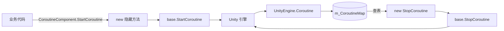

# 仕組み：コルーチン追跡とコンポーネントライフサイクル

`CoroutineComponent` は、ネイティブ Unity API の上に参照追跡レイヤーを重ねることで、「開始されたコルーチン」と「`IEnumerator` インスタンス」を一対一で対応させ、後続の処理で同じ `IEnumerator` 参照に基づいて正確に停止できるようにします。コンポーネント自体は `GameFrameworkComponent` として GameFrameX フレームワークのライフサイクルスケジューリングに参加します。

## コアメカニズム

### 1. ConcurrentDictionary による参照追跡

コンポーネント内部にスレッドセーフな辞書を保持し、key は `IEnumerator`、value は `UnityEngine.Coroutine` です。

```csharp
private readonly ConcurrentDictionary<IEnumerator, UnityEngine.Coroutine> m_CoroutineMap
    = new ConcurrentDictionary<IEnumerator, UnityEngine.Coroutine>();
```

出典: [CoroutineComponent.cs](https://github.com/GameFrameX/com.gameframex.unity.coroutine/blob/main/Runtime/Coroutine/CoroutineComponent.cs#L21)

`StartCoroutine` は `new` キーワードで基底クラスのメソッドを隠蔽し、まず `base.StartCoroutine` を呼び出し、返された `UnityEngine.Coroutine` を辞書に登録します:

```csharp
public new UnityEngine.Coroutine StartCoroutine(IEnumerator enumerator)
{
    var ret = base.StartCoroutine(enumerator);
    m_CoroutineMap[enumerator] = ret;
    return ret;
}
```

出典: [CoroutineComponent.cs](https://github.com/GameFrameX/com.gameframex.unity.coroutine/blob/main/Runtime/Coroutine/CoroutineComponent.cs#L28-L33)

### 2. `new` による基底メソッドの隠蔽で追跡入口を一意に保証

4 つの Start/Stop メソッドはすべて `new` キーワードで `MonoBehaviour` の基底メンバーのオーバーライドを行います。`CoroutineComponent` 参照経由ではなく呼び出した場合（例えば直接 `gameObject.GetComponent<MonoBehaviour>().StartCoroutine(...)` を呼び出すなど）、追跡辞書には書き込まれず、後続の `StopCoroutine` でヒットしません。

| メソッド | 動作 |
|------|------|
| `StartCoroutine(IEnumerator)` | 起動して `m_CoroutineMap` に保存 |
| `StopCoroutine(IEnumerator)` | 辞書を検索して `UnityEngine.Coroutine` を見つけ、`base.StopCoroutine` を呼び出す。見つからない場合は `base.StopCoroutine(enumerator)` にフォールバック |
| `StopCoroutine(UnityEngine.Coroutine)` | 直接 `base.StopCoroutine` を呼び出し、その後辞書を線形スキャンして対応するエントリを削除 |
| `StopAllCoroutines()` | まず辞書内のコルーチンを一つずつ停止し、辞書をクリアしてから `base.StopAllCoroutines()` を呼び出して追跡されていないコルーチンをフォールバック処理 |

出典: [CoroutineComponent.cs](https://github.com/GameFrameX/com.gameframex.unity.coroutine/blob/main/Runtime/Coroutine/CoroutineComponent.cs#L39-L82)

### 3. コンポーネントライフサイクルの統合

`CoroutineComponent` は `GameFrameworkComponent` を継承し、`[GameFrameXAutoComponent(-6500)]` 属性を持つため、フレームワークが優先順位に従って自動的にグローバルコンポーネントシステムに登録します。

```csharp
[DisallowMultipleComponent]
[AddComponentMenu("GameFrameX/Coroutine")]
[GameFrameXAutoComponent(-6500)]
public class CoroutineComponent : GameFrameworkComponent
```

出典: [CoroutineComponent.cs](https://github.com/GameFrameX/com.gameframex.unity.coroutine/blob/main/Runtime/Coroutine/CoroutineComponent.cs#L12-L15)

`Awake` で自動登録を明示的にオフにし、フレームワークの登録ロジックとの競合を回避しています:

```csharp
protected override void Awake()
{
    IsAutoRegister = false;
    base.Awake();
}
```

出典: [CoroutineComponent.cs](https://github.com/GameFrameX/com.gameframex.unity.coroutine/blob/main/Runtime/Coroutine/CoroutineComponent.cs#L106-L110)

### 4. フレーム末尾コールバックのラッパー化

コンポーネントは `WaitForEndOfFrameFinish` も提供しており、内部で再利用される `WaitForEndOfFrame` インスタンスを yield してからコールバックを起動します:

```csharp
private readonly WaitForEndOfFrame _waitForEndOfFrame = new WaitForEndOfFrame();

private IEnumerator WaitForEndOfFrameFinishInternal(System.Action callback)
{
    yield return _waitForEndOfFrame;
    callback?.Invoke();
}

public void WaitForEndOfFrameFinish(System.Action callback)
{
    StartCoroutine(WaitForEndOfFrameFinishInternal(callback));
}
```

出典: [CoroutineComponent.cs](https://github.com/GameFrameX/com.gameframex.unity.coroutine/blob/main/Runtime/Coroutine/CoroutineComponent.cs#L84-L104)

コルーチンがフレーム終了前に `StopCoroutine` または `StopAllCoroutines` で終了された場合、`callback` は実行されません。

### 5. IL2CPP リンク保護

`GameFrameXCoroutineCroppingHelper` は空の `MonoBehaviour` で、`Start` 内で `CoroutineComponent` 型を参照するだけです。目的は IL2CPP / クロップシナリオで `CoroutineComponent` を保持対象としてマークし、静的解析で誤って削除されないようにすることです:

```csharp
[Preserve]
public class GameFrameXCoroutineCroppingHelper : MonoBehaviour
{
    [Preserve]
    private void Start()
    {
        _ = typeof(CoroutineComponent);
    }
}
```

出典: [GameFrameXCoroutineCroppingHelper.cs](https://github.com/GameFrameX/com.gameframex.unity.coroutine/blob/main/Runtime/GameFrameXCoroutineCroppingHelper.cs#L1-L14)

## データフロー



## 呼び出しの制約

- `IEnumerator` は辞書の key として参照等価性を使用するため、`StopCoroutine` には `StartCoroutine` と完全に同じ `IEnumerator` インスタンスを渡す必要があります。そうでない場合は「見つからない」フォールバック分岐を辿ります。
- `StartCoroutine`/`StopCoroutine` は必ず `CoroutineComponent` 型の参照経由で呼び出す必要があります。基底クラス `MonoBehaviour` メソッドを直接呼び出しても追跡されません。
- 辞書は `ConcurrentDictionary` を使用しているため、`IEnumerator` を非メインスレッド上で構築する場合（タスクシステムで生成されたイテレータなど）でも、書き込みと参照はスレッドセーフです。ただし `UnityEngine.Coroutine` の実際の起動/停止は Unity のメインスレッド制約を受けます。

## 関連リンク

- コンポーネントが GameFrameX フレームワークに統合される方法については、`GameFrameworkComponent` と `[GameFrameXAutoComponent]` のソースを参照してください。
- Unity ネイティブのコルーチンセマンティクスについては、Unity 公式の `MonoBehaviour.StartCoroutine` ドキュメントを参照してください。