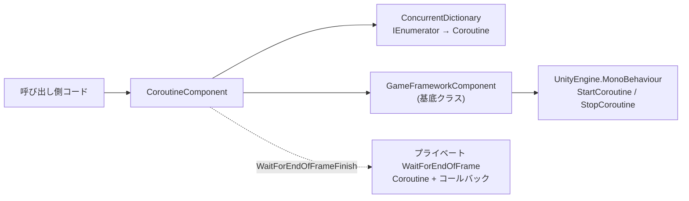

# Coroutine コンポーネントについて

`CoroutineComponent` は、GameFrameX フレームワークによる Unity ネイティブ Coroutine API のラッパーコンポーネントです。コアとなる価値は、このコンポーネントを通じて起動されたすべての Coroutine を**追跡・管理**することにあります。イテレータまたは `UnityEngine.Coroutine` ハンドルによって個々の Coroutine を正確に停止できるほか、一括クリアも可能です。さらに「フレーム終了コールバック」の便利なインターフェースも提供します。

## クイックスタート

### 1. パッケージのインストール

Unity プロジェクトの `Packages/manifest.json` の `scopedRegistries` に GameFrameX のレジストリを追加し、`dependencies` に以下を宣言します:

```json
{
  "scopedRegistries": [
    {
      "name": "GameFrameX",
      "url": "https://gameframex.upm.alianblank.uk",
      "scopes": ["com.gameframex"]
    }
  ],
  "dependencies": {
    "com.gameframex.unity.coroutine": "1.0.3"
  }
}
```

Source: [README.zh-CN.md](https://github.com/GameFrameX/com.gameframex.unity.coroutine/blob/main/README.zh-CN.md#L50-L65)

### 2. コンポーネントをシーンオブジェクトに追加

クラスには `[DisallowMultipleComponent]` と `[AddComponentMenu("GameFrameX/Coroutine")]` が付与されているため、同じゲームオブジェクトには 1 つしかアタッチできません。また、フレームワークは `[GameFrameXAutoComponent(-6500)]` によって自動登録を行います。

```csharp
CoroutineComponent coroutineComponent = gameObject.AddComponent<CoroutineComponent>();
```

Source: [CoroutineComponent.cs](https://github.com/GameFrameX/com.gameframex.unity.coroutine/blob/main/Runtime/Coroutine/CoroutineComponent.cs#L12-L15)

### 3. Coroutine の起動と管理

```csharp
IEnumerator YourCoroutine()
{
    // 协程执行的内容
    yield return null;
}

coroutineComponent.StartCoroutine(YourCoroutine());
```

Source: [README.zh-CN.md](https://github.com/GameFrameX/com.gameframex.unity.coroutine/blob/main/README.zh-CN.md#L82-L91)

## 仕組みの概要

コンポーネント内部では、`ConcurrentDictionary<IEnumerator, UnityEngine.Coroutine>` を使用して「イテレータ → Unity Coroutine ハンドル」のマッピングテーブルを保持しています。すべての `StartCoroutine`/`StopCoroutine`/`StopAllCoroutines` は `new` キーワードによって基底クラスのメソッドを隠蔽しており、まずこのマッピングテーブルを更新し、その後 `GameFrameworkComponent` 基底クラスに実際の Unity 呼び出しを委譲します。



## コア API 一覧

| メソッド | 役割 | 重要なポイント |
|------|------|--------|
| `StartCoroutine(IEnumerator)` | Coroutine を起動し追跡テーブルに追加 | `UnityEngine.Coroutine` を返す |
| `StopCoroutine(IEnumerator)` | イテレータ指定で停止 | `StartCoroutine` と同じ `IEnumerator` インスタンスを渡す必要がある |
| `StopCoroutine(UnityEngine.Coroutine)` | ハンドル指定で停止 | 内部でディクショナリを走査し対応するキーを探して削除 |
| `StopAllCoroutines()` | 追跡中・未追跡のすべての Coroutine を停止 | 追跡項目の停止とディクショナリクリアの後、基底クラスを呼び出す |
| `WaitForEndOfFrameFinish(Action)` | 現フレームのレンダリング完了後にコールバックを実行 | フレーム終了前に `StopCoroutine` で停止された場合、コールバックは発火しない |

## 次に進む

- ステップバイステップで最初の Coroutine を実行したい:『Coroutine の起動と停止方法』を参照
- `StopCoroutine` が効かない、コールバックが発火しないなどの問題が発生した場合:『Coroutine 関連の問題対処法』を参照
- 完全な API シグネチャとデフォルト値が必要な場合:『CoroutineComponent API リファレンス』を参照