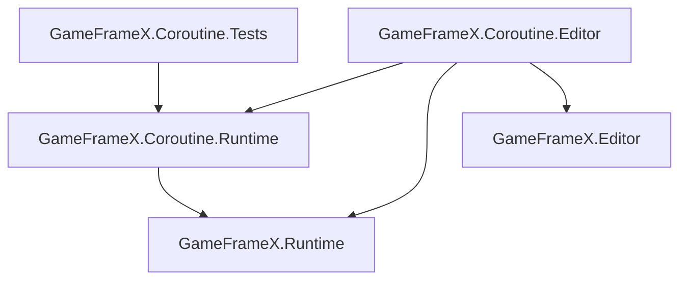

# パッケージ構成とアセンブリリファレンス

このページには `com.gameframex.unity.coroutine` パッケージのすべてのメタデータとアセンブリ定義がまとめられており、依存関係、バージョン互換性、アセンブリ参照の問題のトラブルシューティングに使用します。

## パッケージメタデータ(package.json)

| フィールド | 値 |
|------|-----|
| `name` | `com.gameframex.unity.coroutine` |
| `displayName` | `Game Frame X Coroutine` |
| `category` | `GameFrameX` |
| `version` | `1.2.0` |
| `unity` | `2019.4`(最低サポートバージョン) |
| `keywords` | `GameFrameX`, `Coroutine` |
| `dependencies` | `com.gameframex.unity: 2.5.1` |
| `publishConfig.access` | `public` |
| `publishConfig.registry` | `https://npm.cnb.cool/GameFrameX/npm/-/packages/` |
| `documentationUrl` | `https://gameframex.doc.alianblank.com` |
| `changelogUrl` | `https://github.com/gameframex/com.gameframex.unity.coroutine/blob/main/CHANGELOG.md` |
| `licensesUrl` | `https://github.com/gameframex/com.gameframex.unity.coroutine/blob/main/LICENSE.md` |

## アセンブリ一覧

パッケージには3つのアセンブリ(`.asmdef`)が含まれています。すべてのアセンブリで `autoReferenced` は `true` であるため、同じプロジェクト内の他のスクリプトは手動で参照を追加することなく、その中の型を直接使用できます。

| アセンブリ名 | ファイル | 対象プラットフォーム | 参照 |
|---------|------|---------|------|
| `GameFrameX.Coroutine.Runtime` | [Runtime/GameFrameX.Coroutine.Runtime.asmdef](https://github.com/GameFrameX/com.gameframex.unity.coroutine/blob/main/Runtime/GameFrameX.Coroutine.Runtime.asmdef) | 全プラットフォーム | `GameFrameX.Runtime` |
| `GameFrameX.Coroutine.Editor` | [Editor/GameFrameX.Coroutine.Editor.asmdef](https://github.com/GameFrameX/com.gameframex.unity.coroutine/blob/main/Editor/GameFrameX.Coroutine.Editor.asmdef) | `Editor` | `GameFrameX.Coroutine.Runtime`, `GameFrameX.Editor`, `GameFrameX.Runtime` |
| `GameFrameX.Coroutine.Tests` | [Tests/GameFrameX.Coroutine.Tests.asmdef](https://github.com/GameFrameX/com.gameframex.unity.coroutine/blob/main/Tests/GameFrameX.Coroutine.Tests.asmdef) | `Editor` | `GameFrameX.Coroutine.Runtime` |

## 各アセンブリの主要フィールド

| フィールド | Runtime | Editor | Tests |
|------|---------|--------|-------|
| `rootNamespace` | `GameFrameX.Coroutine.Runtime` | (未設定) | `GameFrameX.Coroutine.Tests` |
| `includePlatforms` | (空、全プラットフォーム) | `Editor` | `Editor` |
| `allowUnsafeCode` | `true` | `false` | `false` |
| `overrideReferences` | `false` | `false` | `false` |
| `autoReferenced` | `true` | `true` | `true` |
| `precompiledReferences` | (空) | (空) | (空) |
| `defineConstraints` | (空) | (空) | (空) |

## 依存関係図

## よくある質問クイックリファレンス

| 症状 | 原因 | 修正方法 |
|------|------|------|
| `GameFrameX.Coroutine` 名前空間が見つからない | 本パッケージがインポートされていない、または `com.gameframex.unity` 上流パッケージが有効になっていない | `manifest.json` で `com.gameframex.unity.coroutine` と `com.gameframex.unity@2.5.1` が同時に存在することを確認する |
| Editor プラットフォームで `GameFrameX.Editor` が見つからないコンパイルエラーが発生する | 上流 Editor アセンブリがインポートされていない | `com.gameframex.unity@2.5.1` がインストールされ、`GameFrameX.Editor` を提供していることを確認する |
| Editor 以外のプラットフォームで Editor アセンブリを参照している | Editor アセンブリは `includePlatforms: ["Editor"]` に制限されている | 対応するコードを Runtime アセンブリに移動するか、`#if UNITY_EDITOR` で囲む |
| 自動参照を無効にしたい | `autoReferenced: true` | 自前の `.asmdef` の `references` に `GameFrameX.Coroutine.Runtime` を明示的に追加する |

## パッケージソースコード参照

- [package.json](https://github.com/GameFrameX/com.gameframex.unity.coroutine/blob/main/package.json)
- [Runtime/GameFrameX.Coroutine.Runtime.asmdef](https://github.com/GameFrameX/com.gameframex.unity.coroutine/blob/main/Runtime/GameFrameX.Coroutine.Runtime.asmdef)
- [Editor/GameFrameX.Coroutine.Editor.asmdef](https://github.com/GameFrameX/com.gameframex.unity.coroutine/blob/main/Editor/GameFrameX.Coroutine.Editor.asmdef)
- [Tests/GameFrameX.Coroutine.Tests.asmdef](https://github.com/GameFrameX/com.gameframex.unity.coroutine/blob/main/Tests/GameFrameX.Coroutine.Tests.asmdef)