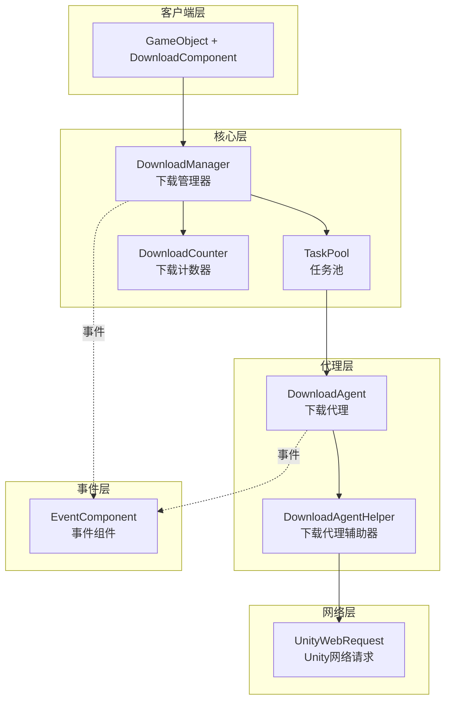
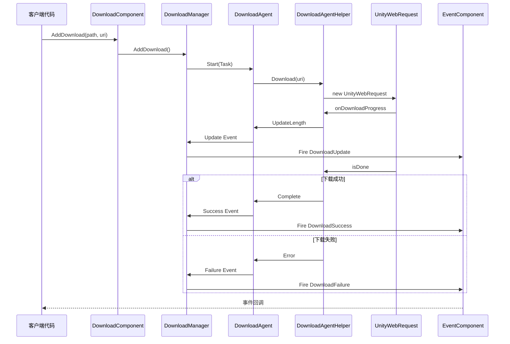

# プラグイン介绍

GameFrameX Download 下载任务コンポーネント是 GameFrameX 游戏フレームワーク的コアモジュール之一，专门为 Unity 游戏プロジェクト提供効率的、可靠的リソース下载解決策。该コンポーネント采用モジュール化設計，サポート多线程并发下载、断点续传、任务优先级管理等企业级機能。

## 概要

GameFrameX Download コンポーネントは機能完善的下载管理系统，旨在帮助 Unity 開発者轻松実装游戏リソース的远程下载和アップデート機能。该コンポーネント設計遵循高内聚、低耦合的原则，通过イベント驱动机制提供下载全フロー的ステータス追踪，让開発者能够柔軟控制下载任务的作成、管理和监控。

该コンポーネント的コア价值在于提供します开箱つまり用的下载機能，開発者无需关心底层网络実装的複雑性，只需呼び出しシンプル的 API つまり可完成複雑的下载任务。同時に，コンポーネントサポート自定義下载代理辅助器，允许開発者根据プロジェクト需求置換或拡張下载実装方法。

从アーキテクチャ角度来看，Download コンポーネントビルド在 GameFrameX フレームワーク的モジュール系统之上，与 Event コンポーネント紧密集成，通过統一された的イベント机制向外部传递下载ステータス变化。这种設計使得下载逻辑与业务逻辑完全分离，コード更加清晰易于维护。

## コア機能

该下载コンポーネント提供します完全な的企业级下载管理能力，能够满足各种複雑的游戏リソース下载シーン。以下是コンポーネント的主な機能特性：

### 多任务并发下载

コンポーネント内部采用任务池（TaskPool）机制管理下载任务，サポート設定多个下载代理同時に工作。開発者〜できます根据实际需求调整并发数量，在下载速度和系统リソース消耗之间取得平衡。任务池会自动调度任务的执行顺序，確認してください高优先级任务优先処理，同時に合理分配系统带宽リソース。

```csharp
// 配置下载代理数量，默认值为3
[SerializeField] private int m_DownloadAgentHelperCount = 3;
```
> Source: [DownloadComponent.cs](https://github.com/GameFrameX/com.gameframex.unity.download/blob/main/Runtime/Download/DownloadComponent.cs#L37)

### 断点续传サポート

コンポーネント内置断点续传機能，在下载过程中会将数据先写入 `.download` 临时ファイル。当下载中断（无论是网络問題还是应用退出）后重新启动时，系统会自动检测已下载的部分，并从中断处继续下载，避免重复下载造成的流量浪费和时间损失。

```csharp
// 检测并继续未完成的下载
if (File.Exists(downloadFile))
{
    m_FileStream = File.OpenWrite(downloadFile);
    m_FileStream.Seek(0L, SeekOrigin.End);
    m_StartLength = m_SavedLength = m_FileStream.Length;
}
```
> Source: [DownloadManager.DownloadAgent.cs](https://github.com/GameFrameX/com.gameframex.unity.download/blob/main/Runtime/Download/Download/DownloadManager.DownloadAgent.cs#L173-L178)

### 任务优先级管理

每个下载任务都〜できます設定优先级（整数数值，数值越高优先级越大），任务池会根据优先级调度下载顺序。在游戏アップデートシーン中，〜できます将关键リソース（如初始シーン、コア設定）設定为高优先级，確認してください重要な内容优先下载完成。

### 实时進捗追踪

コンポーネント提供完全な的下载イベント系统，含みます下载开始、進捗アップデート、下载成功和下载失敗四种ステータス。開発者〜できます通过購読这些イベント实时取得下载進捗、速度统计等情報，并据此アップデートユーザー界面或执行相应的业务逻辑。

### 下载速度统计

内置下载计数器モジュール，能够实时计算当前下载速度（字节/秒）。这一機能对于向ユーザー表示下载進捗、最適化下载体验非常有帮助。開発者〜できます通过 `CurrentSpeed` プロパティ取得当前下载速度值。

```csharp
/// <summary>
/// 获取当前下载速度。
/// </summary>
public float CurrentSpeed
{
    get { return m_DownloadManager.CurrentSpeed; }
}
```
> Source: [DownloadComponent.cs](https://github.com/GameFrameX/com.gameframex.unity.download/blob/main/Runtime/Download/DownloadComponent.cs#L105-L108)

### 任务标签管理

サポート为下载任务設定标签（Tag），〜できます通过标签批量查询或移除相关任务。这一機能在管理同タイプリソース（如语言パッケージ、地图数据）时特别有用，〜できます一次性对某一类リソース进行統一された操作。

## アーキテクチャ設計

GameFrameX Download コンポーネント采用分层アーキテクチャ設計，各层职责明确，层与层之间通过インターフェース进行通信，実装了良好的解耦效果。



### 各層の役割の説明

**客户端层（DownloadComponent）**

客户端层是開発者直接交互的入口点，表现为 Unity 游戏对象上的コンポーネント。DownloadComponent 継承自 GameFrameworkComponent，负责初期化下载マネージャー、登録イベントコールバック、処理任务追加和移除等前端工作。它将複雑的内部実装カプセル化为シンプル的 API，供业务コード呼び出し。

作为 Unity コンポーネント，DownloadComponent 提供します丰富的シリアライズフィールド，用于在エディタ中設定下载パラメータ，如下载代理タイプ、代理数量、超时时间等。这种設計使得開発者无需编写コードつまり可完成コンポーネント的基本設定。

**コア层（DownloadManager + TaskPool + DownloadCounter）**

コア层是下载機能的大脑，由下载マネージャー（DownloadManager）、任务池（TaskPool）和下载计数器（DownloadCounter）三个コアコンポーネント构成。

DownloadManager 継承自 GameFrameworkModule，是フレームワーク的モジュール化组成部分。它実装了 IDownloadManager インターフェース，提供下载任务的增删改查、暂停恢复、パラメータ設定等管理機能。DownloadManager 内部维护一个任务池インスタンス，将具体的下载执行デリゲート给任务池処理。

TaskPool は汎用的任务池実装，专门用于管理 DownloadTask。它负责维护待処理任务队列、分配任务给空闲的下载代理、処理任务优先级排序等逻辑。TaskPool サポート动态追加和移除代理，能够根据可用代理数量和任务队列ステータス自动调度任务。

DownloadCounter 用于统计下载速度。它维护一个时间ウィンドウ，记录最近一段时间内下载的数据量，从而计算出实时的下载速度。这种滑动ウィンドウ算法能够快速反映网络状况的变化。

**代理层（DownloadAgent + DownloadAgentHelper）**

代理层负责实际的网络下载操作，是真正与外部服务器通信的层级。

DownloadAgent 是下载代理的内部実装类，実装了 ITaskAgent インターフェース。每个下载代理绑定一个下载代理辅助器，负责処理一个具体的下载任务。DownloadAgent 管理下载的整个ライフサイクル，含みます作成临时ファイル、処理断点续传、写入下载数据、检测超时等。

DownloadAgentHelper 是下载操作的抽象インターフェース，定義了下载辅助器〜する必要があります実装的メソッド。DownloadAgentHelperBase 是该インターフェース的 Unity 基底クラス実装，提供します MonoBehaviour 的ライフサイクル管理和基本的イベント定義。

**网络层（UnityWebRequest）**

网络层是アーキテクチャ的最底层，负责与远程服务器建立连接并传输数据。デフォルト実装使用 Unity 的 UnityWebRequest 类，这は跨プラットフォーム的 HTTP 客户端，能够在所有 Unity サポート的プラットフォーム上有良好的表现。

開発者〜できます通过継承 DownloadAgentHelperBase 或実装 IDownloadAgentHelper インターフェース来作成自定義的网络実装，以满足特殊需求。

**イベント层（EventComponent）**

イベント层不是下载コンポーネント的一部分，而是依赖 GameFrameX フレームワーク的 Event コンポーネント。下载过程中产生的各种ステータス变化会通过イベント系统向外传播，DownloadComponent 负责将内部イベント转换为フレームワークイベント并トリガー。这种設計使得下载ステータス能够被任意业务モジュール購読和响应。

### イベント流转机制



## コアコンセプト

### 下载任务（DownloadTask）

下载任务は数据结构，カプセル化了单个下载请求的所有情報。每个任务パッケージ含：下载路径（本地存储位置）、下载地址（远程 URL）、标签、优先级、ユーザー自定義数据等プロパティ。任务在下载过程中会维护其ステータス（待処理、执行中、完成、エラー等）。

任务使用序列号（SerialId）作为唯一标识符，開発者通过序列号〜できます查询特定任务的ステータス或在ランタイム移除任务。

### 下载代理（DownloadAgent）

下载代理是执行下载的实体，每个代理一次只能処理一个下载任务。代理负责管理下载的完全なライフサイクル：作成本地临时ファイル、发起网络请求、処理下载進捗、维护断点续传ステータス、检测超时、処理完成或エラー等。

系统中〜できます存在多个代理同時に工作，実装并发下载。代理数量的設定〜する必要があります权衡下载速度和系统リソース占用。

### 下载代理辅助器（DownloadAgentHelper）

下载代理辅助器是网络下载能力的抽象，它定義了与特定网络実装交互的インターフェース。フレームワーク提供します基于 UnityWebRequest 的デフォルト実装，開発者也〜できます通过実装インターフェース来使用其他网络库（如 HttpClient、curl 等）。

辅助器設計为可置換コンポーネント，这种ストラテジーパターン允许在不同的运行環境和需求下切换网络実装，而不〜する必要があります変更上层コード。

### 任务池（TaskPool）

任务池是下载管理的コア调度器，负责维护所有下载任务的ステータス和队列。任务池管理待処理任务的优先级排序，将任务分配给可用的下载代理，処理任务完成后的清理工作，并提供任务ステータス的查询インターフェース。

任务池的設計リファレンス了对象池モード，通过复用代理リソース来减少频繁作成和破棄对象的开销，提升系统性能。

## 使用フロー

### コンポーネント初期化

在 Unity シーン中作成一个空游戏对象，次に追加 DownloadComponent コンポーネント。コンポーネント会在 Awake フェーズ取得下载マネージャーモジュール，并在 Start フェーズ初期化指定数量的下载代理辅助器。

```csharp
protected override void Awake()
{
    ImplementationComponentType = Utility.Assembly.GetType(componentType);
    InterfaceComponentType = typeof(IDownloadManager);
    base.Awake();
    m_DownloadManager = GameFrameworkEntry.GetModule<IDownloadManager>();
    // ...
}
```
> Source: [DownloadComponent.cs](https://github.com/GameFrameX/com.gameframex.unity.download/blob/main/Runtime/Download/DownloadComponent.cs#L142-L152)

### 追加下载任务

通过呼び出し DownloadComponent 的 AddDownload メソッド追加下载任务。该メソッド有多种オーバーロード形式，サポート只指定路径和地址，也〜できます额外指定标签、优先级和自定義数据。

```csharp
// 基础用法：添加下载任务
int serialId = downloadComponent.AddDownload("本地存储路径", "下载链接");

// 带优先级的用法
int serialId = downloadComponent.AddDownload("本地存储路径", "下载链接", 10);

// 带标签的用法
int serialId = downloadComponent.AddDownload("本地存储路径", "下载链接", "resource");

// 完整参数用法
int serialId = downloadComponent.AddDownload("本地存储路径", "下载链接", "resource", 10, customData);
```
> Source: [DownloadComponent.cs](https://github.com/GameFrameX/com.gameframex.unity.download/blob/main/Runtime/Download/DownloadComponent.cs#L238-L350)

AddDownload メソッド返す任务的序列号（SerialId），这は递增的唯一标识符，可用于后续查询任务ステータス或移除任务。

### 异步等待下载完成

コンポーネント提供します基于 Task 的异步等待机制，适合在 async/await モード下使用：

```csharp
// 异步等待下载完成
public async Task<bool> DownloadAsync(string downloadPath, string downloadUri)
{
    var serialId = AddDownload(downloadPath, downloadUri);
    if (m_Downloads.TryGetValue(serialId, out var value))
    {
        return await value.TCS.Task;
    }
    return false;
}
```
> Source: [DownloadComponent.cs](https://github.com/GameFrameX/com.gameframex.unity.download/blob/main/Runtime/Download/DownloadComponent.cs#L273-L282)

### 購読下载イベント

通过 GameFrameX 的イベント系统購読下载進捗和結果：

```csharp
// 订阅下载成功事件
eventComponent.Subscribe(DownloadSuccessEventArgs.EventId, OnDownloadSuccess);

// 订阅下载失败事件
eventComponent.Subscribe(DownloadFailureEventArgs.EventId, OnDownloadFailure);

// 下载成功回调
private void OnDownloadSuccess(object sender, GameEventArgs e)
{
    DownloadSuccessEventArgs ne = (DownloadSuccessEventArgs)e;
    Debug.Log($"下载完成：{ne.DownloadPath}，大小：{ne.CurrentLength}");
}
```
> Source: [README.md](https://github.com/GameFrameX/com.gameframex.unity.download/blob/main/README.md#L88-L106)

### 移除下载任务

〜できます通过序列号、标签或全部移除来管理下载任务：

```csharp
// 根据序列号移除单个任务
bool result = downloadComponent.RemoveDownload(serialId);

// 根据标签移除多个任务
int count = downloadComponent.RemoveDownloads("resource");

// 移除所有任务
int count = downloadComponent.RemoveAllDownloads();
```
> Source: [DownloadComponent.cs](https://github.com/GameFrameX/com.gameframex.unity.download/blob/main/Runtime/Download/DownloadComponent.cs#L357-L392)

## 設定説明

### DownloadComponent 設定项

| 設定项 | タイプ | デフォルト值 | 説明 |
|--------|------|--------|------|
| DownloadAgentHelperTypeName | string | UnityWebRequestDownloadAgentHelper | 下载代理辅助器タイプ名称 |
| CustomDownloadAgentHelper | DownloadAgentHelperBase | null | 自定義下载代理辅助器インスタンス |
| DownloadAgentHelperCount | int | 3 | 下载代理数量，并发下载数 |
| Timeout | float | 30f | 单个任务超时时间（秒） |
| FlushSize | int | 1048576 (1MB) | 缓冲区写入磁盘的临界大小 |

### FlushSize 的作用

FlushSize 控制数据从内存缓冲区写入磁盘的频率。設定较小的值〜できます更频繁地保存下载数据，减少因例外中断导致的数据丢失，但会增加磁盘 I/O 操作。较大的值则相反。お勧め根据实际シーン和网络環境调整此パラメータ。

### Timeout 的作用

Timeout 設定单个下载任务的无响应超时时间。当网络连接建立后，もし在指定时间内没有收到任何数据，任务会被判定为超时并トリガー失敗コールバック。合理的超时設定〜できます避免下载在网络不稳定时无限等待。

## 依赖关系

GameFrameX Download コンポーネント依赖于以下モジュール：

- **GameFrameX.Runtime** - コアランタイム库，提供フレームワーク基本機能
- **GameFrameX.Event** - イベント系统，用于下载ステータス的イベント通知

```json
{
   "com.gameframex.unity.event": "https://github.com/GameFrameX/com.gameframex.unity.event.git",
   "com.gameframex.unity.download": "https://github.com/GameFrameX/com.gameframex.unity.download.git"
}
```
> Source: [README.md](https://github.com/GameFrameX/com.gameframex.unity.download/blob/main/README.md#L112-L118)

## プラットフォームサポート

该コンポーネント使用 UnityWebRequest 作为デフォルト网络実装，天然サポート Unity サポート的所有プラットフォーム：

- Windows / macOS / Linux
- Android
- iOS
- WebGL
- PS4 / PS5
- Xbox One / Xbox Series X|S
- Nintendo Switch

## 関連リンク

- [機能特性](./1-overview.features) - 理解する更多機能详情
- [インストールガイド](./2-installation) - プラグインインストール説明
- [基本設定](./3-getting-started.basic-setup) - 快速設定
- [首个例](./3-getting-started.first-example) - 完全なコード例
- [アーキテクチャ概要](./4-core-concepts.architecture) - 深入アーキテクチャ解析
- [DownloadComponent 详解](./4-core-concepts.download-component) - コンポーネント API 详解
- [下载代理详解](./4-core-concepts.download-agent) - 代理実装机制
- [プロパティリファレンス](./5-api-reference.properties) - プロパティ列表
- [メソッドリファレンス](./5-api-reference.methods) - メソッド签名
- [下载イベント](./6-events.download-events) - イベント详情
- [代理イベント](./6-events.agent-events) - 代理层イベント
- [エディタ設定](./7-configuration.editor-configuration) - エディタ設定
- [代理設定](./7-configuration.agent-configuration) - 代理設定详解
- [常见問題](./8-troubleshooting) - 問題排查ガイド
