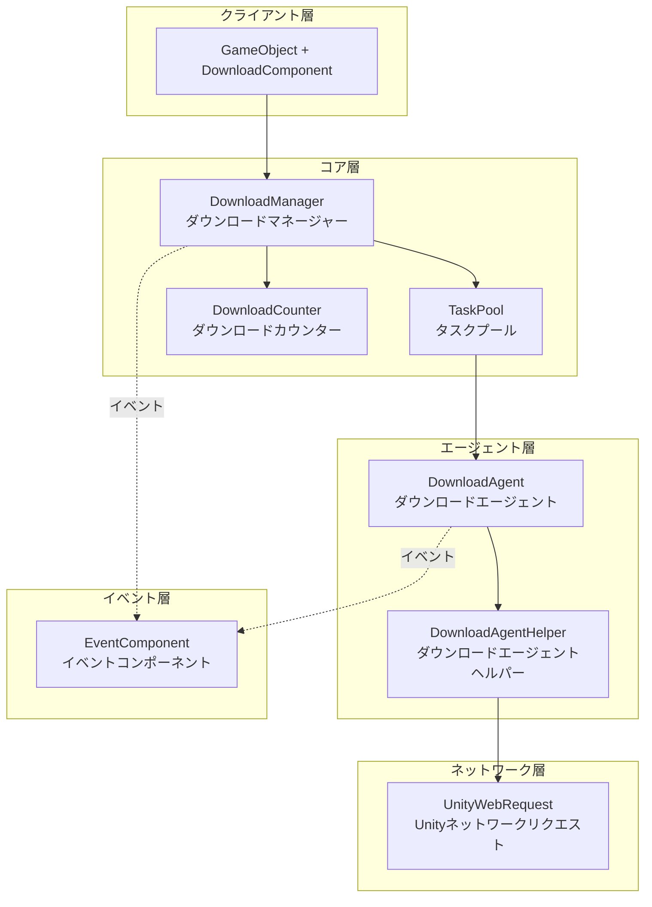
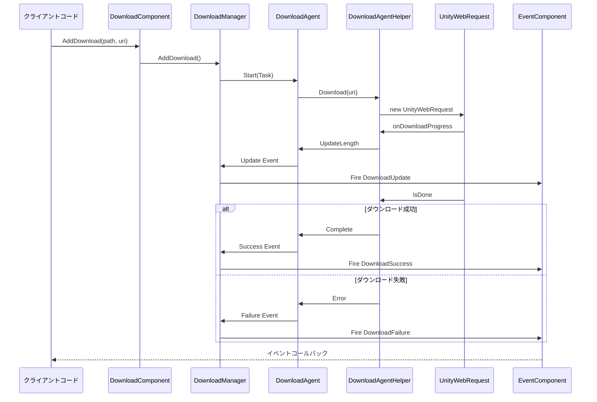

# 概要

GameFrameX Download ダウンロードタスクコンポーネントは、GameFrameX ゲームフレームワークの中核モジュールの1つであり、Unity ゲームプロジェクト向けに効率的で信頼性の高いリソースダウンロード解決策を提供します。このコンポーネントはモジュール式設計を採用し、マルチスレッド同時ダウンロード、レジューム対応、タスク優先度管理などのエンタープライズレベルの機能をサポートします。

## 概要

GameFrameX Download コンポーネントは、Unity 開発者がゲームリソースの遠隔ダウンロードと更新機能を 쉽게 実装できるよう支援する、機能が完備されたダウンロード管理系统です。このコンポーネントは高い凝集度・低い結合度の原则に基づき、イベント駆動メカニズムを通じてダウンロードの全工程におけるステータス追跡を提供し、開発者がダウンロードタスクの作成、管理、監視を柔軟に制御できるようにします。

このコンポーネントのコア価値は、開封即用のダウンロード機能を提供する点にあり、開発者は底层のネットワーク実装の詳細擔心事 없이、シンプルな API を呼び出すだけで複雑なダウンロードタスクを実行できます。同時に、コンポーネントはカスタムダウンロードエージェントヘルパーをサポートしており、開発者はプロジェクト需求に応じてダウンロード実装方法を替换または拡張できます。

アーキテクチャの観点から、Download コンポーネントは GameFrameX フレームワークのモジュールシステムの上に構築されており、Event コンポーネントと緊密に統合されています。統一されたイベントメカニズムを通じて外部にダウンロードステータスの変化を传递し、ダウンロードロジックとビジネスロジックを完全に分離し、コードをより清晰で保守しやすいものにします。

## コア機能

このダウンロードコンポーネントは、複雑なゲームリソースダウンロードシナリオに対応する完全なエンタープライズレベルのダウンロード管理機能を提供します。以下はコンポーネントの主な機能特性です：

### マルチタスク同時ダウンロード

コンポーネント内部ではタスクプール（TaskPool）メカニズムを使用してダウンロードタスクを管理し、複数のダウンロードエージェントの同時動作をサポートします。開発者は実際の需求に基づいて同時実行数を調整し、ダウンロード速度とシステムリソース消費のバランスを取ることができます。タスクプールは自動的にタスクの実行順序をスケジュールし、高優先度タスクが優先的に処理されるようにすると同時に、システム帯域リソースを合理的に分配します。

```csharp
// ダウンロードエージェント数を設定（デフォルト値は3）
[SerializeField] private int m_DownloadAgentHelperCount = 3;
```
> ソース: [DownloadComponent.cs](https://github.com/GameFrameX/com.gameframex.unity.download/blob/main/Runtime/Download/DownloadComponent.cs#L37)

### レジューム対応

コンポーネントには内置のResume機能があり、ダウンロード 과정에서データをまず `.download` 一時ファイルに書き込みます。ダウンロードが中断された場合（ネットワーク問題またはアプリケーション終了の有無にかかわらず）、システムは自動的にダウンロード済みの部分を検出し、中断箇所からダウンロードを再開し、重复ダウンロードによるトラフィック浪費と時間損失を回避します。

```csharp
// 未完了のダウンロードを検出して再開
if (File.Exists(downloadFile))
{
    m_FileStream = File.OpenWrite(downloadFile);
    m_FileStream.Seek(0L, SeekOrigin.End);
    m_StartLength = m_SavedLength = m_FileStream.Length;
}
```
> ソース: [DownloadManager.DownloadAgent.cs](https://github.com/GameFrameX/com.gameframex.unity.download/blob/main/Runtime/Download/Download/DownloadManager.DownloadAgent.cs#L173-L178)

### タスク優先度管理

各ダウンロードタスクには優先度（整数値、値が大きいほど優先度が高い）を設定でき、タスクプールは優先度に基づいてダウンロード順序をスケジュールします。ゲーム更新シーンでは、キーレスポンス（初期シーン、コア設定など）を高優先度に設定し、重要なコンテンツが優先的にダウンロード完了するようにできます。

### リアルタイム進捗追跡

コンポーネントは完全なダウンロードイベントシステムを提供し、ダウンロード開始、進捗更新、ダウンロード成功、ダウンロード失敗の4つのステータスを含まれています。開発者はこれらのイベントを購読することでリアルタイムにダウンロード進捗、速度統計などの情報を取得し、用户インターフェースを更新したり соответствующие ビジネスロジックを実行したりできます。

### ダウンロード速度統計

内置のダウンロードカウンターンモジュールにより、現在のダウンロード速度（バイト/秒）をリアルタイムで計算できます。この機能はユーザーへのダウンロード進捗表示とダウンロード体験の最適化に非常に便利です。開発者は `CurrentSpeed` プロパティを通じて現在のダウンロード速度値を取得できます。

```csharp
/// <summary>
/// 現在のダウンロード速度を取得します。
/// </summary>
public float CurrentSpeed
{
    get { return m_DownloadManager.CurrentSpeed; }
}
```
> ソース: [DownloadComponent.cs](https://github.com/GameFrameX/com.gameframex.unity.download/blob/main/Runtime/Download/DownloadComponent.cs#L105-L108)

### タスクタグ管理

ダウンロードタスクにタグ（Tag）を設定することをサポートし、タグを通じて批量クエリまたは関連タスクの一括削除ができます。この機能は同类型リソース（言語パック、マップデータなど）の管理に特に便利で、特定のクラスリソースを一括操作できます。

## アーキテクチャ設計

GameFrameX Download コンポーネントは階層型アーキテクチャ設計を採用し、各層の責務は明確で、層と層の 间はインターフェースを通じて通信し、良好な疎結合効果を実現しています。



### 各層の責務説明

**クライアント層（DownloadComponent）**

クライアント層は開発者が直接やり取りするエントリーポイントであり、Unity ゲームオブジェクト上のコンポーネントとして存在します。DownloadComponent は GameFrameworkComponent を継承し、ダウンロードマネージャーの初期化、イベントコールバックの登録、タスク追加と削除などの前端処理を 담당합니다。複雑な内部実装を簡潔な API に封装し、ビジネスコードから呼び出せるようにします。

Unity コンポーネントとして、DownloadComponent はエディターでダウンロードパラメータを設定するための丰富的シリアライズフィールドを提供します。ダウンロードエージェントタイプ、エージェント数、タイムアウト時間などのダウンロードパラメータを設定でき、この設計により開発者はコードを書かずにコンポーネントの基本設定が完了できます。

**コア層（DownloadManager + TaskPool + DownloadCounter）**

コア層はダウンロード機能的大脑であり、ダウンロードマネージャー（DownloadManager）、タスクプール（TaskPool）、ダウンロードカウンター（DownloadCounter）の3つのコアコンポーネントで構成されます。

DownloadManager は GameFrameworkModule を継承し、フレームワークのモジュール式コンポーネント的一部分です。IDownloadManager インターフェースを実装し、ダウンロードタスクの増加・削除・変更・検索、一時停止・再開、パラメータ設定などの管理機能を提供します。DownloadManager 内部にはタスクプールインスタンスを維持し、具体的なダウンロード実行をタスクプールに委托します。

TaskPool は汎用的なタスクプール実装であり、DownloadTask の管理に特化しています。待処理タスクキューの維持、空きダウンロードエージェントへのタスク割り当て、タスク優先度排序などのロジックを担当します。TaskPool は動的なエージェント追加と削除をサポートし、利用可能なエージェント数とタスクキューステータスに基づいて自動的にタスクをスケジュールします。

DownloadCounter はダウンロード速度の統計に使用されます。時間ウィンドウを維持し、最近一定時間内にダウンロードされたデータ量を記録し、リアルタイムのダウンロード速度を計算します。このスライディングウィンドウアルゴリズムはネットワーク状況の変化に素早く反映できます。

**エージェント層（DownloadAgent + DownloadAgentHelper）**

エージェント層は実際のネットワークダウンロード操作を担当し、外部サーバーと真正に通信する層です。

DownloadAgent はダウンロードエージェントの内部実装クラスであり、ITaskAgent インターフェースを実装します。各ダウンロードエージェントはダウンロードエージェントヘルパーにバインドされ、1つの具体的なダウンロードタスクを処理します。DownloadAgent はダウンロードの全ライフサイクルを管理し、一時ファイルの作成、レジューム処理、ダウンロードデータの書き込み、タイムアウト検出などを担当します。

DownloadAgentHelper はダウンロード操作の抽象インターフェースであり、ダウンロードヘルパーが実装する必要があるメソッドを定義します。DownloadAgentHelperBase はこのインターフェースの Unity 基底クラス実装であり、MonoBehaviour のライフサイクル管理与と基礎のイベント定義を提供します。

**ネットワーク層（UnityWebRequest）**

ネットワーク層はアーキテクチャの最下層であり、遠隔サーバーとの接続確立とデータ送信を担当します。デフォルト実装では Unity の UnityWebRequest クラスを使用し、これはクロスプラットフォームの HTTP クライアントであり、すべての Unity がサポートするプラットフォームで的良好なパフォーマンスを示します。

開発者は DownloadAgentHelperBase を継承するか IDownloadAgentHelper インターフェースを実装してカスタムネットワーク実装を作成し、特殊需求を満たすことができます。

**イベント層（EventComponent）**

イベント層はダウンロードコンポーネントの一部ではなく、GameFrameX フレームワークの Event コンポーネントに依存しています。ダウンロード過程で生成された各种ステータス変化はイベントシステムを通じて外部に传播し、DownloadComponent は内部イベントをフレームワークイベントに変換してトリガーすることを 담당します。この設計により、ダウンロードステータスが任意のビジネスモジュールに購読・応答できます。

### イベントフロー機構



## コアコンセプト

### ダウンロードタスク（DownloadTask）

ダウンロードタスクはデータ構造であり、1つのダウンロードリクエストのすべての情報を封装します。各タスクには次のものが含まれます：ダウンロードパス（ローカル保存位置）、下载地址（遠隔 URL）、タグ、優先度、ユーザー定義データなどのプロパティ。タスクはダウンロード過程でステータス（待処理、実行中、完了、エラーなど）を維持します。

タスクはシリアル番号（SerialId）を一意の識別子として使用し、開発者はシリアル番号を通じて特定タスクのステータスを查询하거나、実行時にタスクを削除できます。

### ダウンロードエージェント（DownloadAgent）

ダウンロードエージェントはダウンロードを実行する实体であり、各エージェントは一度に1つのダウンロードタスクのみを処理できます。エージェントはダウンロードの完全なライフサイクルを管理します：ローカル一時ファイルの作成、ネットワークリクエストの発信、ダウンロード進捗の処理、レジュームステータスの維持、タイムアウト検出、完了またはエラー処理など。

システムには複数のエージェントが同時に動作でき、同時にダウンロードを実装できます、エージェント数の設定はダウンロード速度とシステムリソース占有のバランスを取る必要があります。

### ダウンロードエージェントヘルパー（DownloadAgentHelper）

ダウンロードエージェントヘルパーはネットワークダウンロード能力の抽象であり、特定のネットワーク実装とやり取りするインターフェースを定義します。フレームワークは UnityWebRequest に基づくデフォルト実装を提供しており、開発者はインターフェースを実装して他のネットワークライブラリ（HttpClient、curl など）を使用することもできます。

ヘルパーは置換可能コンポーネントとして設計されており、このストラテジーパターンにより、異なる実行環境と需求下でネットワーク実装を切り替えることができ、上位コードを変更する必要がありません。

### タスクプール（TaskPool）

タスクプールはダウンロード管理のコアスケジューラーであり、すべてのダウンロードタスクのステータスとキューを維持する职责を持ちます。タスクプールは待処理タスクの優先度排序を管理し、利用可能なダウンロードエージェントにタスクを割り当て、タスク完了後のクリーンアップ 작업을処理し、タスクステータスのクエリインターフェースを提供します。

タスクプールの設計はオブジェクトプールパターンを참고しており、エージェントリソースを再利用することで、オブジェクトの頻煩な作成と破棄によるオーバーヘッドを削減し、システムパフォーマンスを向上させます。

## 使用フロー

### コンポーネント初期化

Unity シーンで空のゲームオブジェクトを作成し、DownloadComponent コンポーネントを追加します。コンポーネントは Awake 段階でダウンロードマネージャーモジュールを取得し、Start 段階で指定数のダウンロードエージェントヘルパーを初期化します。

```csharp
protected override void Awake()
{
    ImplementationComponentType = Utility.Assembly.GetType(componentType);
    InterfaceComponentType = typeof(IDownloadManager);
    base.Awake();
    m_DownloadManager = GameFrameworkEntry.GetModule<IDownloadManager>();
    // ...
}
```
> ソース: [DownloadComponent.cs](https://github.com/GameFrameX/com.gameframex.unity.download/blob/main/Runtime/Download/DownloadComponent.cs#L142-L152)

### ダウンロードタスクの追加

DownloadComponent の AddDownload メソッドを呼び出してダウンロードタスクを追加します。このメソッドには複数のオーバーロード形式があり、パスとアドレスのみを指定したり、タグ、優先度、カスタムデータを追加で指定したりできます。

```csharp
// 基本的な使用方法：ダウンロードタスクを追加
int serialId = downloadComponent.AddDownload("ローカル保存パス", "ダウンロードリンク");

// 優先度付き使用方法
int serialId = downloadComponent.AddDownload("ローカル保存パス", "ダウンロードリンク", 10);

// タグ付き使用方法
int serialId = downloadComponent.AddDownload("ローカル保存パス", "ダウンロードリンク", "resource");

// 完全パラメータ使用方法
int serialId = downloadComponent.AddDownload("ローカル保存パス", "ダウンロードリンク", "resource", 10, customData);
```
> ソース: [DownloadComponent.cs](https://github.com/GameFrameX/com.gameframex.unity.download/blob/main/Runtime/Download/DownloadComponent.cs#L238-L350)

AddDownload メソッドはタスクのシリアル番号（SerialId）を返します。これは 증가する一意の識別子であり、後続のタスクステータス查询またはタスク削除に使用できます。

### ダウンロード完了の非同期待機

コンポーネントは Task に基づく非同期待機メカニズムを提供し、async/await モードでの使用に適しています：

```csharp
// ダウンロード完了を非同期待機
public async Task<bool> DownloadAsync(string downloadPath, string downloadUri)
{
    var serialId = AddDownload(downloadPath, downloadUri);
    if (m_Downloads.TryGetValue(serialId, out var value))
    {
        return await value.TCS.Task;
    }
    return false;
}
```
> ソース: [DownloadComponent.cs](https://github.com/GameFrameX/com.gameframex.unity.download/blob/main/Runtime/Download/DownloadComponent.cs#L273-L282)

### ダウンロードイベントの購読

GameFrameX のイベントシステムを購読してダウンロード進捗と結果を監視：

```csharp
// ダウンロード成功イベントを購読
eventComponent.Subscribe(DownloadSuccessEventArgs.EventId, OnDownloadSuccess);

// ダウンロード失敗イベントを購読
eventComponent.Subscribe(DownloadFailureEventArgs.EventId, OnDownloadFailure);

// ダウンロード成功コールバック
private void OnDownloadSuccess(object sender, GameEventArgs e)
{
    DownloadSuccessEventArgs ne = (DownloadSuccessEventArgs)e;
    Debug.Log($"ダウンロード完了：{ne.DownloadPath}、サイズ：{ne.CurrentLength}");
}
```
> ソース: [README.md](https://github.com/GameFrameX/com.gameframex.unity.download/blob/main/README.md#L88-L106)

### ダウンロードタスクの削除

シリアル番号、タグ、またはすべてを通じて削除してダウンロードタスクを管理：

```csharp
// シリアル番号に基づいて单个タスクを削除
bool result = downloadComponent.RemoveDownload(serialId);

// タグに基づいて複数のタスクを削除
int count = downloadComponent.RemoveDownloads("resource");

// すべてのタスクを削除
int count = downloadComponent.RemoveAllDownloads();
```
> ソース: [DownloadComponent.cs](https://github.com/GameFrameX/com.gameframex.unity.download/blob/main/Runtime/Download/DownloadComponent.cs#L357-L392)

## 設定説明

### DownloadComponent 設定項目

| 設定項目 | タイプ | デフォルト値 | 説明 |
|--------|------|--------|------|
| DownloadAgentHelperTypeName | string | UnityWebRequestDownloadAgentHelper | ダウンロードエージェントヘルパークラス名 |
| CustomDownloadAgentHelper | DownloadAgentHelperBase | null | カスタムダウンロードエージェントヘルパーインスタンス |
| DownloadAgentHelperCount | int | 3 | ダウンロードエージェント数、同時ダウンロード数 |
| Timeout | float | 30f | 单一タスクのタイムアウト時間（秒） |
| FlushSize | int | 1048576 (1MB) | バッファからディスクへの書き込みのしきい値サイズ |

### FlushSize の役割

FlushSize はデータがメモリバッファからディスクに書き込まれる频率を制御します。较小な値を設定するとより頻繁に保存されるため、異常終了によるデータ損失が減りますが、ディスク I/O 操作が増加します。较大な値は逆になります。実際のシーンとネットワーク環境に基づいてこのパラメータを調整することをお勧めします。

### Timeout の役割

Timeout は单一のダウンロードタスクの無応答タイムアウト時間を設定します。ネットワーク接続が確立された後、指定時間内にデータを受信しない場合、タスクはタイムアウトと判定され、失敗コールバックがトリガーされます。合理的なタイムアウト設定により、ネットワークが不安定な場合にダウンロードが無限に待機することを回避できます。

## 依存関係

GameFrameX Download コンポーネントは次のモジュールに依存しています：

- **GameFrameX.Runtime** - コアランタイムライブラリ、フレームワークの基本機能を提供
- **GameFrameX.Event** - イベントシステム、ダウンロードステータスのイベント通知に使用

```json
{
   "com.gameframex.unity.event": "https://github.com/GameFrameX/com.gameframex.unity.event.git",
   "com.gameframex.unity.download": "https://github.com/GameFrameX/com.gameframex.unity.download.git"
}
```
> ソース: [README.md](https://github.com/GameFrameX/com.gameframex.unity.download/blob/main/README.md#L112-L118)

## プラットフォームサポート

このコンポーネントは UnityWebRequest をデフォルトネットワーク実装として使用し、Unity がサポートするすべてのプラットフォームを自然にサポート：

- Windows / macOS / Linux
- Android
- iOS
- WebGL
- PS4 / PS5
- Xbox One / Xbox Series X|S
- Nintendo Switch

## 関連リンク

- [機能特性](./04.features) - 機能の詳細了解更多
- [インストールガイド](./02.installation) - コンポーネントインストール説明
- [基本設定](./06.basic-setup) - クイック設定
- [最初の手示例](./03.getting-started) - 完全コード示例
- [アーキテクチャ概要](./05.architecture) - アーキテクチャの詳細解析
- [DownloadComponent 詳解](./08.download-component) - コンポーネント API 詳解
- [ダウンロードエージェント詳解](./13.download-agent) - エージェント実装メカニズム
- [プロパティリファレンス](./09.properties) - プロパティリスト
- [メソッドリファレンス](./10.methods) - メソッドシグネチャ
- [ダウンロードイベント](./11.download-events) - イベント詳細
- [エージェントイベント](./14.agent-events) - エージェント層イベント
- [エディター設定](./07.editor-configuration) - エディター設定
- [エージェント設定](./12.agent-configuration) - エージェント設定詳解
- [よくある質問](./15.troubleshooting) - 問題排查ガイド