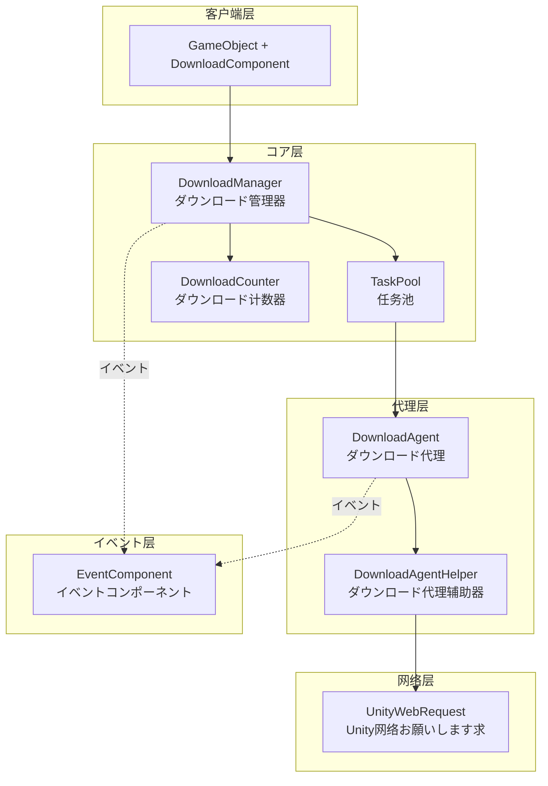

# 插件介绍

GameFrameX Download ダウンロード任务コンポーネント是 GameFrameX ゲームフレームワーク的コア模块之一，专门为 Unity ゲームプロジェクト提供高效、可靠的リソースダウンロード解決策。该コンポーネント采用モジュラー設計，サポート多线程并发ダウンロード、断点续传、任务优先级管理等企业级機能。

## 概要

GameFrameX Download コンポーネントは機能完善的ダウンロード管理系统，旨在帮助 Unity 開発者轻松実装ゲームリソース的远程ダウンロード和更新機能。该コンポーネント设计遵循高内聚、低耦合的原则，を通じてイベント驱动机制提供ダウンロード全フロー的ステータス追踪，让開発者能够灵活控制ダウンロード任务的作成、管理和监控。

该コンポーネント的コア价值在于提供します开箱即用的ダウンロード機能，開発者无需关心底层网络実装的复杂性，只需呼び出し简单的 API 即可完成复杂的ダウンロード任务。同时，コンポーネントサポート自定义ダウンロード代理辅助器，允许開発者に基づいてプロジェクト需求替换或扩展ダウンロード実装方法。

从架构角度来看，Download コンポーネント构建在 GameFrameX フレームワーク的模块系统之上，与 Event コンポーネント紧密集成，を通じて统一的イベント机制向外部传递ダウンロードステータス变化。这种设计使得ダウンロード逻辑与业务逻辑完全分离，代码更加清晰易于维护。

## コア機能

该ダウンロードコンポーネント提供します完整的企业级ダウンロード管理能力，能够满足各种复杂的ゲームリソースダウンロードシーン。以下是コンポーネント的主要機能特性：

### 多任务并发ダウンロード

コンポーネント内部采用任务池（TaskPool）机制管理ダウンロード任务，サポート配置多个ダウンロード代理同时工作。開発者可能に基づいて实际需求调整并发数量，在ダウンロード速度和系统リソース消耗之间取得平衡。任务池会自动调度任务的执行顺序，确保高优先级任务优先处理，同时合理分配系统带宽リソース。

```csharp
// 配置ダウンロード代理数量，默认值为3
[SerializeField] private int m_DownloadAgentHelperCount = 3;
```
> Source: [DownloadComponent.cs](https://github.com/GameFrameX/com.gameframex.unity.download/blob/main/Runtime/Download/DownloadComponent.cs#L37)

### 断点续传サポート

コンポーネント内置断点续传機能，在ダウンロード过程中会将数据先写入 `.download` 临时ファイル。当ダウンロード中断（无论是网络问题还是应用退出）后重新启动时，系统会自动检测已ダウンロード的部分，并从中断处继续ダウンロード，避免重复ダウンロード造成的流量浪费和时间损失。

```csharp
// 检测并继续未完成的ダウンロード
if (File.Exists(downloadFile))
{
    m_FileStream = File.OpenWrite(downloadFile);
    m_FileStream.Seek(0L, SeekOrigin.End);
    m_StartLength = m_SavedLength = m_FileStream.Length;
}
```
> Source: [DownloadManager.DownloadAgent.cs](https://github.com/GameFrameX/com.gameframex.unity.download/blob/main/Runtime/Download/Download/DownloadManager.DownloadAgent.cs#L173-L178)

### 任务优先级管理

每个ダウンロード任务都可能設定优先级（整数数值，数值越高优先级越大），任务池会に基づいて优先级调度ダウンロード顺序。在ゲーム更新シーン中，可能将关键リソース（如初始シーン、コア配置）設定为高优先级，确保重要内容优先ダウンロード完成。

### 实时进度追踪

コンポーネント提供完整的ダウンロードイベント系统，包括ダウンロード开始、进度更新、ダウンロード成功和ダウンロード失败四种ステータス。開発者可能を通じて订阅这些イベント实时取得ダウンロード进度、速度统计等信息，并据此更新用户界面或执行相应的业务逻辑。

### ダウンロード速度统计

内置ダウンロード计数器模块，能够实时计算当前ダウンロード速度（字节/秒）。这一機能对于向用户展示ダウンロード进度、优化ダウンロード体验非常有帮助。開発者可能を通じて `CurrentSpeed` プロパティ取得当前ダウンロード速度值。

```csharp
/// <summary>
/// 取得当前ダウンロード速度。
/// </summary>
public float CurrentSpeed
{
    get { return m_DownloadManager.CurrentSpeed; }
}
```
> Source: [DownloadComponent.cs](https://github.com/GameFrameX/com.gameframex.unity.download/blob/main/Runtime/Download/DownloadComponent.cs#L105-L108)

### 任务标签管理

サポート为ダウンロード任务設定标签（Tag），可能を通じて标签批量查询或移除関連任务。这一機能在管理同クラス型リソース（如语言包、地图数据）时特别有用，可能一次性对某一クラスリソース进行统一操作。

## アーキテクチャ設計

GameFrameX Download コンポーネント采用分层アーキテクチャ設計，各层职责明确，层与层之间を通じてインターフェース进行通信，実装了良好的解耦效果。



### 各层职责説明

**客户端层（DownloadComponent）**

客户端层是開発者直接交互的エントリーポイント点，表现为 Unity ゲーム对象上的コンポーネント。DownloadComponent を継承 GameFrameworkComponent，负责初期化ダウンロード管理器、注册イベント回调、处理任务添加和移除等前端工作。它将复杂的内部実装封装为简洁的 API，供业务代码呼び出し。

作为 Unity コンポーネント，DownloadComponent 提供します丰富的序列化字段，に使用在编辑器中配置ダウンロード参数，如ダウンロード代理クラス型、代理数量、超时时间等。这种设计使得開発者无需编写代码即可完成コンポーネント的基础配置。

**コア层（DownloadManager + TaskPool + DownloadCounter）**

コア层是ダウンロード機能的大脑，由ダウンロード管理器（DownloadManager）、任务池（TaskPool）和ダウンロード计数器（DownloadCounter）三个コアコンポーネント构成。

DownloadManager を継承 GameFrameworkModule，是フレームワーク的模块化组成部分。它実装了 IDownloadManager インターフェース，提供ダウンロード任务的增删改查、暂停恢复、参数配置等管理機能。DownloadManager 内部维护一个任务池インスタンス，将具体的ダウンロード执行委托给任务池处理。

TaskPool は通用的任务池実装，专门に使用管理 DownloadTask。它负责维护待处理任务队列、分配任务给空闲的ダウンロード代理、处理任务优先级排序等逻辑。TaskPool サポート动态添加和移除代理，能够に基づいて可用代理数量和任务队列ステータス自动调度任务。

DownloadCounter に使用统计ダウンロード速度。它维护一个时间窗口，记录最近一段时间内ダウンロード的数据量，从而计算出实时的ダウンロード速度。这种滑动窗口算法能够快速反映网络状况的变化。

**代理层（DownloadAgent + DownloadAgentHelper）**

代理层负责实际的网络ダウンロード操作，是真正与外部服务器通信的层级。

DownloadAgent 是ダウンロード代理的内部実装クラス，実装了 ITaskAgent インターフェース。每个ダウンロード代理绑定一个ダウンロード代理辅助器，负责处理一个具体的ダウンロード任务。DownloadAgent 管理ダウンロード的整个生命周期，包括作成临时ファイル、处理断点续传、写入ダウンロード数据、检测超时等。

DownloadAgentHelper 是ダウンロード操作的抽象インターフェース，定义了ダウンロード辅助器必要実装的メソッド。DownloadAgentHelperBase 是该インターフェース的 Unity 基クラス実装，提供します MonoBehaviour 的生命周期管理和基础的イベント定义。

**网络层（UnityWebRequest）**

网络层是架构的最底层，负责与远程服务器建立连接并传输数据。默认実装使用 Unity 的 UnityWebRequest クラス，这は跨平台的 HTTP 客户端，能够在所有 Unity サポート的平台上有良好的表现。

開発者可能を通じて继承 DownloadAgentHelperBase 或実装 IDownloadAgentHelper インターフェース来作成自定义的网络実装，以满足特殊需求。

**イベント层（EventComponent）**

イベント层不是ダウンロードコンポーネント的一部分，而是依赖 GameFrameX フレームワーク的 Event コンポーネント。ダウンロード过程中产生的各种ステータス变化会を通じてイベント系统向外传播，DownloadComponent 负责将内部イベント转换为フレームワークイベント并触发。这种设计使得ダウンロードステータス能够被任意业务模块订阅和响应。

### イベント流转机制


## コアコンセプト

### ダウンロード任务（DownloadTask）

ダウンロード任务は数据结构，封装了单个ダウンロードお願いします求的所有信息。每个任务包含：ダウンロード路径（本地存储位置）、ダウンロード地址（远程 URL）、标签、优先级、用户自定义数据等プロパティ。任务在ダウンロード过程中会维护其ステータス（待处理、执行中、完成、错误等）。

任务使用序列号（SerialId）作为唯一标识符，開発者を通じて序列号可能查询特定任务的ステータス或在运行时移除任务。

### ダウンロード代理（DownloadAgent）

ダウンロード代理是执行ダウンロード的实体，每个代理一次只能处理一个ダウンロード任务。代理负责管理ダウンロード的完整生命周期：作成本地临时ファイル、发起网络お願いします求、处理ダウンロード进度、维护断点续传ステータス、检测超时、处理完成或错误等。

系统中可能存在多个代理同时工作，実装并发ダウンロード。代理数量的配置必要权衡ダウンロード速度和系统リソース占用。

### ダウンロード代理辅助器（DownloadAgentHelper）

ダウンロード代理辅助器是网络ダウンロード能力的抽象，它定义了与特定网络実装交互的インターフェース。フレームワーク提供します基づく UnityWebRequest 的默认実装，開発者也可能を通じて実装インターフェース来使用其他网络库（如 HttpClient、curl 等）。

辅助器设计为可替换コンポーネント，这种策略模式允许在不同的运行环境和需求下切换网络実装，而不必要修改上层代码。

### 任务池（TaskPool）

任务池是ダウンロード管理的コア调度器，负责维护所有ダウンロード任务的ステータス和队列。任务池管理待处理任务的优先级排序，将任务分配给可用的ダウンロード代理，处理任务完成后的清理工作，并提供任务ステータス的查询インターフェース。

任务池的设计参考了オブジェクトプール模式，を通じて复用代理リソース来减少频繁作成和销毁对象的开销，提升系统性能。

## 使用フロー

### コンポーネント初期化

在 Unity シーン中作成一个空ゲーム对象，然后添加 DownloadComponent コンポーネント。コンポーネント会在 Awake 阶段取得ダウンロード管理器模块，并在 Start 阶段初期化指定数量的ダウンロード代理辅助器。

```csharp
protected override void Awake()
{
    ImplementationComponentType = Utility.Assembly.GetType(componentType);
    InterfaceComponentType = typeof(IDownloadManager);
    base.Awake();
    m_DownloadManager = GameFrameworkEntry.GetModule<IDownloadManager>();
    // ...
}
```
> Source: [DownloadComponent.cs](https://github.com/GameFrameX/com.gameframex.unity.download/blob/main/Runtime/Download/DownloadComponent.cs#L142-L152)

### 添加ダウンロード任务

を通じて呼び出し DownloadComponent 的 AddDownload メソッド添加ダウンロード任务。该メソッド有多种重载形式，サポート只指定路径和地址，也可能额外指定标签、优先级和自定义数据。

```csharp
// 基础用法：添加ダウンロード任务
int serialId = downloadComponent.AddDownload("本地存储路径", "ダウンロード链接");

// 带优先级的用法
int serialId = downloadComponent.AddDownload("本地存储路径", "ダウンロード链接", 10);

// 带标签的用法
int serialId = downloadComponent.AddDownload("本地存储路径", "ダウンロード链接", "resource");

// 完整参数用法
int serialId = downloadComponent.AddDownload("本地存储路径", "ダウンロード链接", "resource", 10, customData);
```
> Source: [DownloadComponent.cs](https://github.com/GameFrameX/com.gameframex.unity.download/blob/main/Runtime/Download/DownloadComponent.cs#L238-L350)

AddDownload メソッド返回任务的序列号（SerialId），这は递增的唯一标识符，可に使用后续查询任务ステータス或移除任务。

### 异步等待ダウンロード完成

コンポーネント提供します基づく Task 的异步等待机制，适合在 async/await 模式下使用：

```csharp
// 异步等待ダウンロード完成
public async Task<bool> DownloadAsync(string downloadPath, string downloadUri)
{
    var serialId = AddDownload(downloadPath, downloadUri);
    if (m_Downloads.TryGetValue(serialId, out var value))
    {
        return await value.TCS.Task;
    }
    return false;
}
```
> Source: [DownloadComponent.cs](https://github.com/GameFrameX/com.gameframex.unity.download/blob/main/Runtime/Download/DownloadComponent.cs#L273-L282)

### 订阅ダウンロードイベント

を通じて GameFrameX 的イベント系统订阅ダウンロード进度和结果：

```csharp
// 订阅ダウンロード成功イベント
eventComponent.Subscribe(DownloadSuccessEventArgs.EventId, OnDownloadSuccess);

// 订阅ダウンロード失败イベント
eventComponent.Subscribe(DownloadFailureEventArgs.EventId, OnDownloadFailure);

// ダウンロード成功回调
private void OnDownloadSuccess(object sender, GameEventArgs e)
{
    DownloadSuccessEventArgs ne = (DownloadSuccessEventArgs)e;
    Debug.Log($"ダウンロード完成：{ne.DownloadPath}，大小：{ne.CurrentLength}");
}
```
> Source: [README.md](https://github.com/GameFrameX/com.gameframex.unity.download/blob/main/README.md#L88-L106)

### 移除ダウンロード任务

可能を通じて序列号、标签或全部移除来管理ダウンロード任务：

```csharp
// に基づいて序列号移除单个任务
bool result = downloadComponent.RemoveDownload(serialId);

// に基づいて标签移除多个任务
int count = downloadComponent.RemoveDownloads("resource");

// 移除所有任务
int count = downloadComponent.RemoveAllDownloads();
```
> Source: [DownloadComponent.cs](https://github.com/GameFrameX/com.gameframex.unity.download/blob/main/Runtime/Download/DownloadComponent.cs#L357-L392)

## 設定説明

### DownloadComponent 配置项

| 配置项 | クラス型 | 默认值 | 説明 |
|--------|------|--------|------|
| DownloadAgentHelperTypeName | string | UnityWebRequestDownloadAgentHelper | ダウンロード代理辅助器クラス型名称 |
| CustomDownloadAgentHelper | DownloadAgentHelperBase | null | 自定义ダウンロード代理辅助器インスタンス |
| DownloadAgentHelperCount | int | 3 | ダウンロード代理数量，并发ダウンロード数 |
| Timeout | float | 30f | 单个任务超时时间（秒） |
| FlushSize | int | 1048576 (1MB) | 缓冲区写入磁盘的临界大小 |

### FlushSize 的作用

FlushSize 控制数据从内存缓冲区写入磁盘的频率。設定较小的值可能更频繁地保存ダウンロード数据，减少因異常中断导致的数据丢失，但会增加磁盘 I/O 操作。较大的值则相反。建议に基づいて实际シーン和网络环境调整此参数。

### Timeout 的作用

Timeout 設定单个ダウンロード任务的无响应超时时间。当网络连接建立后，如果在指定时间内没有收到任何数据，任务会被判定为超时并触发失败回调。合理的超时設定可能避免ダウンロード在网络不稳定时无限等待。

## 依赖关系

GameFrameX Download コンポーネント依赖于以下模块：

- **GameFrameX.Runtime** - コア运行时库，提供フレームワーク基础機能
- **GameFrameX.Event** - イベント系统，に使用ダウンロードステータス的イベント通知

```json
{
   "com.gameframex.unity.event": "https://github.com/GameFrameX/com.gameframex.unity.event.git",
   "com.gameframex.unity.download": "https://github.com/GameFrameX/com.gameframex.unity.download.git"
}
```
> Source: [README.md](https://github.com/GameFrameX/com.gameframex.unity.download/blob/main/README.md#L112-L118)

## プラットフォーム対応

该コンポーネント使用 UnityWebRequest 作为默认网络実装，天然サポート Unity サポート的所有平台：

- Windows / macOS / Linux
- Android
- iOS
- WebGL
- PS4 / PS5
- Xbox One / Xbox Series X|S
- Nintendo Switch

## 関連リンク

- [機能特性](./1-overview.features) - 了解更多機能详情
- [安装指南](./2-installation) - 插件安装説明
- [基础配置](./3-getting-started.basic-setup) - 快速配置
- [首个示例](./3-getting-started.first-example) - 完整代码示例
- [架构概述](./4-core-concepts.architecture) - 深入架构解析
- [DownloadComponent 详解](./4-core-concepts.download-component) - コンポーネント API 详解
- [ダウンロード代理详解](./4-core-concepts.download-agent) - 代理実装机制
- [プロパティ参考](./5-api-reference.properties) - プロパティ列表
- [メソッド参考](./5-api-reference.methods) - メソッド签名
- [ダウンロードイベント](./6-events.download-events) - イベント详情
- [代理イベント](./6-events.agent-events) - 代理层イベント
- [编辑器配置](./7-configuration.editor-configuration) - 编辑器設定
- [代理配置](./7-configuration.agent-configuration) - 代理配置详解
- [常见问题](./8-troubleshooting) - 问题排查指南
