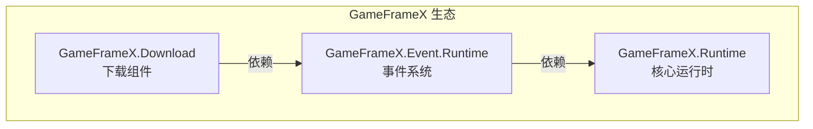

# インストール

このドキュメント介绍如何在 Unity プロジェクト中インストール Game Frame X Download 下载コンポーネント。

## 概要

Game Frame X Download 是 GameFrameX フレームワーク的下载管理コンポーネント，提供完全な的多任务下载解決策。该コンポーネントサポート断点续传、下载优先级、進捗实时アップデート等機能，并通过イベント系统提供下载ステータス的完全な通知。

> **注意**：此コンポーネント依赖于 **Event コンポーネント** (`com.gameframex.unity.event`)，在インストール时〜する必要があります同時にインストール依赖项。

### 系统要求

| 要求 | 最低バージョン |
|------|----------|
| Unity | 2017.1+ |
| GameFrameX.Runtime | 最新稳定版 |
| GameFrameX.Event | 最新稳定版 |

## インストール前准备

在开始インストール之前，请確認してください：

1. ✅ 已インストール Unity 2017.1 或更高バージョン
2. ✅ 理解する Unity Package Manager 的基本使用メソッド
3. ✅ 具备对プロジェクト `Packages/manifest.json` ファイル的编辑权限

## インストールメソッド

### 方法一：通过 manifest.json インストール（推奨）

这是最推奨的インストール方法，便于バージョン管理和团队协作。

1. 打开プロジェクト的 `Packages/manifest.json` ファイル
2. 在 `dependencies` 节点下追加以下内容：

```json
{
  "dependencies": {
    "com.gameframex.unity.event": "https://github.com/GameFrameX/com.gameframex.unity.event.git",
    "com.gameframex.unity.download": "https://github.com/GameFrameX/com.gameframex.unity.download.git"
  }
}
```

3. 保存ファイル后，Unity 会自动下载并インストール依赖パッケージ
4. 等待 Unity コンパイル完成

> Source: [README.md](https://github.com/GameFrameX/com.gameframex.unity.download/blob/main/README.md#L112-L118)

### 方法二：通过 Unity Package Manager インストール

もし您偏好使用 Unity エディタ的图形界面：

1. 打开 Unity エディタ
2. 进入 **Window → Package Manager** メニュー
3. 点击左上角的 **+** ボタン
4. 选择 **Add package from git URL...**
5. 在输入框中填入以下 URL：

```
https://github.com/GameFrameX/com.gameframex.unity.download.git
```

6. 点击 **Add** ボタン开始インストール
7. 同样〜する必要があります先インストールイベントコンポーネント，重复ステップ 3-6，追加以下 URL：

```
https://github.com/GameFrameX/com.gameframex.unity.event.git
```

8. 等待下载和インストール完成

### 方法三：直接放置ソースコード

適しています〜する必要があります変更ソースコード或离线使用的情况：

1. 从 GitHub リポジトリ下载或克隆ソースコード：

```bash
git clone https://github.com/GameFrameX/com.gameframex.unity.download.git
```

2. 将下载的ファイル夹复制到 Unity プロジェクト的 `Packages` ディレクトリ下
3. Unity 会自动识别并ロードパッケージ
4. 確認してください同時にインストール Event コンポーネント的ソースコード或预コンパイルパッケージ

## 依赖项説明

インストール Download コンポーネント时，系统会自动解析以下依赖：



| 依赖パッケージ | 説明 | 必需 |
|--------|------|------|
| `GameFrameX.Runtime` | コアランタイム，提供基本フレームワーク機能 | ✅ 必需 |
| `GameFrameX.Event.Runtime` | イベント系统，処理下载ステータス通知 | ✅ 必需 |
| `GameFrameX.Editor` | エディタ工具（仅开发时〜する必要があります） | ❌ 可选 |

## インストールの確認

インストール完成后，〜できます通过以下方法検証是否インストール成功：

### メソッド一：確認 Package Manager

打开 **Window → Package Manager**，確認以下パッケージ已正确インストール：

- `Game Frame X Download` - バージョン号应为 1.1.0
- `Game Frame X Event` - イベントコンポーネント

### メソッド二：確認脚本コンパイル

在プロジェクト中作成一个シンプル的テスト脚本，確認以下名前空間〜できます正常参照：

```csharp
using GameFrameX.Download.Runtime;
// 如果编译通过，说明安装成功
```

### メソッド三：確認コンポーネントメニュー

在 Unity エディタ中：

1. 作成一个新的 GameObject
2. 右键点击 Inspector パネル
3. 確認メニュー中是否出现 **Game Framework → Download** オプション

## プロジェクト設定

### Assembly Definition

インストール后，系统会自动設定以下アセンブリ定義ファイル：

| アセンブリ | 路径 | 用途 |
|--------|------|------|
| `GameFrameX.Download.Runtime` | `Runtime/GameFrameX.Download.Runtime.asmdef` | ランタイムアセンブリ |
| `GameFrameX.Download.Editor` | `Editor/GameFrameX.Download.Editor.asmdef` | エディタアセンブリ |

ランタイムアセンブリ的依赖設定如下：

```json
{
  "name": "GameFrameX.Download.Runtime",
  "references": [
    "GameFrameX.Runtime",
    "GameFrameX.Event.Runtime"
  ]
}
```

> Source: [Runtime/GameFrameX.Download.Runtime.asmdef](https://github.com/GameFrameX/com.gameframex.unity.download/blob/main/Runtime/GameFrameX.Download.Runtime.asmdef#L1-L17)

## よくある問題

### Q1: インストール后コンパイル报错怎么办？

请確認してください：
1. 已正确インストール Event コンポーネント依赖
2. Unity バージョン符合要求（2017.1+）
3. 尝试执行 **File → Build Settings → Switch Platform** 重新コンパイル

### Q2: 下载機能无法使用？

確認是否满足以下条件：
1. `DownloadComponent` コンポーネント已追加到シーン中
2. `EventComponent` コンポーネント也已追加
3. 网络权限已設定（见下文）

### Q3: 如何設定网络权限？

对于〜する必要があります访问互联网的下载機能，〜する必要があります在 `Assets/Plugins/Android` ディレクトリ下作成或変更 `AndroidManifest.xml`，追加网络权限：

```xml
<uses-permission android:name="android.permission.INTERNET" />
```

## 后续ステップ

インストール完成后，お勧め继续阅读以下ドキュメント：

- [基本設定](./3-getting-started.basic-setup) - 理解するコンポーネント的基本設定
- [首个例](./3-getting-started.first-example) - 作成您的第1个下载任务
- [コアコンセプト](./4-core-concepts.architecture) - 深入理解するフレームワークアーキテクチャ

## 関連リンク

- [GitHub リポジトリ](https://github.com/GameFrameX/com.gameframex.unity.download.git)
- [官方ドキュメント](https://gameframex.doc.alianblank.com)
- [Event コンポーネント](https://github.com/GameFrameX/com.gameframex.unity.event)
- [問題反馈](mailto:alianblank@outlook.com)
