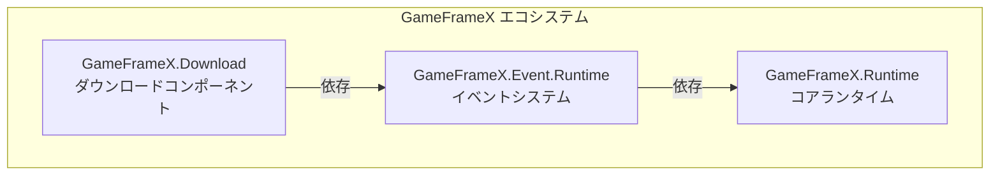

# インストール

このドキュメントでは、Unity プロジェクトに Game Frame X Download ダウンロードコンポーネントをインストールする方法について説明します。

## 概要

Game Frame X Download は、GameFrameX フレームワークのダウンロード管理コンポーネントであり、完全なマルチタスクダウンロード解決策を提供します。このコンポーネントはレジューム対応、ダウンロード優先度、進捗のリアルタイム更新などの機能をサポートし、イベントシステムを通じてダウンロードステータスの完全な通知を提供します。

> **注意**：このコンポーネントは **Event コンポーネント** (`com.gameframex.unity.event`) に依存しています。インストール時に依存項目も同時にインストールする必要があります。

### システム要件

| 要件 | 最小バージョン |
|------|----------|
| Unity | 2017.1+ |
| GameFrameX.Runtime | 最新安定版 |
| GameFrameX.Event | 最新安定版 |

## インストール前の準備

インストールを開始する前に、以下を確認してください：

1. ✅ Unity 2017.1 以降がインストールされている
2. ✅ Unity Package Manager の基本使用方法了解了
3. ✅ プロジェクトの `Packages/manifest.json` ファイルの編集権限がある

## インストール方法

### 方法1：manifest.json を通じてインストール（推奨）

これが最も推奨されるインストール方法であり、版本管理与とチーム協作が容易です。

1. プロジェクトの `Packages/manifest.json` ファイルを開く
2. `dependencies` ノードの下に以下の内容を追加：

```json
{
  "dependencies": {
    "com.gameframex.unity.event": "https://github.com/GameFrameX/com.gameframex.unity.event.git",
    "com.gameframex.unity.download": "https://github.com/GameFrameX/com.gameframex.unity.download.git"
  }
}
```

3. ファイルを保存すると、Unity は自動的に依存パッケージをダウンロードしてインストール
4. Unity のコンパイルが完了するまで待つ

> ソース: [README.md](https://github.com/GameFrameX/com.gameframex.unity.download/blob/main/README.md#L112-L118)

### 方法2：Unity Package Manager を通じてインストール

Unity エディターのGUIを使用する偏好がある場合：

1. Unity エディターを開く
2. **Window → Package Manager** メニュー入る
3. 左上の **+** ボタンをクリック
4. **Add package from git URL...** を選択
5. 入力框に以下の URL を入力：

```
https://github.com/GameFrameX/com.gameframex.unity.download.git
```

6. **Add** ボタンをクリックしてインストール開始
7. イベントコンポーネントも先にインストールする必要があるため、手順 3-6 を繰り返し、以下の URL を追加：

```
https://github.com/GameFrameX/com.gameframex.unity.event.git
```

8. ダウンロードとインストールが完了するまで待つ

### 方法3：ソースコードを直接配置

ソースコードの修改が必要な場合またはオフライン使用的情況：

1. GitHub トレポジトリからソースコードをダウンロードまたはクローン：

```bash
git clone https://github.com/GameFrameX/com.gameframex.unity.download.git
```

2. ダウンロードしたフォルダを Unity プロジェクトの `Packages` ディレクトリにコピー
3. Unity は自動的にパッケージを識別してロード
4. Event コンポーネントのソースコードまたはプリコンパイルパッケージも同時にインストールされていることを確認

## 依存関係について

Download コンポーネントをインストールすると、システムは自動的に以下の依存関係を解決：



| 依存パッケージ | 説明 | 必須 |
|--------|------|------|
| `GameFrameX.Runtime` | コアランタイム、基本フレームワーク機能を提供 | ✅ 必須 |
| `GameFrameX.Event.Runtime` | イベントシステム、ダウンロードステータス通知を処理 | ✅ 必須 |
| `GameFrameX.Editor` | エディターツール（開発時のみ必要） | ❌ 任意 |

## インストール検証

インストールが完了したら、以下の方法でインストールが成功したか確認できます：

### 方法1：Package Manager を確認

**Window → Package Manager** を開き、以下のパッケージが正しくインストールされていることを確認：

- `Game Frame X Download` - バージョン番号は 1.1.0
- `Game Frame X Event` - イベントコンポーネント

### 方法2：スクリプトコンパイルを確認

プロジェクトで単純なテストスクリプトを作成し、以下のネームスペースが正常に参照できることを確認：

```csharp
using GameFrameX.Download.Runtime;
// コンパイルが通れば、インストール成功
```

### 方法3：コンポーネントメニューを確認

Unity エディターで：

1. 新しい GameObject を作成
2. Inspector パネルで右键クリック
3. メニューに **Game Framework → Download** オプションが表示されているか確認

## プロジェクト設定

### Assembly Definition

インストール後、システムは以下のアセンブリ定義ファイルを自動的に設定：

| アセンブリ | パス | 用途 |
|--------|------|------|
| `GameFrameX.Download.Runtime` | `Runtime/GameFrameX.Download.Runtime.asmdef` | ランタイムアセンブリ |
| `GameFrameX.Download.Editor` | `Editor/GameFrameX.Download.Editor.asmdef` | エディターアセンブリ |

ランタイムアセンブリの依存関係設定は以下の通りです：

```json
{
  "name": "GameFrameX.Download.Runtime",
  "references": [
    "GameFrameX.Runtime",
    "GameFrameX.Event.Runtime"
  ]
}
```

> ソース: [Runtime/GameFrameX.Download.Runtime.asmdef](https://github.com/GameFrameX/com.gameframex.unity.download/blob/main/Runtime/GameFrameX.Download.Runtime.asmdef#L1-L17)

## よくある質問

### Q1: インストール後コンパイルエラーが発生した場合は？

以下を確認してください：
1. Event コンポーネントの依存関係が正しくインストールされている
2. Unity バージョンが要件を満たしている（2017.1+）
3. **File → Build Settings → Switch Platform** を実行して再コンパイルを試みる

### Q2: ダウンロード機能が使用できない場合は？

以下の条件を満たしているか確認：
1. `DownloadComponent` コンポーネントがシーンに追加されている
2. `EventComponent` コンポーネントも追加されている
3. ネットワーク権限が設定されている（以下を参照）

### Q3: ネットワーク権限を設定する方法は？

インターネットアクセスが必要なダウンロード機能については、`Assets/Plugins/Android` ディレクトリに `AndroidManifest.xml` を作成または修正し、ネットワーク権限を追加：

```xml
<uses-permission android:name="android.permission.INTERNET" />
```

## 次のステップ

インストール完了後、以下のドキュメントを読むことをお勧めします：

- [基本設定](./06.basic-setup) - コンポーネントの基本設定的了解
- [最初の手示例](./03.getting-started) - はじめてのダウンロードタスクの作成
- [コアコンセプト](./05.architecture) - フレームワークアーキテクチャの詳細的了解

## 関連リンク

- [GitHub トレポジトリ](https://github.com/GameFrameX/com.gameframex.unity.download.git)
- [公式ドキュメント](https://gameframex.doc.alianblank.com)
- [Event コンポーネント](https://github.com/GameFrameX/com.gameframex.unity.event)
- [問題報告](mailto:alianblank@outlook.com)