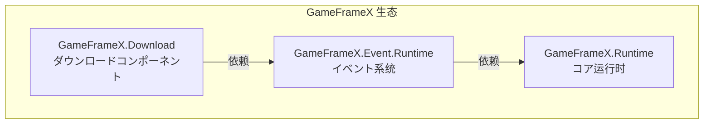

# 安装

本文档介绍如何在 Unity プロジェクト中安装 Game Frame X Download ダウンロードコンポーネント。

## 概要

Game Frame X Download 是 GameFrameX フレームワーク的ダウンロード管理コンポーネント，提供完整的多任务ダウンロード解決策。该コンポーネントサポート断点续传、ダウンロード优先级、进度实时更新等機能，并を通じてイベント系统提供ダウンロードステータス的完整通知。

> **注意**：此コンポーネント依赖于 **Event コンポーネント** (`com.gameframex.unity.event`)，在安装时必要同时安装依赖项。

### システム要件

| 要求 | 最小バージョン |
|------|----------|
| Unity | 2017.1+ |
| GameFrameX.Runtime | 最新稳定版 |
| GameFrameX.Event | 最新稳定版 |

## 安装前准备

在开始安装之前，必ず：

1. ✅ 已安装 Unity 2017.1 或更高版本
2. ✅ 了解 Unity Package Manager 的基本使用メソッド
3. ✅ 具备对プロジェクト `Packages/manifest.json` ファイル的编辑权限

## インストールメソッド

### メソッド一：を通じて manifest.json 安装（推荐）

这是最推荐的安装方法，便于版本管理和团队协作。

1. 打开プロジェクト的 `Packages/manifest.json` ファイル
2. 在 `dependencies` ノードに追加以下の内容：

```json
{
  "dependencies": {
    "com.gameframex.unity.event": "https://github.com/GameFrameX/com.gameframex.unity.event.git",
    "com.gameframex.unity.download": "https://github.com/GameFrameX/com.gameframex.unity.download.git"
  }
}
```

3. 保存ファイル后，Unity 会自动ダウンロード并安装依赖包
4. 等待 Unity 编译完成

> Source: [README.md](https://github.com/GameFrameX/com.gameframex.unity.download/blob/main/README.md#L112-L118)

### メソッド二：を通じて Unity Package Manager 安装

如果您偏好使用 Unity 编辑器的图形界面：

1. 打开 Unity 编辑器
2. 进入 **Window → Package Manager** 菜单
3. 点击左上角的 **+** 按钮
4. 选择 **Add package from git URL...**
5. 在输入框中填入以下 URL：

```
https://github.com/GameFrameX/com.gameframex.unity.download.git
```

6. 点击 **Add** 按钮开始安装
7. 同样必要先安装イベントコンポーネント，重复手順 3-6，添加以下 URL：

```
https://github.com/GameFrameX/com.gameframex.unity.event.git
```

8. 等待ダウンロード和安装完成

### メソッド三：直接放置源码

适に使用必要修改源码或离线使用的情况：

1. 从 GitHub 仓库ダウンロード或克隆源码：

```bash
git clone https://github.com/GameFrameX/com.gameframex.unity.download.git
```

2. 将ダウンロード的ファイル夹复制到 Unity プロジェクト的 `Packages` ディレクトリ下
3. Unity 会自动识别并加载包
4. 确保同时安装 Event コンポーネント的源码或预编译包

## 依赖项説明

安装 Download コンポーネント时，系统会自动解析以下依赖：



| 依赖包 | 説明 | 必須 |
|--------|------|------|
| `GameFrameX.Runtime` | コア运行时，提供基础フレームワーク機能 | ✅ 必須 |
| `GameFrameX.Event.Runtime` | イベント系统，处理ダウンロードステータス通知 | ✅ 必須 |
| `GameFrameX.Editor` | 编辑器工具（仅开发时必要） | ❌ 可选 |

## 安装验证

インストール完了後，以下のメソッドで確認可能是否インストール成功：

### メソッド一：检查 Package Manager

打开 **Window → Package Manager**，确认以下包已正确安装：

- `Game Frame X Download` - 版本号应为 1.1.0
- `Game Frame X Event` - イベントコンポーネント

### メソッド二：检查脚本编译

在プロジェクト中作成一个简单的测试脚本，确认以下名前空間可能正常引用：

```csharp
using GameFrameX.Download.Runtime;
// 如果编译を通じて，説明インストール成功
```

### メソッド三：检查コンポーネント菜单

在 Unity 编辑器中：

1. 作成一个新的 GameObject
2. 右键点击 Inspector 面板
3. 检查菜单中是否出现 **Game Framework → Download** 选项

## プロジェクト配置

### Assembly Definition

安装后，系统会自动配置以下程序集定义ファイル：

| 程序集 | 路径 | 用途 |
|--------|------|------|
| `GameFrameX.Download.Runtime` | `Runtime/GameFrameX.Download.Runtime.asmdef` | 运行时程序集 |
| `GameFrameX.Download.Editor` | `Editor/GameFrameX.Download.Editor.asmdef` | 编辑器程序集 |

运行时程序集的依赖配置如下：

```json
{
  "name": "GameFrameX.Download.Runtime",
  "references": [
    "GameFrameX.Runtime",
    "GameFrameX.Event.Runtime"
  ]
}
```

> Source: [Runtime/GameFrameX.Download.Runtime.asmdef](https://github.com/GameFrameX/com.gameframex.unity.download/blob/main/Runtime/GameFrameX.Download.Runtime.asmdef#L1-L17)

## よくある質問

### Q1: 安装后编译报错怎么办？

必ず：
1. 已正确安装 Event コンポーネント依赖
2. Unity 版本符合要求（2017.1+）
3. 尝试执行 **File → Build Settings → Switch Platform** 重新编译

### Q2: ダウンロード機能无法使用？

检查是否满足以下条件：
1. `DownloadComponent` コンポーネント已添加到シーン中
2. `EventComponent` コンポーネント也已添加
3. 网络权限已配置（见下文）

### Q3: 如何配置网络权限？

对于必要访问互联网的ダウンロード機能，必要在 `Assets/Plugins/Android` ディレクトリ下作成或修改 `AndroidManifest.xml`，添加网络权限：

```xml
<uses-permission android:name="android.permission.INTERNET" />
```

## 后续手順

インストール完了後，建议继续阅读以下文档：

- [基础配置](./3-getting-started.basic-setup) - 了解コンポーネント的基本配置
- [首个示例](./3-getting-started.first-example) - 作成您的第一个ダウンロード任务
- [コア概念](./4-core-concepts.architecture) - 深入了解フレームワーク架构

## 関連リンク

- [GitHub 仓库](https://github.com/GameFrameX/com.gameframex.unity.download.git)
- [官方文档](https://gameframex.doc.alianblank.com)
- [Event コンポーネント](https://github.com/GameFrameX/com.gameframex.unity.event)
- [问题反馈](mailto:alianblank@outlook.com)
