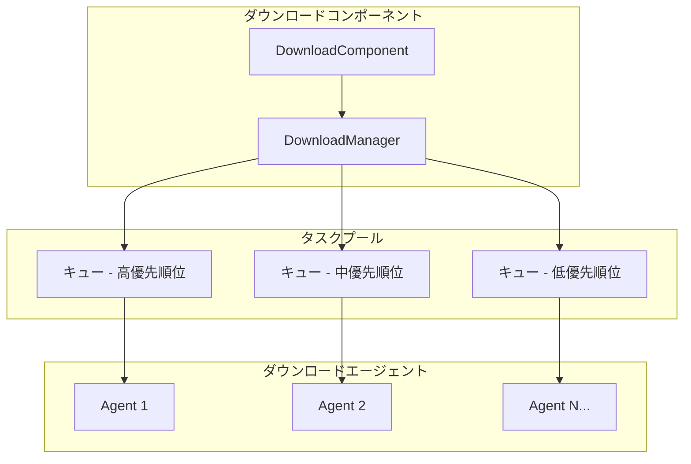
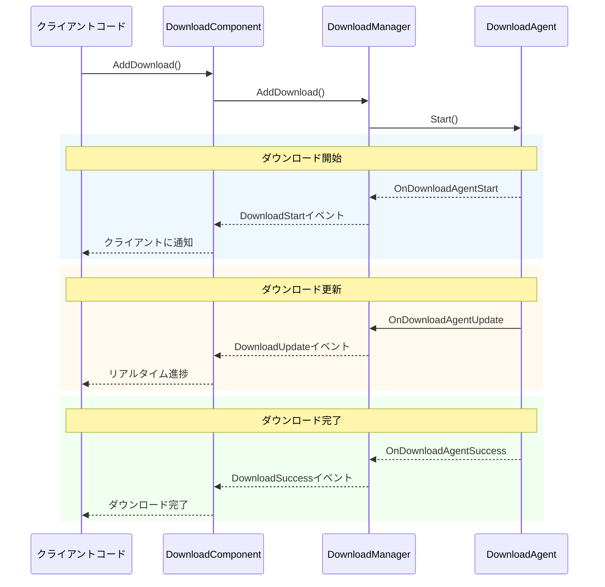
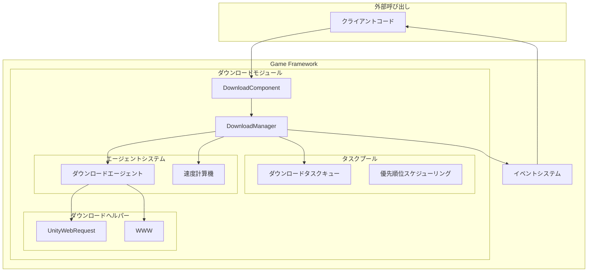

# 機能特性

GameFrameX Downloadダウンロードコンポーネントは、強力なUnityアセットダウンロード管理モジュールであり、完全なダウンロードタスクキュー管理、レジューム（中途再開）、優先順位スケジューリング、リアルタイム進捗監視などの機能を提供します。

## 概要

ダウンロードコンポーネントはGameFrameXフレームワークの中核モジュールの一つであり、ゲームリソースのダウンロード要件を処理するために特地設計されています。このコンポーネントはタスクプールアーキテクチャに基づいて設計されており、マルチスレッド同時ダウンロードをサポートし、複数のダウンロードタスクを同時に管理でき、イベントメカニズムを通じてダウンロード状況のリアルタイム更新をプッシュします。

> コンポーネントの概要とアーキテクチャ設計については、[プラグイン紹介](./1-overview.introduction)および[アーキテクチャ概要](./4-core-concepts.architecture)を参照してください。

## コア機能

### 1. マルチタスクキュー管理

ダウンロードコンポーネントはタスクプール（TaskPool）アーキテクチャを採用しており、複数のダウンロードタスクを同時に管理できます。タスクキューには以下の特性があります：

- **FIFOキュー**：先入れ先出しの順序でタスクを処理
- **優先順位スケジューリング**：高優先順位タスクが優先的に実行される
- **タスク状態追跡**：各タスクの状態をリアルタイムで記録（待機中、実行中、完了済み、エラー）
- **シリアルID識別**：各タスクはユニークなシリアルIDを持ち、追跡・管理が容易



> 出典: [DownloadManager.cs](https://github.com/GameFrameX/com.gameframex.unity.download/blob/main/Runtime/Download/Download/DownloadManager.cs#L22-L44)

### 2. レジューム（中途再開）サポート

レジュームはダウンロードコンポーネントのコア機能の一つであり、大容量ファイルのダウンロード信頼性を大幅に向上させます：

- **自動検出**：システムはローカルに未完了のダウンロードファイル（`.download`サフィックス）を自動的に検出
- **Rangeリクエスト**：HTTP Rangeヘッダーを使用して前回の停止位置からダウンロードを継続
- **増分ダウンロード**：ファイルの新規部分のみをダウンロードし、帯域幅と時間を節約
- **状態検証**：ダウンロード完了後にファイルの整合性を自動的に検証

```csharp
// DownloadAgent.csのレジュームコアロジック
if (File.Exists(downloadFile))
{
    m_FileStream = File.OpenWrite(downloadFile);
    m_FileStream.Seek(0L, SeekOrigin.End);
    m_StartLength = m_SavedLength = m_FileStream.Length;
    m_DownloadedLength = 0L;
}
// 停止位置からダウンロードを継続
if (m_StartLength > 0L)
{
    m_Helper.Download(m_Task.DownloadUri, m_StartLength, m_Task.UserData);
}
```

> 出典: [DownloadManager.DownloadAgent.cs#L168-L204](https://github.com/GameFrameX/com.gameframex.unity.download/blob/main/Runtime/Download/Download/DownloadManager.DownloadAgent.cs#L168-L204)

### 3. マルチダウンロードエージェント並列処理

ダウンロードコンポーネントは複数のダウンロードエージェント（Download Agent）の構成をサポートし、並列ダウンロードを実現します：

- **構成可能数量**：1-16個の代理をエディタで設定可能
- **作業状態監視**：リアルタイムで代理の作業状態を取得
- **ロードバランシング**：タスクは自動的に空き代理に割り当てられる
- **独立動作**：各代理は相互に独立しており、干渉しない

| 属性 | 説明 |
|------|------|
| TotalAgentCount | ダウンロードエージェントの総数 |
| FreeAgentCount | 使用可能（空き）エージェント数 |
| WorkingAgentCount | 作業中のエージェント数 |
| WaitingTaskCount | 待機中のタスク数 |

```csharp
// Startメソッドで複数のダウンロードエージェントを初期化
for (int i = 0; i < m_DownloadAgentHelperCount; i++)
{
    AddDownloadAgentHelper(i);
}
```

> 出典: [DownloadComponent.cs#L178-L181](https://github.com/GameFrameX/com.gameframex.unity.download/blob/main/Runtime/Download/DownloadComponent.cs#L178-L181)

### 4. リアルタイムダウンロード速度監視

コンポーネントには組み込みのダウンロード速度計算機能が搭載されており、正確なリアルタイムダウンロードレートを提供します：

- **スライディングウィンドウアルゴリズム**：時間ウィンドウを使用して瞬間速度を計算
- **オンデマンド更新**：速度値は実際のダウンロードデータに基づいて動的に更新
- **マルチエージェント集計**：複数のエージェントの速度は自動的に累積

```csharp
public float CurrentSpeed
{
    get { return m_DownloadCounter.CurrentSpeed; }
}
```

> 出典: [DownloadManager.cs#L117-L120](https://github.com/GameFrameX/com.gameframex.unity.download/blob/main/Runtime/Download/Download/DownloadManager.cs#L117-L120)

### 5. イベント駆動通知

ダウンロードのライフサイクル全体にわたる完全なイベントシステム：



| イベント | 説明 | トリガータイミング |
|------|------|----------|
| DownloadStart | ダウンロード開始 | エージェントがタスクの処理を開始する時 |
| DownloadUpdate | ダウンロード更新 | データブロックを受信した時 |
| DownloadSuccess | ダウンロード成功 | ファイルが完全にダウンロード完了した時 |
| DownloadFailure | ダウンロード失敗 | エラーまたはタイムアウトが発生した時 |

> イベントパラメータの詳細については、[ダウンロードイベント](./6-events.download-events)を参照してください。

### 6. 一時停止と再開

グローバル一時停止機能により、いつでもすべてのダウンロードタスクを一時停止/再開できます：

```csharp
// すべてのダウンロードを一時停止
downloadComponent.Paused = true;

// ダウンロードを再開
downloadComponent.Paused = false;
```

> 出典: [DownloadComponent.cs#L46-L50](https://github.com/GameFrameX/com.gameframex.unity.download/blob/main/Runtime/Download/DownloadComponent.cs#L46-L50)

### 7. タグ化管理

タグ（Tag）を使用してダウンロードタスクをグループ化管理することをサポート：

- **タグ別クエリ**：指定したタグのすべてのダウンロードタスクを取得
- **タグ別削除**：指定したタグのすべてのタスクを一度に削除
- **柔軟な整理**：リソースタイプ、更新バッチなどの方法でタスクを整理可能

```csharp
// タグ付きダウンロードタスクを追加
int serialId = downloadComponent.AddDownload(downloadPath, downloadUri, "resources");

// 指定したタグのタスク情報を取得
TaskInfo[] tasks = downloadComponent.GetDownloadInfos("resources");

// 指定したタグのすべてのタスクを削除
downloadComponent.RemoveDownloads("resources");
```

> 出典: [DownloadComponent.cs#L250-L253](https://github.com/GameFrameX/com.gameframex.unity.download/blob/main/Runtime/Download/DownloadComponent.cs#L250-L253)

### 8. タイムアウトとバッファ設定

柔軟なダウンロードパラメータ設定：

| 設定項目 | 説明 | デフォルト値 |
|--------|------|--------|
| Timeout | ダウンロードタイムアウト時間（秒） | 30 |
| FlushSize | バッファからディスクへの書き込み閾値（バイト） | 1 MB |

- **Timeout**：単一リクエストの無応答タイムアウト時間
- **FlushSize**：メモリのバッファがこのサイズに達すると強制的にディスクに書き込み、データ損失を防ぐ

```csharp
// タイムアウト時間の設定（ランタイム）
downloadComponent.Timeout = 60f;

// FlushSizeの設定（ランタイム）
downloadComponent.FlushSize = 2 * 1024 * 1024; // 2MB
```

> 出典: [DownloadComponent.cs#L87-L100](https://github.com/GameFrameX/com.gameframex.unity.download/blob/main/Runtime/Download/DownloadComponent.cs#L87-L100)

### 9. マルチダウンロードエージェントヘルパー

コンポーネントは2つのダウンロード実装方式を提供します：

1. **UnityWebRequestDownloadAgentHelper**（推奨）
   - 最新のUnityネットワークリクエストAPI
   - Unity 2017.2+をサポート
   - 完全なレジュームサポート

2. **WWWDownloadAgentHelper**（後方互換性）
   - 従来のWWWクラス
   - Unity 2018.3より前のバージョンをサポート
   - レジュームはサーバーサポートに依存

```csharp
// UnityWebRequestを使用して停止位置からダウンロードを継続
m_UnityWebRequest.SetRequestHeader("Range",
    GameFrameX.Runtime.Utility.Text.Format("bytes={0}-", fromPosition));
m_UnityWebRequest.downloadHandler = new DownloadHandler(this);
```

> 出典: [UnityWebRequestDownloadAgentHelper.cs#L104-L121](https://github.com/GameFrameX/com.gameframex.unity.download/blob/main/Runtime/Download/UnityWebRequestDownloadAgentHelper.cs#L104-L121)

## システムアーキテクチャ



## 機能比較

| 機能 | 説明 | 状態 |
|------|------|------|
| マルチタスクキュー | 複数のダウンロードタスクを同時に管理 | ✅ サポート |
| レジューム | 前回の位置からダウンロードを継続 | ✅ サポート |
| 優先順位スケジューリング | 高優先順位タスクを先に処理 | ✅ サポート |
| リアルタイム速度 | 現在のダウンロード速度を表示 | ✅ サポート |
| イベント通知 | ダウンロード状況をリアルタイムでプッシュ | ✅ サポート |
| マルチエージェント並列 | 1-16個の代理で同時ダウンロード | ✅ サポート |
| 一時停止/再開 | すべてのタスクを一時停止・再開 | ✅ サポート |
| タグ管理 | タグでダウンロードタスクを整理 | ✅ サポート |
| タイムアウト制御 | ネットワークタイムアウト時間を設定 | ✅ サポート |
| バッファ管理 | ディスク書き込み頻度を制御 | ✅ サポート |

## 関連リンク

- [プラグイン紹介](./1-overview.introduction) - プラグインの背景と設計理念を理解する
- [アーキテクチャ概要](./4-core-concepts.architecture) - システムアーキテクチャの詳細
- [DownloadComponent](./4-core-concepts.download-component) - コアコンポーネントの詳細
- [ダウンロードエージェント](./4-core-concepts.download-agent) - ダウンロードエージェントのメカニズム
- [APIリファレンス](./5-api-reference.properties) - 完全なAPIドキュメント
- [インストールガイド](./2-installation) - クイックインストール設定