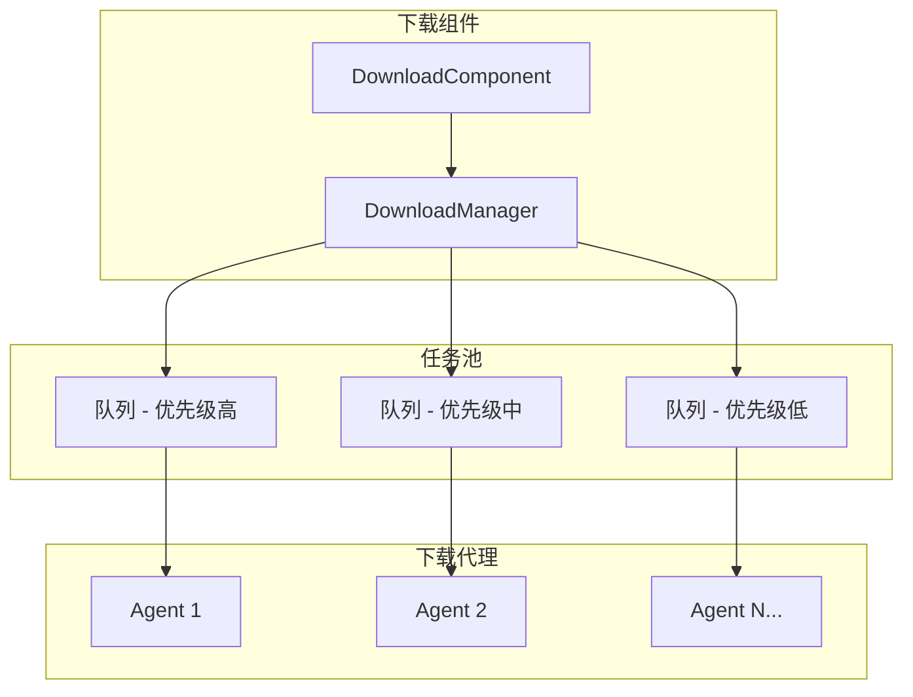
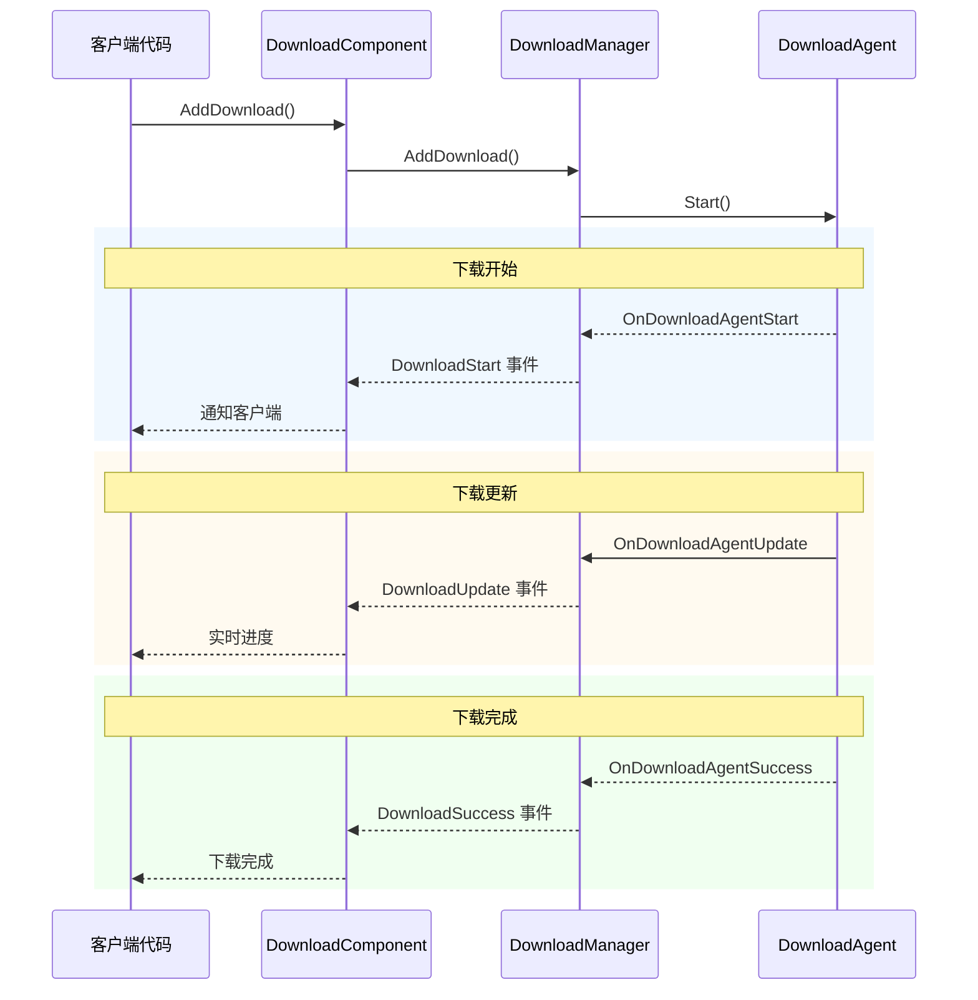
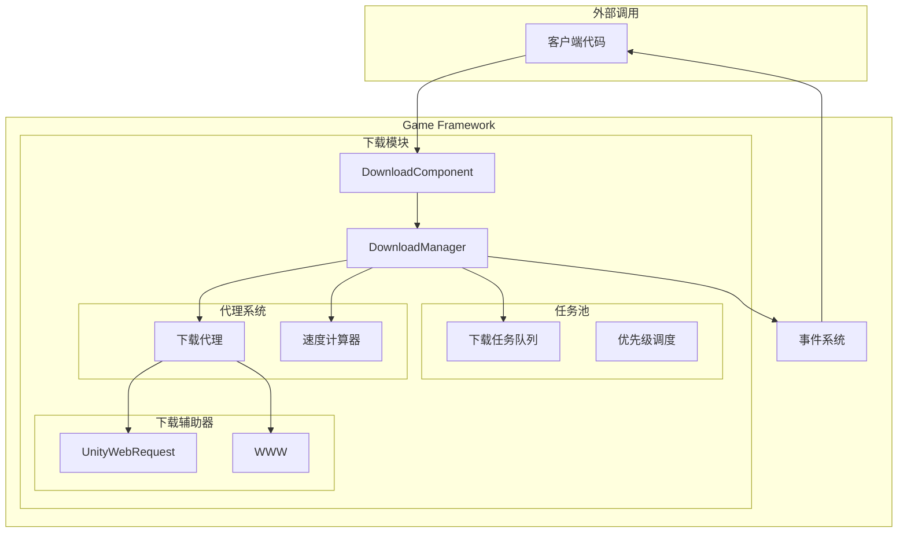

# 機能特性

GameFrameX Download 下载コンポーネントは機能強力的 Unity リソース下载管理モジュール，提供完全な的下载任务队列管理、断点续传、优先级调度、实时進捗监控等機能。

## 概要

下载コンポーネント是 GameFrameX フレームワーク的コアモジュール之一，专门用于処理游戏リソース的下载需求。该コンポーネント基于任务池アーキテクチャ設計，サポート多线程并发下载，可同時に管理多个下载任务，并通过イベント机制实时推送下载ステータスアップデート。

> 更多关于コンポーネント的介绍和アーキテクチャ設計，请参照 [プラグイン介绍](./1-overview.introduction) 和 [アーキテクチャ概要](./4-core-concepts.architecture)。

## コア機能

### 1. 多任务队列管理

下载コンポーネント采用任务池（TaskPool）アーキテクチャ，サポート同時に管理多个下载任务。任务队列具有以下特性：

- **FIFO 队列**：按先进先出顺序処理任务
- **优先级调度**：高优先级任务优先执行
- **任务ステータス追踪**：实时记录每个任务的ステータス（待処理、执行中、已完成、エラー）
- **序列 ID 标识**：每个任务拥有唯一的序列 ID，便于追踪和管理



> 来源: [DownloadManager.cs](https://github.com/GameFrameX/com.gameframex.unity.download/blob/main/Runtime/Download/Download/DownloadManager.cs#L22-L44)

### 2. 断点续传サポート

断点续传是下载コンポーネント的コア機能之一，显著提升大ファイル下载的可靠性：

- **自动检测**：系统自动检测本地是否存在未完成的下载ファイル（`.download` 后缀）
- **Range 请求**：使用 HTTP Range 头部从上次停止的位置继续下载
- **增量下载**：仅下载ファイル的新增部分，节省带宽和时间
- **ステータス検証**：下载完成后自动検証ファイル完全な性

```csharp
// DownloadAgent.cs 中断点续传核心逻辑
if (File.Exists(downloadFile))
{
    m_FileStream = File.OpenWrite(downloadFile);
    m_FileStream.Seek(0L, SeekOrigin.End);
    m_StartLength = m_SavedLength = m_FileStream.Length;
    m_DownloadedLength = 0L;
}
// 从断点位置继续下载
if (m_StartLength > 0L)
{
    m_Helper.Download(m_Task.DownloadUri, m_StartLength, m_Task.UserData);
}
```

> 来源: [DownloadManager.DownloadAgent.cs#L168-L204](https://github.com/GameFrameX/com.gameframex.unity.download/blob/main/Runtime/Download/Download/DownloadManager.DownloadAgent.cs#L168-L204)

### 3. 多下载代理并行

下载コンポーネントサポート設定多个下载代理（Download Agent），実装并行下载：

- **可設定数量**：1-16 个代理可通过エディタ設定
- **工作ステータス监控**：实时取得代理工作ステータス
- **负载均衡**：任务自动分配给空闲代理
- **独立运行**：每个代理相互独立，互不干扰

| プロパティ | 説明 |
|------|------|
| TotalAgentCount | 下载代理总数量 |
| FreeAgentCount | 可用（空闲）代理数量 |
| WorkingAgentCount | 工作中代理数量 |
| WaitingTaskCount | 等待执行的任务数量 |

```csharp
// 在 Start 方法中初始化多个下载代理
for (int i = 0; i < m_DownloadAgentHelperCount; i++)
{
    AddDownloadAgentHelper(i);
}
```

> 来源: [DownloadComponent.cs#L178-L181](https://github.com/GameFrameX/com.gameframex.unity.download/blob/main/Runtime/Download/DownloadComponent.cs#L178-L181)

### 4. 实时下载速度监控

コンポーネント内置下载速度计算器，提供准确的实时下载速率：

- **滑动ウィンドウ算法**：使用时间ウィンドウ计算瞬时速度
- **按需アップデート**：速度值根据实际下载数据动态アップデート
- **多代理汇总**：多个代理的速度自动累加

```csharp
public float CurrentSpeed
{
    get { return m_DownloadCounter.CurrentSpeed; }
}
```

> 来源: [DownloadManager.cs#L117-L120](https://github.com/GameFrameX/com.gameframex.unity.download/blob/main/Runtime/Download/Download/DownloadManager.cs#L117-L120)

### 5. イベント驱动通知

完全な的ライフサイクルイベント体系，涵盖下载全フロー：



| イベント | 説明 | トリガー时机 |
|------|------|----------|
| DownloadStart | 下载开始 | 代理开始処理任务时 |
| DownloadUpdate | 下载アップデート | 收到数据块时 |
| DownloadSuccess | 下载成功 | ファイル完全な下载完成时 |
| DownloadFailure | 下载失敗 | 发生エラー或超时时 |

> 詳細イベントパラメータ请参照 [下载イベント](./6-events.download-events)。

### 6. 暂停与恢复

全局暂停機能，可随时暂停/恢复所有下载任务：

```csharp
// 暂停所有下载
downloadComponent.Paused = true;

// 恢复下载
downloadComponent.Paused = false;
```

> 来源: [DownloadComponent.cs#L46-L50](https://github.com/GameFrameX/com.gameframex.unity.download/blob/main/Runtime/Download/DownloadComponent.cs#L46-L50)

### 7. 标签化管理

サポート使用标签（Tag）对下载任务进行分组管理：

- **按标签查询**：取得指定标签的所有下载任务
- **按标签移除**：一次性移除指定标签的所有任务
- **柔軟组织**：可按リソースタイプ、アップデート批次等方法组织任务

```csharp
// 添加带标签的下载任务
int serialId = downloadComponent.AddDownload(downloadPath, downloadUri, "resources");

// 获取指定标签的任务信息
TaskInfo[] tasks = downloadComponent.GetDownloadInfos("resources");

// 移除指定标签的所有任务
downloadComponent.RemoveDownloads("resources");
```

> 来源: [DownloadComponent.cs#L250-L253](https://github.com/GameFrameX/com.gameframex.unity.download/blob/main/Runtime/Download/DownloadComponent.cs#L250-L253)

### 8. 超时与缓冲区設定

柔軟的下载パラメータ設定：

| 設定项 | 説明 | デフォルト值 |
|--------|------|--------|
| Timeout | 下载超时时间（秒） | 30 |
| FlushSize | 缓冲区写入磁盘临界值（字节） | 1 MB |

- **Timeout**：单次请求无响应时的超时时间
- **FlushSize**：内存缓冲区达到此大小时强制写入磁盘，防止数据丢失

```csharp
// 配置超时时间（运行时）
downloadComponent.Timeout = 60f;

// 配置FlushSize（运行时）
downloadComponent.FlushSize = 2 * 1024 * 1024; // 2MB
```

> 来源: [DownloadComponent.cs#L87-L100](https://github.com/GameFrameX/com.gameframex.unity.download/blob/main/Runtime/Download/DownloadComponent.cs#L87-L100)

### 9. 多下载代理辅助器

コンポーネント提供两种下载実装方法：

1. **UnityWebRequestDownloadAgentHelper**（推奨）
   - 现代 Unity 网络请求 API
   - サポート Unity 2017.2+
   - 完全な的断点续传サポート

2. **WWWDownloadAgentHelper**（兼容性）
   - 传统 WWW 类
   - サポート Unity 2018.3 之前的バージョン
   - 断点续传依赖服务器サポート

```csharp
// 使用 UnityWebRequest 从断点继续下载
m_UnityWebRequest.SetRequestHeader("Range", 
    GameFrameX.Runtime.Utility.Text.Format("bytes={0}-", fromPosition));
m_UnityWebRequest.downloadHandler = new DownloadHandler(this);
```

> 来源: [UnityWebRequestDownloadAgentHelper.cs#L104-L121](https://github.com/GameFrameX/com.gameframex.unity.download/blob/main/Runtime/Download/UnityWebRequestDownloadAgentHelper.cs#L104-L121)

## システムアーキテクチャ



## 機能对比

| 機能 | 説明 | ステータス |
|------|------|------|
| 多任务队列 | 同時に管理多个下载任务 | ✅ サポート |
| 断点续传 | 从上次位置继续下载 | ✅ サポート |
| 优先级调度 | 高优先级任务优先処理 | ✅ サポート |
| 实时速度 | 显示当前下载速度 | ✅ サポート |
| イベント通知 | 下载ステータス实时推送 | ✅ サポート |
| 多代理并行 | 1-16个代理并发下载 | ✅ サポート |
| 暂停/恢复 | 暂停和恢复所有任务 | ✅ サポート |
| 标签管理 | 按标签组织下载任务 | ✅ サポート |
| 超时控制 | 設定网络超时时间 | ✅ サポート |
| 缓冲区管理 | 控制磁盘写入频率 | ✅ サポート |

## 関連リンク

- [プラグイン介绍](./1-overview.introduction) - 理解するプラグイン背景和設計理念
- [アーキテクチャ概要](./4-core-concepts.architecture) - 深入理解する系统アーキテクチャ
- [DownloadComponent](./4-core-concepts.download-component) - コアコンポーネント详解
- [下载代理](./4-core-concepts.download-agent) - 下载代理机制
- [API リファレンス](./5-api-reference.properties) - 完全な API ドキュメント
- [インストールガイド](./2-installation) - 快速インストール設定
