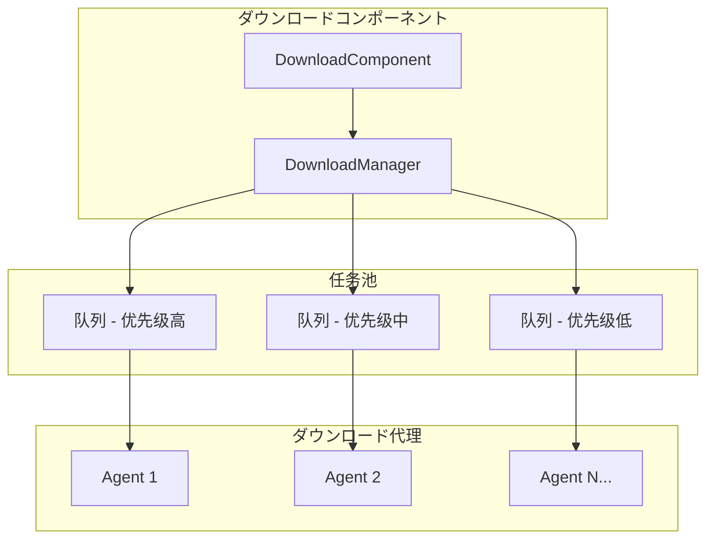
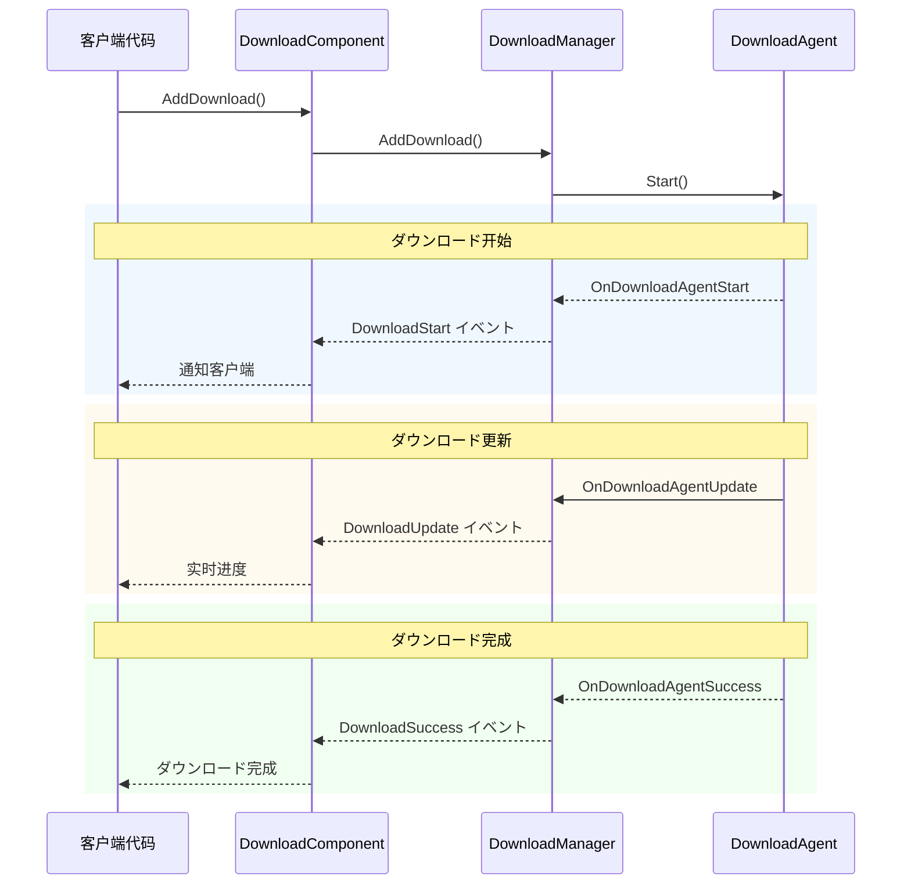
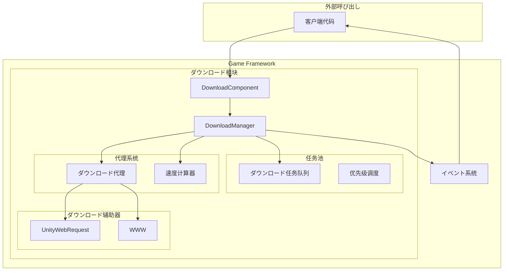

# 機能特性

GameFrameX Download ダウンロードコンポーネントは機能强大的 Unity リソースダウンロード管理模块，提供完整的ダウンロード任务队列管理、断点续传、优先级调度、实时进度监控等機能。

## 概要

ダウンロードコンポーネント是 GameFrameX フレームワーク的コア模块之一，专门に使用处理ゲームリソース的ダウンロード需求。该コンポーネント基づく任务池アーキテクチャ設計，サポート多线程并发ダウンロード，可同时管理多个ダウンロード任务，并を通じてイベント机制实时推送ダウンロードステータス更新。

> 更多关于コンポーネント的介绍和アーキテクチャ設計，お願いします参阅 [插件介绍](./1-overview.introduction) 和 [架构概述](./4-core-concepts.architecture)。

## コア機能

### 1. 多任务队列管理

ダウンロードコンポーネント采用任务池（TaskPool）架构，サポート同时管理多个ダウンロード任务。任务队列具有以下特性：

- **FIFO 队列**：按先进先出顺序处理任务
- **优先级调度**：高优先级任务优先执行
- **任务ステータス追踪**：实时记录每个任务的ステータス（待处理、执行中、已完成、错误）
- **序列 ID 标识**：每个任务拥有唯一的序列 ID，便于追踪和管理



> 来源: [DownloadManager.cs](https://github.com/GameFrameX/com.gameframex.unity.download/blob/main/Runtime/Download/Download/DownloadManager.cs#L22-L44)

### 2. 断点续传サポート

断点续传是ダウンロードコンポーネント的コア機能之一，显著提升大ファイルダウンロード的可靠性：

- **自动检测**：系统自动检测本地是否存在未完成的ダウンロードファイル（`.download` 后缀）
- **Range お願いします求**：使用 HTTP Range 头部从上次停止的位置继续ダウンロード
- **增量ダウンロード**：仅ダウンロードファイル的新增部分，节省带宽和时间
- **ステータス验证**：ダウンロード完成后自动验证ファイル完整性

```csharp
// DownloadAgent.cs 中断点续传コア逻辑
if (File.Exists(downloadFile))
{
    m_FileStream = File.OpenWrite(downloadFile);
    m_FileStream.Seek(0L, SeekOrigin.End);
    m_StartLength = m_SavedLength = m_FileStream.Length;
    m_DownloadedLength = 0L;
}
// 从断点位置继续ダウンロード
if (m_StartLength > 0L)
{
    m_Helper.Download(m_Task.DownloadUri, m_StartLength, m_Task.UserData);
}
```

> 来源: [DownloadManager.DownloadAgent.cs#L168-L204](https://github.com/GameFrameX/com.gameframex.unity.download/blob/main/Runtime/Download/Download/DownloadManager.DownloadAgent.cs#L168-L204)

### 3. 多ダウンロード代理并行

ダウンロードコンポーネントサポート配置多个ダウンロード代理（Download Agent），実装并行ダウンロード：

- **可配置数量**：1-16 个代理可を通じて编辑器配置
- **工作ステータス监控**：实时取得代理工作ステータス
- **负载均衡**：任务自动分配给空闲代理
- **独立运行**：每个代理相互独立，互不干扰

| プロパティ | 説明 |
|------|------|
| TotalAgentCount | ダウンロード代理总数量 |
| FreeAgentCount | 可用（空闲）代理数量 |
| WorkingAgentCount | 工作中代理数量 |
| WaitingTaskCount | 等待执行的任务数量 |

```csharp
// 在 Start メソッド中初期化多个ダウンロード代理
for (int i = 0; i < m_DownloadAgentHelperCount; i++)
{
    AddDownloadAgentHelper(i);
}
```

> 来源: [DownloadComponent.cs#L178-L181](https://github.com/GameFrameX/com.gameframex.unity.download/blob/main/Runtime/Download/DownloadComponent.cs#L178-L181)

### 4. 实时ダウンロード速度监控

コンポーネント内置ダウンロード速度计算器，提供准确的实时ダウンロード速率：

- **滑动窗口算法**：使用时间窗口计算瞬时速度
- **按需更新**：速度值に基づいて实际ダウンロード数据动态更新
- **多代理汇总**：多个代理的速度自动累加

```csharp
public float CurrentSpeed
{
    get { return m_DownloadCounter.CurrentSpeed; }
}
```

> 来源: [DownloadManager.cs#L117-L120](https://github.com/GameFrameX/com.gameframex.unity.download/blob/main/Runtime/Download/Download/DownloadManager.cs#L117-L120)

### 5. イベント驱动通知

完整的生命周期イベント体系，涵盖ダウンロード全フロー：



| イベント | 説明 | 触发时机 |
|------|------|----------|
| DownloadStart | ダウンロード开始 | 代理开始处理任务时 |
| DownloadUpdate | ダウンロード更新 | 收到数据块时 |
| DownloadSuccess | ダウンロード成功 | ファイル完整ダウンロード完成时 |
| DownloadFailure | ダウンロード失败 | 发生错误或超时时 |

> 详细イベント参数お願いします参阅 [ダウンロードイベント](./6-events.download-events)。

### 6. 暂停与恢复

全局暂停機能，可随时暂停/恢复所有ダウンロード任务：

```csharp
// 暂停所有ダウンロード
downloadComponent.Paused = true;

// 恢复ダウンロード
downloadComponent.Paused = false;
```

> 来源: [DownloadComponent.cs#L46-L50](https://github.com/GameFrameX/com.gameframex.unity.download/blob/main/Runtime/Download/DownloadComponent.cs#L46-L50)

### 7. 标签化管理

サポート使用标签（Tag）对ダウンロード任务进行分组管理：

- **按标签查询**：取得指定标签的所有ダウンロード任务
- **按标签移除**：一次性移除指定标签的所有任务
- **灵活组织**：可按リソースクラス型、更新批次等方法组织任务

```csharp
// 添加带标签的ダウンロード任务
int serialId = downloadComponent.AddDownload(downloadPath, downloadUri, "resources");

// 取得指定标签的任务信息
TaskInfo[] tasks = downloadComponent.GetDownloadInfos("resources");

// 移除指定标签的所有任务
downloadComponent.RemoveDownloads("resources");
```

> 来源: [DownloadComponent.cs#L250-L253](https://github.com/GameFrameX/com.gameframex.unity.download/blob/main/Runtime/Download/DownloadComponent.cs#L250-L253)

### 8. 超时与缓冲区配置

灵活的ダウンロード参数配置：

| 配置项 | 説明 | 默认值 |
|--------|------|--------|
| Timeout | ダウンロード超时时间（秒） | 30 |
| FlushSize | 缓冲区写入磁盘临界值（字节） | 1 MB |

- **Timeout**：单次お願いします求无响应时的超时时间
- **FlushSize**：内存缓冲区达到此大小时强制写入磁盘，防止数据丢失

```csharp
// 配置超时时间（运行时）
downloadComponent.Timeout = 60f;

// 配置FlushSize（运行时）
downloadComponent.FlushSize = 2 * 1024 * 1024; // 2MB
```

> 来源: [DownloadComponent.cs#L87-L100](https://github.com/GameFrameX/com.gameframex.unity.download/blob/main/Runtime/Download/DownloadComponent.cs#L87-L100)

### 9. 多ダウンロード代理辅助器

コンポーネント提供两种ダウンロード実装方法：

1. **UnityWebRequestDownloadAgentHelper**（推荐）
   - 现代 Unity 网络お願いします求 API
   - サポート Unity 2017.2+
   - 完整的断点续传サポート

2. **WWWDownloadAgentHelper**（兼容性）
   - 传统 WWW クラス
   - サポート Unity 2018.3 之前的版本
   - 断点续传依赖服务器サポート

```csharp
// 使用 UnityWebRequest 从断点继续ダウンロード
m_UnityWebRequest.SetRequestHeader("Range", 
    GameFrameX.Runtime.Utility.Text.Format("bytes={0}-", fromPosition));
m_UnityWebRequest.downloadHandler = new DownloadHandler(this);
```

> 来源: [UnityWebRequestDownloadAgentHelper.cs#L104-L121](https://github.com/GameFrameX/com.gameframex.unity.download/blob/main/Runtime/Download/UnityWebRequestDownloadAgentHelper.cs#L104-L121)

## 系统架构



## 機能对比

| 機能 | 説明 | ステータス |
|------|------|------|
| 多任务队列 | 同时管理多个ダウンロード任务 | ✅ サポート |
| 断点续传 | 从上次位置继续ダウンロード | ✅ サポート |
| 优先级调度 | 高优先级任务优先处理 | ✅ サポート |
| 实时速度 | 显示当前ダウンロード速度 | ✅ サポート |
| イベント通知 | ダウンロードステータス实时推送 | ✅ サポート |
| 多代理并行 | 1-16个代理并发ダウンロード | ✅ サポート |
| 暂停/恢复 | 暂停和恢复所有任务 | ✅ サポート |
| 标签管理 | 按标签组织ダウンロード任务 | ✅ サポート |
| 超时控制 | 配置网络超时时间 | ✅ サポート |
| 缓冲区管理 | 控制磁盘写入频率 | ✅ サポート |

## 関連リンク

- [插件介绍](./1-overview.introduction) - 了解插件背景和设计理念
- [架构概述](./4-core-concepts.architecture) - 深入了解系统架构
- [DownloadComponent](./4-core-concepts.download-component) - コアコンポーネント详解
- [ダウンロード代理](./4-core-concepts.download-agent) - ダウンロード代理机制
- [API 参考](./5-api-reference.properties) - 完整 API 文档
- [安装指南](./2-installation) - 快速安装配置
