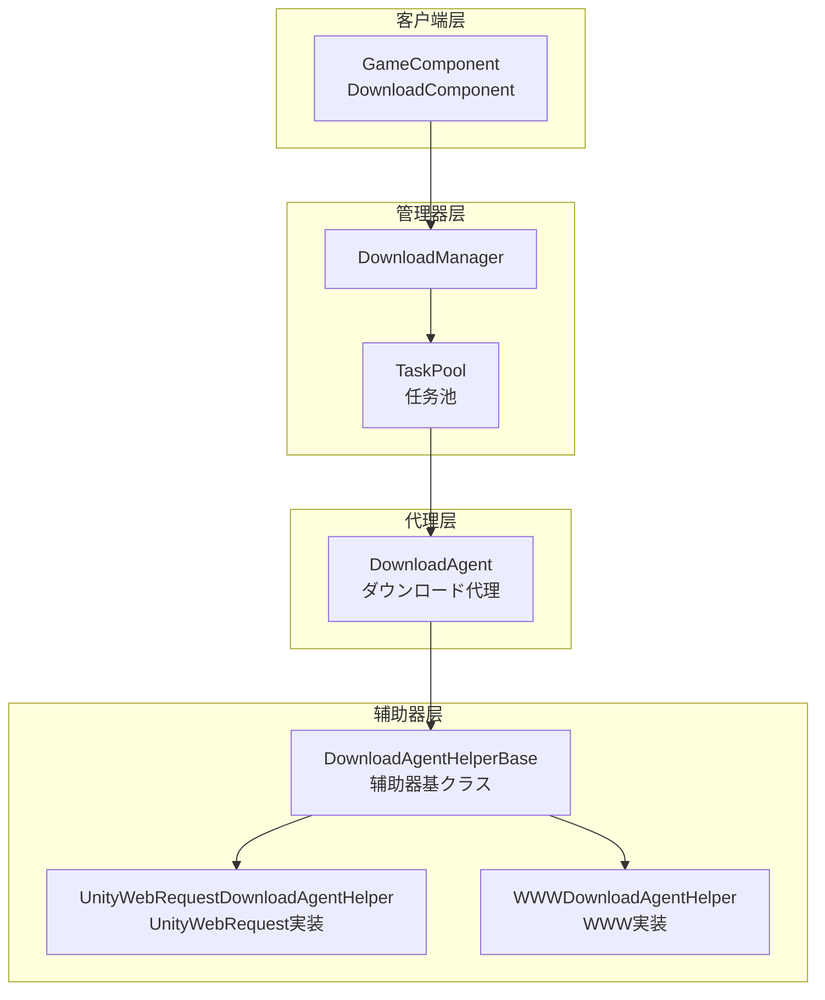
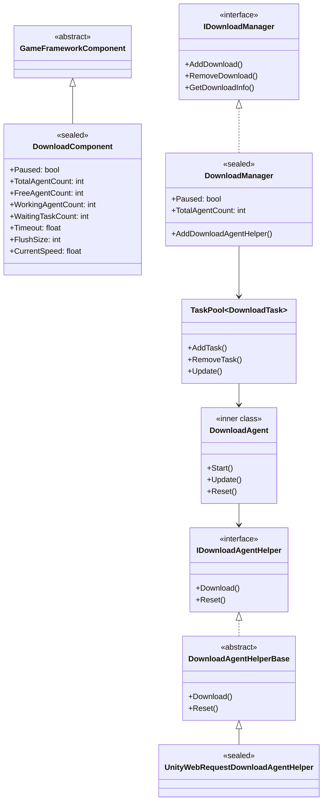
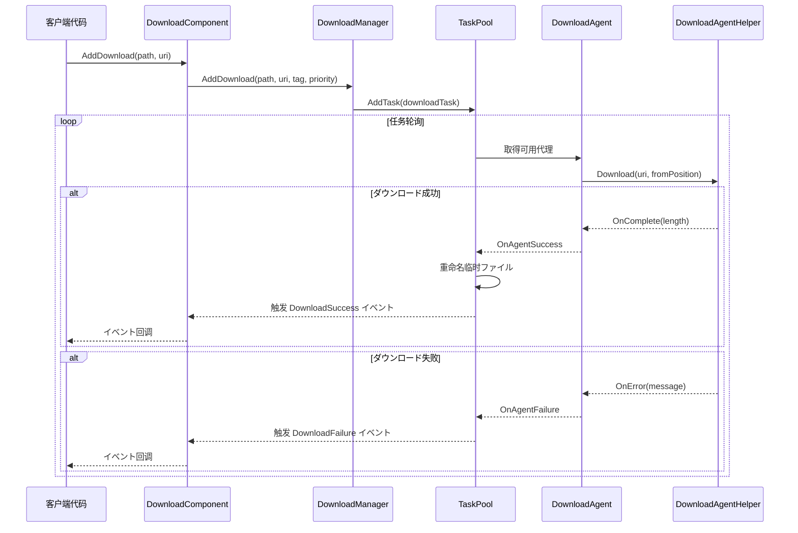
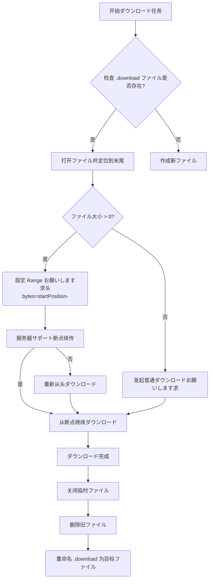
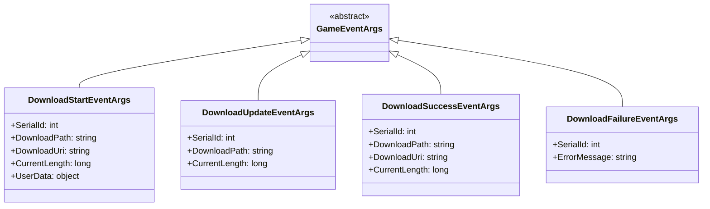

# 架构概述

GameFrameX Download 插件は機能完善的 Unity ダウンロード管理フレームワーク，提供します统一的任务调度、ダウンロード代理管理、断点续传和多线程ダウンロード能力。

## 概要

GameFrameX Download 插件是 GameFrameX フレームワーク的コアコンポーネント之一，专门为 Unity ゲーム提供高效、可靠的リソースダウンロード解決策。该插件采用モジュラー設計，将ダウンロード任务管理、代理调度和底层网络通信分离，便于扩展和维护。

**设计目标：**
- 提供统一的ダウンロード任务管理インターフェース
- サポート多线程并发ダウンロード
- 実装断点续传機能
- サポート可插拔的ダウンロード代理実装
- 提供完整的イベント系统に使用进度监控

## アーキテクチャ設計

该插件采用分层アーキテクチャ設計，从上到下分为四个主要层次：



### 架构层次説明

| 层次 | コンポーネント | 职责 |
|------|------|------|
| 客户端层 | DownloadComponent | 对外暴露ダウンロード機能，集成到 Unity コンポーネント系统 |
| 管理器层 | DownloadManager | 统一管理ダウンロード任务、イベント、代理池 |
| 代理层 | DownloadAgent | 处理单个ダウンロード任务的生命周期 |
| 辅助器层 | DownloadAgentHelper | 底层网络通信実装 |

## コアコンポーネント

### コンポーネント关系图



### コアコンポーネント职责

#### 1. DownloadComponent（ダウンロードコンポーネント）

`DownloadComponent` 是插件的エントリーポイント点，を継承 `GameFrameworkComponent`，直接挂载在 Unity シーン中使用。它负责：

- 初期化 `DownloadManager` 模块
- 作成和管理 `DownloadAgentHelper` インスタンス
- 对外暴露ダウンロード API
- 订阅并转发ダウンロードイベント

> Source: [DownloadComponent.cs](https://github.com/GameFrameX/com.gameframex.unity.download/blob/main/Runtime/Download/DownloadComponent.cs#L1-L443)

关键プロパティ：

```csharp
// 取得可用ダウンロード代理数量
public int FreeAgentCount { get; }

// 取得工作中ダウンロード代理数量
public int WorkingAgentCount { get; }

// 取得等待ダウンロード任务数量
public int WaitingTaskCount { get; }

// 取得当前ダウンロード速度（字节/秒）
public float CurrentSpeed { get; }
```

#### 2. DownloadManager（ダウンロード管理器）

`DownloadManager` 是コア模块，を継承 `GameFrameworkModule`，実装 `IDownloadManager` インターフェース。主要機能：

- 管理任务池（TaskPool）
- 注册和调度ダウンロード代理
- 维护ダウンロード计数器（DownloadCounter）
- 触发ダウンロードイベント

> Source: [DownloadManager.cs](https://github.com/GameFrameX/com.gameframex.unity.download/blob/main/Runtime/Download/Download/DownloadManager.cs#L1-L430)

```csharp
public sealed partial class DownloadManager : GameFrameworkModule, IDownloadManager
{
    private readonly TaskPool<DownloadTask> m_TaskPool;
    private readonly DownloadCounter m_DownloadCounter;
}
```

#### 3. DownloadAgent（ダウンロード代理）

`DownloadAgent` 是内部クラス，実装了 `ITaskAgent<DownloadTask>` インターフェース，负责单个ダウンロード任务的完整生命周期：

- 作成ダウンロード临时ファイル（.download 后缀）
- 处理断点续传逻辑
- 将ダウンロード数据写入磁盘
- 处理超时检测

> Source: [DownloadManager.DownloadAgent.cs](https://github.com/GameFrameX/com.gameframex.unity.download/blob/main/Runtime/Download/Download/DownloadManager.DownloadAgent.cs#L1-L358)

#### 4. DownloadAgentHelper（ダウンロード代理辅助器）

辅助器采用策略模式设计，サポート多种底层実装：

- `IDownloadAgentHelper`：辅助器インターフェース
- `DownloadAgentHelperBase`：抽象基底クラス
- `UnityWebRequestDownloadAgentHelper`：基づく UnityWebRequest 的実装（推荐）
- `WWWDownloadAgentHelper`：基づく WWW 的実装（已废弃）

> Source: [IDownloadAgentHelper.cs](https://github.com/GameFrameX/com.gameframex.unity.download/blob/main/Runtime/Download/Download/IDownloadAgentHelper.cs#L1-L66)
> Source: [UnityWebRequestDownloadAgentHelper.cs](https://github.com/GameFrameX/com.gameframex.unity.download/blob/main/Runtime/Download/UnityWebRequestDownloadAgentHelper.cs#L1-L230)

## コアフロー

### ダウンロード任务フロー



### 断点续传フロー

当已有ダウンロードファイル时，ダウンロード代理会自动检测并恢复ダウンロード：



## イベント系统

插件提供します完整的イベント系统，に使用监控ダウンロード进度和ステータス：



### イベント触发时机

| イベント | 触发时机 |
|------|----------|
| DownloadStart | ダウンロード代理开始处理任务 |
| DownloadUpdate | ダウンロード数据更新（每帧多次） |
| DownloadSuccess | ダウンロード完成并写入磁盘 |
| DownloadFailure | ダウンロード失败或出错 |

> 详细イベント参数説明お願いします参见 [ダウンロードイベント](./6-events.download-events) 文档。

## 設定选项

DownloadComponent 提供以下可配置项：

| プロパティ | クラス型 | 默认值 | 説明 |
|------|------|--------|------|
| DownloadAgentHelperTypeName | string | UnityWebRequestDownloadAgentHelper | ダウンロード代理辅助器クラス型 |
| DownloadAgentHelperCount | int | 3 | ダウンロード代理インスタンス数量 |
| Timeout | float | 30f | ダウンロード超时时间（秒） |
| FlushSize | int | 1MB | 缓冲区刷新大小 |

> 详细配置説明お願いします参见 [编辑器配置](./7-configuration.editor-configuration) 和 [ダウンロード代理配置](./7-configuration.agent-configuration) 文档。

## 扩展机制

### 自定义ダウンロード代理

可能を通じて继承 `DownloadAgentHelperBase` 作成自定义ダウンロード実装：

```csharp
public class CustomDownloadAgentHelper : DownloadAgentHelperBase
{
    public override void Download(string downloadUri, object userData)
    {
        // 実装自定义ダウンロード逻辑
    }
    
    public override void Download(string downloadUri, long fromPosition, object userData)
    {
        // 実装断点续传
    }
    
    public override void Download(string downloadUri, long fromPosition, long toPosition, object userData)
    {
        // 実装范围ダウンロード
    }
    
    public override void Reset()
    {
        // 清理リソース
    }
}
```

> 详细扩展説明お願いします参见 [ダウンロード代理](./4-core-concepts.download-agent) 文档。

## 性能特性

### 并发ダウンロード

插件サポート多代理并发ダウンロード，を通じて `DownloadAgentHelperCount` 配置代理数量。任务池会自动将任务分配给空闲的代理。

### 速度计算

使用移动平均算法计算ダウンロード速度：

```csharp
m_DownloadCounter = new DownloadCounter(1f, 10f);  // 1秒更新间隔，10秒平均
```

> 详细実装お願いします参见 [DownloadCounter](./4-core-concepts.download-component) 文档。

### 断点续传

- ダウンロード过程中使用 `.download` 临时ファイル
- サポート检测已有临时ファイル并恢复ダウンロード
- ダウンロード完成后自动重名前を付ける目标ファイル

## 関連リンク

- [DownloadComponent](./4-core-concepts.download-component) - ダウンロードコンポーネント详解
- [ダウンロード代理](./4-core-concepts.download-agent) - 代理実装详解
- [ダウンロードイベント](./6-events.download-events) - イベント系统详解
- [编辑器配置](./7-configuration.editor-configuration) - 编辑器配置
- [ダウンロード代理配置](./7-configuration.agent-configuration) - 代理配置
- [API 参考](./5-api-reference.properties) - プロパティ API
- [API 参考](./5-api-reference.methods) - メソッド API
