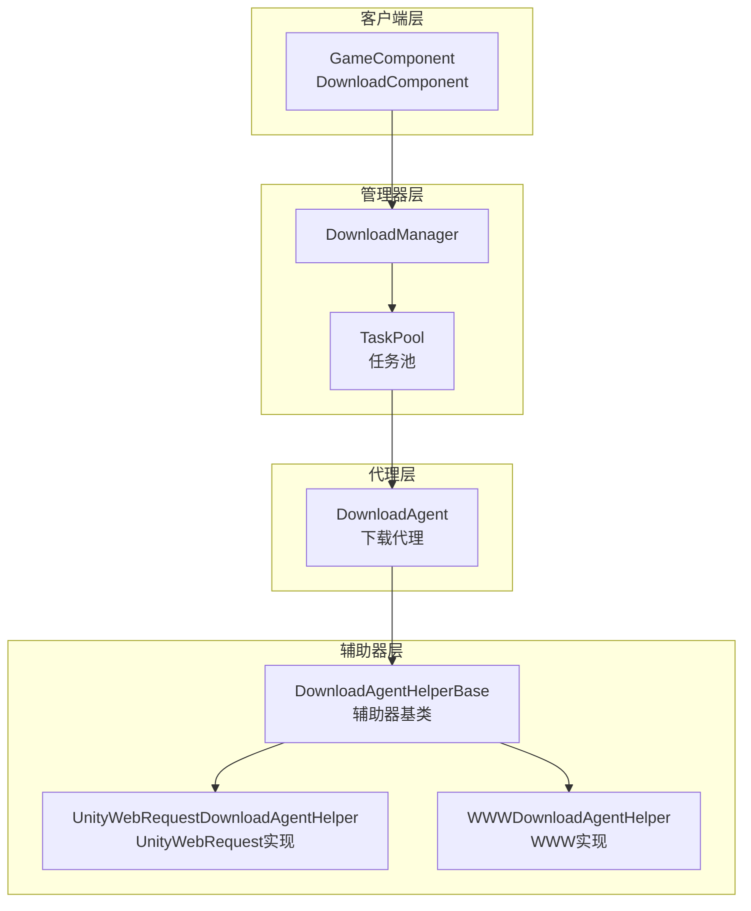
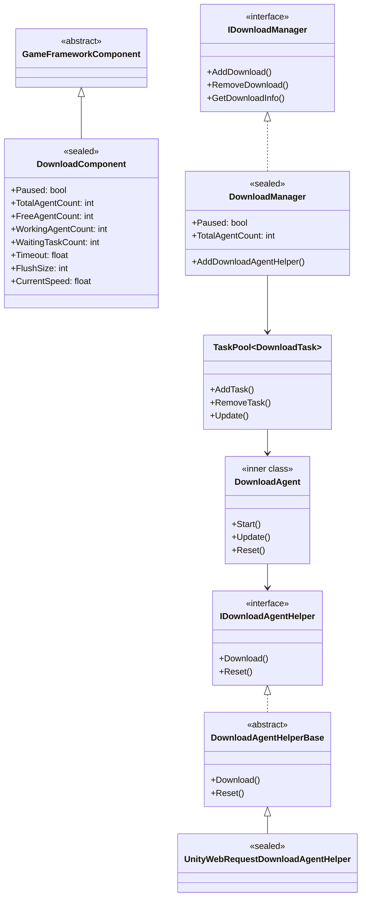
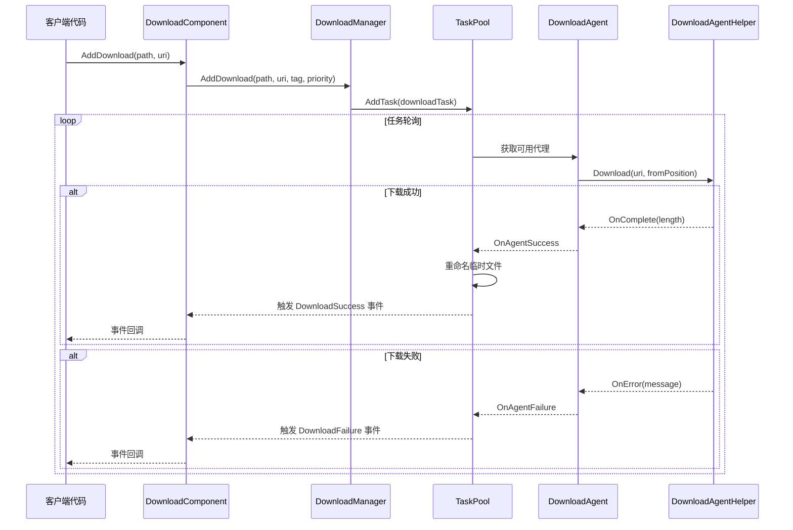
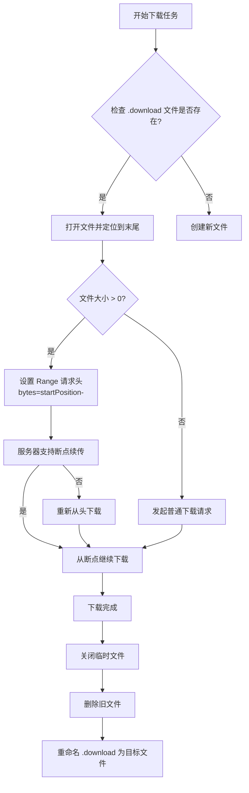
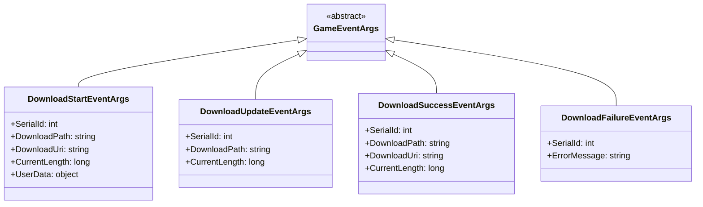

# アーキテクチャ概要

GameFrameX Download プラグインは機能完善的 Unity 下载管理フレームワーク，提供します統一された的任务调度、下载代理管理、断点续传和多线程下载能力。

## 概要

GameFrameX Download プラグイン是 GameFrameX フレームワーク的コアコンポーネント之一，专门为 Unity 游戏提供効率的、可靠的リソース下载解決策。该プラグイン采用モジュール化設計，将下载任务管理、代理调度和底层网络通信分离，便于拡張和维护。

**設計目标：**
- 提供統一された的下载任务管理インターフェース
- サポート多线程并发下载
- 実装断点续传機能
- サポート可插拔的下载代理実装
- 提供完全な的イベント系统用于進捗监控

## アーキテクチャ設計

该プラグイン采用分层アーキテクチャ設計，从上到下分为四个主な层次：



### アーキテクチャ层次説明

| 层次 | コンポーネント | 职责 |
|------|------|------|
| 客户端层 | DownloadComponent | 对外暴露下载機能，集成到 Unity コンポーネント系统 |
| マネージャー层 | DownloadManager | 統一された管理下载任务、イベント、代理池 |
| 代理层 | DownloadAgent | 処理单个下载任务的ライフサイクル |
| 辅助器层 | DownloadAgentHelper | 底层网络通信実装 |

## コアコンポーネント

### コンポーネント关系图



### コアコンポーネント职责

#### 1. DownloadComponent（下载コンポーネント）

`DownloadComponent` 是プラグイン的入口点，継承自 `GameFrameworkComponent`，直接挂载在 Unity シーン中使用。它负责：

- 初期化 `DownloadManager` モジュール
- 作成和管理 `DownloadAgentHelper` インスタンス
- 对外暴露下载 API
- 購読并转发下载イベント

> Source: [DownloadComponent.cs](https://github.com/GameFrameX/com.gameframex.unity.download/blob/main/Runtime/Download/DownloadComponent.cs#L1-L443)

关键プロパティ：

```csharp
// 获取可用下载代理数量
public int FreeAgentCount { get; }

// 获取工作中下载代理数量
public int WorkingAgentCount { get; }

// 获取等待下载任务数量
public int WaitingTaskCount { get; }

// 获取当前下载速度（字节/秒）
public float CurrentSpeed { get; }
```

#### 2. DownloadManager（下载マネージャー）

`DownloadManager` 是コアモジュール，継承自 `GameFrameworkModule`，実装 `IDownloadManager` インターフェース。主な機能：

- 管理任务池（TaskPool）
- 登録和调度下载代理
- 维护下载计数器（DownloadCounter）
- トリガー下载イベント

> Source: [DownloadManager.cs](https://github.com/GameFrameX/com.gameframex.unity.download/blob/main/Runtime/Download/Download/DownloadManager.cs#L1-L430)

```csharp
public sealed partial class DownloadManager : GameFrameworkModule, IDownloadManager
{
    private readonly TaskPool<DownloadTask> m_TaskPool;
    private readonly DownloadCounter m_DownloadCounter;
}
```

#### 3. DownloadAgent（下载代理）

`DownloadAgent` 是内部类，実装了 `ITaskAgent<DownloadTask>` インターフェース，负责单个下载任务的完全なライフサイクル：

- 作成下载临时ファイル（.download 后缀）
- 処理断点续传逻辑
- 将下载数据写入磁盘
- 処理超时检测

> Source: [DownloadManager.DownloadAgent.cs](https://github.com/GameFrameX/com.gameframex.unity.download/blob/main/Runtime/Download/Download/DownloadManager.DownloadAgent.cs#L1-L358)

#### 4. DownloadAgentHelper（下载代理辅助器）

辅助器采用ストラテジーパターン設計，サポート多种底层実装：

- `IDownloadAgentHelper`：辅助器インターフェース
- `DownloadAgentHelperBase`：抽象基底クラス
- `UnityWebRequestDownloadAgentHelper`：基于 UnityWebRequest 的実装（推奨）
- `WWWDownloadAgentHelper`：基于 WWW 的実装（已废弃）

> Source: [IDownloadAgentHelper.cs](https://github.com/GameFrameX/com.gameframex.unity.download/blob/main/Runtime/Download/Download/IDownloadAgentHelper.cs#L1-L66)
> Source: [UnityWebRequestDownloadAgentHelper.cs](https://github.com/GameFrameX/com.gameframex.unity.download/blob/main/Runtime/Download/UnityWebRequestDownloadAgentHelper.cs#L1-L230)

## コアフロー

### 下载任务フロー



### 断点续传フロー

当已有下载ファイル时，下载代理会自动检测并恢复下载：



## イベント系统

プラグイン提供します完全な的イベント系统，用于监控下载進捗和ステータス：



### イベントトリガー时机

| イベント | トリガー时机 |
|------|----------|
| DownloadStart | 下载代理开始処理任务 |
| DownloadUpdate | 下载数据アップデート（每帧多次） |
| DownloadSuccess | 下载完成并写入磁盘 |
| DownloadFailure | 下载失敗或出错 |

> 詳細イベントパラメータ説明请参见 [下载イベント](./6-events.download-events) ドキュメント。

## 設定オプション

DownloadComponent 提供以下可設定项：

| プロパティ | タイプ | デフォルト值 | 説明 |
|------|------|--------|------|
| DownloadAgentHelperTypeName | string | UnityWebRequestDownloadAgentHelper | 下载代理辅助器タイプ |
| DownloadAgentHelperCount | int | 3 | 下载代理インスタンス数量 |
| Timeout | float | 30f | 下载超时时间（秒） |
| FlushSize | int | 1MB | 缓冲区刷新大小 |

> 詳細設定説明请参见 [エディタ設定](./7-configuration.editor-configuration) 和 [下载代理設定](./7-configuration.agent-configuration) ドキュメント。

## 拡張机制

### 自定義下载代理

〜できます通过継承 `DownloadAgentHelperBase` 作成自定義下载実装：

```csharp
public class CustomDownloadAgentHelper : DownloadAgentHelperBase
{
    public override void Download(string downloadUri, object userData)
    {
        // 实现自定义下载逻辑
    }
    
    public override void Download(string downloadUri, long fromPosition, object userData)
    {
        // 实现断点续传
    }
    
    public override void Download(string downloadUri, long fromPosition, long toPosition, object userData)
    {
        // 实现范围下载
    }
    
    public override void Reset()
    {
        // 清理资源
    }
}
```

> 詳細拡張説明请参见 [下载代理](./4-core-concepts.download-agent) ドキュメント。

## 性能特性

### 并发下载

プラグインサポート多代理并发下载，通过 `DownloadAgentHelperCount` 設定代理数量。任务池会自动将任务分配给空闲的代理。

### 速度计算

使用移动平均算法计算下载速度：

```csharp
m_DownloadCounter = new DownloadCounter(1f, 10f);  // 1秒更新间隔，10秒平均
```

> 詳細実装请参见 [DownloadCounter](./4-core-concepts.download-component) ドキュメント。

### 断点续传

- 下载过程中使用 `.download` 临时ファイル
- サポート检测已有临时ファイル并恢复下载
- 下载完成后自动重命名为目标ファイル

## 関連リンク

- [DownloadComponent](./4-core-concepts.download-component) - 下载コンポーネント详解
- [下载代理](./4-core-concepts.download-agent) - 代理実装详解
- [下载イベント](./6-events.download-events) - イベント系统详解
- [エディタ設定](./7-configuration.editor-configuration) - エディタ設定
- [下载代理設定](./7-configuration.agent-configuration) - 代理設定
- [API リファレンス](./5-api-reference.properties) - プロパティ API
- [API リファレンス](./5-api-reference.methods) - メソッド API
