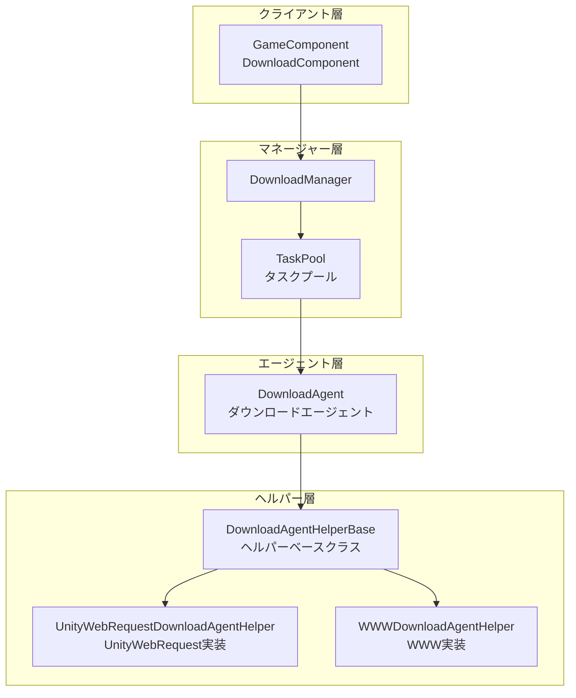
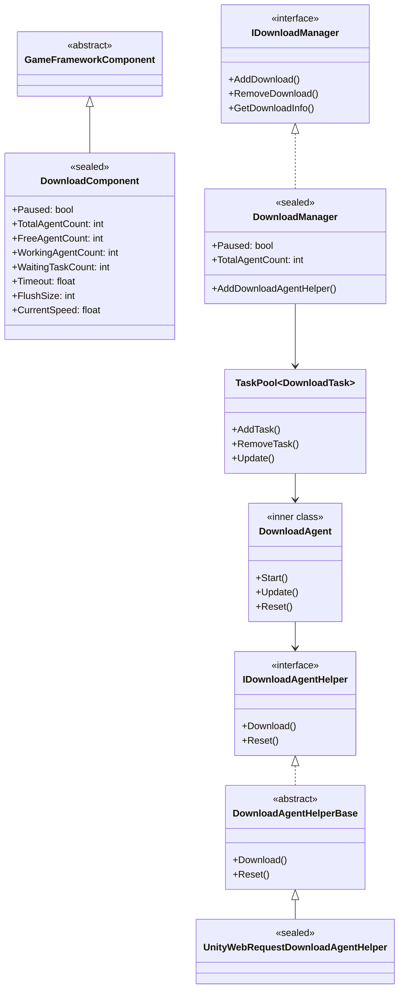
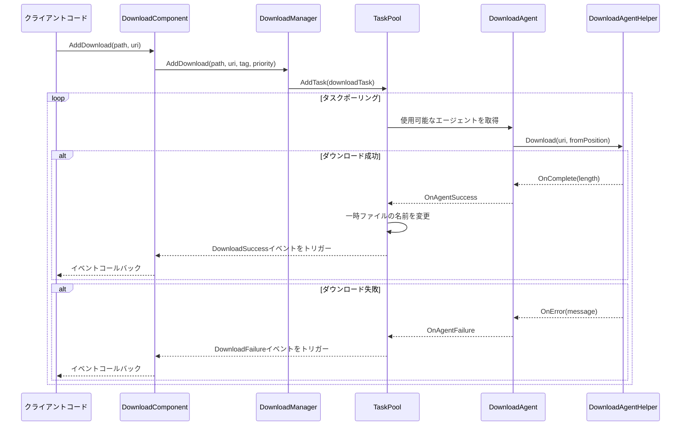
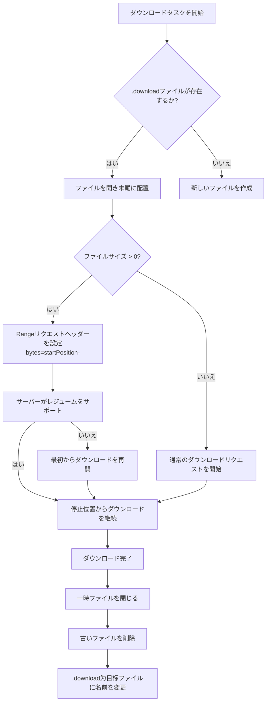
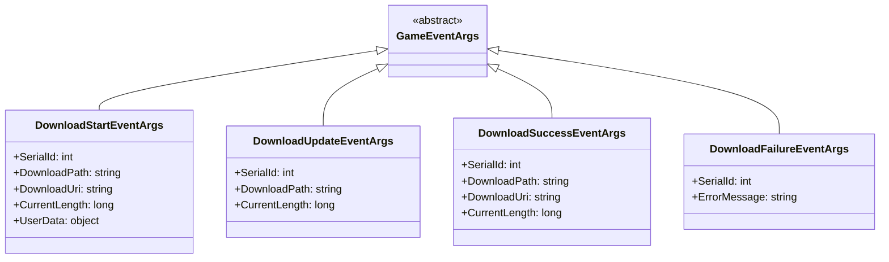

# アーキテクチャ概要

GameFrameX Downloadプラグインは、統一されたタスクスケジューリング、ダウンロードエージェント管理、レジューム（中途再開）、マルチスレッドダウンロード機能を提供する、完成度の高いUnityダウンロード管理フレームワークです。

## 概要

GameFrameX DownloadプラグインはGameFrameXフレームワークの中核コンポーネントの一つであり、Unityゲームに効率的で信頼性の高いリソースダウンロードソリューションを提供します。このプラグインはモジュール化設計を採用しており、ダウンロードタスク管理、エージェントスケジューリング、底部ネットワーク通信を分離し、拡張性と保守性を高めています。

**設計目標：**
- 統一されたダウンロードタスク管理インターフェースを提供
- マルチスレッド同時ダウンロードをサポート
- レジューム（中途再開）機能を実装
- 取り替え可能なダウンロードエージェント実装をサポート
- 完全なイベントシステムを提供し進捗監視を実現

## アーキテクチャ設計

このプラグインは階層化アーキテクチャ設計を採用しており、上から下へ4つの主要階層があります：



### アーキテクチャ階層説明

| 階層 | コンポーネント | 責務 |
|------|------|------|
| クライアント層 | DownloadComponent | ダウンロード機能を外部に公開、Unityコンポーネントシステムに統合 |
| マネージャー層 | DownloadManager | ダウンロードタスク、イベント、エージェントプールを統一管理 |
| エージェント層 | DownloadAgent | 単一ダウンロードタスクのライフサイクルを処理 |
| ヘルパー層 | DownloadAgentHelper | 底部ネットワーク通信実装 |

## コアコンポーネント

### コンポーネント関係図



### コアコンポーネント責務

#### 1. DownloadComponent（ダウンロードコンポーネント）

`DownloadComponent`はプラグインのエントリーポイントであり、`GameFrameworkComponent`を継承し、Unityシーンに直接配置して使用します。主な責務：

- `DownloadManager`モジュールの初期化
- `DownloadAgentHelper`インスタンスの作成与管理
- ダウンロードAPIの外部公開
- ダウンロードイベントの購読と転送

> 出典: [DownloadComponent.cs](https://github.com/GameFrameX/com.gameframex.unity.download/blob/main/Runtime/Download/DownloadComponent.cs#L1-L443)

 主要属性：

```csharp
// 使用可能なダウンロードエージェント数を取得
public int FreeAgentCount { get; }

// 作業中のダウンロードエージェント数を取得
public int WorkingAgentCount { get; }

// 待機中のダウンロードタスク数を取得
public int WaitingTaskCount { get; }

// 現在のダウンロード速度を取得（バイト/秒）
public float CurrentSpeed { get; }
```

#### 2. DownloadManager（ダウンロードマネージャー）

`DownloadManager`はコアモジュールであり、`GameFrameworkModule`を継承し、`IDownloadManager`インターフェースを実装します。主な機能：

- タスクプール（TaskPool）の管理
- ダウンロードエージェント 등록とスケジューリング
- ダウンロードカウンター（DownloadCounter）の維持
- ダウンロードイベントのトリガー

> 出典: [DownloadManager.cs](https://github.com/GameFrameX/com.gameframex.unity.download/blob/main/Runtime/Download/Download/DownloadManager.cs#L1-L430)

```csharp
public sealed partial class DownloadManager : GameFrameworkModule, IDownloadManager
{
    private readonly TaskPool<DownloadTask> m_TaskPool;
    private readonly DownloadCounter m_DownloadCounter;
}
```

#### 3. DownloadAgent（ダウンロードエージェント）

`DownloadAgent`は内部クラスであり、`ITaskAgent<DownloadTask>`インターフェースを実装し、単一ダウンロードタスクの完全なライフサイクルを担当します：

- ダウンロード一時ファイル（.downloadサフィックス）の作成
- レジュームロジックの処理
- ダウンロードデータをディスクに書き込み
- タイムアウト検出の処理

> 出典: [DownloadManager.DownloadAgent.cs](https://github.com/GameFrameX/com.gameframex.unity.download/blob/main/Runtime/Download/Download/DownloadManager.DownloadAgent.cs#L1-L358)

#### 4. DownloadAgentHelper（ダウンロードエージェントヘルパー）

ヘルパーはストラテジーパターン設計を採用しており、複数の底部実装をサポートします：

- `IDownloadAgentHelper`：ヘルパーインターフェース
- `DownloadAgentHelperBase`：抽象基本クラス
- `UnityWebRequestDownloadAgentHelper`：UnityWebRequestに基づく実装（推奨）
- `WWWDownloadAgentHelper`：WWWに基づく実装（廃止予定）

> 出典: [IDownloadAgentHelper.cs](https://github.com/GameFrameX/com.gameframex.unity.download/blob/main/Runtime/Download/Download/IDownloadAgentHelper.cs#L1-L66)
> 出典: [UnityWebRequestDownloadAgentHelper.cs](https://github.com/GameFrameX/com.gameframex.unity.download/blob/main/Runtime/Download/UnityWebRequestDownloadAgentHelper.cs#L1-L230)

## コアフロー

### ダウンロードタスクフロー



### レジューム（中途再開）フロー

既存のダウンロードファイルがある場合、ダウンロードエージェントは自動的に検出してダウンロードを再開します：



## イベントシステム

プラグインはダウンロード進捗と状態の監視のための完全なイベントシステムを提供します：



### イベントトリガータイミング

| イベント | トリガータイミング |
|------|----------|
| DownloadStart | ダウンロードエージェントがタスクの処理を開始 |
| DownloadUpdate | ダウンロードデータが更新（毎フレーム複数回） |
| DownloadSuccess | ダウンロード完了しディスクに書き込み |
| DownloadFailure | ダウンロード失敗またはエラー発生 |

> イベントパラメータの詳細については、[ダウンロードイベント](./6-events.download-events)ドキュメントを参照してください。

## 設定オプション

DownloadComponentは以下設定項目を提供します：

| 属性 | 型 | デフォルト値 | 説明 |
|------|------|--------|------|
| DownloadAgentHelperTypeName | string | UnityWebRequestDownloadAgentHelper | ダウンロードエージェントヘルパーの型名 |
| DownloadAgentHelperCount | int | 3 | ダウンロードエージェントインスタンス数 |
| Timeout | float | 30f | ダウンロードタイムアウト時間（秒） |
| FlushSize | int | 1MB | バッファフラッシュサイズ |

> 設定の詳細については、[エディタ設定](./7-configuration.editor-configuration)および[ダウンロードエージェント設定](./7-configuration.agent-configuration)ドキュメントを参照してください。

## 拡張メカニズム

### カスタムダウンロードエージェント

`DownloadAgentHelperBase`を継承してカスタムダウンロード実装を作成できます：

```csharp
public class CustomDownloadAgentHelper : DownloadAgentHelperBase
{
    public override void Download(string downloadUri, object userData)
    {
        // カスタムダウンロードロジックを実装
    }

    public override void Download(string downloadUri, long fromPosition, object userData)
    {
        // レジュームを実装
    }

    public override void Download(string downloadUri, long fromPosition, long toPosition, object userData)
    {
        // 範囲ダウンロードを実装
    }

    public override void Reset()
    {
        // リソースをクリーンアップ
    }
}
```

> 拡張の詳細については、[ダウンロードエージェント](./4-core-concepts.download-agent)ドキュメントを参照してください。

## パフォーマンス特性

### 同時ダウンロード

プラグインはマルチエージェント同時ダウンロードをサポートし、`DownloadAgentHelperCount`でエージェント数を設定します。タスクプールは自動的にタスクを空いているエージェントに分配します。

### 速度計算

移動平均アルゴリズムを使用してダウンロード速度を計算します：

```csharp
m_DownloadCounter = new DownloadCounter(1f, 10f);  // 1秒更新間隔、10秒平均
```

> 詳細実装については、[DownloadCounter](./4-core-concepts.download-component)ドキュメントを参照してください。

### レジューム（中途再開）

- ダウンロード中は`.download`一時ファイルを使用
- 既存の一時ファイルを検出してダウンロードを再開することをサポート
- ダウンロード完了後に自動的に目标ファイルに名前を変更

## 関連リンク

- [DownloadComponent](./4-core-concepts.download-component) - ダウンロードコンポーネントの詳細
- [ダウンロードエージェント](./4-core-concepts.download-agent) - エージェント実装の詳細
- [ダウンロードイベント](./6-events.download-events) - イベントシステム詳細
- [エディタ設定](./7-configuration.editor-configuration) - エディタ設定
- [ダウンロードエージェント設定](./7-configuration.agent-configuration) - エージェント設定
- [APIリファレンス](./5-api-reference.properties) - 属性API
- [APIリファレンス](./5-api-reference.methods) - メソッドAPI