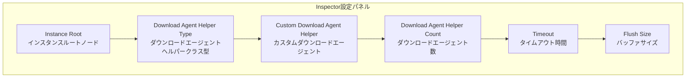
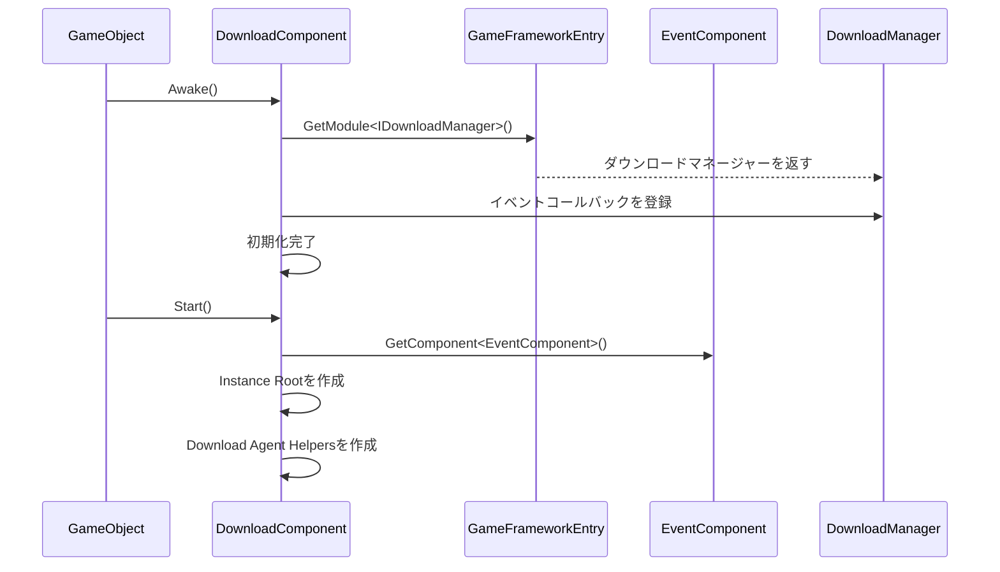

# 基本設定

このドキュメントでは、GameFrameX Downloadプラグインの基本設定方法について説明します。コンポーネントの追加、パラメータ設定、初始化フロー等内容を含みます。

## 概要

DownloadコンポーネントはGameFrameXフレームワークにおけるダウンロード管理モジュールであり、すべてのダウンロード関連タスクを処理します。ダウンロード機能を使用する前に、`DownloadComponent`を正しく設定する必要があります。このコンポーネントはマルチエージェント同時ダウンロードメカニズムを採用しており、レジューム（中途再開）、優先順位スケジューリング、リアルタイム進捗更新をサポートしています。

## DownloadComponentの追加

### Unityエディタから追加

Unityシーンに空のゲームオブジェクトを作成し、`Download`コンポーネントを追加します：

1. UnityエディタでHierarchyパネルを右クリック
2. **GameObject** → **Create Empty**を選択して空のゲームオブジェクトを作成
3. Inspectorパネルで**Add Component**ボタンをクリック
4. **Game Framework** → **Download**を検索して選択
5. コンポーネントがゲームオブジェクトに自動的に追加されます

```csharp
// コンポーネント定義ソースコード
[DisallowMultipleComponent]
[AddComponentMenu("Game Framework/Download")]
public sealed class DownloadComponent : GameFrameworkComponent
```

> 出典: [DownloadComponent.cs](https://github.com/GameFrameX/com.gameframex.unity.download/blob/main/Runtime/Download/DownloadComponent.cs#L21-L23)

### コードから動的に追加

実行時にコードでコンポーネントを動的に作成することもできます：

```csharp
// DownloadComponentを動的に追加
var downloadGameObject = new GameObject("Download");
var downloadComponent = downloadGameObject.AddComponent<DownloadComponent>();
```

> 出典: [DownloadComponent.cs](https://github.com/GameFrameX/com.gameframex.unity.download/blob/main/Runtime/Download/DownloadComponent.cs#L142-L160)

## 設定オプション詳細

### エディタ設定プロパティ

UnityエディタのInspectorパネルでは、DownloadComponentは以下の設定可能なプロパティを含みます：



| プロパティ | 型 | デフォルト値 | 説明 |
|------|------|--------|------|
| Instance Root | Transform | null | ダウンロードエージェントインスタンスの親Transform。未設定時は自動作成 |
| Download Agent Helper Type | string | UnityWebRequestDownloadAgentHelper | ダウンロードエージェントヘルパーのクラス型名 |
| Custom Download Agent Helper | DownloadAgentHelperBase | null | カスタムダウンロードエージェントヘルパーインスタンス |
| Download Agent Helper Count | int | 3 | 同時ダウンロードエージェント数、範囲1-16 |
| Timeout | float | 30 | ダウンロードタイムアウト時間（秒）、範囲0-120 |
| Flush Size | int | 1048576 | バッファからディスクへの書き込み閾値（バイト）、デフォルト1MB |

> 出典: [DownloadComponentInspector.cs](https://github.com/GameFrameX/com.gameframex.unity.download/blob/main/Editor/Inspector/DownloadComponentInspector.cs#L29-L69)

### 各設定項目の詳細説明

#### 1. Instance Root（インスタンスルートノード）

ダウンロードエージェントGameObjectの親Transformを指定します。設定しない場合、システムは「Download Agent Instances」という空のオブジェクトを親ノードとして自動作成します。

```csharp
if (m_InstanceRoot == null)
{
    m_InstanceRoot = new GameObject("Download Agent Instances").transform;
    m_InstanceRoot.SetParent(gameObject.transform);
    m_InstanceRoot.localScale = Vector3.one;
}
```

> 出典: [DownloadComponent.cs](https://github.com/GameFrameX/com.gameframex.unity.download/blob/main/Runtime/Download/DownloadComponent.cs#L171-L176)

#### 2. Download Agent Helper Type（ダウンロードエージェントヘルパークラス型）

実際のダウンロード操作を実行するヘルパーのクラス型を指定します。プラグインには以下の内置実装があります：

| クラス型名 | 説明 |
|----------|------|
| UnityWebRequestDownloadAgentHelper | UnityのUnityWebRequestを使用してダウンロード（推奨） |
| WWWDownloadAgentHelper | 旧式のWWWクラスを使用してダウンロード（旧バージョンとの互換性） |

#### 3. Download Agent Helper Count（ダウンロードエージェント数）

同時ダウンロードエージェント数を設定します。各エージェントは一度に1つのダウンロードタスクのみ処理できますが、複数のエージェントを同時に実行して並列ダウンロードを実現できます。

```csharp
// デフォルトで3つのダウンロードエージェントを作成
for (int i = 0; i < m_DownloadAgentHelperCount; i++)
{
    AddDownloadAgentHelper(i);
}
```

> 出典: [DownloadComponent.cs](https://github.com/GameFrameX/com.gameframex.unity.download/blob/main/Runtime/Download/DownloadComponent.cs#L178-L181)

**推奨設定：**
- 小型リソース（< 10MB）：2-3個のエージェント
- 中型リソース（10-100MB）：3-5個のエージェント
- 大型リソース（> 100MB）：5-8個のエージェント
- 最大サポート：16個のエージェント

#### 4. Timeout（タイムアウト時間）

単一のダウンロードタスクの最大待機時間（秒）を設定します。この時間を超過すると、ダウンロードは失敗とみなされエラーイベントがトリガーされます。

```csharp
[SerializeField]
private float m_Timeout = 30f;
```

> 出典: [DownloadComponent.cs](https://github.com/GameFrameX/com.gameframex.unity.download/blob/main/Runtime/Download/DownloadComponent.cs#L39)

**設定推奨：**
- LANダウンロード：10-15秒
- インターネットダウンロード：30-60秒
- 大容量ファイルダウンロード：60-120秒

#### 5. Flush Size（バッファサイズ）

ダウンロードバッファをディスクに書き込む閾値を設定します。このパラメータはレジューム機能を有効にしている場合のみ有効であり、データの更新頻度制御に使用します。

```csharp
private const int OneMegaBytes = 1024 * 1024;
[SerializeField]
private int m_FlushSize = OneMegaBytes;
```

> 出典: [DownloadComponent.cs](https://github.com/GameFrameX/com.gameframex.unity.download/blob/main/Runtime/Download/DownloadComponent.cs#L25-L26#L41)

**設定推奨：**
- 小ファイル：512KB - 1MB
- 中程度のファイル：1MB - 2MB
- 大ファイル：2MB - 5MB

## コンポーネント初期化フロー

DownloadComponentの初期化は2つのフェーズで構成されます：



### 第一フェーズ：Awake

```csharp
protected override void Awake()
{
    ImplementationComponentType = Utility.Assembly.GetType(componentType);
    InterfaceComponentType = typeof(IDownloadManager);
    base.Awake();
    m_DownloadManager = GameFrameworkEntry.GetModule<IDownloadManager>();

    // ダウンロードイベントを登録
    m_DownloadManager.DownloadStart += OnDownloadStart;
    m_DownloadManager.DownloadUpdate += OnDownloadUpdate;
    m_DownloadManager.DownloadSuccess += OnDownloadSuccess;
    m_DownloadManager.DownloadFailure += OnDownloadFailure;

    m_DownloadManager.FlushSize = m_FlushSize;
    m_DownloadManager.Timeout = m_Timeout;
}
```

> 出典: [DownloadComponent.cs](https://github.com/GameFrameX/com.gameframex.unity.download/blob/main/Runtime/Download/DownloadComponent.cs#L142-L160)

### 第二フェーズ：Start

```csharp
private void Start()
{
    // イベントコンポーネントを取得（必須）
    m_EventComponent = GameEntry.GetComponent<EventComponent>();
    if (m_EventComponent == null)
    {
        Log.Fatal("Event component is invalid.");
        return;
    }

    // インスタンスルートノードを作成
    if (m_InstanceRoot == null)
    {
        m_InstanceRoot = new GameObject("Download Agent Instances").transform;
        m_InstanceRoot.SetParent(gameObject.transform);
        m_InstanceRoot.localScale = Vector3.one;
    }

    // ダウンロードエージェントヘルパーを作成
    for (int i = 0; i < m_DownloadAgentHelperCount; i++)
    {
        AddDownloadAgentHelper(i);
    }
}
```

> 出典: [DownloadComponent.cs](https://github.com/GameFrameX/com.gameframex.unity.download/blob/main/Runtime/Download/DownloadComponent.cs#L162-L182)

## ダウンロードエージェントヘルパー

### デフォルト実装：UnityWebRequestDownloadAgentHelper

プラグインはデフォルトで`UnityWebRequestDownloadAgentHelper`を_download-download-agent-helperとして使用します。これはUnityの`UnityWebRequest` APIに基づいて実装されており、以下の機能をサポートします：

- HTTP/HTTPSプロトコル
- レジューム（Rangeヘッダーを通じて）
- SSL証明書検証（デフォルトでスキップ）
- 進捗追跡

```csharp
public partial class UnityWebRequestDownloadAgentHelper : DownloadAgentHelperBase, IDisposable
{
    // UnityWebRequestを使用してダウンロード
    m_UnityWebRequest = new UnityWebRequest(downloadUri);
    m_UnityWebRequest.certificateHandler = new DownloadCertificateHandler();
    m_UnityWebRequest.downloadHandler = new DownloadHandler(this);
    m_UnityWebRequest.SendWebRequest();
}
```

> 出典: [UnityWebRequestDownloadAgentHelper.cs](https://github.com/GameFrameX/com.gameframex.unity.download/blob/main/Runtime/Download/UnityWebRequestDownloadAgentHelper.cs#L80-L96)

### カスタムダウンロードエージェントの作成

カスタムダウンロードエージェントを作成するには、`DownloadAgentHelperBase`を継承して相關インターフェースを実装する必要があります：

```csharp
public abstract class DownloadAgentHelperBase : MonoBehaviour, IDownloadAgentHelper
{
    // イベント定義
    public abstract event EventHandler<DownloadAgentHelperUpdateBytesEventArgs> DownloadAgentHelperUpdateBytes;
    public abstract event EventHandler<DownloadAgentHelperUpdateLengthEventArgs> DownloadAgentHelperUpdateLength;
    public abstract event EventHandler<DownloadAgentHelperCompleteEventArgs> DownloadAgentHelperComplete;
    public abstract event EventHandler<DownloadAgentHelperErrorEventArgs> DownloadAgentHelperError;

    // キーポイント
    public abstract void Download(string downloadUri, object userData);
    public abstract void Download(string downloadUri, long fromPosition, object userData);
    public abstract void Download(string downloadUri, long fromPosition, long toPosition, object userData);

    // キーポイント
    public abstract void Reset();
}
```

> 出典: [DownloadAgentHelperBase.cs](https://github.com/GameFrameX/com.gameframex.unity.download/blob/main/Runtime/Download/DownloadAgentHelperBase.cs#L17-L72)

## 設定プロパティAPI

DownloadComponentは以下のパブリックプロパティをコードからアクセスできるようにを提供します：

### ランタイムプロパティ

| プロパティ | 型 | 説明 |
|------|------|------|
| Paused | bool | ダウンロードが一時停止されているかの取得または設定 |
| TotalAgentCount | int | ダウンロードエージェントの総数を取得 |
| FreeAgentCount | int | 使用可能なダウンロードエージェント数を取得 |
| WorkingAgentCount | int | 作業中のダウンロードエージェント数を取得 |
| WaitingTaskCount | int | 待機中のダウンロードタスク数を取得 |
| Timeout | float | ダウンロードタイムアウト時間の取得または設定（秒） |
| FlushSize | int | バッファからディスクへの書き込み閾値の取得または設定 |
| CurrentSpeed | float | 現在のダウンロード速度を取得（バイト/秒） |

```csharp
// 例：現在のダウンロードステータスを取得
var downloadComponent = GameEntry.GetComponent<DownloadComponent>();
Debug.Log($"使用可能エージェント: {downloadComponent.FreeAgentCount}");
Debug.Log($"待機タスク: {downloadComponent.WaitingTaskCount}");
Debug.Log($"ダウンロード速度: {downloadComponent.CurrentSpeed} bytes/s");
```

> 出典: [DownloadComponent.cs](https://github.com/GameFrameX/com.gameframex.unity.download/blob/main/Runtime/Download/DownloadComponent.cs#L46-L108)

## 依存要件

DownloadComponentは以下のコンポーネントとサービスに依存しています：

1. **EventComponent** - 必須コンポーネント。ダウンロードイベント通知をトリガーするために使用
2. **GameFrameworkEntry** - フレームワークエントリーポイント。モジュール初期化を提供
3. **GameFrameworkModule** - ベースモジュール基底クラス

```csharp
// 依存関係を確認
private void Start()
{
    m_EventComponent = GameEntry.GetComponent<EventComponent>();
    if (m_EventComponent == null)
    {
        Log.Fatal("Event component is invalid.");
        return;
    }
}
```

> 出典: [DownloadComponent.cs](https://github.com/GameFrameX/com.gameframex.unity.download/blob/main/Runtime/Download/DownloadComponent.cs#L164-L169)

## ベストプラクティス設定

### 開発環境

```csharp
// 開発環境推奨設定
Timeout = 60f;           // 長いタイムアウトでエラーを許容
FlushSize = 512 * 1024;   // 512KBで頻繁な更新、便于调试
AgentCount = 3;           // ほどほどの同時実行数
```

### 本番環境

```csharp
// 本番環境推奨設定
Timeout = 30f;            // 短いタイムアウトで素早い失敗と再試行
FlushSize = 2 * 1024 * 1024;  // 2MBでIO頻度を軽減
AgentCount = 5;           // 多くの同時実行でダウンロード速度を向上
```

### 大容量ファイルダウンロード

```csharp
// 大容量ファイルダウンロード設定
Timeout = 120f;               // 長いタイムアウト
FlushSize = 5 * 1024 * 1024;  // 5MBの大きいバッファ
AgentCount = 8;               // 高同時実行
```

## 関連リンク

- [インストールガイド](./2-installation)
- [最初の例](./3-getting-started.first-example)
- [アーキテクチャ概要](./4-core-concepts.architecture)
- [DownloadComponentコア概念](./4-core-concepts.download-component)
- [ダウンロードエージェント](./4-core-concepts.download-agent)
- [エディタ設定](./7-configuration.editor-configuration)
- [ダウンロードエージェント設定](./7-configuration.agent-configuration)
- [ダウンロードイベント](./6-events.download-events)