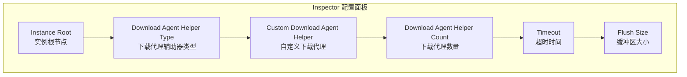
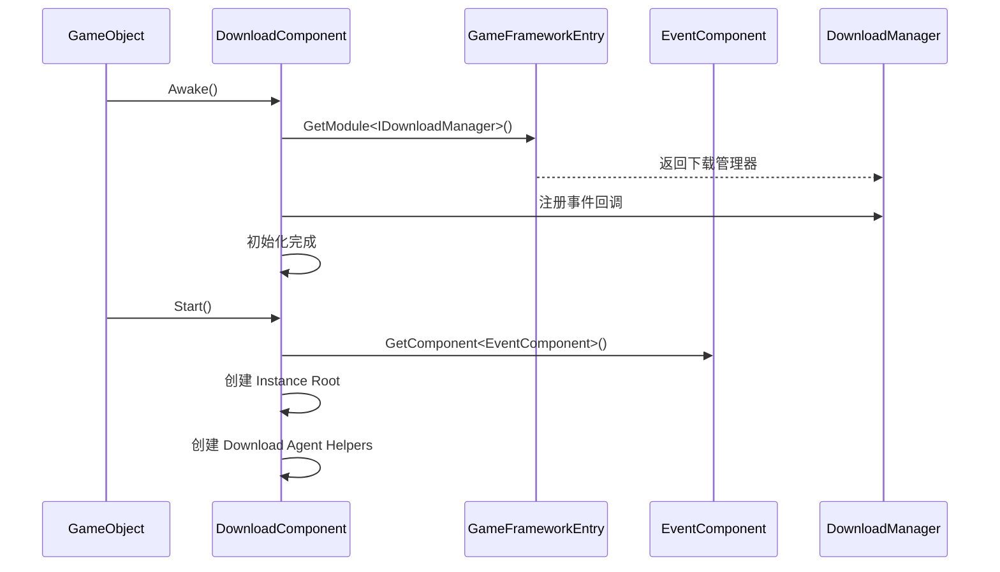

# 基本設定

このドキュメント介绍 GameFrameX Download プラグイン的基本設定メソッド，含みますコンポーネント追加、パラメータ設定和初期化フロー。

## 概要

Download コンポーネント是 GameFrameX フレームワーク中的下载管理モジュール，负责処理所有下载相关任务。在使用下载機能之前，〜する必要があります正确設定 `DownloadComponent`。该コンポーネント采用多代理并发下载机制，サポート断点续传、优先级调度和实时進捗アップデート。

## 追加 DownloadComponent

### 通过 Unity エディタ追加

在 Unity シーン中作成一个空游戏对象，次に追加 `Download` コンポーネント：

1. 在 Unity エディタ中，右键点击 Hierarchy パネル
2. 选择 **GameObject** → **Create Empty** 作成一个空游戏对象
3. 在 Inspector パネル中点击 **Add Component** ボタン
4. 検索并选择 **Game Framework** → **Download**
5. コンポーネント将自动追加到游戏对象上

```csharp
// 组件定义源码
[DisallowMultipleComponent]
[AddComponentMenu("Game Framework/Download")]
public sealed class DownloadComponent : GameFrameworkComponent
```

> Source: [DownloadComponent.cs](https://github.com/GameFrameX/com.gameframex.unity.download/blob/main/Runtime/Download/DownloadComponent.cs#L21-L23)

### 通过コード动态追加

也〜できます在コードランタイム动态作成コンポーネント：

```csharp
// 动态添加 DownloadComponent
var downloadGameObject = new GameObject("Download");
var downloadComponent = downloadGameObject.AddComponent<DownloadComponent>();
```

> Source: [DownloadComponent.cs](https://github.com/GameFrameX/com.gameframex.unity.download/blob/main/Runtime/Download/DownloadComponent.cs#L142-L160)

## 設定オプション详解

### エディタ設定プロパティ

在 Unity エディタ的 Inspector パネル中，DownloadComponent パッケージ含以下可設定プロパティ：



| プロパティ | タイプ | デフォルト值 | 説明 |
|------|------|--------|------|
| Instance Root | Transform | null | 下载代理インスタンス的父级 Transform，为空时自动作成 |
| Download Agent Helper Type | string | UnityWebRequestDownloadAgentHelper | 下载代理辅助器的タイプ名称 |
| Custom Download Agent Helper | DownloadAgentHelperBase | null | 自定義下载代理辅助器インスタンス |
| Download Agent Helper Count | int | 3 | 并发下载代理数量，范围 1-16 |
| Timeout | float | 30 | 下载超时时间（秒），范围 0-120 |
| Flush Size | int | 1048576 | 缓冲区写入磁盘的临界大小（字节），デフォルト 1MB |

> Source: [DownloadComponentInspector.cs](https://github.com/GameFrameX/com.gameframex.unity.download/blob/main/Editor/Inspector/DownloadComponentInspector.cs#L29-L69)

### 各設定项詳細説明

#### 1. Instance Root（インスタンス根节点）

指定下载代理 GameObject 的父级 Transform。もし不設定，系统会自动作成一个名为 "Download Agent Instances" 的空对象作为父节点。

```csharp
if (m_InstanceRoot == null)
{
    m_InstanceRoot = new GameObject("Download Agent Instances").transform;
    m_InstanceRoot.SetParent(gameObject.transform);
    m_InstanceRoot.localScale = Vector3.one;
}
```

> Source: [DownloadComponent.cs](https://github.com/GameFrameX/com.gameframex.unity.download/blob/main/Runtime/Download/DownloadComponent.cs#L171-L176)

#### 2. Download Agent Helper Type（下载代理辅助器タイプ）

指定用于执行实际下载操作辅助器的タイプ。プラグイン内置了以下実装：

| タイプ名称 | 説明 |
|----------|------|
| UnityWebRequestDownloadAgentHelper | 使用 Unity 的 UnityWebRequest 进行下载（推奨） |
| WWWDownloadAgentHelper | 使用过时的 WWW 类进行下载（兼容旧バージョン） |

#### 3. Download Agent Helper Count（下载代理数量）

設定并发下载代理的数量。每个代理一次只能処理一个下载任务，但〜できます同時に运行多个代理以実装并行下载。

```csharp
// 默认创建 3 个下载代理
for (int i = 0; i < m_DownloadAgentHelperCount; i++)
{
    AddDownloadAgentHelper(i);
}
```

> Source: [DownloadComponent.cs](https://github.com/GameFrameX/com.gameframex.unity.download/blob/main/Runtime/Download/DownloadComponent.cs#L178-L181)

**お勧め設定：**
- 小型リソース（< 10MB）：2-3 个代理
- 中型リソース（10-100MB）：3-5 个代理
- 大型リソース（> 100MB）：5-8 个代理
- 最大サポート：16 个代理

#### 4. Timeout（超时时间）

設定单个下载任务的最大等待时间（秒）。超过此时间后，下载将被视为失敗并トリガーエラーイベント。

```csharp
[SerializeField]
private float m_Timeout = 30f;
```

> Source: [DownloadComponent.cs](https://github.com/GameFrameX/com.gameframex.unity.download/blob/main/Runtime/Download/DownloadComponent.cs#L39)

**設定お勧め：**
- 局域网下载：10-15 秒
- 互联网下载：30-60 秒
- 大ファイル下载：60-120 秒

#### 5. Flush Size（缓冲区大小）

設定将下载缓冲区写入磁盘的临界大小。该パラメータ仅在启用断点续传機能时有效，用于控制数据刷新频率。

```csharp
private const int OneMegaBytes = 1024 * 1024;
[SerializeField]
private int m_FlushSize = OneMegaBytes;
```

> Source: [DownloadComponent.cs](https://github.com/GameFrameX/com.gameframex.unity.download/blob/main/Runtime/Download/DownloadComponent.cs#L25-L26#L41)

**設定お勧め：**
- 小ファイル：512KB - 1MB
- 中等ファイル：1MB - 2MB
- 大ファイル：2MB - 5MB

## コンポーネント初期化フロー

DownloadComponent 的初期化分为两个フェーズ：



### 第1フェーズ：Awake

```csharp
protected override void Awake()
{
    ImplementationComponentType = Utility.Assembly.GetType(componentType);
    InterfaceComponentType = typeof(IDownloadManager);
    base.Awake();
    m_DownloadManager = GameFrameworkEntry.GetModule<IDownloadManager>();
    
    // 注册下载事件
    m_DownloadManager.DownloadStart += OnDownloadStart;
    m_DownloadManager.DownloadUpdate += OnDownloadUpdate;
    m_DownloadManager.DownloadSuccess += OnDownloadSuccess;
    m_DownloadManager.DownloadFailure += OnDownloadFailure;
    
    m_DownloadManager.FlushSize = m_FlushSize;
    m_DownloadManager.Timeout = m_Timeout;
}
```

> Source: [DownloadComponent.cs](https://github.com/GameFrameX/com.gameframex.unity.download/blob/main/Runtime/Download/DownloadComponent.cs#L142-L160)

### 第2フェーズ：Start

```csharp
private void Start()
{
    // 获取事件组件（必须）
    m_EventComponent = GameEntry.GetComponent<EventComponent>();
    if (m_EventComponent == null)
    {
        Log.Fatal("Event component is invalid.");
        return;
    }

    // 创建实例根节点
    if (m_InstanceRoot == null)
    {
        m_InstanceRoot = new GameObject("Download Agent Instances").transform;
        m_InstanceRoot.SetParent(gameObject.transform);
        m_InstanceRoot.localScale = Vector3.one;
    }

    // 创建下载代理辅助器
    for (int i = 0; i < m_DownloadAgentHelperCount; i++)
    {
        AddDownloadAgentHelper(i);
    }
}
```

> Source: [DownloadComponent.cs](https://github.com/GameFrameX/com.gameframex.unity.download/blob/main/Runtime/Download/DownloadComponent.cs#L162-L182)

## 下载代理辅助器

### デフォルト実装：UnityWebRequestDownloadAgentHelper

プラグインデフォルト使用 `UnityWebRequestDownloadAgentHelper` 作为下载代理辅助器，它基于 Unity 的 `UnityWebRequest` API 実装，サポート：

- HTTP/HTTPS 协议
- 断点续传（通过 Range 头）
- SSL 证书検証（デフォルト跳过）
- 進捗跟踪

```csharp
public partial class UnityWebRequestDownloadAgentHelper : DownloadAgentHelperBase, IDisposable
{
    // 使用 UnityWebRequest 进行下载
    m_UnityWebRequest = new UnityWebRequest(downloadUri);
    m_UnityWebRequest.certificateHandler = new DownloadCertificateHandler();
    m_UnityWebRequest.downloadHandler = new DownloadHandler(this);
    m_UnityWebRequest.SendWebRequest();
}
```

> Source: [UnityWebRequestDownloadAgentHelper.cs](https://github.com/GameFrameX/com.gameframex.unity.download/blob/main/Runtime/Download/UnityWebRequestDownloadAgentHelper.cs#L80-L96)

### 作成自定義下载代理

要作成自定義下载代理，〜する必要があります継承 `DownloadAgentHelperBase` 并実装相关インターフェース：

```csharp
public abstract class DownloadAgentHelperBase : MonoBehaviour, IDownloadAgentHelper
{
    // 事件定义
    public abstract event EventHandler<DownloadAgentHelperUpdateBytesEventArgs> DownloadAgentHelperUpdateBytes;
    public abstract event EventHandler<DownloadAgentHelperUpdateLengthEventArgs> DownloadAgentHelperUpdateLength;
    public abstract event EventHandler<DownloadAgentHelperCompleteEventArgs> DownloadAgentHelperComplete;
    public abstract event EventHandler<DownloadAgentHelperErrorEventArgs> DownloadAgentHelperError;

    // 下载方法
    public abstract void Download(string downloadUri, object userData);
    public abstract void Download(string downloadUri, long fromPosition, object userData);
    public abstract void Download(string downloadUri, long fromPosition, long toPosition, object userData);
    
    // 重置方法
    public abstract void Reset();
}
```

> Source: [DownloadAgentHelperBase.cs](https://github.com/GameFrameX/com.gameframex.unity.download/blob/main/Runtime/Download/DownloadAgentHelperBase.cs#L17-L72)

## 設定プロパティ API

DownloadComponent 提供します以下公开プロパティ供コード访问：

### ランタイムプロパティ

| プロパティ | タイプ | 説明 |
|------|------|------|
| Paused | bool | 取得或設定下载是否被暂停 |
| TotalAgentCount | int | 取得下载代理总数量 |
| FreeAgentCount | int | 取得可用下载代理数量 |
| WorkingAgentCount | int | 取得工作中下载代理数量 |
| WaitingTaskCount | int | 取得等待下载任务数量 |
| Timeout | float | 取得或設定下载超时时长（秒） |
| FlushSize | int | 取得或設定缓冲区写入磁盘的临界大小 |
| CurrentSpeed | float | 取得当前下载速度（字节/秒） |

```csharp
// 示例：获取当前下载状态
var downloadComponent = GameEntry.GetComponent<DownloadComponent>();
Debug.Log($"可用代理: {downloadComponent.FreeAgentCount}");
Debug.Log($"等待任务: {downloadComponent.WaitingTaskCount}");
Debug.Log($"下载速度: {downloadComponent.CurrentSpeed} bytes/s");
```

> Source: [DownloadComponent.cs](https://github.com/GameFrameX/com.gameframex.unity.download/blob/main/Runtime/Download/DownloadComponent.cs#L46-L108)

## 依存要件

DownloadComponent 依赖于以下コンポーネント和服务：

1. **EventComponent** - 〜しなければなりませんコンポーネント，用于トリガー下载イベント通知
2. **GameFrameworkEntry** - フレームワークエントリ，提供モジュール初期化
3. **GameFrameworkModule** - 基本モジュール基底クラス

```csharp
// 检查依赖
private void Start()
{
    m_EventComponent = GameEntry.GetComponent<EventComponent>();
    if (m_EventComponent == null)
    {
        Log.Fatal("Event component is invalid.");
        return;
    }
}
```

> Source: [DownloadComponent.cs](https://github.com/GameFrameX/com.gameframex.unity.download/blob/main/Runtime/Download/DownloadComponent.cs#L164-L169)

## ベストプラクティス設定

### 开发環境

```csharp
// 开发环境推荐配置
Timeout = 60f;           // 较长超时容错
FlushSize = 512 * 1024;   // 512KB 频繁刷新便于调试
AgentCount = 3;           // 适中并发数
```

### 本番環境

```csharp
// 生产环境推荐配置
Timeout = 30f;            // 较短超时快速失败重试
FlushSize = 2 * 1024 * 1024;  // 2MB 减少IO频率
AgentCount = 5;           // 较多并发提升下载速度
```

### 大ファイル下载

```csharp
// 大文件下载配置
Timeout = 120f;               // 较长超时
FlushSize = 5 * 1024 * 1024;  // 5MB 大缓冲区
AgentCount = 8;               // 高并发
```

## 関連リンク

- [インストールガイド](./2-installation)
- [首个例](./3-getting-started.first-example)
- [アーキテクチャ概要](./4-core-concepts.architecture)
- [DownloadComponent コアコンセプト](./4-core-concepts.download-component)
- [下载代理](./4-core-concepts.download-agent)
- [エディタ設定](./7-configuration.editor-configuration)
- [下载代理設定](./7-configuration.agent-configuration)
- [下载イベント](./6-events.download-events)
