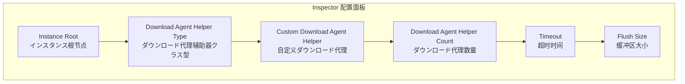
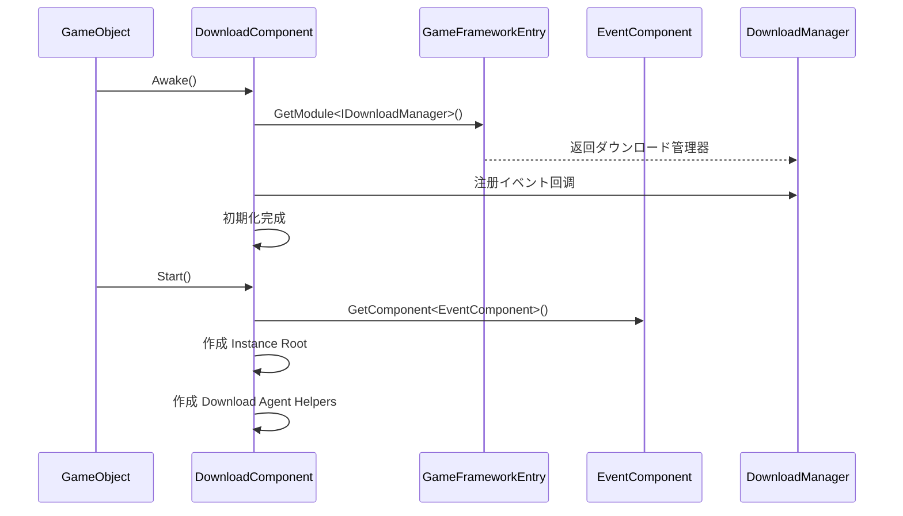

# 基础配置

本文档介绍 GameFrameX Download 插件的基础配置メソッド，包括コンポーネント添加、参数設定和初期化フロー。

## 概要

Download コンポーネント是 GameFrameX フレームワーク中的ダウンロード管理模块，负责处理所有ダウンロード関連任务。在使用ダウンロード機能之前，必要正确配置 `DownloadComponent`。该コンポーネント采用多代理并发ダウンロード机制，サポート断点续传、优先级调度和实时进度更新。

## 添加 DownloadComponent

### を通じて Unity 编辑器添加

在 Unity シーン中作成一个空ゲーム对象，然后添加 `Download` コンポーネント：

1. 在 Unity 编辑器中，右键点击 Hierarchy 面板
2. 选择 **GameObject** → **Create Empty** 作成一个空ゲーム对象
3. 在 Inspector 面板中点击 **Add Component** 按钮
4. 搜索并选择 **Game Framework** → **Download**
5. コンポーネント将自动添加到ゲーム对象上

```csharp
// コンポーネント定义源码
[DisallowMultipleComponent]
[AddComponentMenu("Game Framework/Download")]
public sealed class DownloadComponent : GameFrameworkComponent
```

> Source: [DownloadComponent.cs](https://github.com/GameFrameX/com.gameframex.unity.download/blob/main/Runtime/Download/DownloadComponent.cs#L21-L23)

### を通じて代码动态添加

也可能在代码运行时动态作成コンポーネント：

```csharp
// 动态添加 DownloadComponent
var downloadGameObject = new GameObject("Download");
var downloadComponent = downloadGameObject.AddComponent<DownloadComponent>();
```

> Source: [DownloadComponent.cs](https://github.com/GameFrameX/com.gameframex.unity.download/blob/main/Runtime/Download/DownloadComponent.cs#L142-L160)

## 設定选项详解

### 编辑器配置プロパティ

在 Unity 编辑器的 Inspector 面板中，DownloadComponent 包含以下可配置プロパティ：



| プロパティ | クラス型 | 默认值 | 説明 |
|------|------|--------|------|
| Instance Root | Transform | null | ダウンロード代理インスタンス的父级 Transform，为空时自动作成 |
| Download Agent Helper Type | string | UnityWebRequestDownloadAgentHelper | ダウンロード代理辅助器的クラス型名称 |
| Custom Download Agent Helper | DownloadAgentHelperBase | null | 自定义ダウンロード代理辅助器インスタンス |
| Download Agent Helper Count | int | 3 | 并发ダウンロード代理数量，范围 1-16 |
| Timeout | float | 30 | ダウンロード超时时间（秒），范围 0-120 |
| Flush Size | int | 1048576 | 缓冲区写入磁盘的临界大小（字节），默认 1MB |

> Source: [DownloadComponentInspector.cs](https://github.com/GameFrameX/com.gameframex.unity.download/blob/main/Editor/Inspector/DownloadComponentInspector.cs#L29-L69)

### 各配置项詳細説明

#### 1. Instance Root（インスタンス根节点）

指定ダウンロード代理 GameObject 的父级 Transform。如果不設定，系统会自动作成一个名为 "Download Agent Instances" 的空对象作为父节点。

```csharp
if (m_InstanceRoot == null)
{
    m_InstanceRoot = new GameObject("Download Agent Instances").transform;
    m_InstanceRoot.SetParent(gameObject.transform);
    m_InstanceRoot.localScale = Vector3.one;
}
```

> Source: [DownloadComponent.cs](https://github.com/GameFrameX/com.gameframex.unity.download/blob/main/Runtime/Download/DownloadComponent.cs#L171-L176)

#### 2. Download Agent Helper Type（ダウンロード代理辅助器クラス型）

指定に使用执行实际ダウンロード操作辅助器的クラス型。插件内置了以下実装：

| クラス型名称 | 説明 |
|----------|------|
| UnityWebRequestDownloadAgentHelper | 使用 Unity 的 UnityWebRequest 进行ダウンロード（推荐） |
| WWWDownloadAgentHelper | 使用过时的 WWW クラス进行ダウンロード（兼容旧版本） |

#### 3. Download Agent Helper Count（ダウンロード代理数量）

設定并发ダウンロード代理的数量。每个代理一次只能处理一个ダウンロード任务，但可能同时运行多个代理以実装并行ダウンロード。

```csharp
// 默认作成 3 个ダウンロード代理
for (int i = 0; i < m_DownloadAgentHelperCount; i++)
{
    AddDownloadAgentHelper(i);
}
```

> Source: [DownloadComponent.cs](https://github.com/GameFrameX/com.gameframex.unity.download/blob/main/Runtime/Download/DownloadComponent.cs#L178-L181)

**建议配置：**
- 小型リソース（< 10MB）：2-3 个代理
- 中型リソース（10-100MB）：3-5 个代理
- 大型リソース（> 100MB）：5-8 个代理
- 最大サポート：16 个代理

#### 4. Timeout（超时时间）

設定单个ダウンロード任务的最大等待时间（秒）。超过此时间后，ダウンロード将被视为失败并触发错误イベント。

```csharp
[SerializeField]
private float m_Timeout = 30f;
```

> Source: [DownloadComponent.cs](https://github.com/GameFrameX/com.gameframex.unity.download/blob/main/Runtime/Download/DownloadComponent.cs#L39)

**配置建议：**
- 局域网ダウンロード：10-15 秒
- 互联网ダウンロード：30-60 秒
- 大ファイルダウンロード：60-120 秒

#### 5. Flush Size（缓冲区大小）

設定将ダウンロード缓冲区写入磁盘的临界大小。该参数仅在启用断点续传機能时有效，に使用控制数据刷新频率。

```csharp
private const int OneMegaBytes = 1024 * 1024;
[SerializeField]
private int m_FlushSize = OneMegaBytes;
```

> Source: [DownloadComponent.cs](https://github.com/GameFrameX/com.gameframex.unity.download/blob/main/Runtime/Download/DownloadComponent.cs#L25-L26#L41)

**配置建议：**
- 小ファイル：512KB - 1MB
- 中等ファイル：1MB - 2MB
- 大ファイル：2MB - 5MB

## コンポーネント初期化フロー

DownloadComponent 的初期化分为两个阶段：



### 第一阶段：Awake

```csharp
protected override void Awake()
{
    ImplementationComponentType = Utility.Assembly.GetType(componentType);
    InterfaceComponentType = typeof(IDownloadManager);
    base.Awake();
    m_DownloadManager = GameFrameworkEntry.GetModule<IDownloadManager>();
    
    // 注册ダウンロードイベント
    m_DownloadManager.DownloadStart += OnDownloadStart;
    m_DownloadManager.DownloadUpdate += OnDownloadUpdate;
    m_DownloadManager.DownloadSuccess += OnDownloadSuccess;
    m_DownloadManager.DownloadFailure += OnDownloadFailure;
    
    m_DownloadManager.FlushSize = m_FlushSize;
    m_DownloadManager.Timeout = m_Timeout;
}
```

> Source: [DownloadComponent.cs](https://github.com/GameFrameX/com.gameframex.unity.download/blob/main/Runtime/Download/DownloadComponent.cs#L142-L160)

### 第二阶段：Start

```csharp
private void Start()
{
    // 取得イベントコンポーネント（必須）
    m_EventComponent = GameEntry.GetComponent<EventComponent>();
    if (m_EventComponent == null)
    {
        Log.Fatal("Event component is invalid.");
        return;
    }

    // 作成インスタンス根节点
    if (m_InstanceRoot == null)
    {
        m_InstanceRoot = new GameObject("Download Agent Instances").transform;
        m_InstanceRoot.SetParent(gameObject.transform);
        m_InstanceRoot.localScale = Vector3.one;
    }

    // 作成ダウンロード代理辅助器
    for (int i = 0; i < m_DownloadAgentHelperCount; i++)
    {
        AddDownloadAgentHelper(i);
    }
}
```

> Source: [DownloadComponent.cs](https://github.com/GameFrameX/com.gameframex.unity.download/blob/main/Runtime/Download/DownloadComponent.cs#L162-L182)

## ダウンロード代理辅助器

### 默认実装：UnityWebRequestDownloadAgentHelper

插件默认使用 `UnityWebRequestDownloadAgentHelper` 作为ダウンロード代理辅助器，它基づく Unity 的 `UnityWebRequest` API 実装，サポート：

- HTTP/HTTPS 协议
- 断点续传（を通じて Range 头）
- SSL 证书验证（默认跳过）
- 进度跟踪

```csharp
public partial class UnityWebRequestDownloadAgentHelper : DownloadAgentHelperBase, IDisposable
{
    // 使用 UnityWebRequest 进行ダウンロード
    m_UnityWebRequest = new UnityWebRequest(downloadUri);
    m_UnityWebRequest.certificateHandler = new DownloadCertificateHandler();
    m_UnityWebRequest.downloadHandler = new DownloadHandler(this);
    m_UnityWebRequest.SendWebRequest();
}
```

> Source: [UnityWebRequestDownloadAgentHelper.cs](https://github.com/GameFrameX/com.gameframex.unity.download/blob/main/Runtime/Download/UnityWebRequestDownloadAgentHelper.cs#L80-L96)

### 作成自定义ダウンロード代理

要作成自定义ダウンロード代理，必要继承 `DownloadAgentHelperBase` 并実装関連インターフェース：

```csharp
public abstract class DownloadAgentHelperBase : MonoBehaviour, IDownloadAgentHelper
{
    // イベント定义
    public abstract event EventHandler<DownloadAgentHelperUpdateBytesEventArgs> DownloadAgentHelperUpdateBytes;
    public abstract event EventHandler<DownloadAgentHelperUpdateLengthEventArgs> DownloadAgentHelperUpdateLength;
    public abstract event EventHandler<DownloadAgentHelperCompleteEventArgs> DownloadAgentHelperComplete;
    public abstract event EventHandler<DownloadAgentHelperErrorEventArgs> DownloadAgentHelperError;

    // ダウンロードメソッド
    public abstract void Download(string downloadUri, object userData);
    public abstract void Download(string downloadUri, long fromPosition, object userData);
    public abstract void Download(string downloadUri, long fromPosition, long toPosition, object userData);
    
    // 重置メソッド
    public abstract void Reset();
}
```

> Source: [DownloadAgentHelperBase.cs](https://github.com/GameFrameX/com.gameframex.unity.download/blob/main/Runtime/Download/DownloadAgentHelperBase.cs#L17-L72)

## 設定プロパティ API

DownloadComponent 提供します以下公开プロパティ供代码访问：

### 运行时プロパティ

| プロパティ | クラス型 | 説明 |
|------|------|------|
| Paused | bool | 取得或設定ダウンロード是否被暂停 |
| TotalAgentCount | int | 取得ダウンロード代理总数量 |
| FreeAgentCount | int | 取得可用ダウンロード代理数量 |
| WorkingAgentCount | int | 取得工作中ダウンロード代理数量 |
| WaitingTaskCount | int | 取得等待ダウンロード任务数量 |
| Timeout | float | 取得或設定ダウンロード超时时长（秒） |
| FlushSize | int | 取得或設定缓冲区写入磁盘的临界大小 |
| CurrentSpeed | float | 取得当前ダウンロード速度（字节/秒） |

```csharp
// 示例：取得当前ダウンロードステータス
var downloadComponent = GameEntry.GetComponent<DownloadComponent>();
Debug.Log($"可用代理: {downloadComponent.FreeAgentCount}");
Debug.Log($"等待任务: {downloadComponent.WaitingTaskCount}");
Debug.Log($"ダウンロード速度: {downloadComponent.CurrentSpeed} bytes/s");
```

> Source: [DownloadComponent.cs](https://github.com/GameFrameX/com.gameframex.unity.download/blob/main/Runtime/Download/DownloadComponent.cs#L46-L108)

## 依赖要求

DownloadComponent 依赖于以下コンポーネント和服务：

1. **EventComponent** - 必須コンポーネント，に使用触发ダウンロードイベント通知
2. **GameFrameworkEntry** - フレームワークエントリーポイント，提供模块初期化
3. **GameFrameworkModule** - 基础模块基クラス

```csharp
// 检查依赖
private void Start()
{
    m_EventComponent = GameEntry.GetComponent<EventComponent>();
    if (m_EventComponent == null)
    {
        Log.Fatal("Event component is invalid.");
        return;
    }
}
```

> Source: [DownloadComponent.cs](https://github.com/GameFrameX/com.gameframex.unity.download/blob/main/Runtime/Download/DownloadComponent.cs#L164-L169)

## 最佳实践配置

### 开发环境

```csharp
// 开发环境推荐配置
Timeout = 60f;           // 较长超时容错
FlushSize = 512 * 1024;   // 512KB 频繁刷新便于调试
AgentCount = 3;           // 适中并发数
```

### 生产环境

```csharp
// 生产环境推荐配置
Timeout = 30f;            // 较短超时快速失败重试
FlushSize = 2 * 1024 * 1024;  // 2MB 减少IO频率
AgentCount = 5;           // 较多并发提升ダウンロード速度
```

### 大ファイルダウンロード

```csharp
// 大ファイルダウンロード配置
Timeout = 120f;               // 较长超时
FlushSize = 5 * 1024 * 1024;  // 5MB 大缓冲区
AgentCount = 8;               // 高并发
```

## 関連リンク

- [安装指南](./2-installation)
- [首个示例](./3-getting-started.first-example)
- [架构概述](./4-core-concepts.architecture)
- [DownloadComponent コア概念](./4-core-concepts.download-component)
- [ダウンロード代理](./4-core-concepts.download-agent)
- [编辑器配置](./7-configuration.editor-configuration)
- [ダウンロード代理配置](./7-configuration.agent-configuration)
- [ダウンロードイベント](./6-events.download-events)
