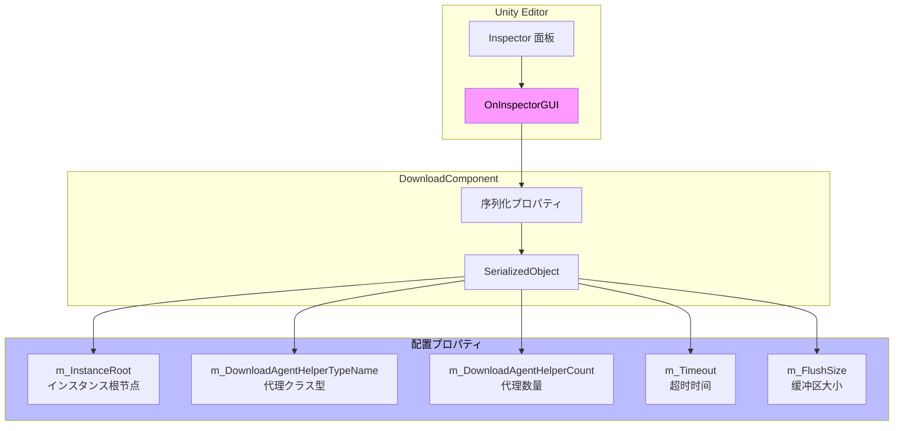
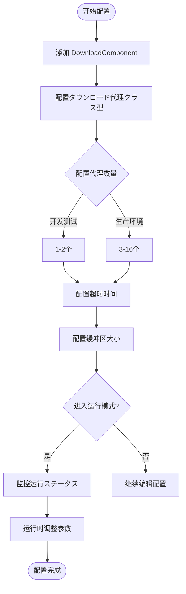

# 编辑器配置

本文档详细介绍 GameFrameX Download コンポーネント在 Unity 编辑器中的配置选项，包括コンポーネント的 Inspector 面板配置和设计意图。

## 概要

GameFrameX Download コンポーネントを通じて Unity 的自定义 Inspector 界面提供直观的编辑器配置機能。開発者可能在编辑器中配置ダウンロード代理数量、超时时长、缓冲区大小等关键参数，无需编写代码即可完成基础配置。

> Source: [DownloadComponentInspector.cs](https://github.com/GameFrameX/com.gameframex.unity.download/blob/main/Editor/Inspector/DownloadComponentInspector.cs#L19-L156)

## 設定界面详解

### 添加 DownloadComponent

在 Unity シーン中，を通じて以下方法添加 Download コンポーネント：

1. 在 Hierarchy 面板中右键选择 **GameObject** → **Create Empty**
2. 在 Inspector 面板中点击 **Add Component**
3. 搜索并选择 **Download**（或 `Game Framework/Download`）
4. コンポーネント将自动添加到ゲーム对象上

```csharp
// コンポーネントを通じて AddComponentMenu 特性注册到 Unity 菜单
[AddComponentMenu("Game Framework/Download")]
public sealed class DownloadComponent : GameFrameworkComponent
```

> Source: [DownloadComponent.cs](https://github.com/GameFrameX/com.gameframex.unity.download/blob/main/Runtime/Download/DownloadComponent.cs#L22-L23)

### Inspector 配置面板

当在シーン中选择带有 DownloadComponent 的ゲーム对象时，Inspector 面板会显示以下配置选项：

```csharp
private SerializedProperty m_InstanceRoot = null;
private SerializedProperty m_DownloadAgentHelperCount = null;
private SerializedProperty m_Timeout = null;
private SerializedProperty m_FlushSize = null;

private HelperInfo<DownloadAgentHelperBase> m_DownloadAgentHelperInfo = new HelperInfo<DownloadAgentHelperBase>("DownloadAgent");
```

> Source: [DownloadComponentInspector.cs](https://github.com/GameFrameX/com.gameframex.unity.download/blob/main/Editor/Inspector/DownloadComponentInspector.cs#L22-L27)

## 設定选项详解

### 1. Instance Root（インスタンス根节点）

| プロパティ | 説明 |
|------|------|
| **クラス型** | Transform |
| **默认值** | null（自动作成） |
| **运行时** | 可读取 |

**機能説明**：指定ダウンロード代理インスタンス的父级 Transform。如果为空，コンポーネント会自动作成一个名为 "Download Agent Instances" 的ゲーム对象作为父节点。

```csharp
if (m_InstanceRoot == null)
{
    m_InstanceRoot = new GameObject("Download Agent Instances").transform;
    m_InstanceRoot.SetParent(gameObject.transform);
    m_InstanceRoot.localScale = Vector3.one;
}
```

> Source: [DownloadComponent.cs](https://github.com/GameFrameX/com.gameframex.unity.download/blob/main/Runtime/Download/DownloadComponent.cs#L171-L176)

---

### 2. Download Agent Helper Type（ダウンロード代理クラス型）

| プロパティ | 説明 |
|------|------|
| **クラス型** | string（クラス型名称） |
| **默认值** | UnityGameFramework.Runtime.UnityWebRequestDownloadAgentHelper |
| **运行时** | 仅读取 |

**機能説明**：指定に使用执行实际ダウンロード工作的代理辅助器クラス型。插件提供します两种内置実装：

- **UnityWebRequestDownloadAgentHelper**：基づく Unity 的 `UnityWebRequest` API，サポート断点续传
- **WWWDownloadAgentHelper**：基づく传统的 `WWW` クラス（已废弃）

```csharp
[SerializeField] private string m_DownloadAgentHelperTypeName = "UnityGameFramework.Runtime.UnityWebRequestDownloadAgentHelper";
```

> Source: [DownloadComponent.cs](https://github.com/GameFrameX/com.gameframex.unity.download/blob/main/Runtime/Download/DownloadComponent.cs#L33)

**自定义代理**：開発者也可能実装自己的ダウンロード代理辅助器，只需继承 `DownloadAgentHelperBase` クラス并実装相应インターフェース。

---

### 3. Download Agent Helper Count（ダウンロード代理数量）

| プロパティ | 説明 |
|------|------|
| **クラス型** | int |
| **范围** | 1 - 16 |
| **默认值** | 3 |
| **运行时** | 不可修改 |

**機能説明**：配置并发ダウンロード代理的数量。增加代理数量可能提高并行ダウンロード能力，但也会占用更多系统リソース。

```csharp
m_DownloadAgentHelperCount.intValue = EditorGUILayout.IntSlider("Download Agent Helper Count", m_DownloadAgentHelperCount.intValue, 1, 16);
```

> Source: [DownloadComponentInspector.cs](https://github.com/GameFrameX/com.gameframex.unity.download/blob/main/Editor/Inspector/DownloadComponentInspector.cs#L41)

**配置建议**：
| シーン | 推荐值 |
|------|--------|
| 开发测试 | 1-2 |
| 移动端ゲーム | 3-5 |
| PC/主机ゲーム | 5-10 |
| 大ファイル多线程ダウンロード | 10-16 |

---

### 4. Timeout（超时时间）

| プロパティ | 説明 |
|------|------|
| **クラス型** | float |
| **范围** | 0 - 120 秒 |
| **默认值** | 30 秒 |
| **运行时** | 可修改 |

**機能説明**：設定ダウンロードお願いします求的超时时间。当ダウンロード时间超过此值时，ダウンロード任务将失败并触发错误イベント。

```csharp
float timeout = EditorGUILayout.Slider("Timeout", m_Timeout.floatValue, 0f, 120f);
if (timeout != m_Timeout.floatValue)
{
    if (EditorApplication.isPlaying)
    {
        t.Timeout = timeout;  // 运行时修改
    }
    else
    {
        m_Timeout.floatValue = timeout;  // 编辑器修改
    }
}
```

> Source: [DownloadComponentInspector.cs](https://github.com/GameFrameX/com.gameframex.unity.download/blob/main/Editor/Inspector/DownloadComponentInspector.cs#L45-L56)

**设计意图**：超时設定可能防止因网络问题导致的无限等待。在编辑器模式下修改会保存到コンポーネント配置，在运行时修改则直接生效。

---

### 5. Flush Size（缓冲区刷新大小）

| プロパティ | 説明 |
|------|------|
| **クラス型** | int |
| **默认值** | 1048576（1 MB） |
| **运行时** | 可修改 |

**機能説明**：設定将内存缓冲区数据写入磁盘的临界大小。仅当开启断点续传機能时有效。该值决定了多久将数据写入磁盘一次，较大的值可能提高性能但会降低断点续传的精度。

```csharp
private const int OneMegaBytes = 1024 * 1024;

[SerializeField] private int m_FlushSize = OneMegaBytes;
```

> Source: [DownloadComponent.cs](https://github.com/GameFrameX/com.gameframex.unity.download/blob/main/Runtime/Download/DownloadComponent.cs#L26#L41)

```csharp
int flushSize = EditorGUILayout.DelayedIntField("Flush Size", m_FlushSize.intValue);
```

> Source: [DownloadComponentInspector.cs](https://github.com/GameFrameX/com.gameframex.unity.download/blob/main/Editor/Inspector/DownloadComponentInspector.cs#L58)

**配置建议**：
| シーン | 推荐值 | 説明 |
|------|--------|------|
| 小ファイルダウンロード | 64KB - 256KB | 更频繁写入，数据更安全 |
| 大ファイルダウンロード | 512KB - 2MB | 提高性能，减少磁盘IO |
| 网络不稳定 | 较小值 | 减少断点续传失败概率 |

---

## 运行时ステータス监控

在运行模式下，Inspector 面板会显示当前ダウンロードコンポーネント的实时ステータス信息：

```csharp
if (EditorApplication.isPlaying && IsPrefabInHierarchy(t.gameObject))
{
    EditorGUILayout.LabelField("Paused", t.Paused.ToString());
    EditorGUILayout.LabelField("Total Agent Count", t.TotalAgentCount.ToString());
    EditorGUILayout.LabelField("Free Agent Count", t.FreeAgentCount.ToString());
    EditorGUILayout.LabelField("Working Agent Count", t.WorkingAgentCount.ToString());
    EditorGUILayout.LabelField("Waiting Agent Count", t.WaitingTaskCount.ToString());
    EditorGUILayout.LabelField("Current Speed", t.CurrentSpeed.ToString());
}
```

> Source: [DownloadComponentInspector.cs](https://github.com/GameFrameX/com.gameframex.unity.download/blob/main/Editor/Inspector/DownloadComponentInspector.cs#L71-L78)

### 运行时プロパティ説明

| プロパティ | クラス型 | 説明 |
|------|------|------|
| Paused | bool | ダウンロード是否被暂停 |
| TotalAgentCount | int | ダウンロード代理总数量 |
| FreeAgentCount | int | 可用ダウンロード代理数量 |
| WorkingAgentCount | int | 工作中ダウンロード代理数量 |
| WaitingTaskCount | int | 等待中的任务数量 |
| CurrentSpeed | float | 当前ダウンロード速度（字节/秒） |

---

## CSV 导出機能

运行时ステータス下，Inspector 面板提供ダウンロード任务信息导出機能：

```csharp
if (GUILayout.Button("Export CSV Data"))
{
    string exportFileName = EditorUtility.SaveFilePanel("Export CSV Data", string.Empty, "Download Task Data.csv", string.Empty);
    if (!string.IsNullOrEmpty(exportFileName))
    {
        // 导出逻辑...
    }
}
```

> Source: [DownloadComponentInspector.cs](https://github.com/GameFrameX/com.gameframex.unity.download/blob/main/Editor/Inspector/DownloadComponentInspector.cs#L89-L112)

点击按钮后，可能将当前所有ダウンロード任务的信息导出为 CSV ファイル，包含以下字段：
- Download Path（ダウンロード路径）
- Serial Id（序列编号）
- Tag（标签）
- Priority（优先级）
- Status（ステータス）

---

## 编辑器配置架构



---

## 設定フロー图



---

## 関連リンク

- [ダウンロード代理配置](./7-configuration.agent-configuration) - 了解ダウンロード代理的详细配置
- [DownloadComponent](./4-core-concepts.download-component) - コアコンポーネント详解
- [ダウンロード代理](./4-core-concepts.download-agent) - ダウンロード代理工作原理
- [API 参考](./5-api-reference.properties) - プロパティ詳細説明
- [API 参考](./5-api-reference.methods) - メソッド詳細説明
