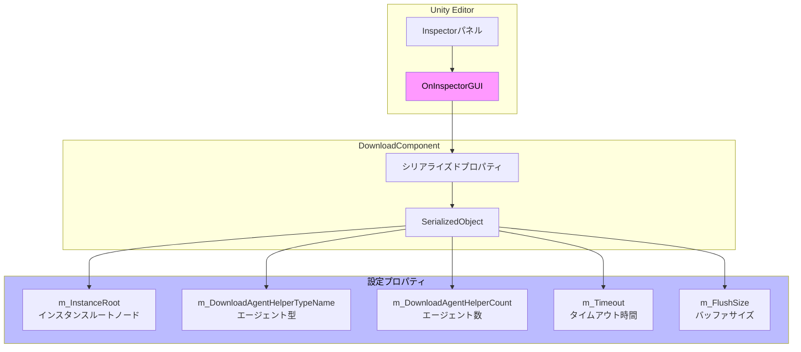
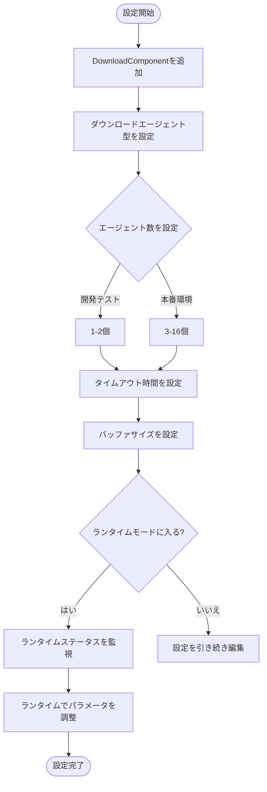

# エディタ設定

このドキュメントでは、GameFrameX DownloadコンポーネントのUnityエディタにおける設定オプションについて詳しく説明します。コンポーネントのInspectorパネル設定と設計意図等内容を含みます。

## 概要

GameFrameX Downloadコンポーネントは、UnityのカスタムInspector界面を通じて直感的なエディタ設定機能を提供します。開発者はエディタでダウンロードエージェント数、タイムアウト時間、バッファサイズなどの主要パラメータを設定でき、コードを書かずに基本設定が完了します。

> 出典: [DownloadComponentInspector.cs](https://github.com/GameFrameX/com.gameframex.unity.download/blob/main/Editor/Inspector/DownloadComponentInspector.cs#L19-L156)

## 設定界面の詳細

### DownloadComponentを追加

Unityシーンで、以下の方法でDownloadコンポーネントを追加します：

1. Hierarchyパネルで右クリックし、**GameObject** → **Create Empty**を選択
2. Inspectorパネルで**Add Component**をクリック
3. **Download**（または`Game Framework/Download`）を検索して選択
4. コンポーネントがゲームオブジェクトに自動的に追加されます

```csharp
// コンポーネントはAddComponentMenu属性でUnityメニューに登録
[AddComponentMenu("Game Framework/Download")]
public sealed class DownloadComponent : GameFrameworkComponent
```

> 出典: [DownloadComponent.cs](https://github.com/GameFrameX/com.gameframex.unity.download/blob/main/Runtime/Download/DownloadComponent.cs#L22-L23)

### Inspector設定パネル

シーンでDownloadComponentを持つゲームオブジェクトを選択すると、Inspectorパネルに以下の設定オプションが表示されます：

```csharp
private SerializedProperty m_InstanceRoot = null;
private SerializedProperty m_DownloadAgentHelperCount = null;
private SerializedProperty m_Timeout = null;
private SerializedProperty m_FlushSize = null;

private HelperInfo<DownloadAgentHelperBase> m_DownloadAgentHelperInfo = new HelperInfo<DownloadAgentHelperBase>("DownloadAgent");
```

> 出典: [DownloadComponentInspector.cs](https://github.com/GameFrameX/com.gameframex.unity.download/blob/main/Editor/Inspector/DownloadComponentInspector.cs#L22-L27)

## 設定オプション詳細

### 1. Instance Root（インスタンスルートノード）

| プロパティ | 説明 |
|------|------|
| **型** | Transform |
| **デフォルト値** | null（自動作成） |
| **ランタイム** | 読み取り可能 |

**機能説明**：ダウンロードエージェントインスタンスの親Transformを指定します。空の場合、コンポーネントは「Download Agent Instances」という名前のゲームオブジェクトを親ノードとして自動作成します。

```csharp
if (m_InstanceRoot == null)
{
    m_InstanceRoot = new GameObject("Download Agent Instances").transform;
    m_InstanceRoot.SetParent(gameObject.transform);
    m_InstanceRoot.localScale = Vector3.one;
}
```

> 出典: [DownloadComponent.cs](https://github.com/GameFrameX/com.gameframex.unity.download/blob/main/Runtime/Download/DownloadComponent.cs#L171-L176)

---

### 2. Download Agent Helper Type（ダウンロードエージェント型）

| プロパティ | 説明 |
|------|------|
| **型** | string（クラス型名） |
| **デフォルト値** | UnityGameFramework.Runtime.UnityWebRequestDownloadAgentHelper |
| **ランタイム** | 読み取り専用 |

**機能説明**：実際のダウンロード作業を実行するエージェントヘルパーのクラス型を指定します。プラグインは以下の2つの内置実装を提供します：

- **UnityWebRequestDownloadAgentHelper**：Unityの`UnityWebRequest` APIに基づいて実装され、レジュームをサポート
- **WWWDownloadAgentHelper**：伝統的な`WWW`クラスに基づいて実装（廃止予定）

```csharp
[SerializeField] private string m_DownloadAgentHelperTypeName = "UnityGameFramework.Runtime.UnityWebRequestDownloadAgentHelper";
```

> 出典: [DownloadComponent.cs](https://github.com/GameFrameX/com.gameframex.unity.download/blob/main/Runtime/Download/DownloadComponent.cs#L33)

**カスタムエージェント**：開発者は独自のダウンロードエージェントヘルパーを実装することもできます。`DownloadAgentHelperBase`クラスを継承して相应インターフェースを実装してください。

---

### 3. Download Agent Helper Count（ダウンロードエージェント数）

| プロパティ | 説明 |
|------|------|
| **型** | int |
| **範囲** | 1 - 16 |
| **デフォルト値** | 3 |
| **ランタイム** | 変更不可 |

**機能説明**：同時ダウンロードエージェント数を設定します。エージェント数を増やすと並列ダウンロード能力が向上しますが、より多くのシステムリソースを占有します。

```csharp
m_DownloadAgentHelperCount.intValue = EditorGUILayout.IntSlider("Download Agent Helper Count", m_DownloadAgentHelperCount.intValue, 1, 16);
```

> 出典: [DownloadComponentInspector.cs](https://github.com/GameFrameX/com.gameframex.unity.download/blob/main/Editor/Inspector/DownloadComponentInspector.cs#L41)

**設定推奨：**
| シーン | 推奨値 |
|------|--------|
| 開発・テスト | 1-2 |
| モバイルゲーム | 3-5 |
| PC/コンソールゲーム | 5-10 |
| 大容量ファイルマルチスレッドダウンロード | 10-16 |

---

### 4. Timeout（タイムアウト時間）

| プロパティ | 説明 |
|------|------|
| **型** | float |
| **範囲** | 0 - 120 秒 |
| **デフォルト値** | 30 秒 |
| **ランタイム** | 変更可能 |

**機能説明**：ダウンロードリクエストのタイムアウト時間を設定します。ダウンロード時間がこの値を超えると、ダウンロードタスクは失敗しエラーイベントがトリガーされます。

```csharp
float timeout = EditorGUILayout.Slider("Timeout", m_Timeout.floatValue, 0f, 120f);
if (timeout != m_Timeout.floatValue)
{
    if (EditorApplication.isPlaying)
    {
        t.Timeout = timeout;  // ランタイムで変更
    }
    else
    {
        m_Timeout.floatValue = timeout;  // エディタで変更
    }
}
```

> 出典: [DownloadComponentInspector.cs](https://github.com/GameFrameX/com.gameframex.unity.download/blob/main/Editor/Inspector/DownloadComponentInspector.cs#L45-L56)

**設計意図**：タイムアウト設定は、ネットワーク問題导致的無限待機を防止できます。エディタモードで変更するとコンポーネント設定に保存され、ランタイムで変更すると直接有効になります。

---

### 5. Flush Size（バッファフラッシュサイズ）

| プロパティ | 説明 |
|------|------|
| **型** | int |
| **デフォルト値** | 1048576（1 MB） |
| **ランタイム** | 変更可能 |

**機能説明**：メモリバッファデータをディスクに書き込む閾値を設定します。レジューム機能を有効にしている場合のみ有効です。この値はデータをディスクに書き込む頻度を决定し、大きい値はパフォーマンスを向上させますがレジュームの精度が低下します。

```csharp
private const int OneMegaBytes = 1024 * 1024;

[SerializeField] private int m_FlushSize = OneMegaBytes;
```

> 出典: [DownloadComponent.cs](https://github.com/GameFrameX/com.gameframex.unity.download/blob/main/Runtime/Download/DownloadComponent.cs#L26#L41)

```csharp
int flushSize = EditorGUILayout.DelayedIntField("Flush Size", m_FlushSize.intValue);
```

> 出典: [DownloadComponentInspector.cs](https://github.com/GameFrameX/com.gameframex.unity.download/blob/main/Editor/Inspector/DownloadComponentInspector.cs#L58)

**設定推奨：**
| シーン | 推奨値 | 説明 |
|------|--------|------|
| 小ファイルダウンロード | 64KB - 256KB | より頻繁な書き込み、データ安全性向上 |
| 大ファイルダウンロード | 512KB - 2MB | パフォーマンス向上、ディスクIO軽減 |
| ネットワーク不安定 | 小さい値 | レジューム失敗確率を減少 |

---

## ランタイムステータス監視

ランタイムモードでは、Inspectorパネルに現在のダウンロードコンポーネントのリアルタイムステータス情報が表示されます：

```csharp
if (EditorApplication.isPlaying && IsPrefabInHierarchy(t.gameObject))
{
    EditorGUILayout.LabelField("Paused", t.Paused.ToString());
    EditorGUILayout.LabelField("Total Agent Count", t.TotalAgentCount.ToString());
    EditorGUILayout.LabelField("Free Agent Count", t.FreeAgentCount.ToString());
    EditorGUILayout.LabelField("Working Agent Count", t.WorkingAgentCount.ToString());
    EditorGUILayout.LabelField("Waiting Agent Count", t.WaitingTaskCount.ToString());
    EditorGUILayout.LabelField("Current Speed", t.CurrentSpeed.ToString());
}
```

> 出典: [DownloadComponentInspector.cs](https://github.com/GameFrameX/com.gameframex.unity.download/blob/main/Editor/Inspector/DownloadComponentInspector.cs#L71-L78)

### ランタイムプロパティ説明

| プロパティ | 型 | 説明 |
|------|------|------|
| Paused | bool | ダウンロードが一時停止されているか |
| TotalAgentCount | int | ダウンロードエージェント総数 |
| FreeAgentCount | int | 使用可能なダウンロードエージェント数 |
| WorkingAgentCount | int | 作業中のダウンロードエージェント数 |
| WaitingTaskCount | int | 待機中のタスク数 |
| CurrentSpeed | float | 現在のダウンロード速度（バイト/秒） |

---

## CSVエクスポート機能

ランタイムステータスでは、Inspectorパネルにダウンロードタスク情報エクスポート機能を提供します：

```csharp
if (GUILayout.Button("Export CSV Data"))
{
    string exportFileName = EditorUtility.SaveFilePanel("Export CSV Data", string.Empty, "Download Task Data.csv", string.Empty);
    if (!string.IsNullOrEmpty(exportFileName))
    {
        // エクスポートロジック...
    }
}
```

> 出典: [DownloadComponentInspector.cs](https://github.com/GameFrameX/com.gameframex.unity.download/blob/main/Editor/Inspector/DownloadComponentInspector.cs#L89-L112)

ボタンクリックすると、現在のすべてのダウンロードタスクの情報がCSVファイルとしてエクスポートされ、以下のフィールドを含みます：
- Download Path（ダウンロードパス）
- Serial Id（シリアル番号）
- Tag（タグ）
- Priority（優先順位）
- Status（ステータス）

---

## エディタ設定アーキテクチャ



---

## 設定フローチャート



---

## 関連リンク

- [ダウンロードエージェント設定](./7-configuration.agent-configuration) - ダウンロードエージェントの詳細設定について
- [DownloadComponent](./4-core-concepts.download-component) - コアコンポーネントの詳細
- [ダウンロードエージェント](./4-core-concepts.download-agent) - ダウンロードエージェントの動作原理
- [APIリファレンス](./5-api-reference.properties) - プロパティの詳細説明
- [APIリファレンス](./5-api-reference.methods) - メソッドの詳細説明