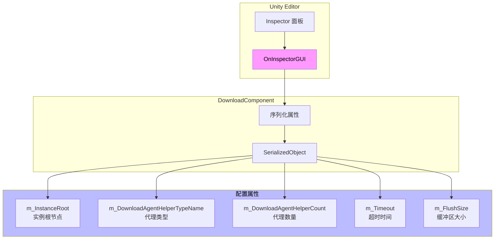
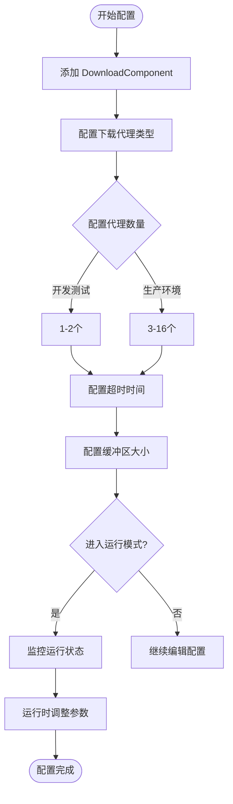

# エディタ設定

このドキュメント詳細介绍 GameFrameX Download コンポーネント在 Unity エディタ中的設定オプション，含みますコンポーネント的 Inspector パネル設定和設計意图。

## 概要

GameFrameX Download コンポーネント通过 Unity 的自定義 Inspector 界面提供直观的エディタ設定機能。開発者〜できます在エディタ中設定下载代理数量、超时时长、缓冲区大小等关键パラメータ，无需编写コードつまり可完成基本設定。

> Source: [DownloadComponentInspector.cs](https://github.com/GameFrameX/com.gameframex.unity.download/blob/main/Editor/Inspector/DownloadComponentInspector.cs#L19-L156)

## 設定界面详解

### 追加 DownloadComponent

在 Unity シーン中，通过以下方法追加 Download コンポーネント：

1. 在 Hierarchy パネル中右键选择 **GameObject** → **Create Empty**
2. 在 Inspector パネル中点击 **Add Component**
3. 検索并选择 **Download**（或 `Game Framework/Download`）
4. コンポーネント将自动追加到游戏对象上

```csharp
// 组件通过 AddComponentMenu 特性注册到 Unity 菜单
[AddComponentMenu("Game Framework/Download")]
public sealed class DownloadComponent : GameFrameworkComponent
```

> Source: [DownloadComponent.cs](https://github.com/GameFrameX/com.gameframex.unity.download/blob/main/Runtime/Download/DownloadComponent.cs#L22-L23)

### Inspector 設定パネル

当在シーン中选择带有 DownloadComponent 的游戏对象时，Inspector パネル会显示以下設定オプション：

```csharp
private SerializedProperty m_InstanceRoot = null;
private SerializedProperty m_DownloadAgentHelperCount = null;
private SerializedProperty m_Timeout = null;
private SerializedProperty m_FlushSize = null;

private HelperInfo<DownloadAgentHelperBase> m_DownloadAgentHelperInfo = new HelperInfo<DownloadAgentHelperBase>("DownloadAgent");
```

> Source: [DownloadComponentInspector.cs](https://github.com/GameFrameX/com.gameframex.unity.download/blob/main/Editor/Inspector/DownloadComponentInspector.cs#L22-L27)

## 設定オプション详解

### 1. Instance Root（インスタンス根节点）

| プロパティ | 説明 |
|------|------|
| **タイプ** | Transform |
| **デフォルト值** | null（自动作成） |
| **ランタイム** | 可读取 |

**機能説明**：指定下载代理インスタンス的父级 Transform。もし为空，コンポーネント会自动作成一个名为 "Download Agent Instances" 的游戏对象作为父节点。

```csharp
if (m_InstanceRoot == null)
{
    m_InstanceRoot = new GameObject("Download Agent Instances").transform;
    m_InstanceRoot.SetParent(gameObject.transform);
    m_InstanceRoot.localScale = Vector3.one;
}
```

> Source: [DownloadComponent.cs](https://github.com/GameFrameX/com.gameframex.unity.download/blob/main/Runtime/Download/DownloadComponent.cs#L171-L176)

---

### 2. Download Agent Helper Type（下载代理タイプ）

| プロパティ | 説明 |
|------|------|
| **タイプ** | string（タイプ名称） |
| **デフォルト值** | UnityGameFramework.Runtime.UnityWebRequestDownloadAgentHelper |
| **ランタイム** | 仅读取 |

**機能説明**：指定用于执行实际下载工作的代理辅助器タイプ。プラグイン提供します两种内置実装：

- **UnityWebRequestDownloadAgentHelper**：基于 Unity 的 `UnityWebRequest` API，サポート断点续传
- **WWWDownloadAgentHelper**：基于传统的 `WWW` 类（已废弃）

```csharp
[SerializeField] private string m_DownloadAgentHelperTypeName = "UnityGameFramework.Runtime.UnityWebRequestDownloadAgentHelper";
```

> Source: [DownloadComponent.cs](https://github.com/GameFrameX/com.gameframex.unity.download/blob/main/Runtime/Download/DownloadComponent.cs#L33)

**自定義代理**：開発者也〜できます実装自己的下载代理辅助器，只需継承 `DownloadAgentHelperBase` 类并実装相应インターフェース。

---

### 3. Download Agent Helper Count（下载代理数量）

| プロパティ | 説明 |
|------|------|
| **タイプ** | int |
| **范围** | 1 - 16 |
| **デフォルト值** | 3 |
| **ランタイム** | 不可変更 |

**機能説明**：設定并发下载代理的数量。增加代理数量〜できます提高并行下载能力，但也会占用更多系统リソース。

```csharp
m_DownloadAgentHelperCount.intValue = EditorGUILayout.IntSlider("Download Agent Helper Count", m_DownloadAgentHelperCount.intValue, 1, 16);
```

> Source: [DownloadComponentInspector.cs](https://github.com/GameFrameX/com.gameframex.unity.download/blob/main/Editor/Inspector/DownloadComponentInspector.cs#L41)

**設定お勧め**：
| シーン | 推奨值 |
|------|--------|
| 开发テスト | 1-2 |
| 移动端游戏 | 3-5 |
| PC/主机游戏 | 5-10 |
| 大ファイル多线程下载 | 10-16 |

---

### 4. Timeout（超时时间）

| プロパティ | 説明 |
|------|------|
| **タイプ** | float |
| **范围** | 0 - 120 秒 |
| **デフォルト值** | 30 秒 |
| **ランタイム** | 可変更 |

**機能説明**：設定下载请求的超时时间。当下载时间超过此值时，下载任务将失敗并トリガーエラーイベント。

```csharp
float timeout = EditorGUILayout.Slider("Timeout", m_Timeout.floatValue, 0f, 120f);
if (timeout != m_Timeout.floatValue)
{
    if (EditorApplication.isPlaying)
    {
        t.Timeout = timeout;  // 运行时修改
    }
    else
    {
        m_Timeout.floatValue = timeout;  // 编辑器修改
    }
}
```

> Source: [DownloadComponentInspector.cs](https://github.com/GameFrameX/com.gameframex.unity.download/blob/main/Editor/Inspector/DownloadComponentInspector.cs#L45-L56)

**設計意图**：超时設定〜できます防止因网络問題导致的无限等待。在エディタモード下変更会保存到コンポーネント設定，在ランタイム変更则直接生效。

---

### 5. Flush Size（缓冲区刷新大小）

| プロパティ | 説明 |
|------|------|
| **タイプ** | int |
| **デフォルト值** | 1048576（1 MB） |
| **ランタイム** | 可変更 |

**機能説明**：設定将内存缓冲区数据写入磁盘的临界大小。仅当开启断点续传機能时有效。该值决定了多久将数据写入磁盘一次，较大的值〜できます提高性能但会降低断点续传的精度。

```csharp
private const int OneMegaBytes = 1024 * 1024;

[SerializeField] private int m_FlushSize = OneMegaBytes;
```

> Source: [DownloadComponent.cs](https://github.com/GameFrameX/com.gameframex.unity.download/blob/main/Runtime/Download/DownloadComponent.cs#L26#L41)

```csharp
int flushSize = EditorGUILayout.DelayedIntField("Flush Size", m_FlushSize.intValue);
```

> Source: [DownloadComponentInspector.cs](https://github.com/GameFrameX/com.gameframex.unity.download/blob/main/Editor/Inspector/DownloadComponentInspector.cs#L58)

**設定お勧め**：
| シーン | 推奨值 | 説明 |
|------|--------|------|
| 小ファイル下载 | 64KB - 256KB | 更频繁写入，数据更安全 |
| 大ファイル下载 | 512KB - 2MB | 提高性能，减少磁盘IO |
| 网络不稳定 | 较小值 | 减少断点续传失敗概率 |

---

## ランタイムステータス监控

在运行モード下，Inspector パネル会显示当前下载コンポーネント的实时ステータス情報：

```csharp
if (EditorApplication.isPlaying && IsPrefabInHierarchy(t.gameObject))
{
    EditorGUILayout.LabelField("Paused", t.Paused.ToString());
    EditorGUILayout.LabelField("Total Agent Count", t.TotalAgentCount.ToString());
    EditorGUILayout.LabelField("Free Agent Count", t.FreeAgentCount.ToString());
    EditorGUILayout.LabelField("Working Agent Count", t.WorkingAgentCount.ToString());
    EditorGUILayout.LabelField("Waiting Agent Count", t.WaitingTaskCount.ToString());
    EditorGUILayout.LabelField("Current Speed", t.CurrentSpeed.ToString());
}
```

> Source: [DownloadComponentInspector.cs](https://github.com/GameFrameX/com.gameframex.unity.download/blob/main/Editor/Inspector/DownloadComponentInspector.cs#L71-L78)

### ランタイムプロパティ説明

| プロパティ | タイプ | 説明 |
|------|------|------|
| Paused | bool | 下载是否被暂停 |
| TotalAgentCount | int | 下载代理总数量 |
| FreeAgentCount | int | 可用下载代理数量 |
| WorkingAgentCount | int | 工作中下载代理数量 |
| WaitingTaskCount | int | 等待中的任务数量 |
| CurrentSpeed | float | 当前下载速度（字节/秒） |

---

## CSV 导出機能

ランタイムステータス下，Inspector パネル提供下载任务情報导出機能：

```csharp
if (GUILayout.Button("Export CSV Data"))
{
    string exportFileName = EditorUtility.SaveFilePanel("Export CSV Data", string.Empty, "Download Task Data.csv", string.Empty);
    if (!string.IsNullOrEmpty(exportFileName))
    {
        // 导出逻辑...
    }
}
```

> Source: [DownloadComponentInspector.cs](https://github.com/GameFrameX/com.gameframex.unity.download/blob/main/Editor/Inspector/DownloadComponentInspector.cs#L89-L112)

点击ボタン后，〜できます将当前所有下载任务的情報导出为 CSV ファイル，パッケージ含以下フィールド：
- Download Path（下载路径）
- Serial Id（序列编号）
- Tag（标签）
- Priority（优先级）
- Status（ステータス）

---

## エディタ設定アーキテクチャ



---

## 設定フロー图



---

## 関連リンク

- [下载代理設定](./7-configuration.agent-configuration) - 理解する下载代理的詳細設定
- [DownloadComponent](./4-core-concepts.download-component) - コアコンポーネント详解
- [下载代理](./4-core-concepts.download-agent) - 下载代理工作原理
- [API リファレンス](./5-api-reference.properties) - プロパティ詳細説明
- [API リファレンス](./5-api-reference.methods) - メソッド詳細説明
