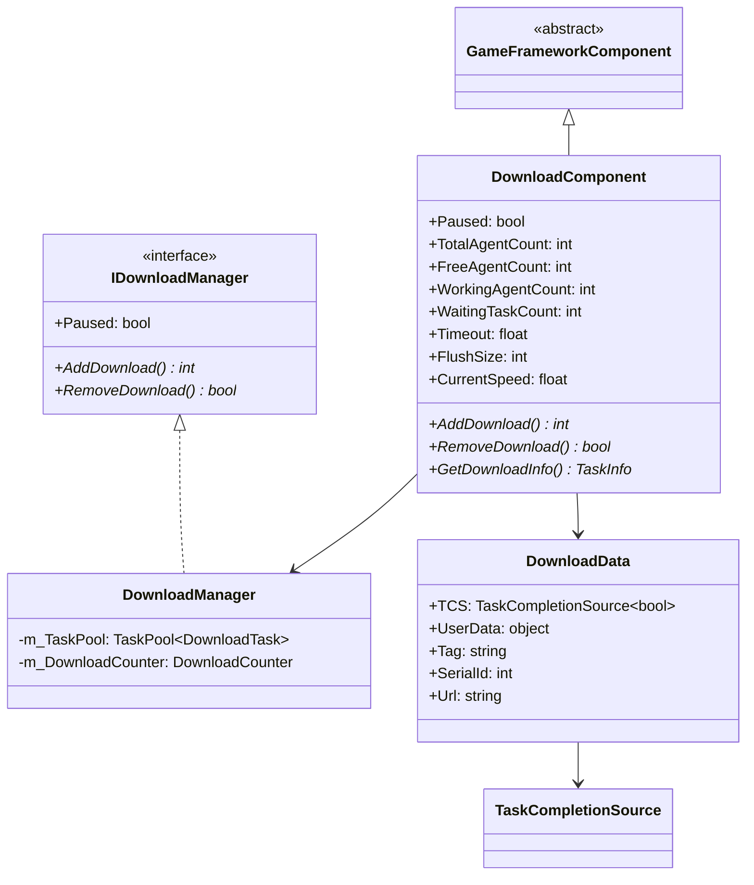
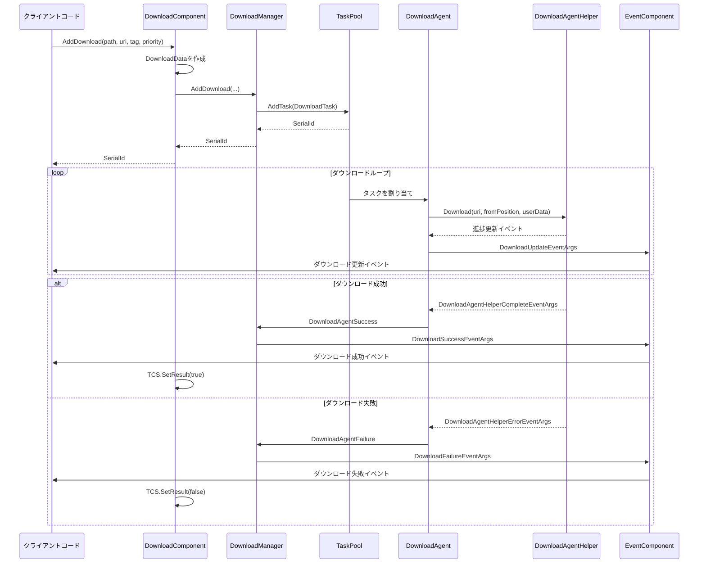
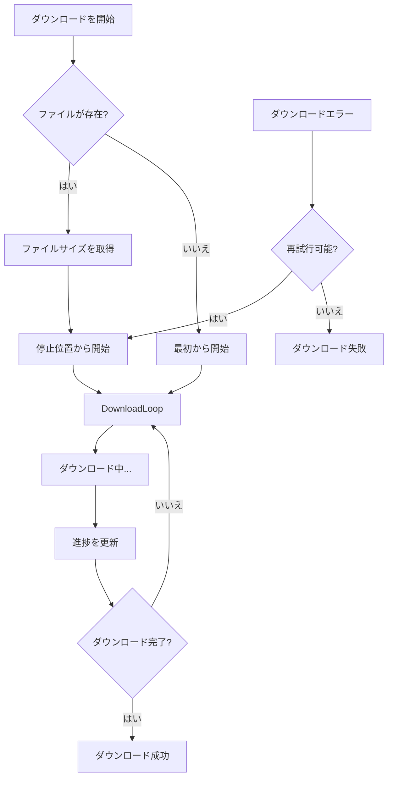

# DownloadComponent

DownloadComponentはGame FrameworkダウンロードシステムのUnityコンポーネント層であり、IDownloadManagerインターフェースのパサード（Facade）として機能し、Unityプロジェクトに便利なダウンロード機能統合を提供します。

## 概要

DownloadComponentはゲームフレームワークダウンロードモジュールのコアUnityコンポーネントであり、GameFrameworkComponentを継承しています。DownloadManagerの機能をカプセル化し、Unityライフサイクル跟你統合します。MonoBehaviourとして、開発者はシーンに直接追加でき、Inspectorパネルまたはコードを通じて設定和使用できます。

このコンポーネントのコア設計目標は：
- 簡潔なUnity APIインターフェースを提供
- 複数のダウンロードエージェント（Download Agent）インスタンスを管理
- イベントシステムを通じてダウンロード進捗と状態の変化を通知
- タスク優先順位、タグ分類、レジュームなどの高度な機能をサポート

## アーキテクチャ

DownloadComponentはダウンロードシステム全体においてエントリーポイント層の役割を果たし、以下の図は各コンポーネントとの関係を示しています：

```mermaid
flowchart TD
    subgraph UnityLayer["Unity層"]
        DC[DownloadComponent]
        Inspector[DownloadComponentInspector]
    end

    subgraph Core["コアモジュール"]
        DM[DownloadManager]
        IDM[IDownloadManagerインターフェース]
    end

    subgraph TaskPool["タスクプール"]
        TP[TaskPool&lt;DownloadTask&gt;]
        DA[DownloadAgent x N]
    end

    subgraph AgentHelper["ダウンロードエージェントヘルパー"]
        DAHB[DownloadAgentHelperBase]
        UWR[UnityWebRequestDownloadAgentHelper]
        WWW[WWWDownloadAgentHelper]
    end

    subgraph Events["イベントシステム"]
        EC[EventComponent]
        DE[DownloadEventArgs]
    end

    DC --> DM
    DC --> Inspector
    DM --> IDM
    IDM <|.. DM
    DM --> TP
    TP --> DA
    DA --> DAHB
    DAHB --> UWR
    DAHB --> WWW
    DM --> EC
    EC --> DE
```

### コンポーネント階層説明

**Unity層**
- DownloadComponent：メインコンポーネント。Unityに優しいAPIを提供
- DownloadComponentInspector：Editor Inspector。可視化設定に使用

**コアモジュール**
- DownloadManager：ダウンロードマネージャー実装。コアロジックを処理
- IDownloadManager：ダウンロードマネージャーインターフェース。規範を定義

**タスクプール層**
- TaskPool：汎用タスクプール。ダウンロードタスクとエージェントを管理
- DownloadAgent：ダウンロードエージェント。具体的なダウンロードタスクを実行

**エージェントヘルパー層**
- DownloadAgentHelperBase：ダウンロードエージェントヘルパーの基底クラス
- UnityWebRequestDownloadAgentHelper：UnityWebRequestに基づく実装
- WWWDownloadAgentHelper：WWWに基づく実装（旧バージョンとの互換性）

### コアクラス図



## コア機能

### 1. ダウンロードタスク管理

DownloadComponentは 풍부한ダウンロードタスク管理機能を提供します：

```csharp
// 基本的なダウンロードタスクを追加
int serialId = downloadComponent.AddDownload(downloadPath, downloadUri);

// タグ付きダウンロードタスクを追加
int serialId = downloadComponent.AddDownload(downloadPath, downloadUri, "resources");

// 優先順位付きダウンロードタスクを追加
int serialId = downloadComponent.AddDownload(downloadPath, downloadUri, 100);

// ユーザーデータ付きダウンロードタスクを追加
int serialId = downloadComponent.AddDownload(downloadPath, downloadUri, userData);

// 完全パラメータ：パス、URI、タグ、優先順位、ユーザーデータ
int serialId = downloadComponent.AddDownload(downloadPath, downloadUri, "update", 100, userData);
```
> 出典: [DownloadComponent.cs](https://github.com/GameFrameX/com.gameframex.unity.download/blob/main/Runtime/Download/DownloadComponent.cs#L238-L350)

### 2. 非同期ダウンロードサポート

DownloadComponentは非同期ダウンロードモードをサポートし、Taskを通じてダウンロード結果を返します：

```csharp
// 非同期ダウンロードして結果を待機
public async void StartDownload()
{
    var downloadComponent = GameEntry.GetComponent<DownloadComponent>();
    Task<bool> task = downloadComponent.Download(downloadPath, downloadUri);
    bool success = await task;
    Debug.Log($"Download {(success ? "succeeded" : "failed")}");
}
```
> 出典: [DownloadComponent.cs](https://github.com/GameFrameX/com.gameframex.unity.download/blob/main/Runtime/Download/DownloadComponent.cs#L273-L282)

### 3. タスクのクエリと削除

```csharp
// シリアル番号に基づいてダウンロードタスク情報を取得
TaskInfo info = downloadComponent.GetDownloadInfo(serialId);

// タグに基づいてすべてのマッチするダウンロードタスクを取得
TaskInfo[] infos = downloadComponent.GetDownloadInfos("resources");

// すべてのダウンロードタスクを取得
TaskInfo[] allInfos = downloadComponent.GetAllDownloadInfos();

// 指定タスクを削除
bool removed = downloadComponent.RemoveDownload(serialId);

// 指定タグのすべてのタスクを削除
int count = downloadComponent.RemoveDownloads("resources");

// すべてのタスクを削除
downloadComponent.RemoveAllDownloads();
```
> 出典: [DownloadComponent.cs](https://github.com/GameFrameX/com.gameframex.unity.download/blob/main/Runtime/Download/DownloadComponent.cs#L189-L392)

### 4. ダウンロードステータス監視

コンポーネントはダウンロードステータスを監視するための複数の読み取り専用プロパティを提供します：

```csharp
// ダウンロードエージェントステータスを取得
int totalCount = downloadComponent.TotalAgentCount;    // 総エージェント数
int freeCount = downloadComponent.FreeAgentCount;       // 空きエージェント数
int workingCount = downloadComponent.WorkingAgentCount; // 作業中のエージェント数
int waitingCount = downloadComponent.WaitingTaskCount;  // 待機タスク数

// 現在のダウンロード速度を取得（バイト/秒）
float speed = downloadComponent.CurrentSpeed;

// 一時停止ステータスの取得/設定
downloadComponent.Paused = true;
```

### 5. 設定プロパティ

| プロパティ | 型 | デフォルト値 | 説明 |
|------|------|--------|------|
| InstanceRoot | Transform | null | ダウンロードエージェントインスタンスのルートノード |
| DownloadAgentHelperTypeName | string | UnityWebRequestDownloadAgentHelper | ダウンロードエージェントヘルパーのクラス型 |
| DownloadAgentHelperCount | int | 3 | ダウンロードエージェントインスタンス数（1-16） |
| Timeout | float | 30f | ダウンロードタイムアウト時間（秒、0-120） |
| FlushSize | int | 1MB | バッファからディスクへの書き込み閾値 |

> 出典: [DownloadComponentInspector.cs](https://github.com/GameFrameX/com.gameframex.unity.download/blob/main/Editor/Inspector/DownloadComponentInspector.cs#L39-L69)

## ダウンロードフロー

### シーケンス図



### レジュームフロー

DownloadComponentはレジューム機能をサポートし、ダウンロードが中断した後、前回の位置からダウンロードを継続できます：



レジュームはDownloadAgentHelperでHTTP Rangeヘッダーを設定して実装します：

```csharp
// UnityWebRequestDownloadAgentHelper.csのレジューム実装
m_UnityWebRequest.SetRequestHeader("Range", GameFrameX.Runtime.Utility.Text.Format("bytes={0}-", fromPosition));
```
> 出典: [UnityWebRequestDownloadAgentHelper.cs](https://github.com/GameFrameX/com.gameframex.unity.download/blob/main/Runtime/Download/UnityWebRequestDownloadAgentHelper.cs#L114)

## 使用例

### 基本的な使用方法

```csharp
using GameFrameX.Runtime;
using GameFrameX.Download.Runtime;

// コンポーネントを取得
var downloadComponent = GameEntry.GetComponent<DownloadComponent>();

// ダウンロードタスクを追加
string localPath = Application.persistentDataPath + "/Resources/texture.png";
string remoteUrl = "https://example.com/texture.png";

int serialId = downloadComponent.AddDownload(localPath, remoteUrl);
```
> 出典: [DownloadComponent.cs](https://github.com/GameFrameX/com.gameframex.unity.download/blob/main/Runtime/Download/DownloadComponent.cs#L238-L241)

### ダウンロードイベントの監視

```csharp
using GameFrameX.Runtime;
using GameFrameX.Download.Runtime;

// ダウンロードイベントを購読
var downloadComponent = GameEntry.GetComponent<DownloadComponent>();
downloadComponent.DownloadStart += OnDownloadStart;
downloadComponent.DownloadUpdate += OnDownloadUpdate;
downloadComponent.DownloadSuccess += OnDownloadSuccess;
downloadComponent.DownloadFailure += OnDownloadFailure;

private void OnDownloadStart(object sender, DownloadStartEventArgs e)
{
    Debug.Log($"ダウンロード開始: {e.DownloadUri}");
}

private void OnDownloadUpdate(object sender, DownloadUpdateEventArgs e)
{
    Debug.Log($"ダウンロード進捗: {e.CurrentLength} bytes");
}

private void OnDownloadSuccess(object sender, DownloadSuccessEventArgs e)
{
    Debug.Log($"ダウンロード成功: {e.DownloadPath}");
}

private void OnDownloadFailure(object sender, DownloadFailureEventArgs e)
{
    Debug.Log($"ダウンロード失敗: {e.ErrorMessage}");
}
```
> 出典: [DownloadComponent.cs](https://github.com/GameFrameX/com.gameframex.unity.download/blob/main/Runtime/Download/DownloadComponent.cs#L415-L442)

### アセットバンドルの一括ダウンロード

```csharp
public class ResourceUpdater
{
    private DownloadComponent _downloadComponent;
    private List<string> _pendingDownloads = new List<string>();
    
    public void StartUpdate(List<ResourceInfo> resources)
    {
        _downloadComponent = GameEntry.GetComponent<DownloadComponent>();
        
        foreach (var resource in resources)
        {
            // 各リソースにダウンロードタスクを追加し、管理しやすいようタグを設定
            _downloadComponent.AddDownload(
                resource.LocalPath, 
                resource.RemoteUrl, 
                "resources",  // タグ
                resource.Priority  // 優先順位
            );
        }
    }
    
    // 特定のタグのダウンロード完了を監視
    private void OnDownloadSuccess(object sender, DownloadSuccessEventArgs e)
    {
        if (e.UserData is ResourceInfo info)
        {
            Debug.Log($"リソースダウンロード完了: {info.Name}");
            CheckAllComplete();
        }
    }
}
```

### async/awaitの使用

```csharp
public async Task<bool> DownloadFileAsync(string url, string path)
{
    var downloadComponent = GameEntry.GetComponent<DownloadComponent>();
    
    // TaskベースのAPIを使用
    Task<bool> downloadTask = downloadComponent.Download(path, url);
    
    // ダウンロード完了を待機
    bool success = await downloadTask;
    
    return success;
}

// 呼び出し例
bool result = await DownloadFileAsync(
    "https://example.com/bundle.zip",
    Application.persistentDataPath + "/bundle.zip"
);
```
> 出典: [DownloadComponent.cs](https://github.com/GameFrameX/com.gameframex.unity.download/blob/main/Runtime/Download/DownloadComponent.cs#L273-L282)

## イベントシステム

DownloadComponentはEventComponentを通じてダウンロードイベントを転送し、以下の主要イベントを含みます：

| イベント | 説明 | EventArgs |
|------|------|-----------|
| DownloadStart | ダウンロード開始時にトリガー | DownloadStartEventArgs |
| DownloadUpdate | ダウンロード進捗更新時にトリガー | DownloadUpdateEventArgs |
| DownloadSuccess | ダウンロード成功時にトリガー | DownloadSuccessEventArgs |
| DownloadFailure | ダウンロード失敗時にトリガー | DownloadFailureEventArgs |

### DownloadSuccessEventArgsプロパティ

```csharp
public sealed class DownloadSuccessEventArgs : GameEventArgs
{
    public int SerialId { get; }           // タスクのシリアル番号
    public string DownloadPath { get; }    // ローカルストレージパス
    public string DownloadUri { get; }    // 元のダウンロードアドレス
    public long CurrentLength { get; }     // ダウンロード済みサイズ
    public object UserData { get; }        // ユーザー定義データ
}
```
> 出典: [DownloadSuccessEventArgs.cs](https://github.com/GameFrameX/com.gameframex.unity.download/blob/main/Runtime/EventArgs/DownloadSuccessEventArgs.cs#L36-L56)

## 設定説明

### Inspector設定

UnityエディタでDownloadComponentを持つGameObjectを選択すると、Inspectorパネルで以下のプロパティを設定できます：

```csharp
// DownloadComponentInspector.csの設定界面
EditorGUILayout.PropertyField(m_InstanceRoot);
m_DownloadAgentHelperInfo.Draw();
m_DownloadAgentHelperCount.intValue = EditorGUILayout.IntSlider("Download Agent Helper Count", ...);
float timeout = EditorGUILayout.Slider("Timeout", ...);
int flushSize = EditorGUILayout.DelayedIntField("Flush Size", ...);
```
> 出典: [DownloadComponentInspector.cs](https://github.com/GameFrameX/com.gameframex.unity.download/blob/main/Editor/Inspector/DownloadComponentInspector.cs#L39-L69)

### ダウンロードエージェントヘルパー

DownloadComponentはカスタムダウンロードエージェントヘルパーをサポートし、デフォルトでUnityWebRequestDownloadAgentHelperを使用します。開発者はDownloadAgentHelperBaseを継承してカスタム実装を作成できます：

```csharp
public abstract class DownloadAgentHelperBase : MonoBehaviour, IDownloadAgentHelper
{
    public abstract event EventHandler<DownloadAgentHelperUpdateBytesEventArgs> DownloadAgentHelperUpdateBytes;
    public abstract event EventHandler<DownloadAgentHelperUpdateLengthEventArgs> DownloadAgentHelperUpdateLength;
    public abstract event EventHandler<DownloadAgentHelperCompleteEventArgs> DownloadAgentHelperComplete;
    public abstract event EventHandler<DownloadAgentHelperErrorEventArgs> DownloadAgentHelperError;
    
    public abstract void Download(string downloadUri, object userData);
    public abstract void Download(string downloadUri, long fromPosition, object userData);
    public abstract void Download(string downloadUri, long fromPosition, long toPosition, object userData);
    public abstract void Reset();
}
```
> 出典: [DownloadAgentHelperBase.cs](https://github.com/GameFrameX/com.gameframex.unity.download/blob/main/Runtime/Download/DownloadAgentHelperBase.cs#L17-L72)

## 内部実装の詳細

### DownloadData内部クラス

DownloadComponentは内部クラスDownloadDataを使用して、各ダウンロードタスクのメタデータを存储します：

```csharp
sealed class DownloadData
{
    public TaskCompletionSource<bool> TCS { get; }  // 非同期待機に使用
    public object UserData { get; }                  // ユーザーデータ
    public string Tag { get; }                        // タグ
    public int SerialId { get; }                     // シリアル番号
    public string Url { get; }                        // ダウンロードアドレス
    
    public DownloadData(string url, string tag, int serialId, object userData)
    {
        Url = url;
        Tag = tag;
        SerialId = serialId;
        UserData = userData;
        TCS = new TaskCompletionSource<bool>();
    }
}
```
> 出典: [DownloadComponent.cs](https://github.com/GameFrameX/com.gameframex.unity.download/blob/main/Runtime/Download/DownloadComponent.cs#L118-L137)

### ライフサイクル

1. **Awake()**: DownloadManagerモジュールを初期化し、ダウンロードイベントを登録
2. **Start()**: EventComponentを取得し、ダウンロードエージェントヘルパーインスタンスを作成
3. **Update()**: GameFrameworkが自動的に呼び出し、タスクプール更新を処理
4. **OnDestroy()**: リソースをクリーンアップ（基底クラス実装を通じて）

```csharp
protected override void Awake()
{
    ImplementationComponentType = Utility.Assembly.GetType(componentType);
    InterfaceComponentType = typeof(IDownloadManager);
    base.Awake();
    m_DownloadManager = GameFrameworkEntry.GetModule<IDownloadManager>();
    // イベントを登録...
}

private void Start()
{
    m_EventComponent = GameEntry.GetComponent<EventComponent>();
    // ダウンロードエージェントヘルパーを作成...
}
```
> 出典: [DownloadComponent.cs](https://github.com/GameFrameX/com.gameframex.unity.download/blob/main/Runtime/Download/DownloadComponent.cs#L142-L182)

## 関連リンク

- [アーキテクチャ概要](./4-core-concepts.architecture) - ダウンロードシステム全体のアーキテクチャ
- [ダウンロードエージェント](./4-core-concepts.download-agent) - DownloadAgentの詳細
- [APIリファレンス - プロパティ](./5-api-reference.properties) - 完全なプロパティリスト
- [APIリファレンス - メソッド](./5-api-reference.methods) - 完全なメソッドリスト
- [ダウンロードイベント](./6-events.download-events) - ダウンロードイベントの詳細
- [エディタ設定](./7-configuration.editor-configuration) - Editor Inspector設定
- [ダウンロードエージェント設定](./7-configuration.agent-configuration) - エージェントヘルパー設定