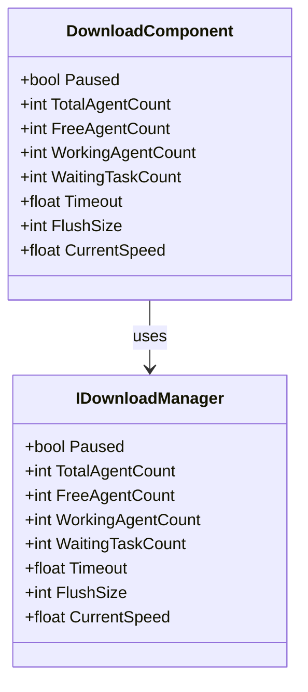
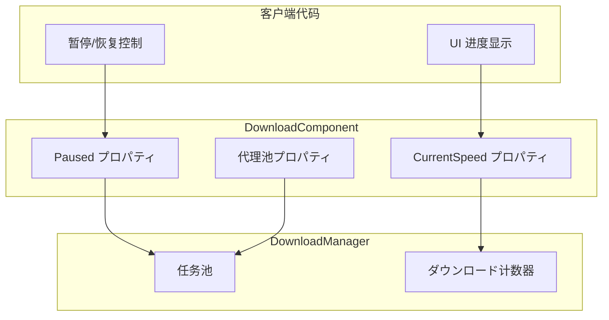

# プロパティ

本文档详细介绍 DownloadComponent コンポーネント及其关联インターフェース、イベント参数中暴露的所有公共プロパティ。

## 概要

ダウンロード模块提供します丰富的プロパティに使用监控和控制ダウンロード任务的ステータス。主要プロパティ分为以下几クラス：

1. **ステータス控制プロパティ** - に使用控制ダウンロード暂停/恢复
2. **代理池プロパティ** - に使用监控ダウンロード代理的使用情况
3. **性能配置プロパティ** - に使用配置超时和缓冲区大小
4. **监控プロパティ** - に使用取得实时ダウンロードステータス



## DownloadComponent プロパティ

DownloadComponent 是ダウンロード系统的コアコンポーネント，を継承 GameFrameworkComponent。以下是所有公共プロパティ的詳細説明：

> Source: [DownloadComponent.cs](https://github.com/GameFrameX/com.gameframex.unity.download/blob/main/Runtime/Download/DownloadComponent.cs#L46-L108)

### `Paused`

```csharp
public bool Paused
{
    get { return m_DownloadManager.Paused; }
    set { m_DownloadManager.Paused = value; }
}
```

**クラス型：** `bool`  
**读写：** 可读可写  
**説明：** 取得或設定ダウンロード是否被暂停。当設定为 `true` 时，所有正在进行的ダウンロード任务和等待中的任务都将暂停；当設定为 `false` 时，暂停的任务将恢复执行。

**使用示例：**

```csharp
// 暂停所有ダウンロード
var downloadComponent = GameEntry.GetComponent<DownloadComponent>();
downloadComponent.Paused = true;

// 恢复ダウンロード
downloadComponent.Paused = false;
```

### `TotalAgentCount`

```csharp
public int TotalAgentCount
{
    get { return m_DownloadManager.TotalAgentCount; }
}
```

**クラス型：** `int`  
**读写：** 只读  
**説明：** 取得ダウンロード代理总数量。这是系统在启动时作成的ダウンロード代理インスタンス总数，反映了系统能够并行处理的最大ダウンロード任务数。

### `FreeAgentCount`

```csharp
public int FreeAgentCount
{
    get { return m_DownloadManager.FreeAgentCount; }
}
```

**クラス型：** `int`  
**读写：** 只读  
**説明：** 取得可用（空闲）ダウンロード代理数量。当此值大于 0 时，可能立即添加新的ダウンロード任务而无需等待。

### `WorkingAgentCount`

```csharp
public int WorkingAgentCount
{
    get { return m_DownloadManager.WorkingAgentCount; }
}
```

**クラス型：** `int`  
**读写：** 只读  
**説明：** 取得工作中（忙碌）ダウンロード代理数量。表示当前正在执行ダウンロード任务的代理数量。

### `WaitingTaskCount`

```csharp
public int WaitingTaskCount
{
    get { return m_DownloadManager.WaitingTaskCount; }
}
```

**クラス型：** `int`  
**读写：** 只读  
**説明：** 取得等待ダウンロード任务数量。由于系统只有有限的ダウンロード代理，当所有代理都在忙碌时，新添加的任务会进入等待队列。

### `Timeout`

```csharp
public float Timeout
{
    get { return m_DownloadManager.Timeout; }
    set { m_DownloadManager.Timeout = m_Timeout = value; }
}
```

**クラス型：** `float`  
**读写：** 可读可写  
**默认值：** `30.0f`（30秒）  
**説明：** 取得或設定ダウンロード超时时长，以秒为单位。当单个ダウンロード任务超过此时间未完成时，将触发ダウンロード失败イベント。

### `FlushSize`

```csharp
public int FlushSize
{
    get { return m_DownloadManager.FlushSize; }
    set { m_DownloadManager.FlushSize = m_FlushSize = value; }
}
```

**クラス型：** `int`  
**读写：** 可读可写  
**默认值：** `1048576`（1MB，即 1024 * 1024）  
**説明：** 取得或設定将缓冲区写入磁盘的临界大小，仅当开启断点续传时有效。该值决定了数据在写入最终ファイル前必要在内存缓冲区中积累的大小，较大的值可能提高写入性能但会增加内存占用。

### `CurrentSpeed`

```csharp
public float CurrentSpeed
{
    get { return m_DownloadManager.CurrentSpeed; }
}
```

**クラス型：** `float`  
**读写：** 只读  
**单位：** 字节/秒（B/s）  
**説明：** 取得当前ダウンロード速度。这是系统实时计算的下行速率，可に使用显示ダウンロード进度 UI。

## イベント参数プロパティ

ダウンロード模块を通じてイベント系统通知外部ダウンロードステータス变化。以下是各イベント参数クラス中暴露的プロパティ：

### DownloadStartEventArgs

ダウンロード开始时触发的イベント参数。

> Source: [DownloadStartEventArgs.cs](https://github.com/GameFrameX/com.gameframex.unity.download/blob/main/Runtime/EventArgs/DownloadStartEventArgs.cs#L35-L55)

| プロパティ | クラス型 | 説明 |
|------|------|------|
| `SerialId` | `int` | ダウンロード任务的序列编号，に使用唯一标识ダウンロード任务 |
| `DownloadPath` | `string` | ダウンロード后存放的本地路径 |
| `DownloadUri` | `string` | 原始ダウンロード地址（URL） |
| `CurrentLength` | `long` | 当前已ダウンロード的大小（字节） |
| `UserData` | `object` | 用户自定义数据 |

### DownloadUpdateEventArgs

ダウンロード进度更新时触发的イベント参数。

> Source: [DownloadUpdateEventArgs.cs](https://github.com/GameFrameX/com.gameframex.unity.download/blob/main/Runtime/EventArgs/DownloadUpdateEventArgs.cs#L35-L55)

| プロパティ | クラス型 | 説明 |
|------|------|------|
| `SerialId` | `int` | ダウンロード任务的序列编号 |
| `DownloadPath` | `string` | ダウンロード后存放的本地路径 |
| `DownloadUri` | `string` | 原始ダウンロード地址 |
| `CurrentLength` | `long` | 当前已ダウンロード的大小 |
| `UserData` | `object` | 用户自定义数据 |

### DownloadSuccessEventArgs

ダウンロード成功完成时触发的イベント参数。

> Source: [DownloadSuccessEventArgs.cs](https://github.com/GameFrameX/com.gameframex.unity.download/blob/main/Runtime/EventArgs/DownloadSuccessEventArgs.cs#L35-L56)

| プロパティ | クラス型 | 説明 |
|------|------|------|
| `SerialId` | `int` | ダウンロード任务的序列编号 |
| `DownloadPath` | `string` | ダウンロード后存放的本地路径 |
| `DownloadUri` | `string` | 原始ダウンロード地址 |
| `CurrentLength` | `long` | 最终ダウンロードファイル的大小 |
| `UserData` | `object` | 用户自定义数据 |

### DownloadFailureEventArgs

ダウンロード失败时触发的イベント参数。

> Source: [DownloadFailureEventArgs.cs](https://github.com/GameFrameX/com.gameframex.unity.download/blob/main/Runtime/EventArgs/DownloadFailureEventArgs.cs#L35-L55)

| プロパティ | クラス型 | 説明 |
|------|------|------|
| `SerialId` | `int` | ダウンロード任务的序列编号 |
| `DownloadPath` | `string` | ダウンロード后存放的本地路径 |
| `DownloadUri` | `string` | 原始ダウンロード地址 |
| `ErrorMessage` | `string` | 错误信息説明 |
| `UserData` | `object` | 用户自定义数据 |

## プロパティ关系与数据流

以下图表展示了各プロパティ之间的关系以及数据流向：



## 使用例

### 监控ダウンロードステータス

以下示例展示如何利用プロパティ监控ダウンロード系统ステータス：

```csharp
public class DownloadStatusMonitor : MonoBehaviour
{
    private DownloadComponent _downloadComponent;

    private void Start()
    {
        _downloadComponent = GameEntry.GetComponent<DownloadComponent>();
    }

    private void Update()
    {
        // 取得实时ダウンロード速度
        float speed = _downloadComponent.CurrentSpeed;
        
        // 取得代理池ステータス
        int total = _downloadComponent.TotalAgentCount;
        int free = _downloadComponent.FreeAgentCount;
        int working = _downloadComponent.WorkingAgentCount;
        int waiting = _downloadComponent.WaitingTaskCount;
        
        // 更新 UI 显示
        UpdateDownloadUI(speed, total, free, working, waiting);
    }
    
    private void UpdateDownloadUI(float speed, int total, int free, int working, int waiting)
    {
        // 将字节转换为 MB/s
        float speedMB = speed / (1024 * 1024);
        Debug.Log($"ダウンロード速度: {speedMB:F2} MB/s | 代理ステータス: {free}/{total} 空闲 | 工作中: {working} | 等待: {waiting}");
    }
}
```
> Source: [DownloadComponent.cs](https://github.com/GameFrameX/com.gameframex.unity.download/blob/main/Runtime/Download/DownloadComponent.cs#L100-L108)

### 暂停与恢复ダウンロード

```csharp
public class DownloadController
{
    private DownloadComponent _downloadComponent;

    public void PauseAllDownloads()
    {
        _downloadComponent = GameEntry.GetComponent<DownloadComponent>();
        _downloadComponent.Paused = true;
        Debug.Log("所有ダウンロード已暂停");
    }

    public void ResumeAllDownloads()
    {
        if (_downloadComponent == null)
        {
            _downloadComponent = GameEntry.GetComponent<DownloadComponent>();
        }
        _downloadComponent.Paused = false;
        Debug.Log("ダウンロード已恢复");
    }
}
```
> Source: [DownloadComponent.cs](https://github.com/GameFrameX/com.gameframex.unity.download/blob/main/Runtime/Download/DownloadComponent.cs#L46-L50)

### 設定ダウンロード参数

```csharp
public void ConfigureDownload()
{
    var downloadComponent = GameEntry.GetComponent<DownloadComponent>();
    
    // 設定超时时间为 60 秒
    downloadComponent.Timeout = 60f;
    
    // 設定缓冲区刷新大小为 2MB
    downloadComponent.FlushSize = 2 * 1024 * 1024;
    
    Debug.Log($"超时: {downloadComponent.Timeout}s, 缓冲区: {downloadComponent.FlushSize} bytes");
}
```
> Source: [DownloadComponent.cs](https://github.com/GameFrameX/com.gameframex.unity.download/blob/main/Runtime/Download/DownloadComponent.cs#L87-L100)

## 設定选项汇总表

| プロパティ | クラス型 | 默认值 | 説明 |
|------|------|--------|------|
| `Paused` | `bool` | `false` | ダウンロード是否被暂停 |
| `TotalAgentCount` | `int` | 由配置决定 | ダウンロード代理总数量 |
| `FreeAgentCount` | `int` | - | 可用ダウンロード代理数量 |
| `WorkingAgentCount` | `int` | - | 工作中ダウンロード代理数量 |
| `WaitingTaskCount` | `int` | - | 等待ダウンロード任务数量 |
| `Timeout` | `float` | `30.0f` | ダウンロード超时时长（秒） |
| `FlushSize` | `int` | `1048576` | 缓冲区写入磁盘临界大小（字节） |
| `CurrentSpeed` | `float` | - | 当前ダウンロード速度（字节/秒） |

## 関連リンク

- [メソッド](./5-api-reference.methods) - 了解 DownloadComponent 的所有メソッド
- [ダウンロードイベント](./6-events.download-events) - 详细了解ダウンロードイベント系统
- [架构概述](./4-core-concepts.architecture) - 查看ダウンロード模块的整体架构
- [DownloadComponent](./4-core-concepts.download-component) - 了解 DownloadComponent コア概念
